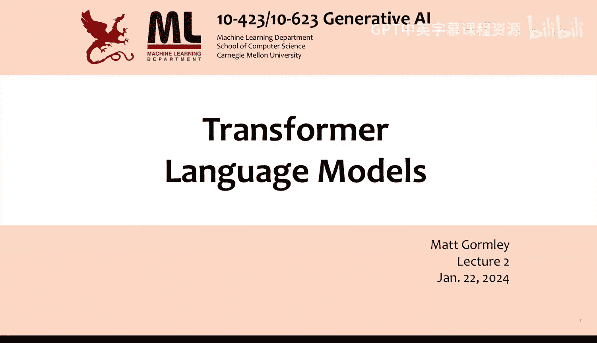
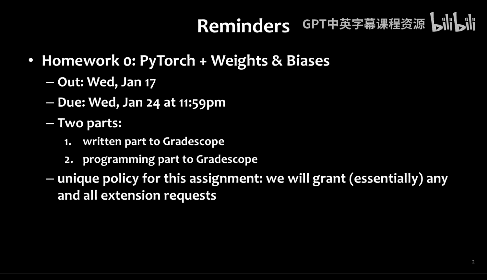

# 02：Transformer语言模型

在本节课中，我们将学习Transformer语言模型的核心原理。我们将从循环神经网络（RNN）的局限性开始，探讨Transformer架构如何解决这些问题，并详细介绍其核心组件——注意力机制、多头注意力、层归一化、残差连接以及位置编码。最后，我们将了解如何将这些组件组合成一个完整的Transformer语言模型。

---

## 历史背景：从N-gram到大型语言模型

在Transformer于2017年发明之前，自然语言处理领域主要依赖语言模型完成语音识别和机器翻译等任务。其核心思想是构建一个噪声信道模型，该模型结合了转导模型和语言模型。

**公式**：`P(y|x) ∝ P(x|y) * P(y)`

其中，`P(y)`是语言模型，`P(x|y)`是转导模型。目标是找到使该乘积最大化的`y`。

早期，人们使用N-gram模型。例如，谷歌在2006年发布的英语N-gram模型使用了1万亿个词元（约950亿个句子）进行训练，包含从1-gram到5-gram的统计信息，总计约30亿个参数。

如今的大型语言模型规模已远超从前：
*   GPT-2 (2019): 15亿参数，100亿词元训练数据。
*   GPT-3: 1750亿参数，3000亿词元训练数据。
*   PaLM: 5400亿参数，近1万亿词元训练数据。
*   Chinchilla: 参数减少但训练数据超过1万亿词元，证明了“更多数据，更少参数”的有效性。
*   GPT-4: 推测其核心模型参数在数千亿级别。

---

## RNN的局限性：遗忘问题

上一节我们介绍了RNN语言模型。本节中，我们来看看RNN面临的一个核心挑战：难以学习长距离依赖关系，这本质上是“遗忘”问题。

为了理解这一点，我们考虑一个简单的Elman RNN。其隐藏状态`H_t`和输出`Y_t`的计算如下：

**公式**：
`H_t = σ(W_hh * H_{t-1} + W_hx * X_t + b_h)`
`Y_t = σ(W_hy * H_t + b_y)`

假设我们设置`W_hh`为单位矩阵，`W_hx`为0.5倍单位矩阵。如果输入序列在早期出现了关键信息比特，随着时间步的推进，这些信息在隐藏状态中的强度会不断衰减（例如，乘以0.5）。最终，在足够多的时间步之后，模型将“遗忘”这些早期信息，导致无法基于它们做出正确预测。

这种现象在训练中表现为**梯度消失问题**：在反向传播时，梯度需要跨越许多时间步进行连乘，导致其对早期输入的梯度变得极其微小，使得模型难以学习长距离的依赖关系。

---

## LSTM：缓解遗忘的尝试

为了解决RNN的遗忘问题，长短期记忆网络（LSTM）被提出。LSTM通过引入“门”机制来控制信息的流动。

LSTM单元在每一个时间步包含以下核心组件：
*   **输入门 (i_t)**：控制当前输入有多少信息需要被存入细胞状态。
*   **遗忘门 (f_t)**：控制上一个细胞状态有多少信息需要被保留或遗忘。
*   **输出门 (o_t)**：控制当前细胞状态有多少信息需要输出到隐藏状态。
*   **细胞状态 (C_t)**：代表网络的长期记忆。

其计算过程可以概括为：
1.  基于当前输入`X_t`和上一隐藏状态`H_{t-1}`，计算三个门的激活值。
2.  计算一个候选细胞状态`~C_t`（类似于简单RNN的隐藏状态更新）。
3.  更新细胞状态：`C_t = f_t ⊙ C_{t-1} + i_t ⊙ ~C_t`。这里`⊙`表示逐元素相乘。
4.  计算当前隐藏状态：`H_t = o_t ⊙ tanh(C_t)`。

通过让遗忘门接近1，LSTM可以选择性地将信息长期保存在细胞状态中，从而缓解梯度消失问题。然而，LSTM仍然存在计算 inherently sequential（无法高效并行化）的问题，并且在某些情况下仍可能面临梯度爆炸的挑战。

---

## Transformer的核心：注意力机制

Transformer架构通过**注意力机制**从根本上解决了长距离依赖和并行化的问题。注意力机制的核心思想是：在生成当前词元的表示时，直接查看并汇总序列中所有之前词元的信息，而不是像RNN那样必须通过一系列中间状态传递。

注意力机制的计算可以分为以下几步：

**1. 创建查询、键和值**
首先，为每个输入向量`X_i`创建三个新的向量表示：
*   **查询 (Query, Q_i)**：代表当前词元在“寻找什么”。
*   **键 (Key, K_i)**：代表每个词元“有什么特征”可供匹配。
*   **值 (Value, V_i)**：代表每个词元实际要被汇总的“信息内容”。

它们通过可学习的权重矩阵得到：
`Q_i = W_Q * X_i`, `K_i = W_K * X_i`, `V_i = W_V * X_i`

**2. 计算注意力分数**
对于当前位置`t`，我们将其查询向量`Q_t`与所有之前位置的键向量`K_i`进行点积，来衡量`t`与`i`之间的相关性。为了稳定训练，点积结果会除以键向量维度`d_k`的平方根。

**公式**：`score(t, i) = (Q_t · K_i^T) / sqrt(d_k)`

**3. 计算注意力权重**
将上一步得到的分数通过Softmax函数转换为一个概率分布，即注意力权重。它表示在生成当前位置表示时，应该“关注”之前每个位置的程度。

**公式**：`attention_weight(t, i) = softmax(score(t, i))`

**4. 生成输出表示**
将注意力权重作为系数，对所有的值向量`V_i`进行加权求和，得到当前位置的最终输出表示`X‘_t`。

**公式**：`X‘_t = Σ(attention_weight(t, i) * V_i)`

这种机制的优势在于，无论两个词元相距多远，它们之间的关联计算都是直接的，不存在信息衰减。

---

## 多头注意力

单一的注意力机制可能只捕捉到一种类型的依赖关系。为了让模型能够同时关注来自不同表示子空间的信息，Transformer使用了**多头注意力**。

以下是多头注意力的实现步骤：
1.  使用`h`组不同的`(W_Q, W_K, W_V)`矩阵，将输入`X`并行地投影到`h`组查询、键、值。每一组称为一个“头”。
2.  每个头独立地执行上一节介绍的缩放点积注意力计算，产生`h`个输出序列。
3.  将这`h`个输出序列在特征维度上拼接起来。
4.  最后通过一个线性投影层`W_O`将拼接后的结果映射回预期的输出维度。

通过这种方式，模型可以同时学习到词语之间多种不同的关系模式（例如语法关系、语义关系等）。

---

## 构建Transformer层：其他关键组件

一个完整的Transformer层不仅仅包含多头注意力。为了稳定和加速深度网络的训练，它还集成了以下组件：

**层归一化**
深度网络中，底层参数的微小变化可能被放大，导致高层输入分布发生剧烈变动（内部协变量偏移），不利于训练。层归一化对每个样本的每一个层输出进行标准化，使其均值为0，方差为1，然后应用可学习的缩放和偏移参数。

**公式**：`LayerNorm(x) = γ * (x - μ) / σ + β`
其中`μ`是均值，`σ`是标准差，`γ`和`β`是可学习参数。

**残差连接**
极深的网络有时会出现性能退化问题（训练和测试误差同时上升）。残差连接通过将层的输入直接加到其输出上来解决这个问题。这样，层只需要学习输入与期望输出之间的残差（即变化部分），使得深层网络更容易训练。

**公式**：`Output = LayerNorm( Attention(x) + x )`

**前馈神经网络**
每个Transformer层在注意力子层之后，还包含一个全连接的前馈神经网络。它通常由两个线性变换和一个激活函数组成，作用在每个位置独立且相同。

**公式**：`FFN(x) = max(0, xW_1 + b_1)W_2 + b_2`

---

## 位置编码：注入序列顺序信息

注意力机制本身是置换不变的：打乱输入序列的顺序，只要注意力权重相应调整，输出表示可以保持不变。但这显然不符合语言特性（“猫追老鼠”和“老鼠追猫”意思不同）。

为了解决这个问题，我们需要向模型注入序列中词元的位置信息。最常用的方法是**位置编码**。

**绝对位置编码**：为序列中的每个位置`t`学习或定义一个固定的向量`P_t`。然后将词嵌入向量`E_t`与位置编码向量相加，作为Transformer的输入。

**公式**：`X_t = E_t + P_t`

这样，即使两个词相同，只要它们处于不同位置，其输入表示就会不同。除了可学习的位置嵌入，还有一种经典的正弦/余弦函数编码方案。

---

## 因果注意力掩码与矩阵化实现

对于语言模型任务，我们在预测下一个词时，只能使用当前及之前的词信息，不能“偷看”未来的词。这需要通过**因果注意力掩码**来实现。

具体做法是：在计算注意力分数后，Softmax操作之前，将所有未来位置（`j > i`）的分数设置为一个极大的负数（如`-1e9`）。这样，经过Softmax后，这些位置的注意力权重就会变为0。

**矩阵化实现**
在实际编程中，我们使用矩阵运算来高效实现上述过程。假设输入序列矩阵`X`的形状为`[序列长度, 模型维度]`：
1.  `Q = X @ W_Q`, `K = X @ W_K`, `V = X @ W_V`
2.  注意力分数矩阵：`S = (Q @ K^T) / sqrt(d_k)`
3.  加上因果掩码矩阵`M`（上三角为`-inf`）：`S_masked = S + M`
4.  注意力权重矩阵：`A = softmax(S_masked, dim=-1)`
5.  输出矩阵：`Output = A @ V`

多头注意力则是将这个过程并行执行`h`次，然后将各头的输出拼接，最后通过线性层`W_O`投影。

---

## 总结

本节课中，我们一起学习了Transformer语言模型的基础知识。我们从RNN的遗忘问题和LSTM的改进入手，引出了Transformer的核心创新——自注意力机制，它能够直接建模任意距离的词元依赖关系。我们详细剖析了缩放点积注意力、多头注意力的原理与优势。接着，我们了解了构建一个稳定、可深度堆叠的Transformer层所必需的其他组件：层归一化、残差连接和前馈网络。最后，我们探讨了为注意力机制注入位置信息的方法（位置编码），以及如何通过因果注意力掩码确保语言模型的自回归特性，并简要介绍了其高效的矩阵化实现方式。这些构成了现代大型语言模型（如GPT系列）的基石。下一节课，我们将探讨如何训练这些模型，并介绍一些更先进的变体。