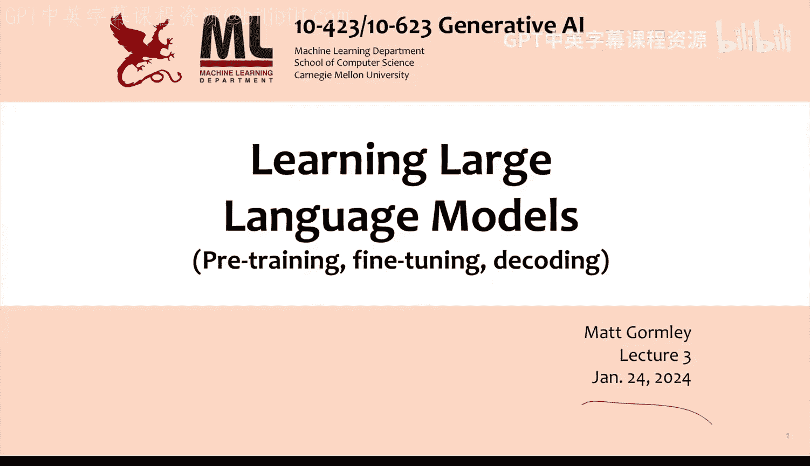
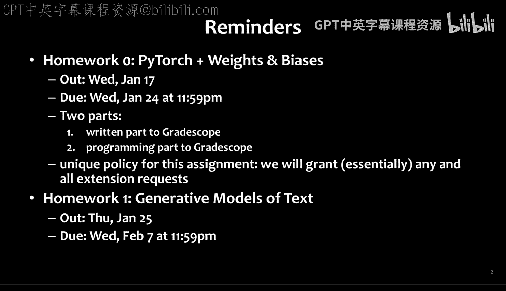
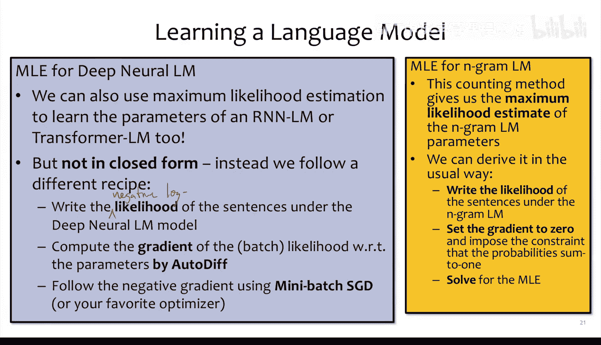
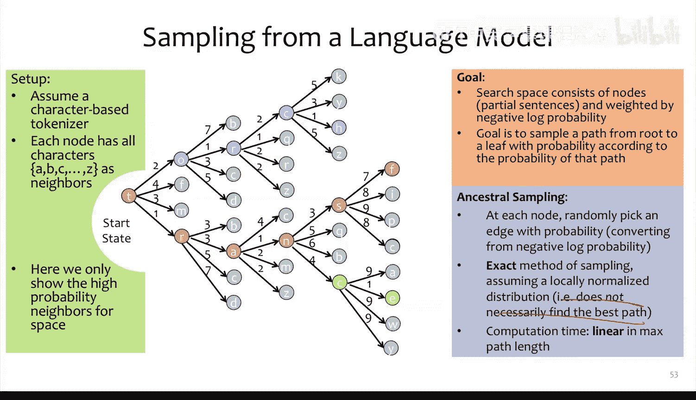

# 03：学习大型语言模型

在本节课中，我们将要学习如何训练一个大型语言模型。到目前为止，我们几乎没有讨论过学习过程，这对于一门机器学习课程来说有些特别。现在，我们将深入探讨之前提到的模型的学习方面。

## 课程概述与提醒

首先，提醒一下，作业零的截止日期是今天。如果你需要额外时间，请注意不能使用宽限期。我们不希望你将宽限期浪费在作业零上，而是希望你按照教学大纲中的说明申请延期。通常延期适用于紧急情况，但这次是特殊情况。

作业一将于近期发布，预计在周四，截止日期大约在两周后。

关于如何获得5%的课堂参与分，我们将通过一些非作业性质的活动来分配，例如投票、调查以及项目过程中的不同环节。

## 深度学习内容回顾

我注意到一些同学反馈，深度学习内容进展很快，感到有些跟不上。我们并不要求你预先掌握深度学习知识。根据你之前课程的不同，对神经网络的讲解深度也有所不同。如果你感到困惑，可以在课后与我交流，或者复习一下2023年秋季301601课程的神经网络模块，这里有幻灯片和视频的链接。如果你已经上过我的301601课程但仍感到困惑，也请来找我，我们一起解决。

## 从自动微分到语言模型

在深入之前，我们先简要回顾一下到目前为止的内容。

我们介绍了基于模块的自动微分概念。其核心思想是，存在称为“模块”的对象，它们定义了前向和后向方法，并且可以链接在一起形成一个计算图。自动微分就是计算该计算图输出（通常是损失）相对于图中叶子节点（通常是参数）的梯度。

我们定义了一个非常有趣的计算图，称为RNN语言模型。随后，我们又定义了一个更复杂的计算图，称为Transformer语言模型。

我们还讨论了语言建模的各个方面，这可以说是一个完全不同的主题。本质上，到目前为止，我们将自动微分视为计算梯度的工具，特别是针对可微函数。如果F是某个可微函数，那么最终我们可能只需要在前向方法中通过链接现有模块来编写代码，甚至不需要实现后向方法，因为每个模块都已经实现了后向方法，我们可以通过精心使用计算图来依赖它们。

计算图是定义函数F的另一种方式，它更便于在幻灯片上展示。到目前为止，我们已经看到了两种计算图，可以说Transformer语言模型是一种相当复杂的计算图，它无法在一张幻灯片上完整展示。但当我们将其模块化后，就可以分解展示。

## 语言建模的核心思想

对于语言建模，其核心思想是，我们根据前面的单词来采样下一个单词。另一种说法是，语言模型定义了序列上的概率分布，或者通过定义给定先前单词的下一个单词的概率分布来实现。

到目前为止，我们看到的两种实现方式是N-gram语言模型和神经网络语言模型（RNNLM或Transformer LM）。N-gram语言模型可以看作是一个巨大的、拥有50,000面的骰子集合（因为词汇表有50,000个单词），每次你选择适当的骰子并投掷以得到下一个单词。相比之下，RNNLM或Transformer LM使用神经网络来定义下一个单词的概率。你可以认为这个神经网络定义了那个50,000面骰子的权重。当我们“投掷”它时，实际上就是从神经网络给出的概率分布中采样。

## 进入学习阶段

关于学习，我们之前提到N-gram语言模型的学习很简单，只需统计共现次数。但到目前为止，我们实际上完全没有讨论如何学习RNNLM或Transformer LM。你可能已经推断出我们要做什么，但今天我们将详细展开这个话题。

本质上，到目前为止我们讨论了两件事：一是如何概念化语言建模的思想，二是如何定义一些深度学习模型。现在，我们终于要思考如何学习这些模型。此外，我们今天还将讨论如何实际从这些语言模型中解码或获取输出。

## 神经网络学习快速回顾

首先，我们快速回顾一下神经网络的视觉化术语和通用学习流程。

我们熟悉的机器学习流程是：给定一些训练数据，然后选择一个决策函数和一个损失函数，接着定义一个目标，即最小化经验风险（将损失应用于我们的预测和真实标签），最后使用随机梯度下降法，沿着梯度的反方向更新参数。

对于一个单隐藏层神经网络，反向传播可以模块化地思考，也可以过程化地思考。前向计算从底部开始，向上进行，计算线性层、Sigmoid层、另一个线性层、另一个Sigmoid层，最后是交叉熵损失。反向计算则从顶部开始向下进行，每一步计算一些偏导数。如果J是我们的损失，那么这些g_b就是J相对于b的导数，我们将其存储在g_b中。

自动微分的意义在于，我们现在可以自动完成整个反向传播过程。虽然可以说，确实有人必须为Sigmoid层、线性层和交叉熵层写出反向传播的步骤。

如果你想训练那个单隐藏层神经网络，你会按照以下步骤进行随机梯度下降：初始化网络参数（例如alpha和beta，其中alpha是第一层的参数矩阵，beta是第二层的参数矩阵）。对于每个训练轮次E，你遍历训练数据D中的每个训练样本（即XY对）。然后执行两个步骤：前向计算和反向计算。前向计算给出所有中间层的结果，反向计算给出参数的梯度（g_alpha和g_beta），我们将使用这些梯度进行随机梯度下降更新：alpha更新为alpha减去学习率gamma乘以g_alpha，beta更新为beta减去gamma乘以g_beta。在此过程中，通常最好跟踪训练和验证数据的平均交叉熵损失。最后，返回一些参数alpha和beta，不过如果你更聪明，可能会跟踪对应于最佳验证交叉熵的参数并返回它们。

## 从SGD到小批量SGD

为了快速对比，我一直在讨论随机梯度下降，它每次只处理一个训练样本。但通常，出于多种原因，使用小批量同时处理多个训练样本会更好。原因可能有两个：一是减少方差，二是提高效率。

在随机梯度下降中，我们只选择一个训练点（即单个x_i, y_i对）。而在小批量SGD中，我们首先将所有训练样本（假设有N个）随机分成批次。这里假设有B个批次，每个批次I1, I2, ..., IB大小相同（大小为M）。所有小批次的并集构成完整训练集，交集为空集（因为它们通常不重叠）。最后，当我们想要实际训练或优化目标时，我们将迭代时间步T，然后迭代小批次B。我们会选择下一个批次I_B（假设其大小为M，可能是16或64，通常根据GPU内存能容纳的训练样本数量来决定，并尽可能选择2的幂次方大小）。然后我们计算梯度，现在不是针对一个样本，而是小批次中梯度的平均值。对于小批次I_B中的每个训练样本i，我们累加目标函数或损失在样本i上的梯度。前面的1/M是为了求平均。然后我们更新参数：新参数等于旧参数减去学习率乘以小批次的梯度。最后，我们在每个训练轮次结束时评估平均训练损失。

## 应用小批量SGD训练Transformer

我们将使用这种训练神经网络的基础思想来训练另一个神经网络——Transformer语言模型。但在开始之前，我认为有必要暂停一下，思考我们是如何学习N-gram语言模型的。

## N-gram模型的最大似然估计

如果我们还记得，N-gram模型的概率是通过统计N-gram频率来学习的。你查看所有“cow eat”的情况，然后统计每个可能后续单词出现的次数。实际上，这种计数方法就是N-gram模型的最大似然估计。

你如何得出这种计数方法？你会按照通常的方式写下N-gram语言模型下句子的似然。N-gram语言模型中实际使用的概率分布是什么？实际上只有一个概率分布，我们只是用不同的参数反复使用它。它是什么？伯努利分布几乎正确，但伯努利分布就像抛硬币，只给我们两个单词，而我们需要更多单词。如果我们的词汇表只有“cat”和“dog”，那么它就是伯努利分布，但我们只能得到像“cat cat, dog dog dog”这样的句子。多项分布？是的，我更喜欢将其称为分类分布，因为通常定义的多项分布允许你从中抽取多个样本，而我们每次只抽取一个样本（下一个单词），所以它是多项分布的一个特例。

当你写下N-gram语言模型下句子的似然时，你得到的是许多多项概率的乘积，每个单词对应一个。这给出了一个似然值。你可以将这个似然设为目标函数，然后计算该似然的梯度。但这里有个棘手的问题：你们中有多少人求解过多项分布的最大似然估计？哦，真的吗？不多？嗯，我们应该把这个放到作业里。多项分布的最大似然估计很有趣，因为它有一个约束条件：概率之和必须为1。这个约束意味着你不能简单地将梯度设为零然后求解参数。如果你那样做，得到的答案会是所有参数都应该是正无穷。你需要一个约束条件，即当参数（概率）相加时不能超过1。当你以闭式求解这个约束优化问题时，你得到的就是这些计数作为最大似然估计的答案。

## 深度神经语言模型的MLE

考虑到这一点，如果我们训练一个深度神经语言模型，我们也可以使用最大似然估计。这就是我们将对RNNLM和Transformer LM所做的，但不是以闭式形式。我们将遵循我们刚刚看到的普通神经网络的流程：写下深度神经语言模型下句子的（负）对数似然，然后通过自动微分计算一个小批量样本的梯度，接着使用小批量随机梯度下降（或者更实际地说，使用Adam优化器，因为几乎每个人都这么做）沿着负梯度方向更新。

## 从RNN到语言建模损失

那么，我们如何从循环神经网络语言模型中实际得到似然呢？这里有一个基本的Elman网络图，它是我们一个有用的构建模块，因为它允许我们讨论完整的计算图，而无需达到Transformer的复杂程度。

这里我们看到一些伪代码，类似于你会放入RNN前向方法中的内容。我们有隐藏状态（称为h_0，初始化为全零）。然后对于每个时间步T（注意：这些时间步不要与训练中的随机梯度下降时间步混淆，它们实际上是输入序列中的位置，例如一个句子“The cat saw food”中的单词位置）。我们接收时间步T的输入数据x_t，然后计算隐藏状态：h_t = σ(W_h * h_{t-1} + W_x * x_t + b)。其中W是矩阵，h、x和b是向量，σ是逐元素的激活函数。接着我们计算时间步T的输出：y_t = W_y * h_t + b_y。

问题来了：这些W矩阵和b向量从哪里来？在训练开始时，例如小批量SGD的第一次迭代，所有这些W和b（统称为参数θ）通常是随机初始化的。所以第一次调用前向计算时，这些参数是随机数。第二次调用时呢？它们来自小批量SGD更新后的当前θ值。第1000次调用时，它们可能已经是能够执行有用任务的参数表示了，因为我们已经进行了1000步小批量SGD更新。

## 引入Softmax与损失计算

我们可以对RNN做一个改动：将第9行（y_t = W_y * h_t + b_y）替换为y_t = softmax(W_y * h_t + b_y)。现在，我们的y_t从任意向量变成了概率分布。例如，你可能试图预测句子中每个单词的词性标签。假设句子是“The cat saw donuts”，我们试图预测的词性标签是形容词、限定词、名词、动词。那么在每个时间步，我们都有一个在形容词、限定词、名词、动词上的概率分布。

现在，假设你想为这个RNN计算损失函数。对于句子“The cat saw donuts”，我们需要一个黄金词性标签序列：The是限定词(D)，cat是名词(N)，saw是动词(V)，donuts是名词(N)。所以黄金序列y_1*, y_2*, y_3*, y_4* 是 D, N, V, N。

当我们想要计算交叉熵损失时，我们在每个时间步T计算该标签的损失。因为每个y_t都是A, D, N, V上的概率分布，所以每个小损失L_t告诉我们模型为真实标签（例如y_1*是D）分配的概率是多少。你可以将其想象为：在第一个时间步，它挑出了蓝色小条（对应D的概率），放入L_1的盒子；第二个时间步，它挑出红色小条（对应N的概率），放入L_2的盒子，依此类推。实际上，它还应用了对数，所以不仅仅是放入概率值，而是放入概率的对数。

这里有一个重要的实现细节：在幻灯片上这样写是正确的，但在实际实现中，我们永远不会这样做。在作业零中，我们实际上揭示了一些重要的东西。有人看出我们在这里做了什么在实际实现中不会做的事情吗？是的，softmax。我们实际上不会计算softmax，而是直接使用logits（即输入到softmax的值）工作，因为这样交叉熵损失计算根本不需要处理概率，效率更高。

## 将RNN用于语言建模

下一个问题是：我们如何将其用于语言建模损失？目前我们计算的损失函数是针对结构化预测问题（如词性标注）的。但这看起来与我们之前的语言建模问题非常不同。在这种情况下，我们定义的是给定向量X条件下向量Y的概率分布P(Y|X)。这是我们习惯的典型的判别式机器学习，而不是生成式问题。它可能比分类更有趣，因为我们实际上同时进行多个分类。

那么，我们如何将其用于语言建模？我认为我们根本不需要改变算法1。是的，你可以直接预测下一个单词，而不是预测D, N, V, N。只需小心处理输入。W_0将是x_1，而W_0始终是特殊的开始标记，告诉我们RNN开始了。这意味着我们的输入x_1是这个开始标记。然后我们得到单词1的概率分布，这就是我们称为向量y_1的东西。现在，单词1的正确标签就是那个单词本身。同样，如果我们使用之前的句子“The cat saw donuts”，那么单词“The”就是存储于y_1中的概率分布的真实标签。然后我们取单词“cat”作为应该跟在“The”后面的东西的真实标签，从而成为应该从这个概率分布中挑出的东西，依此类推。

你会注意到，我们实际上从未输入单词4。这感觉有点不对称。但我们在这里定义的是单词1、2、3、4的正确概率分布。如果你真的对此感到不舒服，并且真的想输入单词4，你如何改变它以便实际输入单词4到语言模型？是的，你可以添加一个特殊的结束标记。然后我们可以在这里添加一个框，即W_4，它被输入，而对于W_4，我们基于某个W_5（一个特殊的结束标记）计算L_5。这样，你就稍微改变了概率分布，因为现在你说的是计算W_1到W_T的概率，以及W_{T+1}（结束标记）的概率。所以结束标记现在是概率分布的一部分，因为我们生成的最后一个东西是结束标记。

## 处理大词汇表

这是一个很好的问题：直方图与单词概率分布有什么关系？实际上，我的图在这里不适用，因为实践中你的词汇表可能有大约50,000个单词，而不是四个。所以实际上，这个直方图应该是针对50,000个单词的直方图。在这种情况下，你可以想象y_t向量实际上是一个50,000维的向量。但由于它是softmax的输出，我们知道它所有值都是正的，并且这些正值之和为1。所以它是在50,000个不同单词上的概率分布。同样，如果我们将其绘制为直方图，幻灯片上没有足够空间，但每个概率分布实际上就是这样的。关键的是，每个时间步的这些概率分布看起来都会有点不同。例如，在输入“The cat”之后，动词的概率分布将对词汇表中所有动词赋予很高的概率。

## 语言建模与序列标注的对比

让我们回到非语言建模的故事。当我们不做语言建模，只是用词性标签标注句子时，我们输入“The cat saw donuts”。在每个时间步，我们得到这个h，它是所有直到当前单词的表示。所以如果你试图标注单词“The”，那么h_1是单词“The”的某种固定大小的向量表示，我们用它来获取该单词可能词性标签的概率分布。同样，当我们得到h_3时，这是“The cat saw”的表示，它将为我们提供单词“saw”可能词性标签的概率分布。

然而，当我们进行语言建模时，我们需要更小心地处理输入方式。让我们思考一下，如果我们没有这一列（指输入列），会发生什么。如果我们去掉整个输入列，我们会定义什么概率分布？假设你为隐藏状态输入了相同的东西，那么它将是给定W_1条件下，W_2到W_T的概率。因为现在我们所做的是：我们乘以给定h_2条件下单词2的概率、给定h_3条件下单词3的概率、给定h_4条件下单词4的概率。但我们没有单词1的概率了。所以我们只剩下单词2、3、4的概率相乘，我们有一个在2、3、4上的分布，但1被遗漏了。因此，我们需要这个额外的特殊开始标记，以便我们实际上获得第一个单词的概率分布。

## 训练RNN语言模型

所以，学习RNN语言模型本质上如下：每个训练样本是一个序列。如果你在进行真实的人类语言建模，那么这个序列就是一个句子。尽管在实践中，可能不是句子，而是一个被分成1024个标记的单词序列。

我们的训练数据由N个句子或序列组成，其中每个序列由一系列单词组成。那么，深度神经语言模型（可以是RNNLM或Transformer LM）的目标函数通常是实际训练样本的对数似然。整个数据集的完整似然就是对所有N个训练样本求和，对每个样本，我们加上模型下第i个句子的概率的对数。然后我们通过小批量随机梯度下降（或你喜欢的任何优化器）进行训练。

## 转向Transformer语言模型

我们讨论的所有内容都是为了训练循环神经网络语言模型。但那不是我们想做的，我们想训练Transformer语言模型。现在我们需要完全转变思路，思考如何训练Transformer语言模型。方法如下：你可能错过了，幻灯片上唯一的变化是标题和这个灰色框。仅此而已。因为Transformer语言模型只是为我们定义了一个不同的计算图。归根结底，我们上次花了所有时间讨论的那个庞大、复杂的Transformer语言模型，只是为我们定义了一系列下一个单词的概率。它通过注意力、层归一化、残差连接和前馈神经网络等全部堆叠在一起实现，但最终它所做的就是为我们定义这些下一个单词的概率分布。因此，无论我们使用RNNLM还是Transformer LM，训练算法看起来完全一样，唯一的区别是我们实际使用哪个可微函数来构建这些概率分布。

## 为什么先讲RNNLM？

现在你可以明白为什么我们花这么多时间看RNNLM了，因为我们可以把所有内容塞到一张幻灯片上。我无法将Transformer的所有内容塞到一张幻灯片上，但我想你现在已经有了从单词到概率的图景——那就是Transformer语言模型，它是一个庞大复杂的可微函数。你现在也有了另一个图景：如果你有了这些概率，如何为你的数据集获得合适的损失函数。

## 模型演进与评估

事实证明，尽管当前最先进的语言模型确实依赖于Transformer模型，但RNN实际上构成了早期神经语言模型的大部分，并引领了当前最先进的架构。例如，著名的Penn Tree Bank数据集，包含约一百万个单词，被用作测试集。评估语言模型质量的方法之一是询问语言模型：你给一个未见过的单词序列分配多少概率？因为如果一个语言模型从未见过那个单词序列，并且假设Penn Tree Bank主要包含20世纪90年代的《华尔街日报》文章