# 04：现代Transformer与视觉模型

在本节课中，我们将学习现代Transformer架构的关键改进，并探讨如何将Transformer模型应用于计算机视觉任务。我们将从预训练与微调的概念讲起，然后深入分析几种前沿的Transformer变体，最后介绍卷积神经网络（CNN）的基础知识，为后续理解视觉Transformer打下基础。

## 预训练与微调 🎯

上一节我们学习了如何通过随机梯度下降和自动微分来训练语言模型。本节中，我们来看看模型训练中两个核心概念：**预训练** 与 **微调**。

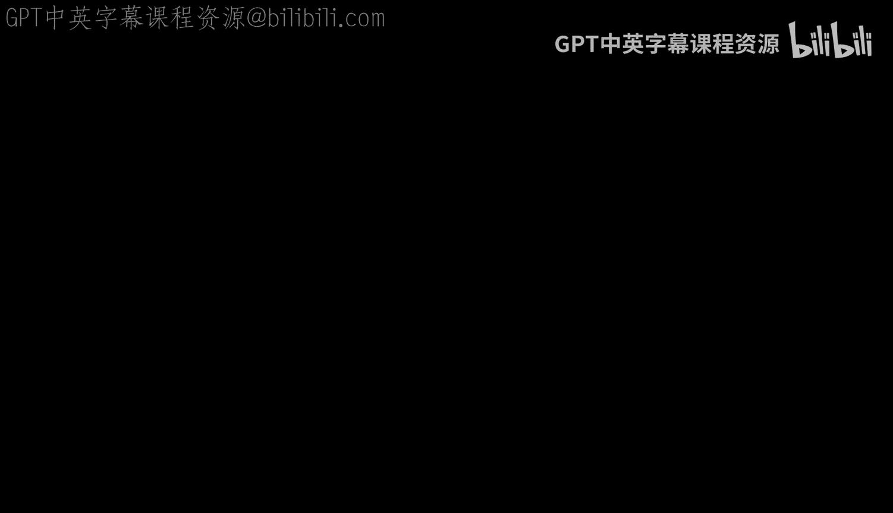

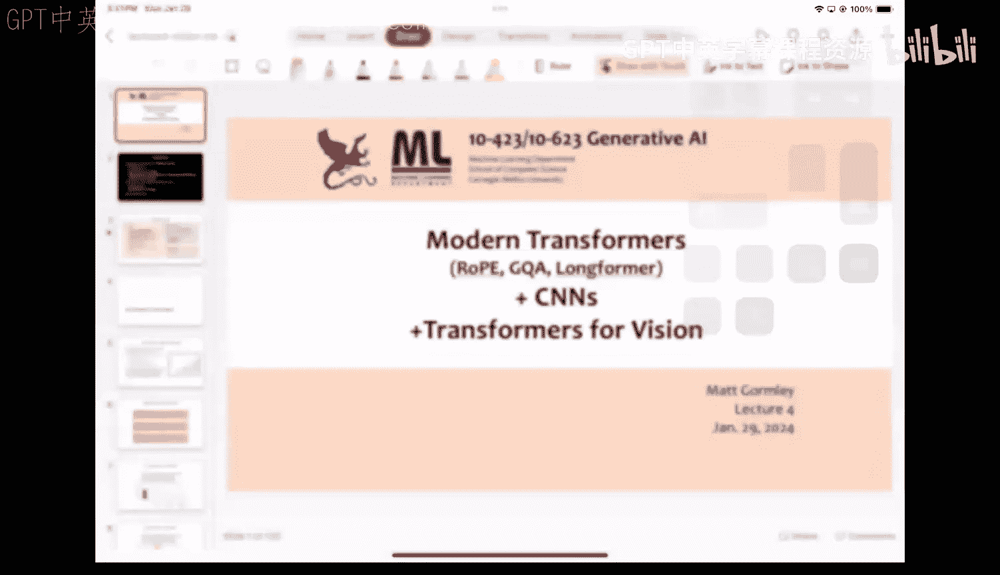

现代深度学习架构有着悠久的历史。2006年，预训练思想的出现极大地推动了深度学习的复兴。我们可以通过三种不同的训练范式来理解这一发展：

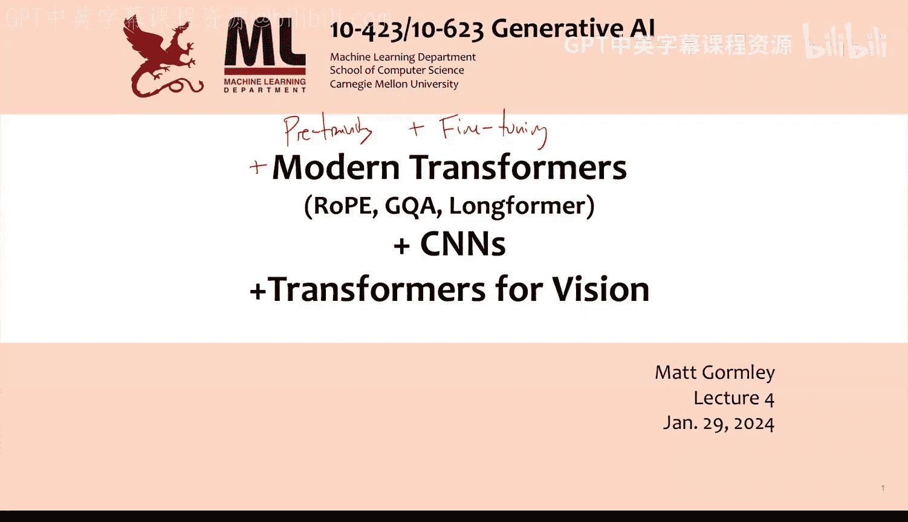

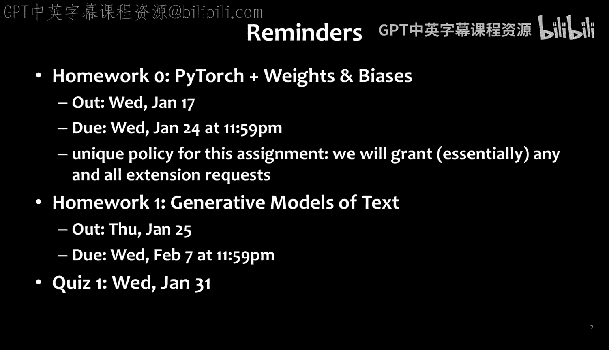

1.  **监督微调**：直接使用带标签的数据训练整个模型。
2.  **逐层监督预训练 + 监督微调**：逐层贪婪地训练模型，每层都使用监督信号，最后对整个模型进行微调。
3.  **无监督预训练 + 监督微调**：使用无标签数据预训练模型，然后使用带标签的数据进行微调。

2006年的一个关键实验展示了这些范式的效果。在MNIST手写数字分类任务上：
*   使用**监督微调**的浅层神经网络错误率低于2%。
*   使用相同方法训练的深层神经网络错误率反而更高。
*   采用**逐层监督预训练**后，深层网络的错误率有所下降，但仍不如浅层网络。
*   最终，**无监督预训练 + 监督微调**的方法使得深层网络的性能超越了浅层网络，这成为了深度学习复兴的“火花”。

无监督预训练的核心是**自编码器**。其目标是让模型重建输入数据本身，从而学习到数据的有用表示。

一个自编码器包含两部分：
*   **编码器**：将输入 `x` 映射到低维表示 `z`。
    `z = f_encoder(x)`
*   **解码器**：从表示 `z` 重建输入 `x'`。
    `x' = f_decoder(z)`

损失函数是原始输入 `x` 与重建输出 `x'` 之间的距离（如均方误差）。通过这种逐层贪婪的无监督预训练，模型获得了良好的参数初始化，随后在特定任务（如分类）的带标签数据上进行监督微调，性能得到显著提升。

这一“预训练-微调”范式如今被广泛应用。例如，大型语言模型的生成式预训练就是在海量无标签文本上进行的，目标是最优化观测句子的似然概率。

## 现代Transformer模型 🚀

了解了预训练的基础后，我们来看看几种具有代表性的现代Transformer模型及其核心改进。

以下是近年来一些重要模型及其特点：
*   **PaLM (2022年10月)**：5400亿参数，使用了GLU激活函数、多查询注意力、旋转位置编码，并在7800亿token上训练。
*   **LLaMA 1 (2023年2月)**：模型规模从70亿到650亿不等，使用RMSNorm、旋转位置编码，在1.4万亿token上训练。
*   **Falcon (2023年6月)**：完全开源，使用分组查询注意力、旋转位置编码、GELU激活函数，在3.5万亿token上训练。
*   **LLaMA 2 (2023年8月)**：引入了对话微调版本，使用分组查询注意力，上下文长度增至4096，使用2万亿token训练。
*   **Mistral (2023年10月)**：70亿参数的小模型，性能超越LLaMA 2 130亿，使用滑动窗口注意力和分组查询注意力，上下文长度超过8000。

从这些模型中，我们可以总结出几个重要的技术趋势：**旋转位置编码**、**分组查询注意力**和**滑动窗口注意力**。

### 旋转位置编码

旋转位置编码旨在替代传统的绝对位置编码，将相对位置信息更优雅地整合到注意力计算中。

标准注意力计算查询 `q` 和键 `k` 的相似度时，使用点积：
`相似度 = (q · k) / sqrt(d_k)`

而旋转位置编码在计算时，会考虑查询和键之间的相对距离 `m`。它通过一个旋转矩阵 `R` 来变换 `q` 和 `k`：
`变换后的 q = R(theta, m) * q`
`变换后的 k = R(theta, m) * k`
`相似度 = (变换后的 q · 变换后的 k) / sqrt(d_k)`

具体实现时，它将高维向量分解为多个二维向量对，并对每个二维向量进行不同角度的旋转。距离 `m` 越大，旋转角度也越大。这种方法保证了相对距离越远的token，其表示在向量空间中也越“疏远”，比简单的加法位置编码更具几何意义。

### 分组查询注意力

分组查询注意力是对标准多头注意力的高效改进，旨在减少计算和内存开销。

在标准多头注意力中，每个头都有独立的查询（Q）、键（K）、值（V）参数矩阵。分组查询注意力则将多个查询头分组，共享同一组键和值头。

假设总共有 `H_q` 个查询头， `H_kv` 个键值头（`H_q` 可被 `H_kv` 整除），每组大小为 `G = H_q / H_kv`。计算时，每组内的 `G` 个查询头共享同一个键头和值头。虽然最终输出的头数减少为 `H_kv`，但通过调整模型其他部分（如MLP层）的参数，模型整体性能与标准多头注意力相近，同时显著提升了效率。

### 滑动窗口注意力

滑动窗口注意力（又称局部注意力）通过限制每个token只能关注其附近一个窗口内的token，来降低长序列的计算复杂度。

它使用一个加强版的因果掩码。设窗口大小为 `W`，对于当前位置的token，它只能关注其左侧 `W/2` 个token、自身以及右侧 `W/2` 个token（在纯因果掩码中，只关注左侧）。这相当于将全连接的注意力图变成了一个带状矩阵。

关键在于高效实现。朴素实现（使用大矩阵并填充 `-inf`）无法节省计算。高效的实现需要将序列分块，每个块大小为 `W`，块之间有重叠，然后对每个块独立进行注意力计算。虽然单层只能看到局部信息，但通过堆叠多层，高层网络能够间接捕获长距离依赖。Mistral模型就成功使用了滑动窗口注意力来处理长上下文。

## 卷积神经网络入门 👁️

在深入视觉Transformer之前，我们需要先了解计算机视觉的传统主力——卷积神经网络。

卷积神经网络特别适合图像数据，因为它具有**平移不变性**：在图像一处学到的模式，可以应用到图像的其他位置。

### 卷积操作

卷积操作的核心是使用一个小的**卷积核**（或滤波器）在输入图像上滑动，并进行点积运算。

假设有一个3x3的输入图像 `X` 和一个2x2的卷积核 `Alpha`：
```
X = [[x11, x12, x13],
     [x21, x22, x23],
     [x31, x32, x33]]

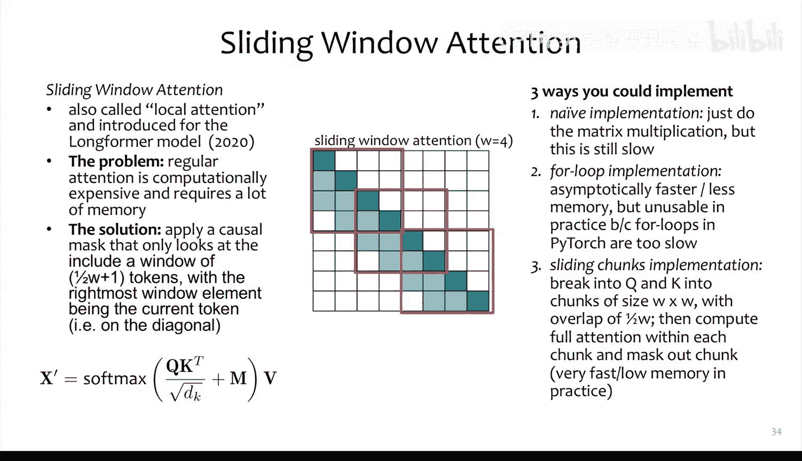

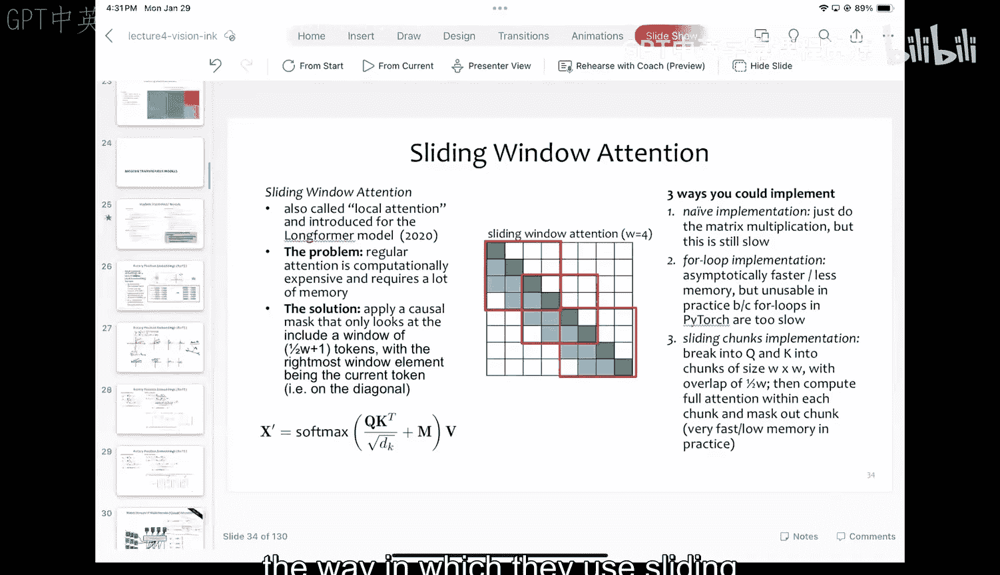

Alpha = [[a11, a12],
         [a21, a22]]
```
输出 `Y` 是一个2x2的特征图：
`y11 = a11*x11 + a12*x12 + a21*x21 + a22*x22 + bias`
`y12 = a11*x12 + a12*x13 + a21*x22 + a22*x23 + bias`
...以此类推，滑动卷积核得到所有输出。

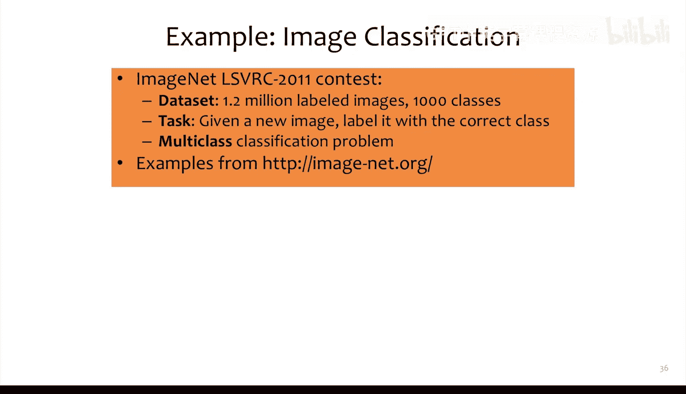

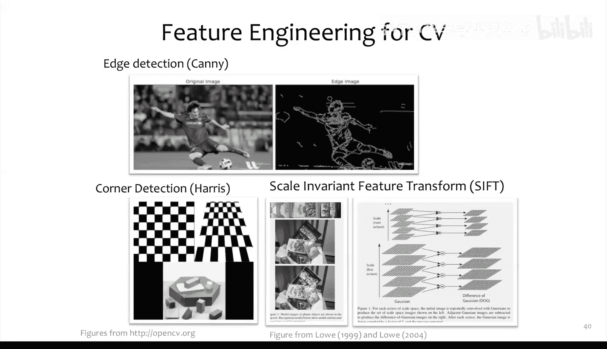

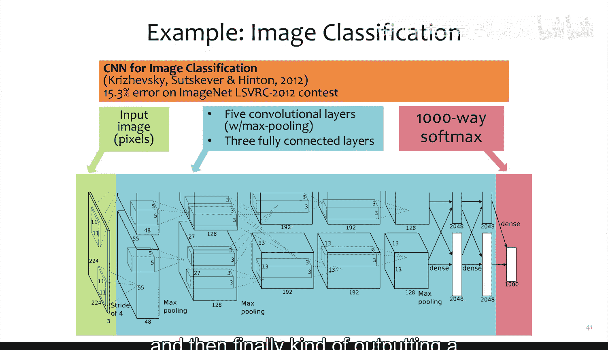

通过设计不同的卷积核，可以手动实现各种图像处理效果，如模糊、锐化、边缘检测等。

### 从手工特征到学习特征

CNN的关键突破在于，**卷积核的参数不再是手工设计的，而是通过数据学习得到的**。模型会自动从数据中学习到有用的特征（如边缘、纹理、形状）。

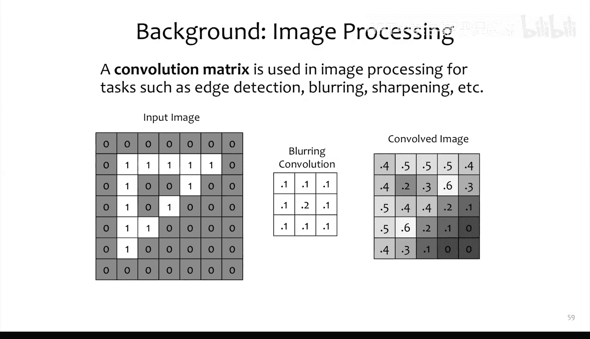

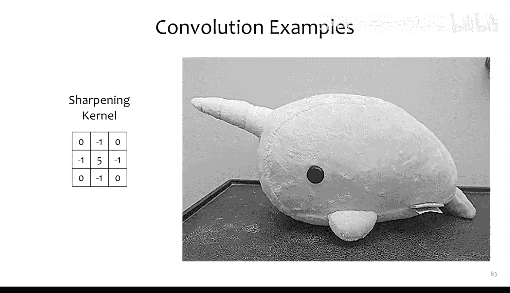

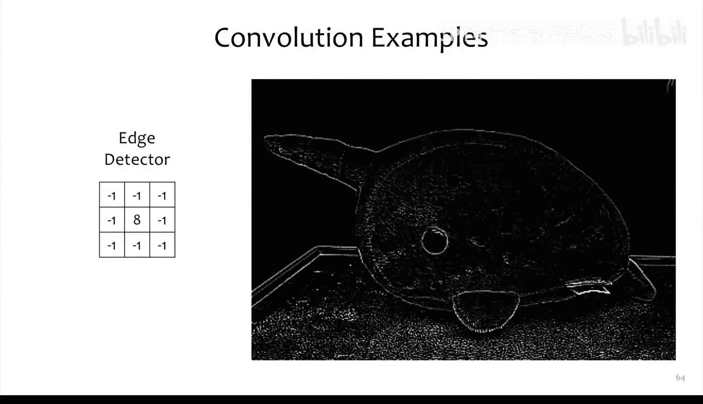

一个典型的CNN由多种层堆叠而成：
1.  **卷积层**：使用多个可学习的卷积核提取特征，产生多个输出通道。
2.  **激活层**（如ReLU）：引入非线性。
3.  **池化层**（如最大池化）：进行下采样，减少空间尺寸，增加感受野。
4.  **全连接层**：在网络的末端，将特征图展平后进行分类或回归。

对于彩色图像（3个通道），卷积核也是三维的（宽 x 高 x 输入通道数）。每个卷积核会同时处理所有输入通道，并产生一个输出通道。多个卷积核则产生多个输出通道。

训练CNN与训练其他神经网络一样，使用反向传播和随机梯度下降优化损失函数（如交叉熵损失）。

### CNN架构演进

CNN架构不断向更深、更有效的方向发展：
*   **LeNet-5 (1998)**：早期成功的CNN，用于手写数字识别。
*   **AlexNet (2012)**：在ImageNet竞赛中取得突破性成功，使用了ReLU激活函数和Dropout。
*   **VGGNet (2014)**：通过反复堆叠3x3卷积，构建了更深的网络，结构简洁。
*   **ResNet (2015)**：引入了残差连接，解决了极深网络中的梯度消失问题，使得构建数百层的网络成为可能。

小尺寸卷积核（如3x3）的流行，源于其参数效率高，并且通过堆叠多层，高层神经元能够获得很大的感受野，从而捕获图像的全局信息。

---

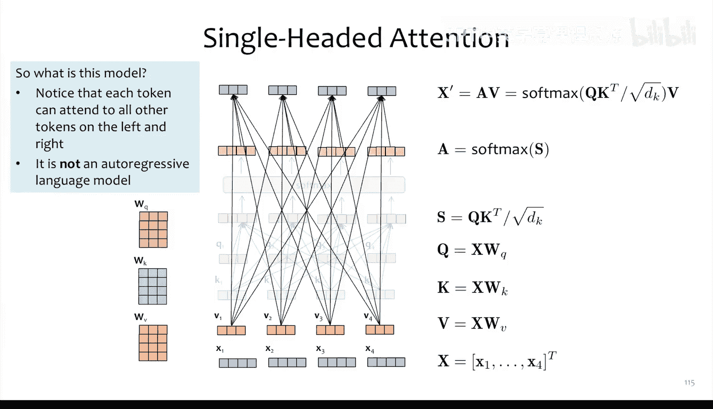

本节课中，我们一起学习了现代Transformer模型的几项重要改进：旋转位置编码、分组查询注意力和滑动窗口注意力，它们分别从位置表示、计算效率和长序列处理方面优化了模型。同时，我们也回顾了卷积神经网络的基本原理，理解了其平移不变性和层级特征提取的特点。下一节课，我们将探讨如何将去掉因果掩码的Transformer应用于视觉任务，开启生成式AI在视觉领域的大门。