# 05：GANs与条件GANs

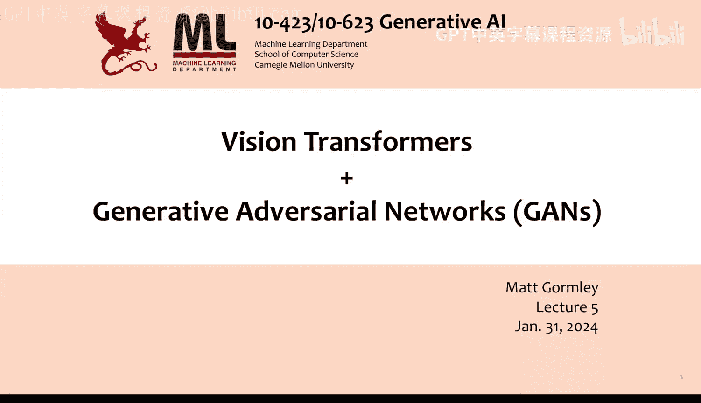

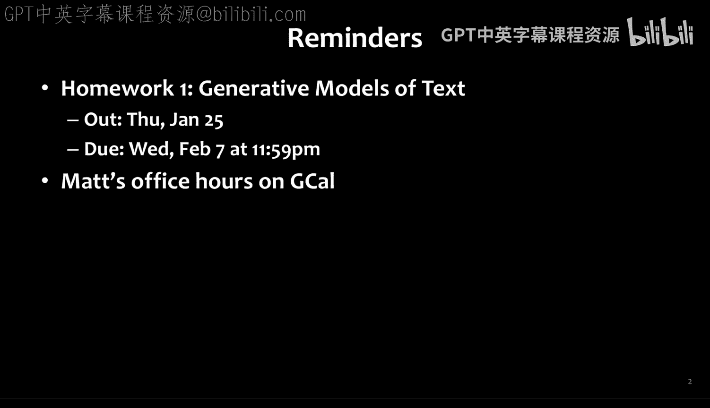

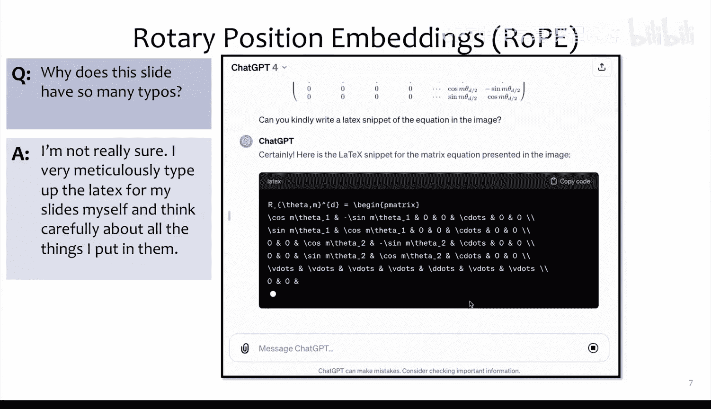

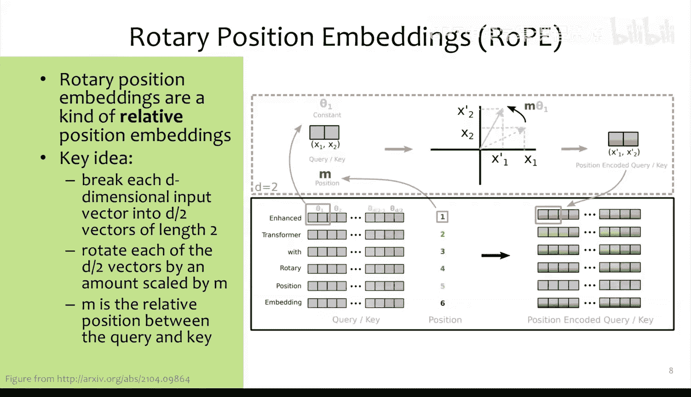

在本节课中，我们将学习两种重要的生成模型：生成对抗网络及其条件变体。我们将从计算机视觉任务和视觉Transformer的现代视角开始，然后深入探讨如何构建能够生成图像的模型。

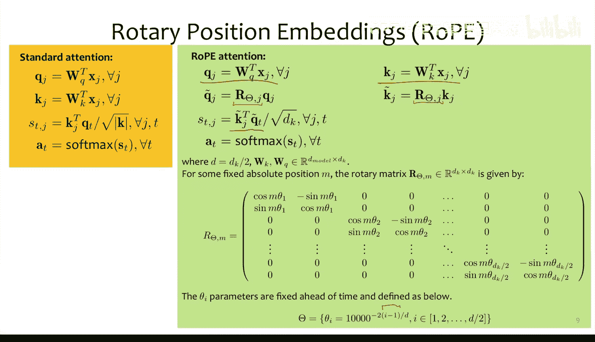

## 计算机视觉任务与视觉Transformer

上一节我们回顾了Transformer在语言模型中的应用。本节中，我们来看看Transformer如何应用于计算机视觉领域。

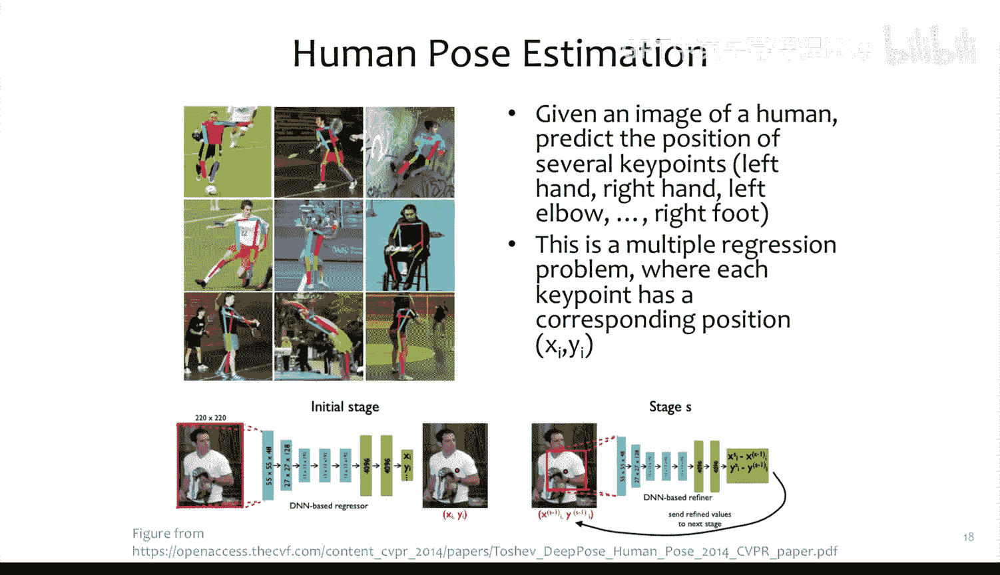

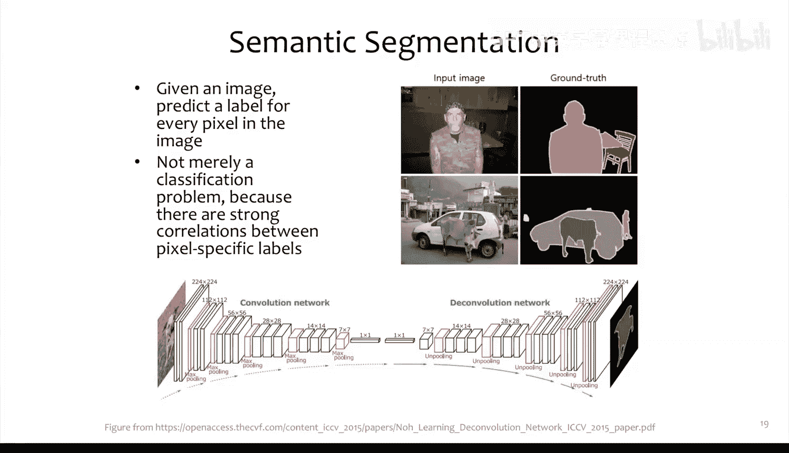

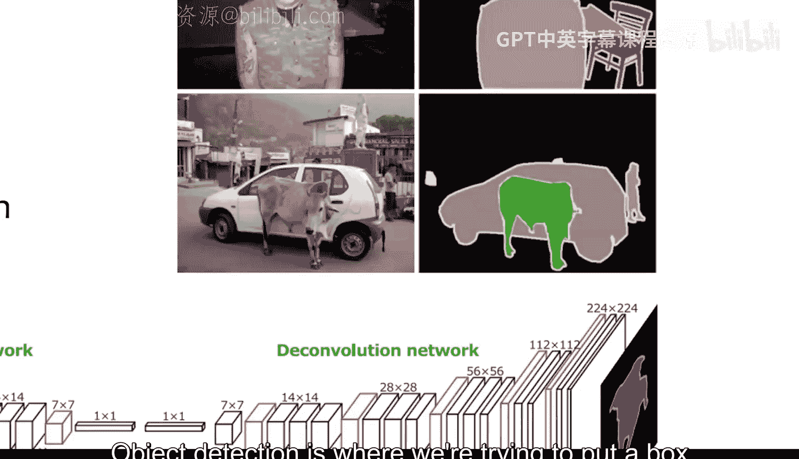

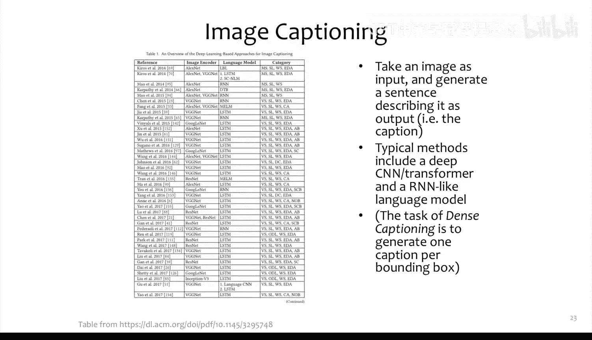

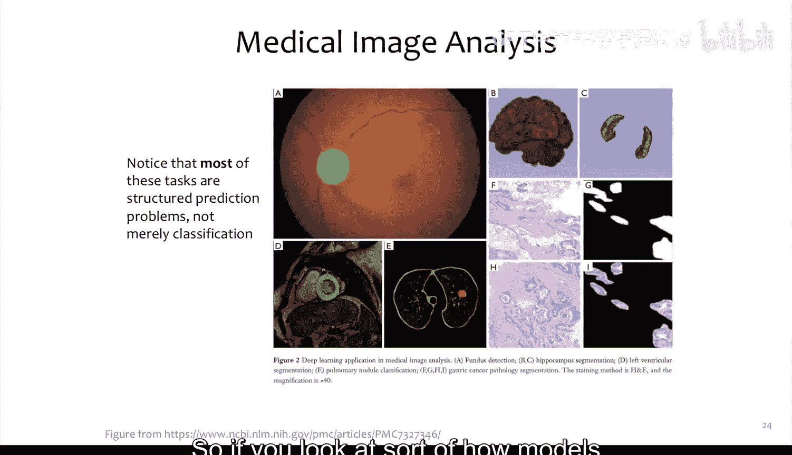

计算机视觉包含多种任务，例如：
*   **图像分类**：给定图像，预测其类别标签。
*   **分类与定位**：预测类别标签及目标在图像中的边界框位置。这可以看作一个多输出回归问题，输出四个值：`(x, y, 宽度, 高度)`。
*   **语义分割**：为图像中的每一个像素预测一个类别标签。
*   **图像描述生成**：为图像生成一段文字描述。早期模型通常结合CNN图像编码器和RNN语言模型，后来逐渐转向使用Transformer。

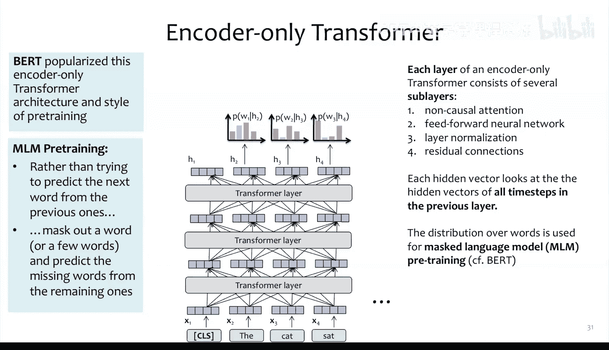

### 仅编码器Transformer与视觉Transformer

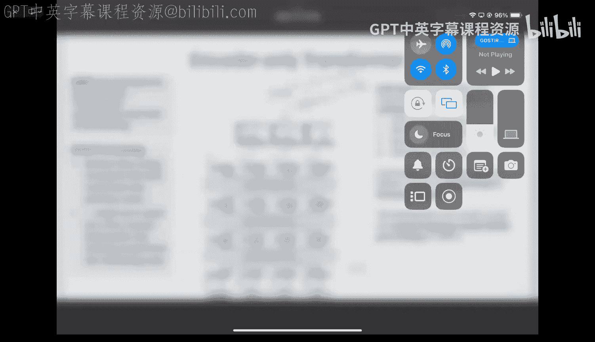

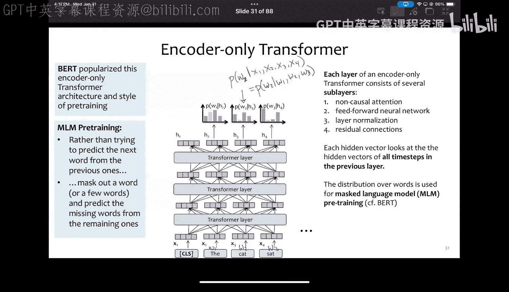

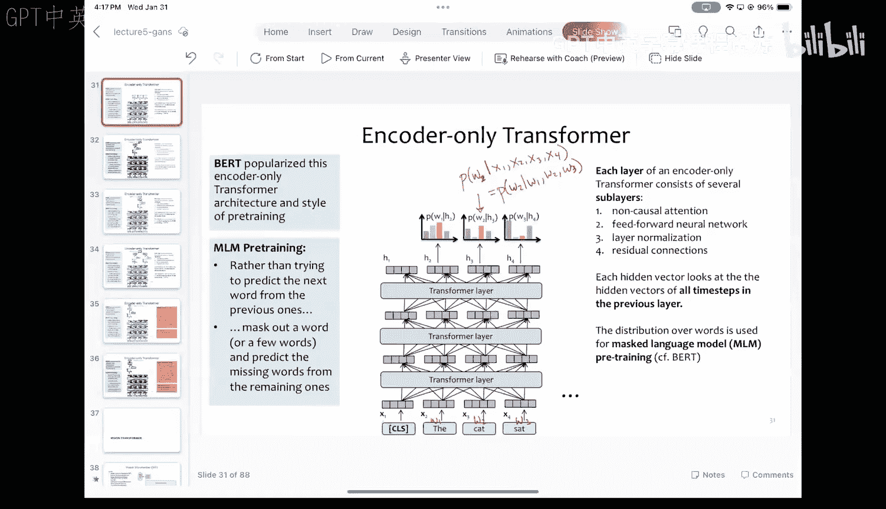

仅编码器Transformer（如BERT）使用非因果注意力机制，即每个位置的表示可以关注输入序列中的所有位置。其预训练通常采用**掩码语言建模**：随机遮盖输入句子中的部分词语，然后训练模型根据上下文预测这些被遮盖的词语。

视觉Transformer的结构与BERT几乎完全相同，区别仅在于输入处理：
1.  将输入图像分割成固定大小的非重叠图像块（例如16x16像素）。
2.  每个图像块通过一个线性层被投影为一个向量（例如1024维），作为“词嵌入”。
3.  为每个图像块添加一维位置嵌入，以保留其顺序信息。
4.  将处理后的序列输入标准的仅编码器Transformer。
5.  使用一个额外的可学习“[CLS]”标记（在ViT中称为类别嵌入）的表示，通过一个多层感知机来预测图像类别。

视觉Transformer的预训练通常在大型有标签数据集（如ImageNet）上进行监督分类。尽管其位置嵌入是一维的，缺乏CNN固有的平移不变性等归纳偏置，但通过在大规模数据（数亿图像）上训练，模型可以学习到这些关系，从而取得超越传统CNN的性能。

## 图像生成任务简介

接下来，我们将焦点转向图像生成。图像生成有多种形式：
*   **类别条件生成**：给定一个类别标签，生成属于该类别的图像。这是图像分类的逆过程，目标是学习 `P(图像 | 类别)`。
*   **超分辨率**：给定一张低分辨率图像，生成对应的高分辨率版本。
*   **图像编辑**：包括图像修复（填充图像中被移除的部分）、着色（为灰度图像添加颜色）等。
*   **风格迁移**：将一幅图像的内容与另一幅图像的风格相结合，生成新图像。
*   **文本到图像生成**：根据一段文本描述生成符合描述的图像。

## 生成对抗网络

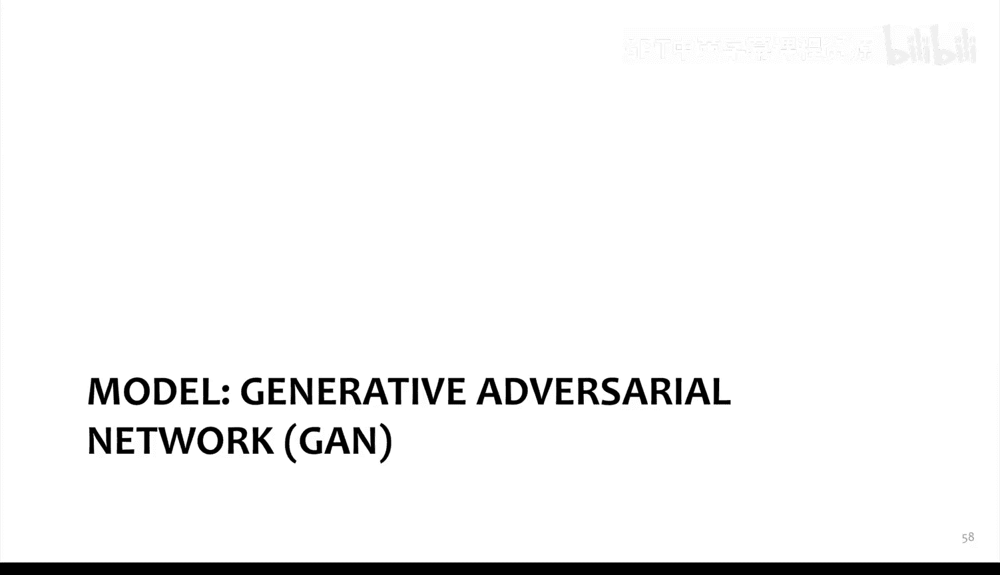

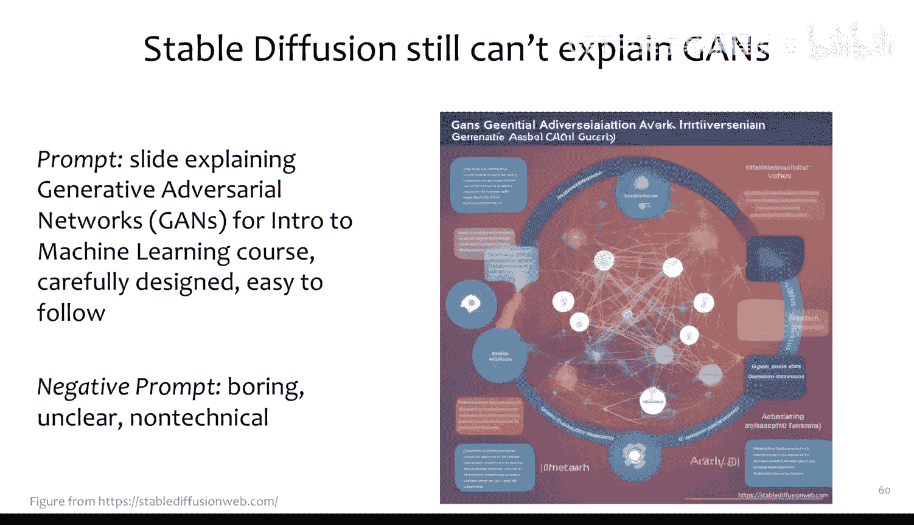

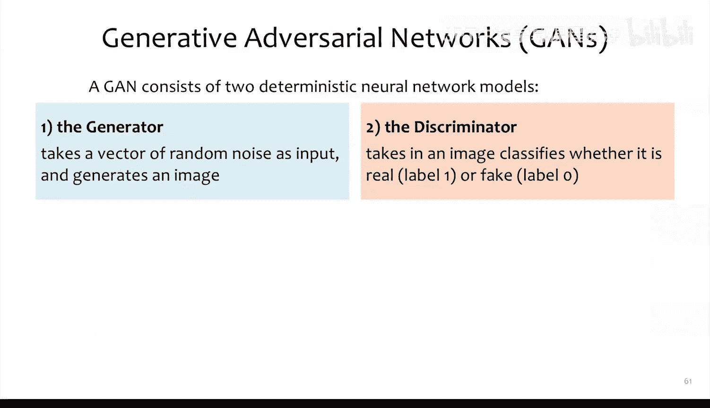

本节课我们一起学习了计算机视觉中Transformer的应用以及多种图像生成任务。作为我们深入探讨生成模型的开始，下一讲我们将重点介绍**生成对抗网络**——一种通过让两个神经网络相互对抗来学习生成逼真数据的方法。