# 06：生成对抗网络 (GANs) + 变分推断

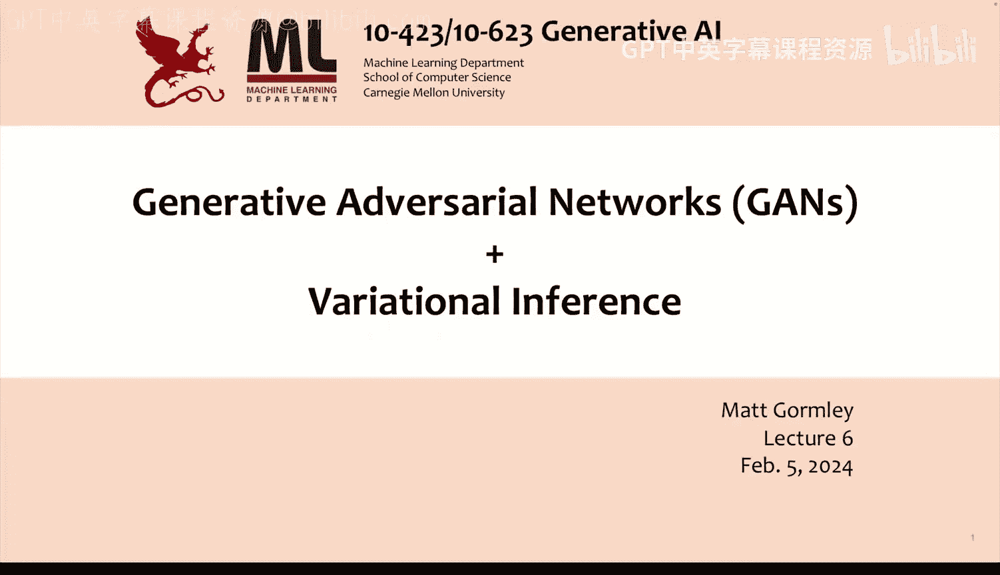


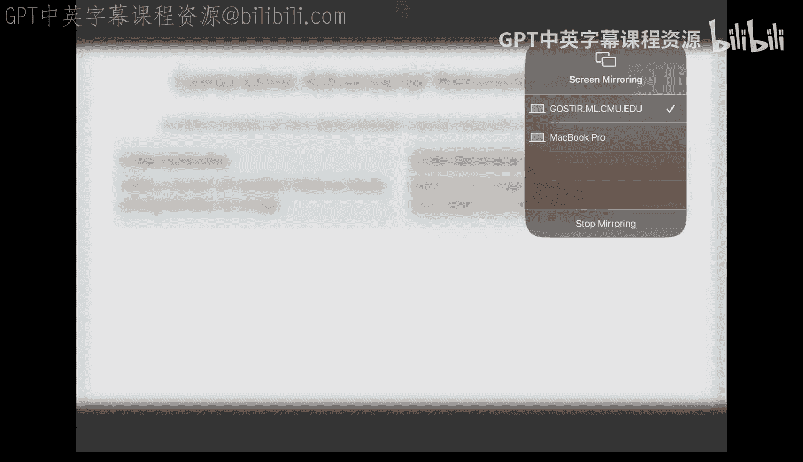

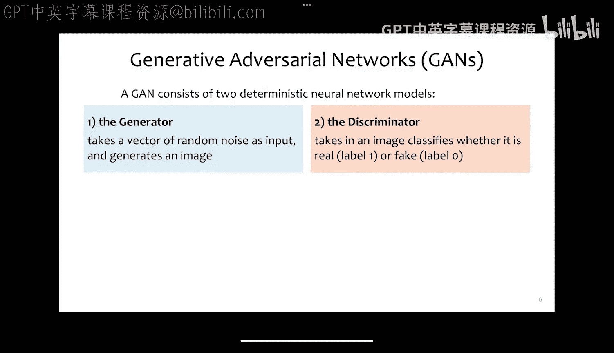

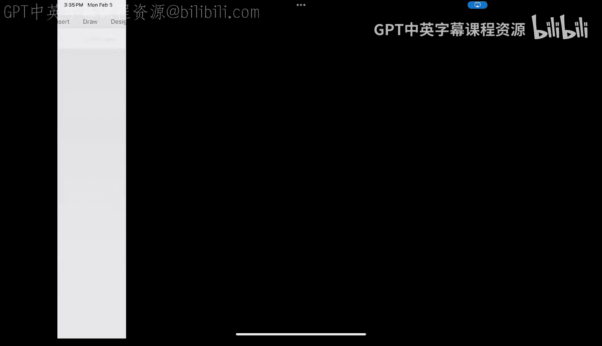

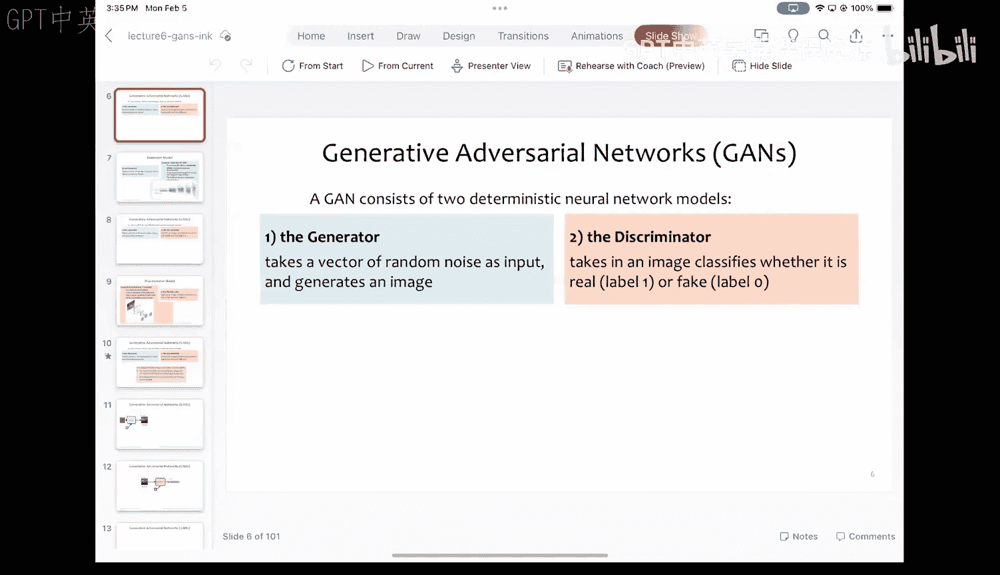

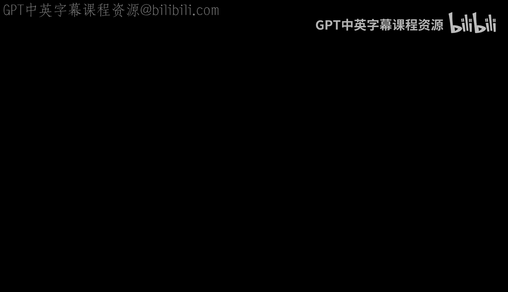

在本节课中，我们将学习两种重要的生成式模型：生成对抗网络和变分推断。我们将首先探讨GANs的基本原理和训练过程，然后介绍变分推断这一核心概念，为后续学习扩散模型和变分自编码器打下基础。

## GANs：两个网络的博弈

生成对抗网络由两个确定性的神经网络组成：一个生成器和一个判别器。它们相互竞争，共同进步。

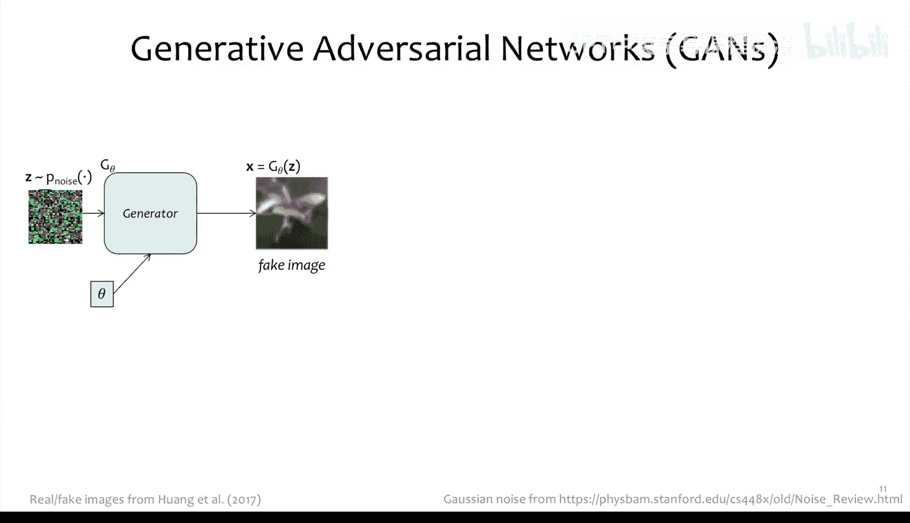

### 生成器模型

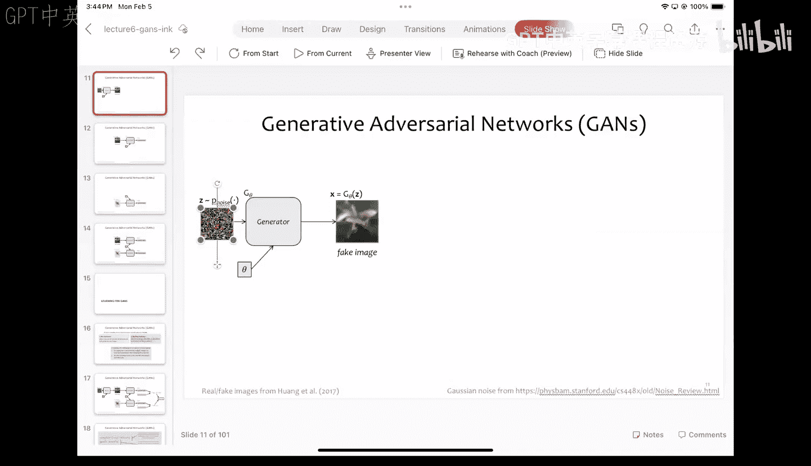

生成器是一个神经网络，它接收一个随机噪声向量 **z**，并生成一张假图像 **G_θ(z)**。一种常见的架构是使用**分数步长卷积**（Fractionally Strided Convolution）来逐步增大图像的尺寸。

例如，一个生成器可能从4x4像素开始，通过几层分数步长卷积，逐步生成8x8、16x16、32x32，最终输出64x64像素的三通道（RGB）图像。

### 判别器模型

判别器是一个分类器神经网络，其任务是判断输入的图像是真实的（来自数据集）还是虚假的（由生成器生成）。一种改进的判别器是**PatchGAN**，它不直接判断整张图像，而是将图像分割成多个小块（如4x4的补丁），并对每个小块进行真假预测。这有助于生成更清晰、细节更丰富的图像。

## GANs的训练过程

GAN的训练是一个**极小极大博弈**。生成器试图生成足以“欺骗”判别器的逼真图像，而判别器则努力区分真假图像。

### 目标函数

训练的目标函数基于标准的交叉熵损失。对于判别器，其目标是最大化正确分类真实图像和虚假图像的概率。对于生成器，其目标是最小化其生成的虚假图像被判别器识别为假的概率。

数学上，我们可以将目标函数 **J(θ, φ)** 定义为：
```
J(θ, φ) = E_{x~p_data}[log D_φ(x)] + E_{z~p_z}[log(1 - D_φ(G_θ(z)))]
```
其中：
*   **D_φ(x)** 是判别器认为图像 **x** 为真的概率。
*   **G_θ(z)** 是生成器根据噪声 **z** 生成的图像。
*   判别器 **φ** 试图**最大化 J**。
*   生成器 **θ** 试图**最小化 J**（具体是最小化公式的第二项）。

### 训练算法

训练采用交替优化的策略，类似于块坐标下降法：
1.  **固定生成器，训练判别器**：采样一批真实图像和一批由生成器产生的假图像，通过梯度上升更新判别器参数 **φ**，使其更好地区分真假。
2.  **固定判别器，训练生成器**：采样一批噪声，通过梯度下降更新生成器参数 **θ**，使其生成的图像更能欺骗当前的判别器。

实践中，通常会为判别器执行 **K** 步更新（例如K=1），然后再为生成器执行一步更新。这确保了生成器是在与一个相对强大的判别器博弈，从而学习生成更高质量的图像。

### 条件生成

GANs可以进行**条件生成**。通过向生成器和判别器同时输入一个类别标签（例如，“飞机”、“猫”），模型可以学习生成特定类别的图像。这使生成过程更具可控性。

## GANs的扩展与影响

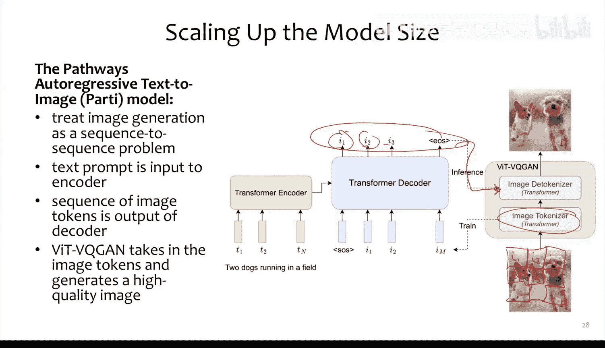

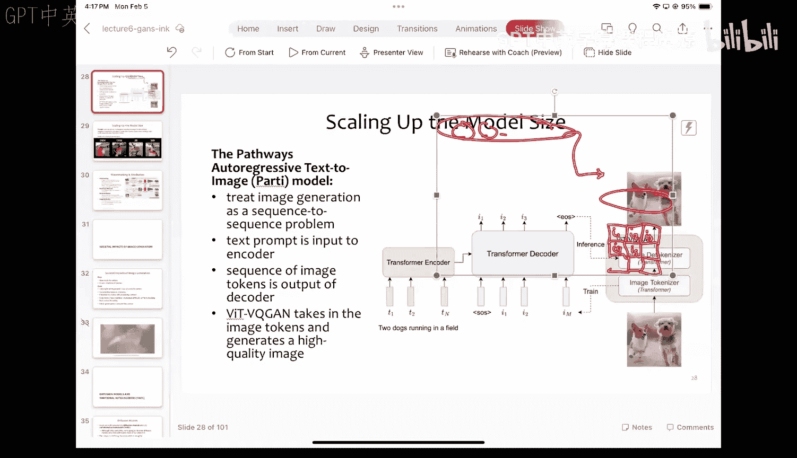

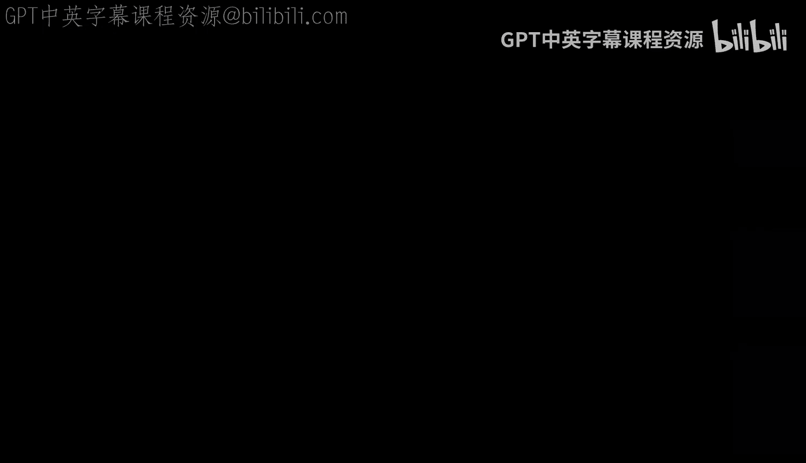

随着模型规模的扩大，GANs能够生成极其逼真的图像。一些大型模型（如Pathways模型）采用了两阶段架构：首先用一个自回归变换器根据文本提示生成一系列图像语义标记，然后再用一个基于GAN的模型将这些标记解码成高分辨率图像。

### 社会影响

生成式图像模型的强大能力带来了双重影响：
*   **积极方面**：为艺术家提供了强大的创作和编辑工具，开启了新的艺术形式。
*   **挑战与风险**：包括版权侵权、创意萎缩、制造虚假信息（如假新闻、深度伪造）等。应对措施包括开发数字水印技术、假图像检测模型和模型归属识别工具。然而，**图像溯源**（追溯生成图像所使用的原始训练数据）仍然是一个巨大的开放挑战。

## 变分推断：处理棘手概率问题的工具

在转向扩散模型和变分自编码器之前，我们需要理解**变分推断**这一核心概念。它为我们提供了一种通过优化来近似处理复杂概率计算（如后验推断）的方法。

### 图模型基础

图模型是一种用图结构直观表示变量间概率依赖关系的工具。

**有向图模型（贝叶斯网络）**：用有向无环图表示因果关系或依赖关系。联合概率分布分解为每个节点给定其父节点的条件概率的乘积。例如：
```
P(A, B, C, D) = P(A) * P(B) * P(C|A,B) * P(D|C)
```
每个条件概率表（CPT）或概率密度函数是**局部归一化**的。

**马尔可夫假设**：在序列模型中，一个常见简化是假设当前状态只依赖于前一个状态，即：
```
P(X_t | X_1, ..., X_{t-1}) = P(X_t | X_{t-1})
```
这构成了**一阶马尔可夫链**的基础。

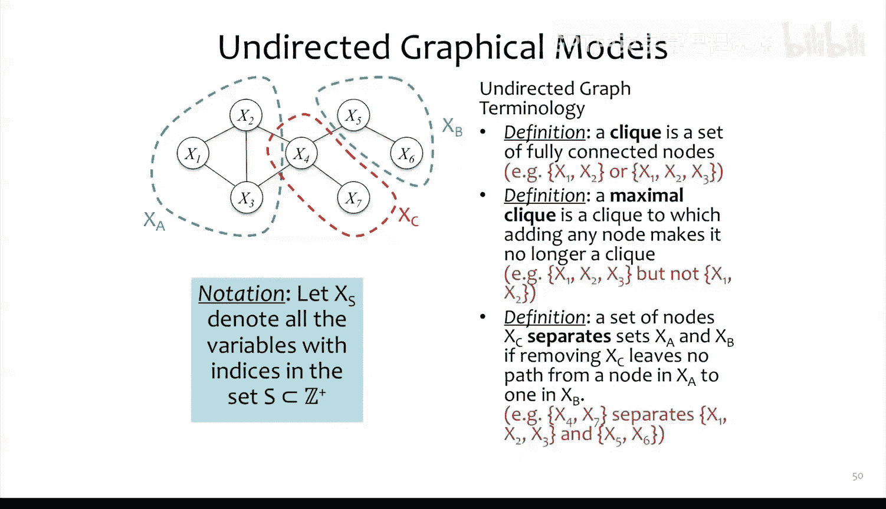

**因子图**：一种更通用的表示，包含变量节点和因子节点。因子是定义在变量子集上的非负函数。联合概率分布正比于所有因子的乘积，并通过一个全局归一化常数 **Z** 确保总和为1。
```
P(X) = (1/Z) * ∏_{k} ψ_k(D_k)
```
其中 **Z = Σ_x ∏_{k} ψ_k(D_k)** 需要对所有变量取值求和，这使得计算通常很困难。这种模型是**全局归一化**的。

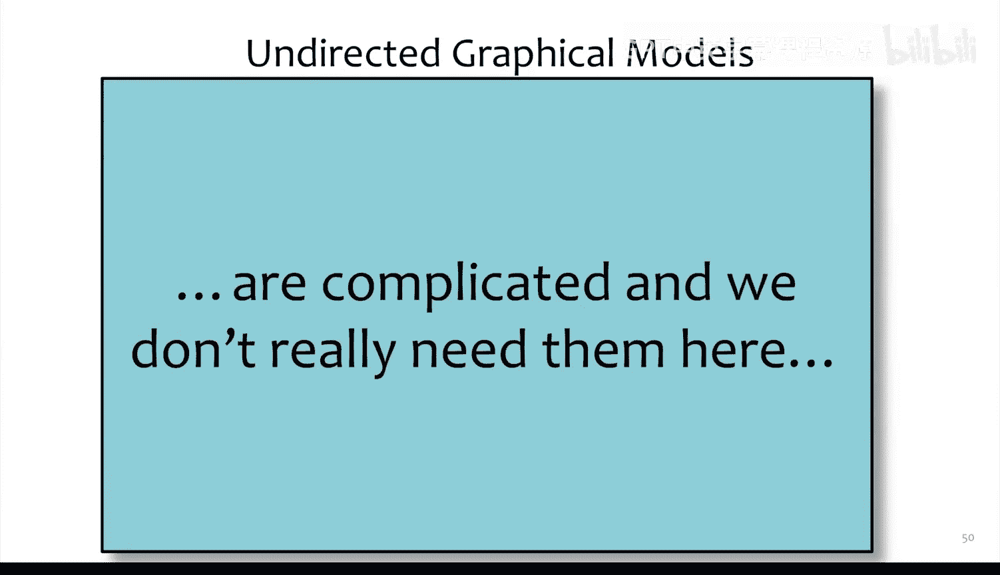

### 变分推断的核心思想

在许多机器学习问题中，我们观测到变量 **X**（如数据），并希望推断潜在变量 **Z**（如模型参数或隐层表示）的后验分布 **P(Z|X)**。直接计算这个后验分布通常是**难以处理的**。

变分推断的核心思想是：**用一个由参数 **φ** 定义的、形式更简单的分布 **Q_φ(Z)** 来近似真实的后验分布 **P(Z|X)**。** 我们通过优化参数 **φ**，最小化 **Q_φ(Z)** 与 **P(Z|X)** 之间的差异（通常用KL散度衡量），从而得到最好的近似。

这引出了**变分下界**的概念，它允许我们将难以处理的后验推断问题转化为一个可优化的目标函数。我们将在下一节课中详细探讨这一点，并看到它如何直接应用于扩散模型和变分自编码器的构建。

## 总结

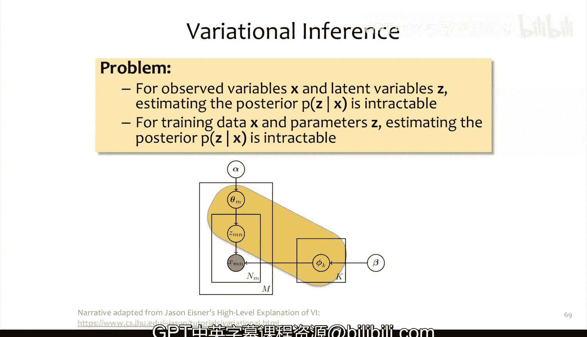

本节课我们一起学习了生成对抗网络的基本原理和训练过程，了解了其“对抗博弈”的核心思想。随后，我们引入了变分推断这一重要概念，介绍了有向图模型、因子图以及局部/全局归一化的区别，为理解后续更复杂的生成模型（如扩散模型）奠定了理论基础。下一节课，我们将深入探讨变分下界，并开始学习扩散模型。