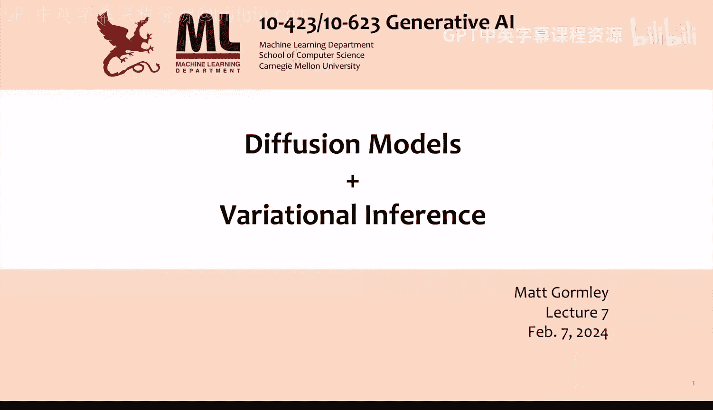
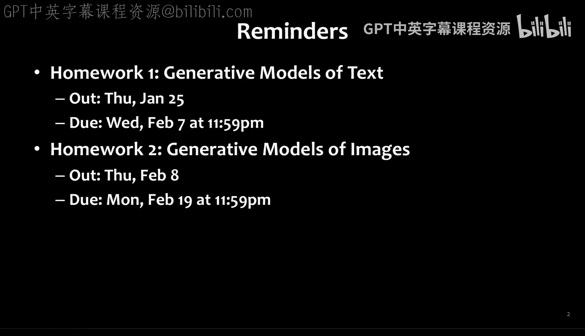
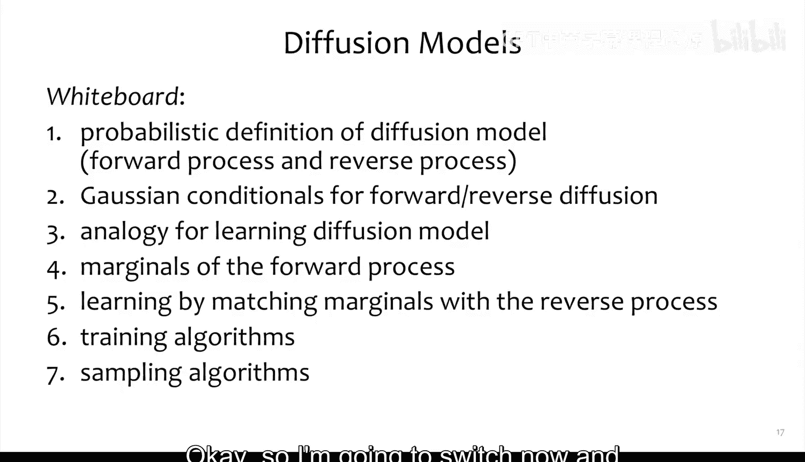
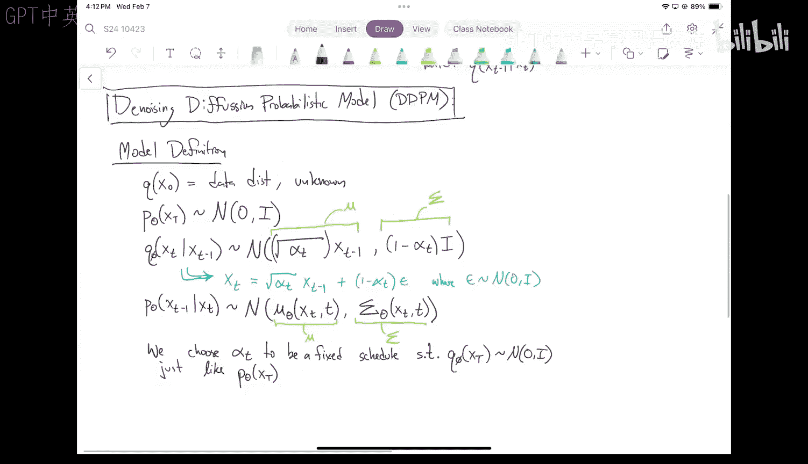
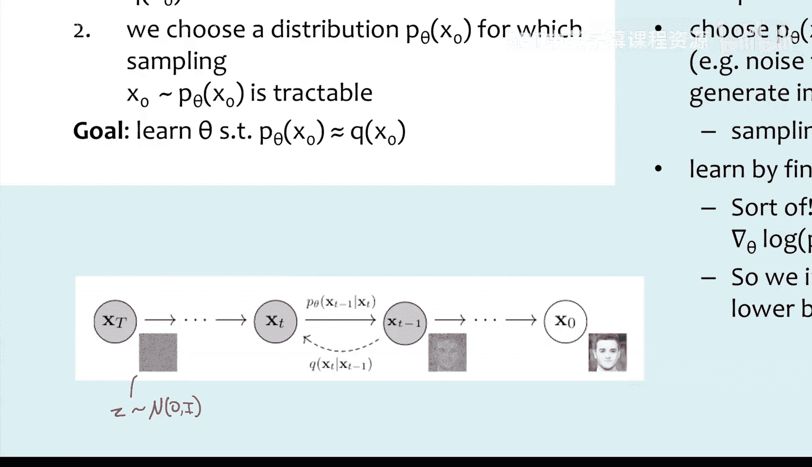
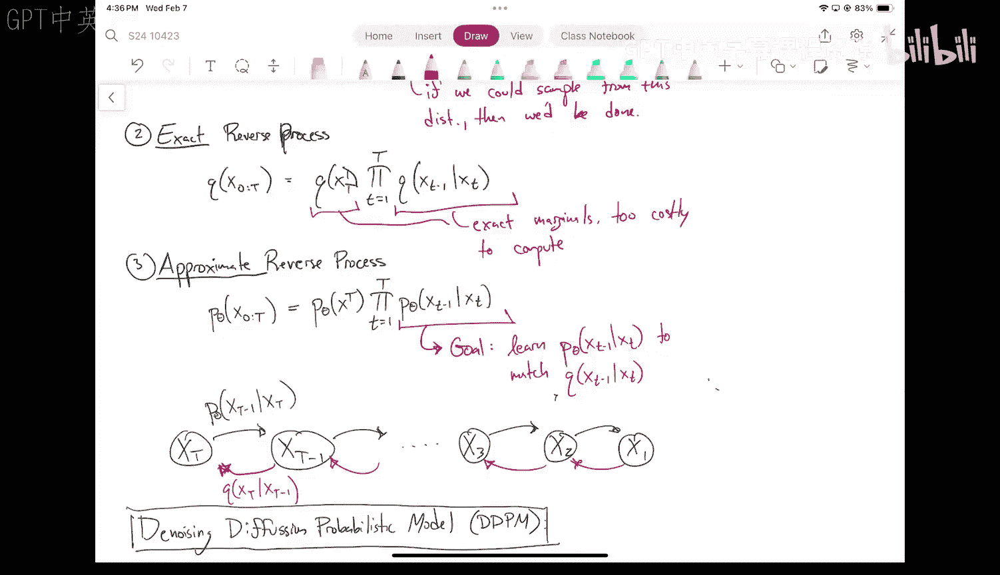
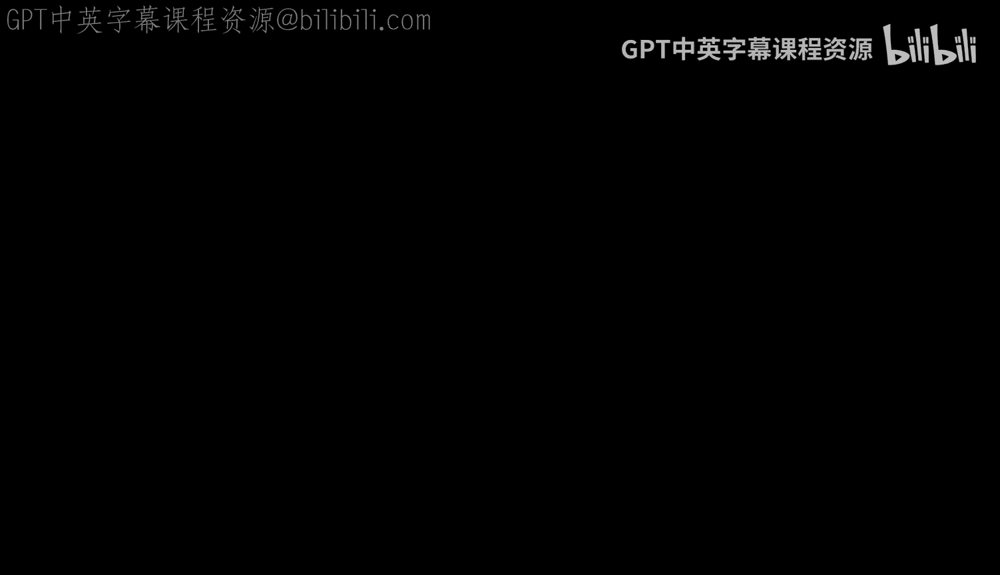
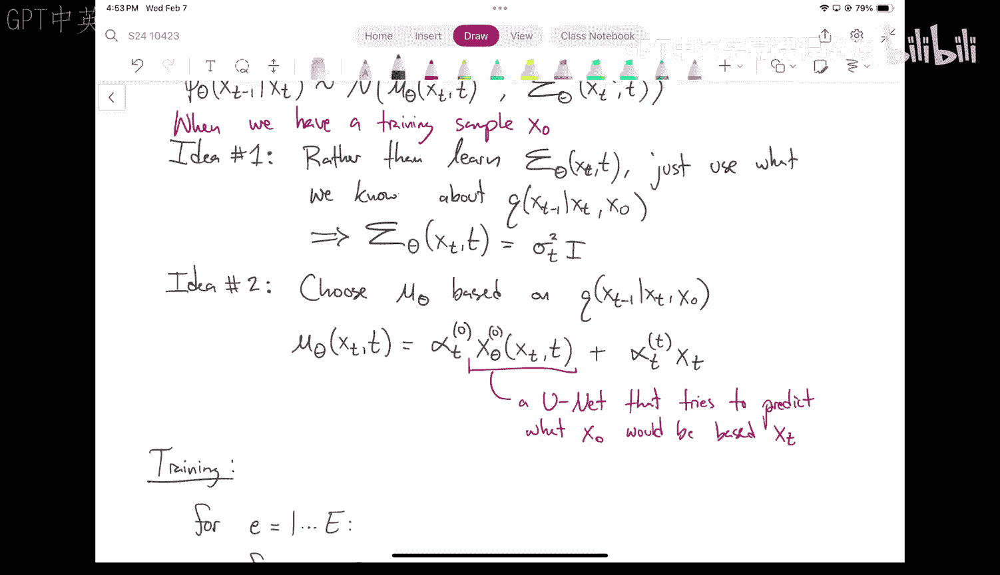

# 07：扩散模型与变分推断

在本节课中，我们将学习扩散模型的基本原理。这是一种强大的生成模型，能够通过逐步添加和去除噪声来生成高质量的数据，如图像。我们将从直观的角度出发，先理解扩散模型的核心思想，再探讨其与变分推断的联系。

## 模型架构：U-Net

在深入扩散模型之前，我们需要了解一个关键的神经网络架构：U-Net。U-Net因其计算图呈“U”形而得名，最初用于生物医学图像分割任务。

U-Net的核心特性是输入和输出具有相同的空间维度。它包含一个“收缩路径”和一个“扩展路径”。收缩路径通过卷积和池化层逐步降低特征图的空间尺寸并增加通道数。扩展路径则通过上采样和卷积层逐步恢复空间尺寸。一个关键设计是，在扩展路径中，会将收缩路径对应层级的特征图拼接过来，这有助于保留细节信息。

上一节我们介绍了U-Net的基本结构，本节中我们来看看它在扩散模型中的作用。简单来说，U-Net将作为我们模型的核心组件，用于预测如何从带噪声的图像中恢复原始图像。

## 无监督学习框架

为了理解扩散模型，我们首先需要建立一个无监督学习的通用框架。

我们的假设是数据来自某个真实分布 \( Q(x_0) \)，其中 \( x_0 \) 可以是一张图像或一段文本。我们的目标是学习一个参数化的模型分布 \( P_\theta \)，使得 \( P_\theta \approx Q \)，并且从 \( P_\theta \) 中采样是可行的。

以下是几种生成模型在此框架下的对比：
*   **自回归语言模型**：选择 \( P_\theta \) 为自回归模型。其条件分布 \( P(x_t | x_{<t}) \) 是分类分布（softmax），因此祖先采样算法既高效又精确。我们通过最大化训练数据的对数似然（最大似然估计）来学习参数。
*   **生成对抗网络**：选择 \( P_\theta \) 为一个将噪声向量 \( z \) 映射到图像的确定性生成器。然而，计算数据点 \( x_0 \) 在模型下的概率 \( P_\theta(x_0) \) 需要对所有可能的 \( z \) 进行积分，这通常是难以处理的。因此，GAN采用了对抗训练这种截然不同的学习方式。
*   **扩散模型**：其设置与GAN类似，\( Q \) 是真实数据分布，\( P_\theta \) 是生成模型。同样，直接计算 \( P_\theta(x_0) \) 的梯度是困难的。因此，我们将优化一个变分下界。

## 潜在变量模型

GAN和扩散模型都属于潜在变量模型。我们假设存在一些未观测到的潜在变量 \( z \)，它们生成了我们观察到的数据 \( x_0 \)。在GAN中，\( z \) 是输入生成器的噪声向量。学习后，我们可以在潜在空间 \( z \) 中进行插值，生成语义上平滑过渡的图像。

扩散模型也将利用潜在变量，但其形式更为复杂。

## 扩散模型：前向过程

现在，我们开始正式定义扩散模型。首先，我们定义一个简单的概率模型，称为**前向过程**（或扩散过程）。

前向过程是一个逐步向数据 \( x_0 \) 添加噪声的马尔可夫链。我们定义其联合分布为：
\[
Q_\phi(x_{1:T} | x_0) = \prod_{t=1}^{T} Q_\phi(x_t | x_{t-1})
\]
其中，\( Q_\phi(x_t | x_{t-1}) \) 是易于处理的简单分布（通常是高斯分布）。\( \phi \) 代表这个过程固定的参数（如噪声调度表）。这个过程从真实数据 \( x_0 \sim Q(x_0) \) 开始，经过 \( T \) 步后，得到几乎完全是噪声的 \( x_T \)。

## 扩散模型：反向过程

我们真正感兴趣的是**反向过程**，即从噪声生成数据的过程。根据概率链式法则，前向过程的联合分布也可以写成：
\[
Q_\phi(x_{1:T} | x_0) = Q_\phi(x_T | x_0) \prod_{t=1}^{T} Q_\phi(x_{t-1} | x_t, x_0)
\]
注意，这里我们将条件概率“翻转”了。虽然前向条件 \( Q_\phi(x_t | x_{t-1}) \) 很简单，但反向条件 \( Q_\phi(x_{t-1} | x_t) \)（不依赖于 \( x_0 \) 时）通常难以计算，因为它依赖于复杂的真实数据分布 \( Q(x_0) \)。

我们的目标是学习一个近似的反向过程 \( P_\theta \)，其结构与上述形式相同：
\[
P_\theta(x_{0:T}) = P_\theta(x_T) \prod_{t=1}^{T} P_\theta(x_{t-1} | x_t)
\]
我们希望 \( P_\theta(x_{t-1} | x_t) \) 能够逼近真实的反向条件分布 \( Q_\phi(x_{t-1} | x_t) \)。

## 去噪扩散概率模型

现在，我们具体化到最流行的扩散模型变体：**去噪扩散概率模型**。我们做出以下具体设定：

1.  **先验分布**：令 \( P_\theta(x_T) = \mathcal{N}(x_T; 0, I) \)，即标准高斯分布。
2.  **前向过程**：定义 \( Q_\phi(x_t | x_{t-1}) = \mathcal{N}(x_t; \sqrt{\alpha_t} x_{t-1}, (1-\alpha_t)I) \)，其中 \( \alpha_t \) 是一个预先定义好的、介于0和1之间的调度表。这意味着每一步都在当前值的基础上添加一点高斯噪声。
3.  **反向过程**：定义 \( P_\theta(x_{t-1} | x_t) = \mathcal{N}(x_{t-1}; \mu_\theta(x_t, t), \Sigma_\theta(x_t, t)) \)。其中，均值 \( \mu_\theta \) 和方差 \( \Sigma_\theta \) 是参数化的函数（如神经网络）。

**关键设计**：我们精心选择调度表 \( \{\alpha_t\} \)，使得当 \( T \) 足够大时，前向过程产生的 \( x_T \) 的分布 \( Q_\phi(x_T | x_0) \) 近似为标准高斯分布 \( \mathcal{N}(0, I) \)。这确保了我们可以从简单的噪声开始生成过程。

## 两个关键性质

扩散模型的有效性依赖于前向过程的两个关键数学性质：

**性质一：任意步的噪声化分布是高斯分布**
给定 \( x_0 \)，经过 \( t \) 步前向过程后，\( x_t \) 的分布是封闭形式的高斯分布：
\[
Q_\phi(x_t | x_0) = \mathcal{N}(x_t; \sqrt{\bar{\alpha}_t} x_0, (1-\bar{\alpha}_t)I)
\]
其中 \( \bar{\alpha}_t = \prod_{s=1}^{t} \alpha_s \)。通过设计调度表使 \( \bar{\alpha}_T \approx 0 \)，我们就得到了 \( Q_\phi(x_T | x_0) \approx \mathcal{N}(0, I) \)。

**性质二：已知 \( x_0 \) 时，真实反向条件分布是高斯分布**
虽然 \( Q_\phi(x_{t-1} | x_t) \) 难求，但如果我们额外知道起点 \( x_0 \)，那么分布 \( Q_\phi(x_{t-1} | x_t, x_0) \) 有一个封闭形式的高斯表达式：
\[
Q_\phi(x_{t-1} | x_t, x_0) = \mathcal{N}(x_{t-1}; \tilde{\mu}_t(x_t, x_0), \tilde{\beta}_t I)
\]
其中均值 \( \tilde{\mu}_t \) 和方差 \( \tilde{\beta}_t \) 都可以由调度参数 \( \alpha_t, \bar{\alpha}_t \) 以及 \( x_t, x_0 \) 计算出来。具体地：
\[
\tilde{\mu}_t(x_t, x_0) = \frac{\sqrt{\bar{\alpha}_{t-1}}\beta_t}{1-\bar{\alpha}_t} x_0 + \frac{\sqrt{\alpha_t}(1-\bar{\alpha}_{t-1})}{1-\bar{\alpha}_t} x_t
\]
\[
\tilde{\beta}_t = \frac{1-\bar{\alpha}_{t-1}}{1-\bar{\alpha}_t} \beta_t
\]
这里 \( \beta_t = 1-\alpha_t \)。

## 训练目标推导

利用上述性质，我们可以推导出扩散模型的训练目标。

**思路一：匹配方差**
由于我们知道真实反向条件分布（在已知 \( x_0 \) 时）的方差 \( \tilde{\beta}_t \) 是固定值，我们可以简单地将学习到的反向过程的方差设为该值：\( \Sigma_\theta(x_t, t) = \tilde{\beta}_t I \)。

**思路二：参数化均值**
接下来，我们需要学习均值函数 \( \mu_\theta(x_t, t) \)。观察 \( \tilde{\mu}_t(x_t, x_0) \) 的表达式，它由 \( x_0 \) 和 \( x_t \) 的线性组合构成。在训练时，我们有 \( x_0 \)，但没有 \( x_t \)；在生成时，我们有 \( x_t \)，但没有 \( x_0 \)。

一个自然的想法是：让神经网络根据当前的噪声图像 \( x_t \) 和时间步 \( t \) 来预测原始图像 \( x_0 \)。我们将这个预测记为 \( x_\theta(x_t, t) \)。然后，我们可以将学习的均值构造成与 \( \tilde{\mu}_t \) 相同的形式：
\[
\mu_\theta(x_t, t) = \frac{\sqrt{\bar{\alpha}_{t-1}}\beta_t}{1-\bar{\alpha}_t} x_\theta(x_t, t) + \frac{\sqrt{\alpha_t}(1-\bar{\alpha}_{t-1})}{1-\bar{\alpha}_t} x_t
\]
这样，如果神经网络 \( x_\theta \) 能完美预测 \( x_0 \)，那么 \( \mu_\theta \) 就等于真实的 \( \tilde{\mu}_t \)。

**训练算法**
基于此，我们可以得到简化的训练算法：

1.  从训练集中采样一个干净图像 \( x_0 \)。
2.  在 \( 1 \) 到 \( T \) 之间均匀采样一个时间步 \( t \)。
3.  根据性质一，采样噪声 \( \epsilon \sim \mathcal{N}(0, I) \)，并计算加噪后的图像 \( x_t = \sqrt{\bar{\alpha}_t} x_0 + \sqrt{1-\bar{\alpha}_t} \epsilon \)。
4.  让神经网络 \( x_\theta \) 以 \( x_t \) 和 \( t \) 为输入，预测原始图像 \( x_0 \)。
5.  最小化预测值 \( x_\theta(x_t, t) \) 与真实值 \( x_0 \) 之间的均方误差（或类似的重建损失）。

实际上，论文中发现直接预测所添加的噪声 \( \epsilon \) 效果更好，这可以通过变量替换实现，但其核心思想与预测 \( x_0 \) 是一致的：都是让网络学习如何从带噪声的数据中恢复出干净信号。

## 总结

本节课中我们一起学习了扩散模型的核心原理。我们从U-Net架构和通用生成框架出发，定义了扩散模型的前向（加噪）和反向（去噪）过程。通过深入分析DDPM这一具体实例，我们揭示了两个关键性质：任意步的噪声分布可解析计算，以及已知原始数据时真实反向过程是高斯分布。基于这些性质，我们推导出了扩散模型的训练目标——训练一个神经网络（如U-Net）来预测噪声或原始图像，从而学习到复杂的反向生成过程。扩散模型通过逐步去噪的方式，能够生成高质量、多样化的数据样本。