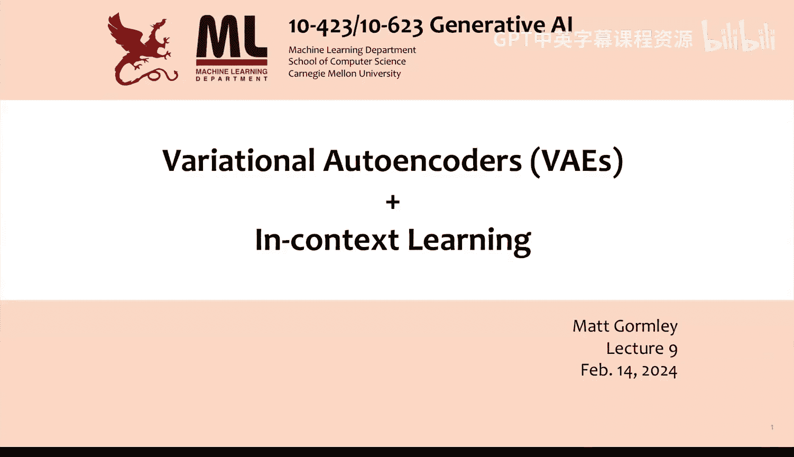
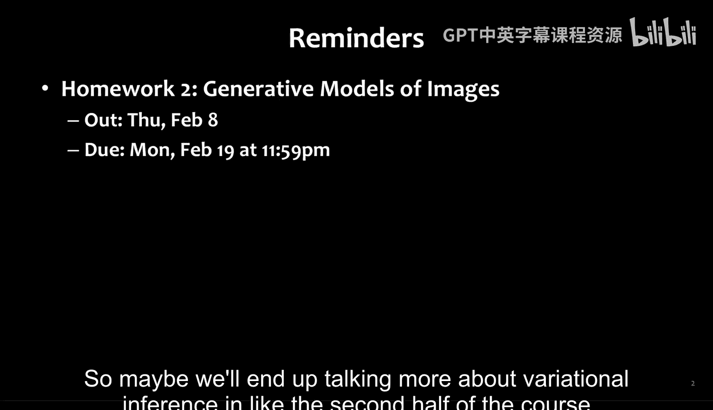
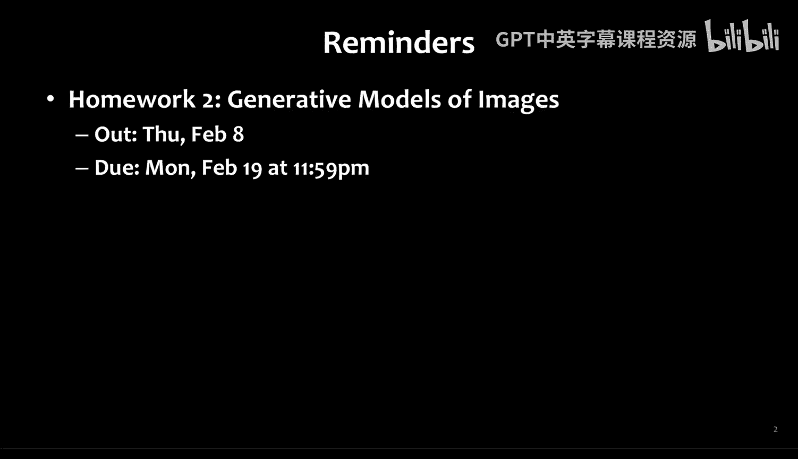
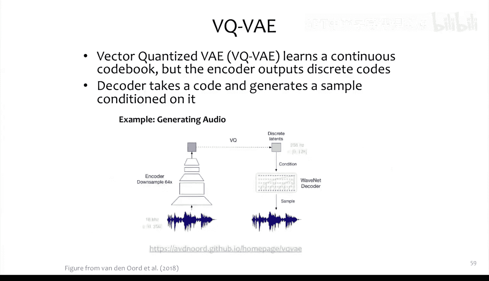
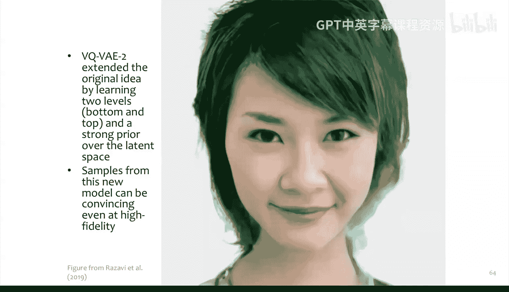

# 09：变分自编码器 (VAE) 🧠

在本节课中，我们将要学习变分自编码器。VAE是一种强大的生成模型，它结合了概率图模型和神经网络的优点，能够学习数据的连续潜在表示并生成新的样本。我们将从变分推断的核心概念出发，逐步理解VAE的原理、目标函数及其与扩散模型的联系。

## 从KL散度到变分下界

上一节我们介绍了KL散度，它是一种衡量两个概率分布差异的方法。本节中，我们来看看如何利用KL散度来处理复杂的概率分布。

KL散度不是对称的，因此不是一个真正的距离度量。公式 `KL(Q||P)` 不等于 `KL(P||Q)`。当两个分布相同时，KL散度达到最小值。

变分推断的高层动机源于我们希望处理复杂的概率分布。例如，我们有一些观测变量 `X`（如图像像素）和一些潜在变量 `Z`（如图像不同部分的标签），我们可能希望估计后验分布 `P(Z|X)`。如果因子图中存在循环，或者我们采用贝叶斯视角试图估计参数的分布，那么这种后验估计通常是难以处理的。

解决方案是使用一个更简单的分布 `Q(Z)` 来近似后验 `P(Z|X)`。通常，`Q(Z)` 比 `P(Z|X)` 具有更强的独立性假设，这是可以接受的，因为 `Q(Z)` 是针对某个特定的 `X` 进行调整的。

关键思想是从某个分布族 `Q` 中选择一个最佳的 `Q(Z)` 来近似 `P(Z|X)`。我们称 `Q(Z)` 为变分近似，`Q` 为变分族，即所有被考虑的概率分布的集合。通常，`Q_θ(Z)` 由一些称为变分参数 `θ` 的参数化。而 `P_α(Z|X)` 则由一些固定的参数 `α` 参数化。

在扩散模型中，我们可以说 `Q_φ` 是前向过程，`P_α` 是我们学习的反向过程。变分推断的不同之处在于，这里我们假设 `α` 是已知的，但无法直接处理该分布，因此我们推断出参数 `θ`，使我们能够使用该分布的近似版本。这与学习模型参数是不同的。

以下是变分推断算法的一些例子：
*   平均场变分推断
*   置信传播
*   树重加权置信传播
*   期望传播

我们将主要提及平均场方法。

## 平均场近似与变分推断

上一节我们介绍了变分推断的基本思想，本节中我们来看看一个具体的近似方法：平均场近似。

平均场近似的思想是，假设 `Q_θ(Z)` 分布中每个变量都是完全独立的。这听起来可能是一个很糟糕的分布，但如果我们只处理某个特定的 `X`，这可能是合理的。

回到语义分割问题。`P_α(Z|X)` 是给定图像的语义分割分布。平均场近似则学习一个所有像素独立的概率分布。对于给定的图像，我们仍然可以处理这个分布。

我们可以考虑两种情况：
1.  给定联合分布 `P(X, Z)`，我们希望处理分布 `P(Z|X)`。这里我们假设分母难以处理。
2.  给定一个因子图和势函数，其全局归一化常数（分母）难以计算。

无论哪种情况，我们都希望处理 `P(Z|X)`，但分母难以计算。平均场的思想是，我们做出假设，得到一个分解的近似分布 `Q_θ`，然后通过求解一个优化问题来选择最小化 `KL(Q||P)` 的 `Q`。最终，对于这个特定的 `P` 和 `X`，我们会得到一个超级容易处理的 `Q_hat`，因为所有变量都是独立的。

要获得这个 `Q_hat`，我们可以使用坐标下降、梯度下降等优化算法来解决。等价地，如果我们用某个 `θ` 参数化 `Q`，那么选择最小化KL散度的 `Q` 就等同于选择最小化KL散度的 `θ`。

在测试时，模型已经训练好，`α` 已知。这里所做的就是针对一个特定的测试图像 `X`，高效地提出一个更简单的分布 `Q_θ`，因为原始分布计算量太大。我们针对这一个图像优化目标函数，然后使用对应的 `Q` 进行处理。

## 证据下界 (ELBO) 的推导与应用

上一节我们讨论了如何通过优化来获得近似分布，但直接最小化KL散度本身可能也难以计算。本节中，我们来看看如何通过一个可处理的目标函数——证据下界来实现。

KL散度可以写为：
`KL(Q||P) = E_Q[log Q(Z)] - E_Q[log P(X, Z)] + log P(X)`
其中 `log P(X)` 难以计算。

如果我们想对 `θ` 最小化 KL 散度，`log P(X)` 是一个常数。因此，我们可以直接忽略它，因为最小化操作不关心这个难以处理的常数。然后我们可以取负号，将最小化问题转化为最大化问题，从而得到证据下界 (ELBO)：
`ELBO(Q) = E_Q[log P(X, Z)] - E_Q[log Q(Z)]`

ELBO 包含两项：
1.  第一项 `E_Q[log P(X, Z)]`：如果 `Q_θ` 将概率质量放在与 `P_α` 相同的高概率 `Z` 值上，则该项值较高。它促使 `Q` 匹配 `P`。
2.  第二项 `-E_Q[log Q(Z)]`：这实质上是 `Q_θ` 的熵。如果 `Q_θ` 像均匀分布一样均匀地分散其概率质量，则熵较高。它起到正则化的作用。

定理表明，对于任何 `Q`，都有 `log P(X) >= ELBO(Q)`。因此，ELBO 是 `log P(X)` 的一个下界。通过最大化 ELBO，我们实际上是在寻找对 `P(Z|X)` 归一化常数最紧的下界。

## 从自编码器到变分自编码器 (VAE)

上一节我们建立了变分推断的理论基础，本节中我们来看看如何将其应用于构建生成模型，即变分自编码器。

我们之前见过自编码器，它有一个输入 `X`，一个学习 `X` 低维表示的瓶颈网络（编码器），以及一个从该隐藏表示重建原始输入 `X` 的解码器网络。自编码器的一个关键限制是无法从中采样，因为整个过程是确定性的。

变分自编码器将学习一个易于采样的连续潜在空间 `Z`，并通过从学习到的生成模型中采样来生成新的数据图像。

可以从两个视角看待VAE：
*   **概率图模型视角**：VAE模型是一个简单的图模型。潜在变量 `Z` 服从多元高斯分布，给定 `Z`，我们采样 `X`。这里有一个函数 `G_Φ` 确定性地从 `Z` 计算 `X`。
*   **神经网络视角**：VAE像一个概率自编码器，定义了两个分布：
    *   `Q_θ`：编码器分布，给出给定 `X` 时 `Z` 的分布。
    *   `P_Φ`：解码器分布，给出给定 `Z` 时 `X` 的分布。
    参数 `θ` 和 `Φ` 是神经网络参数。

对于VAE，模型是 `P_Φ`，变分近似是 `Q_θ`。我们定义了一个模型（从高斯分布采样 `Z`，然后确定性地生成 `X`），但如果我们想通过最大化训练样本 `X_i` 的对数概率来学习，将会遇到困难，因为边缘化潜在变量 `Z` 是难以处理的。因此，我们需要一个可以高效处理的简单分布，这就是编码器的作用。

## VAE的架构与重参数化技巧

上一节我们介绍了VAE的基本框架，本节中我们深入看看其具体架构和训练中的关键技术。

让我们详细看看这些概率分布：
*   **解码器 `P_Φ`**：采样一个潜在变量 `Z`，将其输入解码器神经网络（例如反卷积网络或多层感知机）。网络输出一个均值和一个（协）方差矩阵，将这些作为高斯分布的参数，即可从中采样得到图像 `X` 的分布。
*   **编码器 `Q_θ`**：输入一个图像 `X` 到神经网络，网络输出一个均值和一个方差，作为高斯分布 `Q(Z|X)` 的参数，从而可以得到 `Z`。

我们可以将VAE与扩散模型联系起来。这类似于一个单步（T=1）的扩散模型：
*   编码器 `Q_θ(Z|X)` 类似于前向过程（从 `X0` 到 `X1`）。
*   解码器 `P_Φ(X|Z)` 类似于反向过程（从 `X1` 到 `X0`）。
在扩散模型中，我们绕过了变分推断，因为我们直接定义了一个固定的前向过程 `Q`（例如添加高斯噪声），没有复杂的神经网络编码器，只学习了反向过程的参数。而在VAE中，我们同时学习前向（编码）和后向（解码）过程的参数。

我们通过最大化证据下界 (ELBO) 来训练VAE。ELBO包含一个类似于重构损失的项（希望观测到的 `X` 概率高）和一个正则化项。我们通过对编码器分布进行采样来近似 `E_Q` 的期望。

训练中的问题是，计算图中存在采样操作 `Z ~ Q_θ(Z|X)`，无法直接反向传播。解决方案是使用**重参数化技巧**。我们不是直接采样 `Z`，而是先从标准高斯分布采样一个噪声 `ε ~ N(0, I)`，然后通过 `Z = μ + σ * ε` 计算 `Z`，其中 `μ` 和 `σ` 是编码器网络的输出。这样，采样过程就变成了计算图中的一个叶子节点，从而支持反向传播。

VAE的整体计算流程是：输入图像 `X`，用编码器网络得到高斯分布的均值和方差，通过重参数化技巧采样 `Z`，将 `Z` 输入解码器网络得到另一个高斯分布的参数，然后计算损失（重构损失和正则化损失），最后通过反向传播同时更新编码器和解码器的参数。

## VAE的应用与发展

VAE最初用于图像生成（如MNIST手写数字、人脸），在当时效果很好。它也可用于文本生成。后来，人们提出了像**矢量量化VAE** 这样的方法，能够生成更高质量的图像。在VAE框架中，我们拥有一种变分采样方法。

此外，还有扩散模型的完全变分版本，例如**变分DDPM**，它将整个前向扩散过程（`T` 个时间步）也用神经网络参数化，并在训练过程中学习前向过程的参数。

本节课中我们一起学习了变分自编码器。我们从变分推断和KL散度出发，理解了如何用简单分布近似复杂后验分布，并推导出可优化的证据下界。接着，我们将这些原理应用于构建VAE，了解了其编码器-解码器架构、概率解释以及与扩散模型的联系。最后，我们探讨了VAE的训练技巧（重参数化）及其应用与发展。VAE为学习数据的连续潜在表示和生成新样本提供了一个坚实的概率框架。