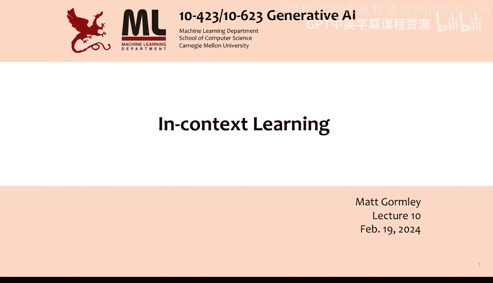
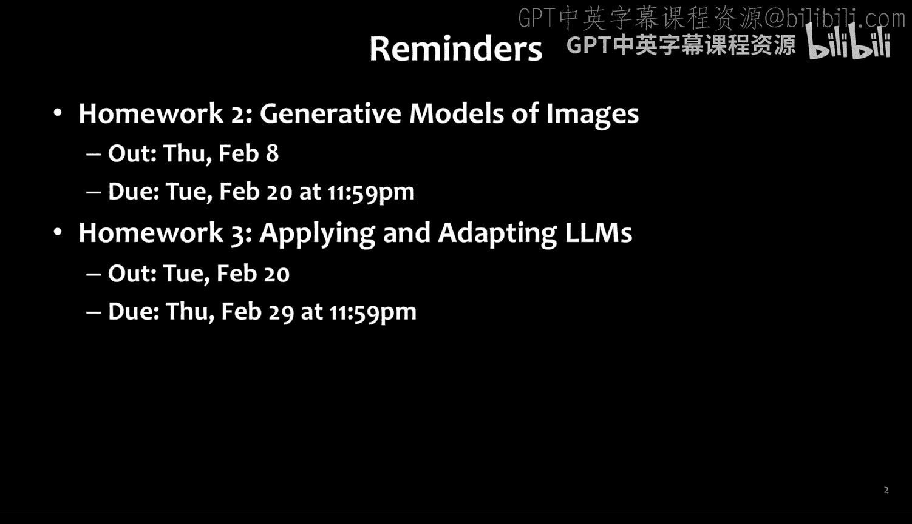
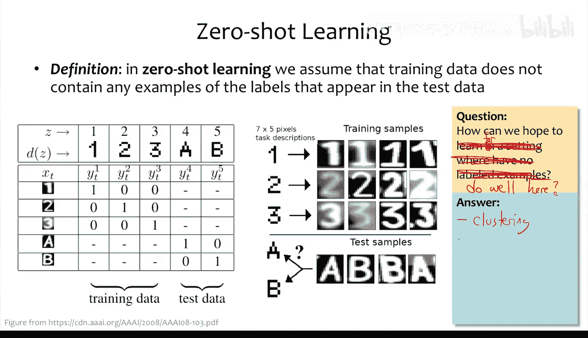
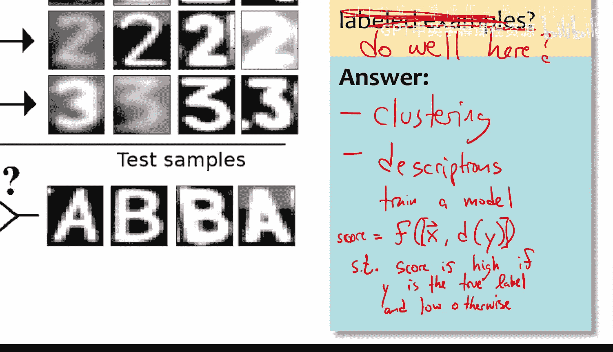
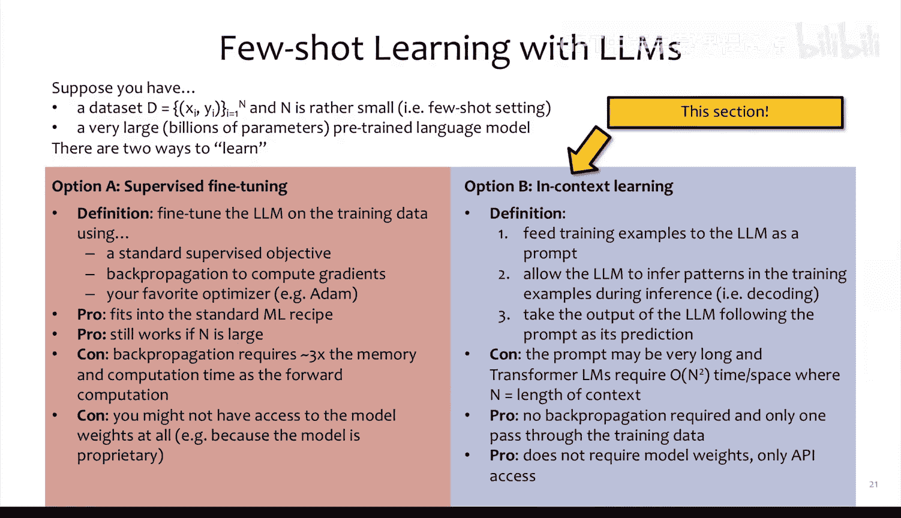
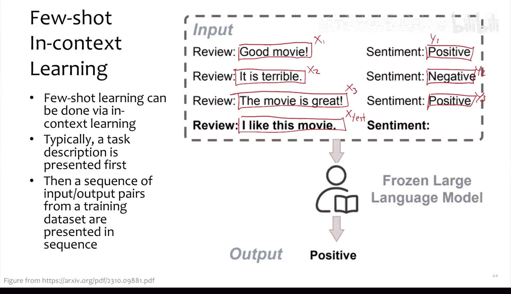
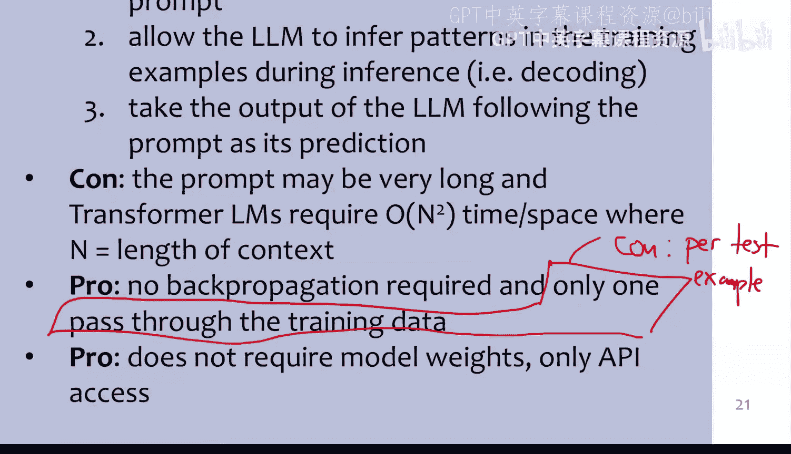
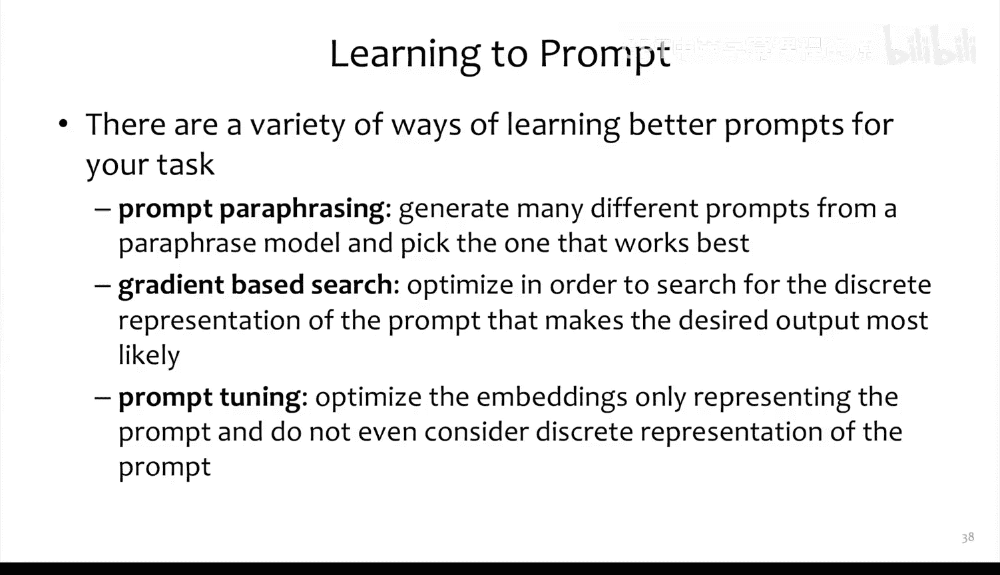

# 10：上下文学习





在本节课中，我们将学习如何利用大型基础模型（特别是大语言模型）来适应不同的任务，而无需修改模型参数。我们将重点探讨“上下文学习”这一核心概念，这是一种通过巧妙设计输入提示（Prompt）来引导模型完成特定任务的方法。

---





## 零样本学习与少样本学习

上一节我们介绍了基础模型的概念，本节中我们来看看如何将它们应用于新任务。首先，我们需要理解两个关键术语：零样本学习和少样本学习。

**零样本学习** 假设训练数据中完全不包含测试数据中出现的新类别标签。例如，一个模型只训练过识别数字“1”、“2”、“3”，现在却需要它识别从未见过的字母“A”和“B”。核心挑战是：如何在没有任何标注示例的情况下进行有效预测？

一种可能的解决方案是使用**辅助信息**。我们可以训练一个模型 `f(x, d(y))`，其中 `x` 是输入（如图像），`d(y)` 是标签 `y` 的描述（如文本）。模型输出一个分数，表示 `x` 与描述 `d(y)` 的匹配程度。在训练时，我们让模型为正确的 `(x, d(y))` 对输出高分，为错误的对输出低分。在测试时，对于新输入 `x_test`，我们计算它与所有可能标签描述的匹配分数，并选择分数最高的标签。这种方法允许模型处理无限多的新标签，只要能为它们提供描述。

**少样本学习** 则假设我们至少拥有每个新类别的少量（例如1-5个）标注示例。在这种情况下，我们可以采用更直接的方法，例如基于模型学到的特征表示，使用最近邻分类等算法。

---

## 提示与大语言模型的零样本能力

现在，让我们将焦点转向大语言模型。这些模型通常通过自回归方式在大量文本上训练，以预测序列中的下一个词。**提示** 的核心思想是：我们可以提供一个前缀字符串（即提示），使得模型最有可能生成的后续文本正是我们想要的答案。

以下是几个零样本提示的例子：

*   **风格模仿**：给定一个标题和作者（如华莱士·史蒂文斯的诗），模型能生成风格相似的文本。
*   **翻译**：输入一句西班牙语，后接“English translation:”，模型能输出对应的英语翻译。
*   **问答**：提供一段文本，后接“Question: ...”，模型能生成“Answer: ...”及其解释。
*   **摘要**：输入一个故事，后接“one sentence summary:”，模型能生成简洁的摘要。

为什么未经专门训练的模型能完成这些任务？一个可能的原因是，其海量的训练数据中本身就包含了这些任务的“自然演示”。例如，网络上可能存在大量“某句话在法语中是...”或“问题：... 答案：...”这样的文本模式，模型从中隐式地学到了这些任务。

---

## 上下文学习：少样本场景下的提示

上一节我们看到了零样本提示的威力，本节中我们来看看如何利用少量示例来进一步提升性能，这就是**上下文学习**。

上下文学习是指在提示中不仅包含任务描述，还包含少量的输入-输出示例，然后让模型根据这个“上下文”来对新输入进行预测。这与需要更新模型参数的**监督微调**形成对比。

以下是上下文学习的两个示例：

1.  **情感分析**：
    ```
    输入：good movie
    情感：positive

    输入：it is terrible
    情感：negative

    输入：movie is great
    情感：positive

    输入：not good
    情感：
    ```
    我们希望模型在最后一个“情感：”后生成“negative”。

2.  **翻译**：
    ```
    sea otter => loutre de mer
    plush girafe => girafe peluche
    cheese =>
    ```
    我们希望模型输出“fromage”。





上下文学习的优点在于无需反向传播和参数更新，计算成本相对较低，且对于仅提供API的模型也适用。但其效果受多种因素影响。



---

## 上下文学习的特点与挑战

以下是上下文学习中一些值得注意的现象：

*   **示例顺序敏感**：提供给模型的少量示例的排列顺序会显著影响预测结果，导致性能波动。
*   **标签平衡**：提示中正负示例的比例会影响模型的预测倾向。
*   **标签随机性**：令人惊讶的是，即使将提示中示例的标签替换为随机标签，模型的性能有时也不会急剧下降，甚至仍优于零样本情况。这表明模型可能更多地是在学习输入数据的格式或分布，而非严格的输入-输出映射。
*   **示例数量**：增加上下文中的示例数量并不总是能提升性能，有时在达到一个峰值后性能会下降。
*   **提示工程**：提示的具体措辞对结果影响巨大。例如，在新闻分类任务中，使用“what is the most accurate label for this news article?”比“what is this piece of news regarding?”能获得高得多的准确率。研究表明，在模型看来**概率更高（困惑度更低）**的提示往往能带来更好的性能。

---

## 进阶技巧：思维链提示

一个能显著提升模型在复杂推理任务上性能的技巧是**思维链提示**。其核心思想是，在提示的示例中，不仅给出答案，还展示得出答案的逐步推理过程。

例如，对于一个数学问题：
```
问题：食堂有23个苹果。做午餐用了20个，又买了6个。现在有多少苹果？
```
标准提示的示例可能直接给出答案。而思维链提示的示例则会展示：
```
问题：Roger有5个球。他又买了2罐网球，每罐3个。他一共有多少个球？
推理：2罐网球，每罐3个，就是6个网球。5 + 6 = 11。
答案：11
```
通过要求模型“逐步思考”，可以显著提升其在算术、常识推理等任务上的表现。甚至仅通过添加“让我们一步步思考”这样的指令，也能激发模型的推理能力。

---

## 自动提示优化

鉴于手动设计最佳提示非常耗时，研究者开发了自动优化提示的方法：
*   **提示复述**：使用模型生成多个提示变体，并选择效果最好的。
*   **基于梯度的搜索**：在连续的词嵌入空间中进行优化，寻找能最大化任务性能的提示表示。
*   **提示微调**：直接优化一组连续的“软提示”向量，这些向量作为可训练参数被前置到输入中，而无需对应具体的词汇。

---

## 总结




本节课中我们一起学习了如何利用大语言模型进行上下文学习。我们从零样本学习和少样本学习的经典定义出发，探讨了如何通过设计提示来激发模型完成翻译、问答、摘要等任务。我们深入分析了上下文学习的工作原理、其相对于监督微调的优势与局限，以及影响其效果的多种因素（如示例顺序、提示措辞）。最后，我们介绍了思维链提示这一强大技巧以及自动提示优化的前沿方向。下一节课，我们将继续探讨适配器与参数高效微调等其他模型适应技术。