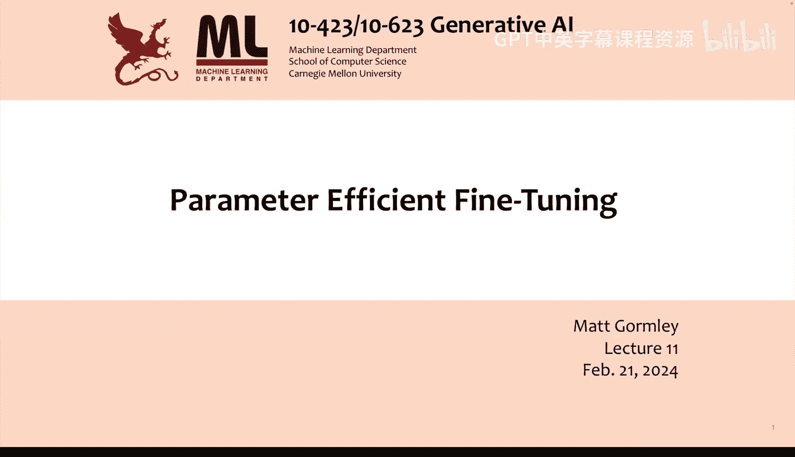
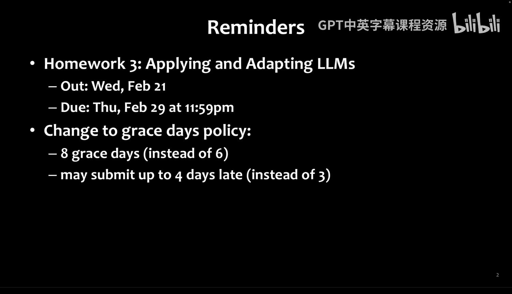
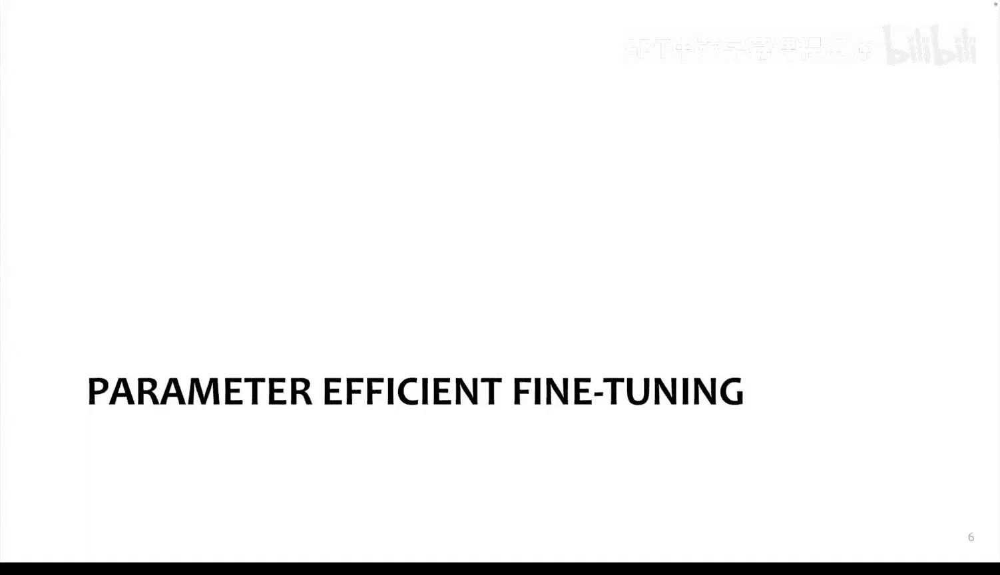
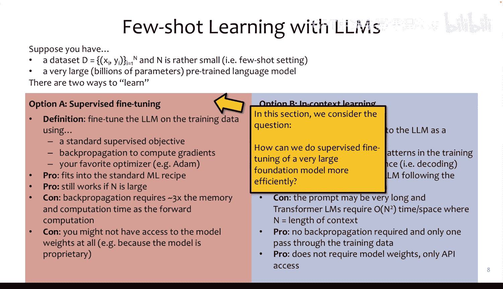
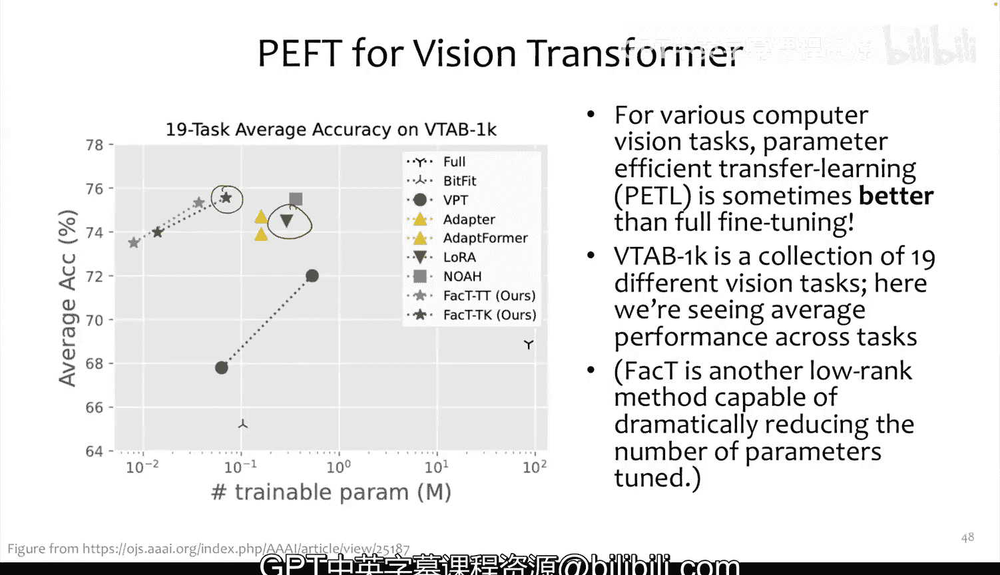

# 11：参数高效微调 🎯



在本节课中，我们将要学习参数高效微调。这是一种在微调大型基础模型时，显著减少所需内存和计算量的技术。我们将探讨其动机、核心方法以及它们如何在实际任务中发挥作用。





## 概述



微调预训练模型是提升其在特定下游任务上性能的标准方法。然而，对于拥有数百亿参数的大型模型，全参数微调需要巨大的计算资源，通常需要将模型分割到多个GPU上。参数高效微调旨在通过仅更新模型的一小部分参数，来达到接近全参数微调的性能，从而大幅提升效率。

## 为什么需要参数高效微调？

上一节我们介绍了微调的基本概念，本节中我们来看看为什么需要更高效的方法。

全参数微调虽然性能优异，但存在两个主要问题：
1.  **计算与内存开销大**：反向传播所需的内存和计算时间通常是前向传播的三倍。
2.  **模型规模限制**：当前顶级GPU（如A100或H100）的显存通常为40GB或80GB。要微调一个千亿参数模型，往往需要将模型分割到多个GPU上。

参数高效微调的目标，正是通过将反向传播的内存和计算时间大幅减少（例如3倍），使得在单个GPU上微调大型模型成为可能。

## 微调 vs. 上下文学习

在深入具体方法前，我们先对比一下微调与上下文学习的性能。这有助于理解为什么即使微调效率较低，我们仍然需要它。

研究表明，在相同模型规模下，微调通常显著优于少样本上下文学习。例如，在一项公平比较中，使用16个训练样本时，微调模型的准确率比上下文学习高出约12%。更重要的是，一个经过微调的67亿参数模型，其性能可能与一个300亿参数的上下文学习模型相当。这解释了为什么像ChatGPT使用的GPT-3.5 Turbo（一个较小的微调模型）能够提供强大的服务。

参数高效微调的目标，就是在保持这种性能优势的同时，极大地提升效率。

## 参数高效微调方法概览

接下来，我们将介绍几种主流的参数高效微调方法。我们的目标是获得与全参数微调相当的性能。以下是几种核心方法：

*   **微调顶层参数**：仅更新模型最顶部的若干层参数。
*   **适配器**：在模型的Transformer层中插入额外的小型神经网络模块，并仅训练这些模块。
*   **前缀微调**：为模型学习一个任务特定的“软提示”向量前缀，并将其添加到每一层的注意力机制中。
*   **LoRA**：为模型中的权重矩阵学习一个低秩的增量更新，这是本节课的重点。

下面，我们将逐一探讨这些方法。

## 方法一：微调顶层参数

我们从最简单的方法开始：仅微调模型的顶层参数。

其核心思想是：在深度神经网络中，底层通常学习通用的特征表示（如文本的基础语义或图像的边缘），而高层则学习更任务相关的特征。因此，在微调时，我们可以固定所有底层参数，只更新顶部的K层。

**实现方式**：
在大多数深度学习框架中，这很容易实现。你只需在反向传播时，在指定层之后停止梯度计算。

**优势**：
*   **内存节省**：无需存储底层参数的梯度。节省的内存比例约为 `K / (K+L)`，其中L是总层数。
*   **简单易用**：实现起来非常直接。

**局限性**：
*   性能可能不如更新更多参数的方法。实验表明，随着可训练参数减少，性能会出现明显下降。

## 方法二：适配器

适配器方法不是选择现有层进行更新，而是向模型中插入全新的、可训练的小型模块。

以下是适配器层的典型结构：

```python
# 适配器模块结构示意
Adapter(x):
    h = DownProject(x)   # 线性层，将维度D降至r (r << D)
    h = NonLinearity(h)  # 例如ReLU激活函数
    output = UpProject(h) # 线性层，将维度r升回D
    return x + output    # 残差连接
```

**工作原理**：
1.  在预训练好的Transformer层中的两个位置（通常在多头注意力模块之后和前馈网络之后）插入适配器模块。
2.  微调时，冻结Transformer的所有原始参数，只训练这些新插入的适配器参数。
3.  由于适配器内部的瓶颈维度r远小于模型维度D，其参数量仅占模型总参数的0.5%到8%。

**优势**：
*   参数量极少，性能却可以接近全参数微调，且没有微调顶层参数那样的性能陡降问题。

**劣势**：
*   **推理延迟**：在模型推理（测试）时，这些额外的层会增加计算量，导致延迟。尤其是在批大小为1的场景下，延迟可能增加20-30%。

## 方法三：前缀微调

前缀微调提供了一种不同的思路：它不修改模型内部的权重，而是通过优化一组“虚拟”的令牌嵌入来影响模型行为。

**核心思想**：
*   为模型每一层的注意力机制学习一组任务特定的“前缀”向量（`P_K` 和 `P_V`）。
*   在计算注意力时，将这些前缀向量与实际的键（`K`）和值（`V`）拼接起来，仿佛输入序列前有一些额外的“软提示”令牌。
*   微调时，只优化这些前缀向量，模型的所有原始权重保持冻结。

**优势**：
*   可以实现多任务共享一个核心模型，只需切换不同的前缀参数即可。

**劣势**：
*   性能对前缀长度（参数量）敏感，有时增加参数反而会导致性能下降，优化过程不太稳定。
*   仍需进行完整的反向传播来计算梯度（尽管不更新模型权重），效率提升有限。

## 方法四：LoRA（低秩自适应）

LoRA是当前最流行且高效的参数高效微调方法之一。它的设计受到了一个重要观察的启发：大型过参数化模型学到的权重，可能实际上存在于一个低维的内在子空间中。

### LoRA的动机

1.  **内在维度理论**：研究表明，大型神经网络的参数可能位于一个低维流形上。这意味着，要适应新任务，可能只需要在低维空间中对参数进行微小的调整。
2.  **前缀微调的不稳定性**：如前所述，前缀微调的性能变化不单调。
3.  **适配器的推理延迟**：适配器会增加测试时的延迟。

### LoRA的工作原理

LoRA的核心是为预训练模型中的权重矩阵添加一个低秩的增量更新。

假设我们有一个预训练好的线性层，其权重为 `W0 ∈ R^(d×k)`，输入为 `x`，输出为 `h = W0 * x`。

LoRA将其修改为：
`h = W0 * x + ΔW * x = W0 * x + B * A * x`
其中，`ΔW = B * A`，`B ∈ R^(d×r)`，`A ∈ R^(r×k)`，且秩 `r << min(d, k)`。

**关键步骤**：
1.  **初始化**：`A` 用随机高斯噪声初始化，`B` 初始化为零矩阵。这确保训练开始时，`ΔW = 0`，模型行为与原始预训练模型完全一致。
2.  **训练**：冻结原始权重 `W0`，只训练低秩矩阵 `B` 和 `A`。
3.  **推理**：训练完成后，可以将增量合并回权重：`W‘ = W0 + B*A`。这样，在推理时就是一个标准的、无额外开销的线性层，实现了“热插拔”不同任务的适配权重。

**在Transformer中的应用**：
通常，LoRA被应用于Transformer每一层的**查询（Q）** 和**键（K）** 投影矩阵（有时也包括值（V）矩阵）。实验发现，仅适配Q和K矩阵通常就能取得很好效果，且比适配所有三个矩阵更高效。

### LoRA的优势与效果

*   **参数量极少**：即使秩 `r=1` 或 `r=2`，在许多任务上也能取得接近全参数微调的性能。
*   **无推理开销**：训练完成后可将低秩矩阵合并，推理速度与原始模型相同。
*   **性能优异**：在多种任务和数据集规模（从小样本到大数据）上，LoRA都表现出了强大且稳定的性能，常常匹配甚至超过全参数微调。
*   **模块化**：可以轻松为不同任务存储不同的 `(B, A)` 对，并在同一个基础模型上快速切换。

## 扩展到视觉Transformer

参数高效微调的思想同样适用于视觉Transformer。例如，**LN-LoRA** 在应用低秩更新前加入了层归一化，在视觉任务上取得了更好效果。还有像**FacT**这样的方法，能够以更少的参数量实现优秀的性能。这表明，对于视觉和语言模态，低秩适应都是一种强大且通用的微调策略。

## 总结

本节课我们一起学习了参数高效微调。我们首先了解了全参数微调面临的挑战，然后深入探讨了四种主要方法：
1.  **微调顶层参数**：简单但性能可能受限。
2.  **适配器**：插入小型网络模块，性能好但会增加推理延迟。
3.  **前缀微调**：学习软提示向量，但优化不稳定。
4.  **LoRA**：为权重矩阵学习低秩增量，在保持高性能的同时，实现了参数高效且无推理开销，是目前最受欢迎的方法之一。




这些技术使我们能够在有限的计算资源下，有效地将庞大的基础模型适配到各种下游任务，是生成式AI实际应用中的关键一环。未来的研究可能会进一步探索如何优化反向传播过程本身，以实现更极致的微调效率。