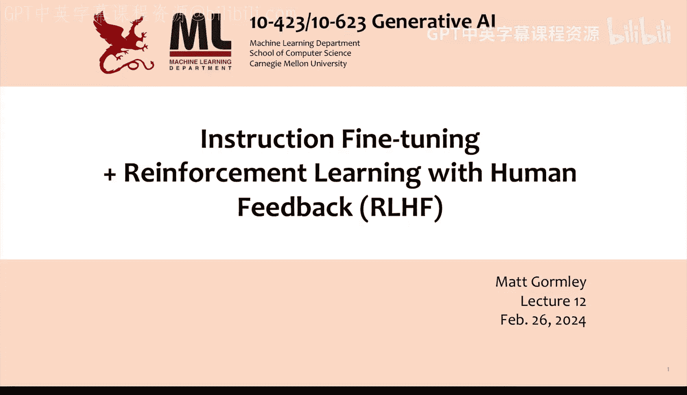
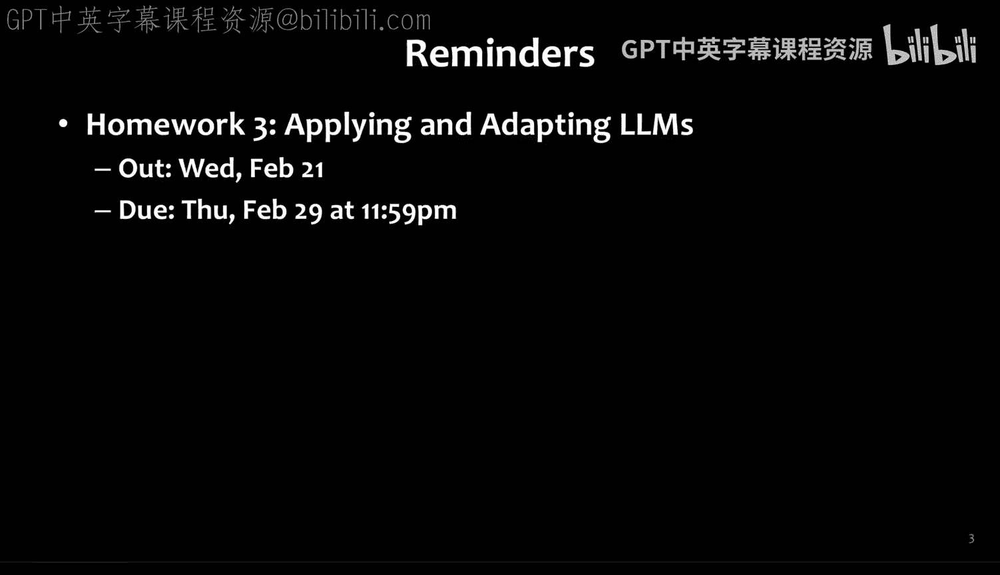
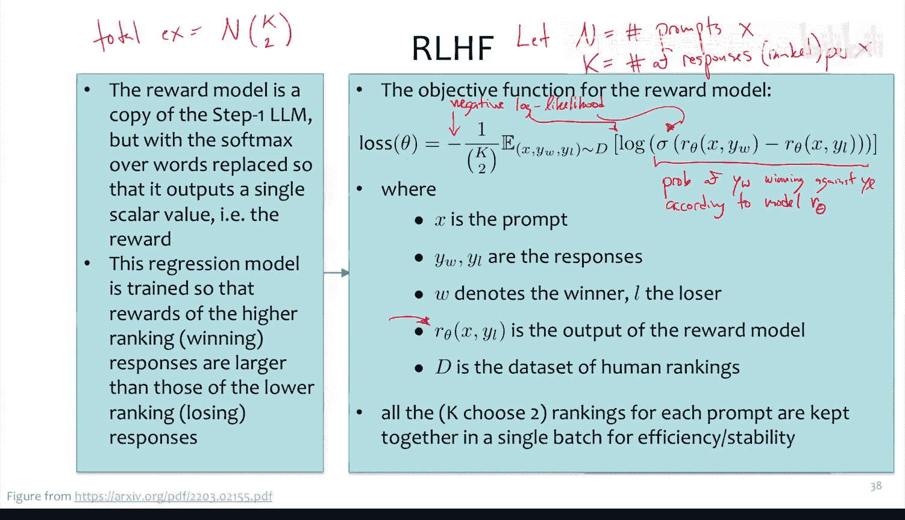
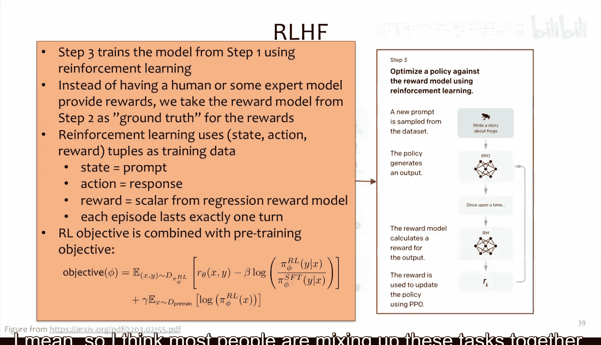
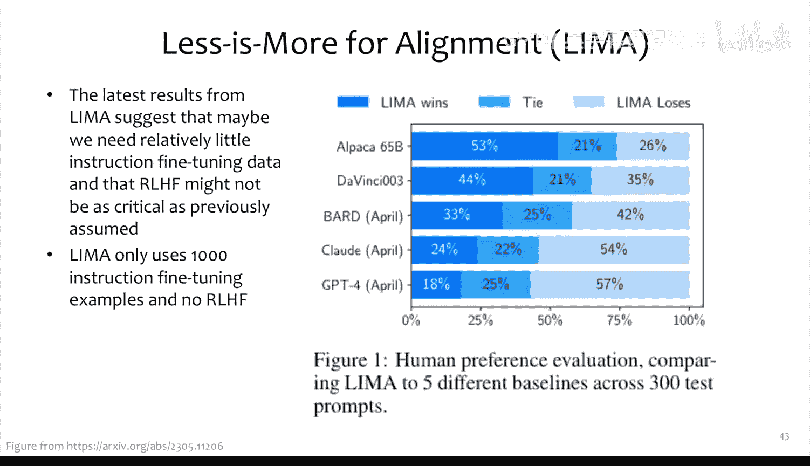
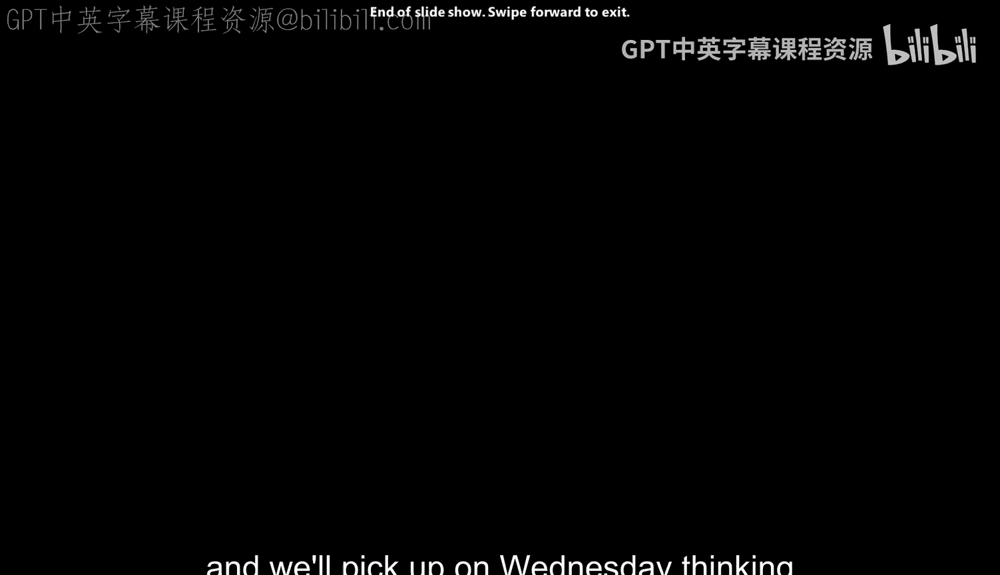

# 12：指令微调与基于人类反馈的强化学习 😊

在本节课中，我们将学习如何让大型语言模型更好地适应特定用例，特别是如何使其行为与人类用户的期望保持一致。我们将重点探讨两个核心主题：**指令微调**和**基于人类反馈的强化学习**。

## 指令微调 😊

上一节我们介绍了上下文学习，本节中我们来看看指令微调。我们之前提到，对于一个经过指令微调的大型语言模型，其提示前通常会有一个额外的系统提示，例如“你是一个有帮助的AI助手”。这个系统提示与实际指令（如用户的问题）是分开的。

我们曾看到一个例子，在Llama 2（70B参数）和Llama 2 Chat（7B参数）上使用相同的提示，得到的模型输出却大不相同。为了获得这种类似聊天的响应，我们需要对模型进行进一步的微调，这就是指令微调。

其动机在于，我们想构建一个聊天代理。大型语言模型通常是在海量网络文本、文章和代码上训练，以降低困惑度，其核心目标是预测下一个词。然而，聊天代理的任务不仅仅是预测下一个词，它需要以对话方式行事，并知道何时停止生成。因此，我们的目标是进行**对齐**，使大型语言模型的行为与人类用户对特定任务的期望保持一致。

关键思想是构建一个数据集，其中包含我们期望的聊天行为示例，然后在这些数据上微调模型。这项技术在文献中有许多名称，如指令微调、聊天微调、对齐微调或行为微调，但其核心都是构建数据集并训练模型。

那么，如何为聊天代理构建训练数据集呢？一个训练示例需要包含一个提示（X）和对应的响应（Y）。以下是几种获取数据的方法：

*   **人工标注**：可以请专家或标注员模拟聊天行为，创建提示并撰写理想的响应。
*   **网络爬取**：可以从网络上抓取对话数据，例如问答网站（如Stack Overflow），这些网站通常还包含答案的质量评分。
*   **模型生成**：可以利用现有的基础模型，通过上下文学习等方式，让其生成提示或响应，甚至对现有提示进行改写以提升质量。

接下来，让我们看看实际中人们是如何构建指令微调数据集的。

### 数据集实例分析

业界已涌现出大量开源指令微调数据集。我们深入分析几个代表性案例。

第一个是InstructGPT（OpenAI）使用的数据集，它包含13,000个提示-响应对。其来源有两种：一是由标注员直接编写提示和演示响应；二是从早期API用户提交的提示中采样，再由标注员撰写理想的响应。这个数据集是闭源的。

作为其开源替代，Databricks公司创建了**Dolly**数据集，包含15,000个手工编写的示例。他们通过竞赛激励员工，并遵循了与InstructGPT类似的分类，如开放式问答、封闭式问答、信息提取、总结、头脑风暴、分类和创意写作。

以下是Dolly数据集的一些示例类别：

*   **开放式问答**：例如，指令：“哪位个人在奥运会历史上获得的金牌最多？”，响应：“迈克尔·菲尔普斯以23枚金牌保持着获得最多金牌的记录。”
*   **封闭式问答**：提供一段上下文，然后基于上下文提问。例如，上下文是关于雷丁火车站的信息，问题是：“第一个雷丁火车站是何时开放的？”
*   **信息提取**：例如，指令：“提取本段落中提到的所有日期，并以‘日期 - 描述’的格式用项目符号列出。”
*   **头脑风暴**：例如，指令：“你可以自己制作哪些独特的窗帘绑带？”，响应会列出多种可能的物品。
*   **创意写作**：例如，指令：“写一首关于我多么喜欢泡菜的俳句。”

这些示例表明，像ChatGPT这类模型的行为并非凭空产生，而是高度依赖于特定标注员编写的交互范例。

另一种构建大规模数据集的方法是**Flamingo/T5**系列模型采用的。其核心思想是利用现有的自然语言处理（NLP）任务数据集，通过编写模板将其转化为指令微调格式。

例如，对于一个自然语言推理（NLI）任务的数据点（包含前提、假设和标签），可以设计多个模板来生成不同的指令示例：

*   **模板1**：`基于以上段落，我们能否推断出“俄罗斯人保持着在太空停留时间最长的记录”？选项：是/否`
*   **模板2**：`阅读以下内容，判断假设是否可以从前提中推断出来。`

通过这种方式，一个包含10,000个示例的NLI数据集可以轻松生成数万甚至数十万个指令微调示例。

### 多模态指令微调

指令微调也可以扩展到多模态领域。例如，**Multi-Instruct**数据集采用了与Flamingo类似的方法，从62个多模态任务中构建了包含图像的指令微调数据集。任务可能包括为图像中的指定区域生成描述、定位图像中的文本，或根据图像内容回答问题。

以上我们讨论了如何构建数据集并进行微调。接下来，我们将探讨一种替代标准最大似然训练的方法。

## 基于人类反馈的强化学习 😊

上一节我们介绍了指令微调，本节中我们来看看如何通过基于人类反馈的强化学习进一步优化模型行为。InstructGPT模型首次成功地将RLHF应用于大型GPT模型的训练。其论文声称，经过人类评估，13亿参数的InstructGPT模型的输出比1750亿参数的GPT-3更受青睐，尽管前者参数少了100倍。

标准的RLHF流程包含三个步骤，我们将逐一详解。

### 第一步：指令微调（监督微调）

这一步与我们之前讨论的指令微调完全相同。使用一个相对较小的数据集（例如InstructGPT的13K示例）对基础语言模型进行微调，使其初步对齐聊天代理的行为。这一步的输出是一个微调后的语言模型 `P_φ`（参数为φ）。

### 第二步：训练奖励模型

这一步开始变得有趣。我们从第一步得到的模型中采样生成大量响应，并引入人类标注员进行评估。

具体流程如下：
1.  收集大量提示（例如33,000个）。
2.  对于每个提示，使用第一步的模型生成K个（通常为4到9个）不同的响应。
3.  将每个提示对应的K个响应交给人类标注员进行排序（从最佳到最差），或进行两两比较评分。

接下来，我们需要训练一个**奖励模型** `R_θ`（参数为θ）。这个模型本质上是一个回归模型，其任务是接收一个提示和对应的响应，输出一个标量分数，表示该响应的质量。

如何构建这个模型？通常，我们取一个大型语言模型（可以与第一步模型相同或更小），移除其用于词汇预测的最终输出层，替换为一个输出单个标量的线性层。

训练目标函数如下：

`loss(θ) = -E_{(x, y_w, y_l) ~ D} [log(σ(R_θ(x, y_w) - R_θ(x, y_l)))]`

其中：
*   `(x, y_w, y_l)` 来自数据集 `D`，`y_w` 是人类标注中优于 `y_l` 的响应。
*   `σ` 是sigmoid函数。
*   这个损失函数鼓励奖励模型给优质响应 `y_w` 的打分高于劣质响应 `y_l`。

一个训练技巧是，对于同一个提示 `x` 对应的所有 `C(K,2)` 个响应对，将它们放在同一个训练批次中。这样做有两个好处：一是提高训练稳定性，二是能高效地重用模型在处理相同提示 `x` 时的计算图，提升效率。

### 第三步：使用强化学习微调策略模型

这一步，我们使用第二步训练好的奖励模型 `R_θ` 作为奖励信号，通过强化学习进一步微调第一步得到的语言模型 `P_φ`。

在强化学习框架中：
*   **状态**：当前的提示 `x`。
*   **动作**：模型生成的响应 `y`。
*   **奖励**：奖励模型给出的分数 `R_θ(x, y)`。
*   **回合**：每个提示-响应对被视为一个独立的回合。

目标是通过优化策略模型 `P_φ` 的参数 `φ`，来最大化期望奖励。通常，目标函数会结合强化学习目标（最大化奖励）和原始预训练目标（最大化似然），以防止模型过度优化奖励而偏离自然语言分布或导致退化。

最终的目标函数形式可能类似于：

`objective(φ) = E_{x~D, y~P_φ(·|x)} [R_θ(x, y)] - β * KL(P_φ(·|x) || P_ref(·|x))`

其中 `P_ref` 通常是第一步微调后的模型，`KL` 散度项用于约束新模型不要偏离参考模型太远，`β` 是控制约束强度的系数。

### RLHF的效果与最新进展

研究表明，RLHF能有效提升模型在人类评估中的**帮助性**和**无害性**，同时通常不会损害模型在各类NLP任务上的零样本或少样本性能。

然而，最新的研究（如**LIMA: Less Is More for Alignment**）提出了一个有趣的观点。该工作仅使用**1000个**精心挑选的指令微调示例对LLaMA模型进行微调，无需RLHF，其效果就能与经过大规模RLHF训练的商用模型（如Bard、Claude、GPT-4）相媲美或接近。

这暗示着，模型的大部分能力可能已经蕴含在预训练阶段，而指令微调和RLHF更多是在此基础上进行相对较小的行为风格调整。

## 总结

本节课我们一起学习了如何通过**指令微调**和**基于人类反馈的强化学习**来对齐大型语言模型，使其行为更符合人类用户的期望。我们探讨了构建指令微调数据集的各种方法，并详细剖析了RLHF的三个关键步骤：监督微调、奖励模型训练和强化学习优化。最后，我们也了解到，有时“少即是多”，精心设计的小规模数据微调也能取得惊人的效果。