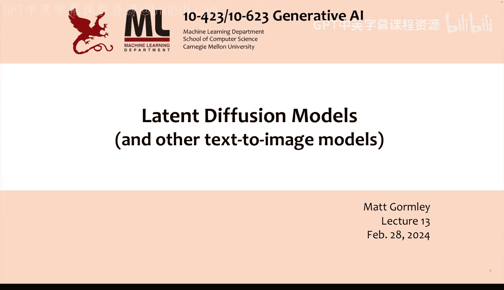
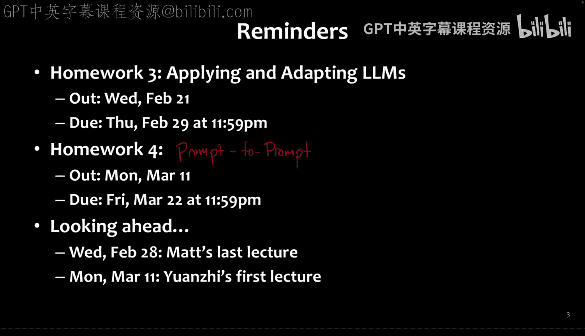
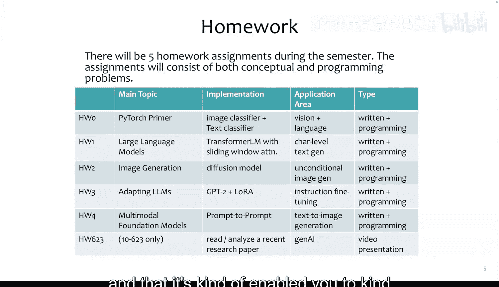
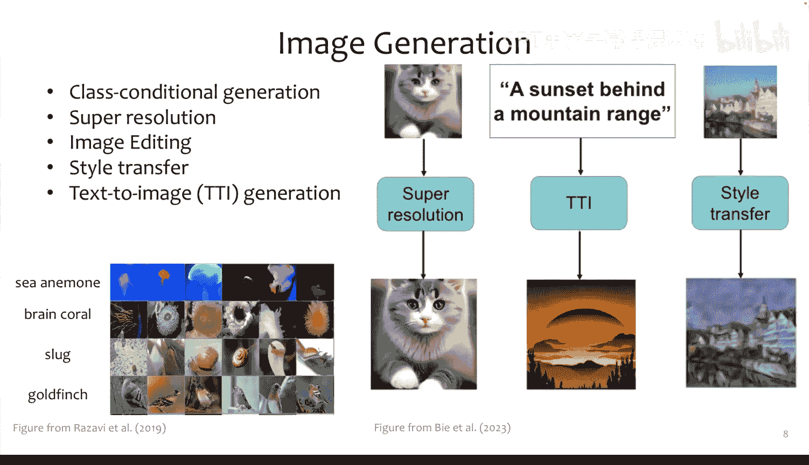
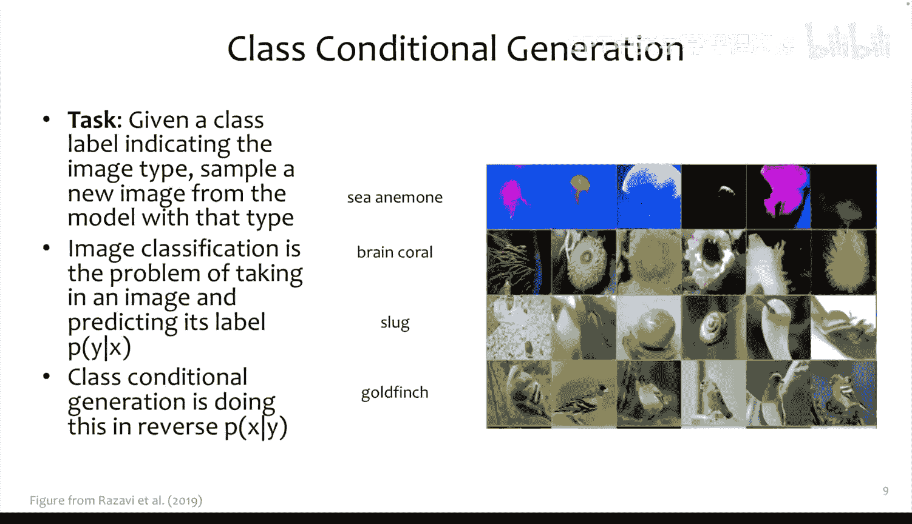
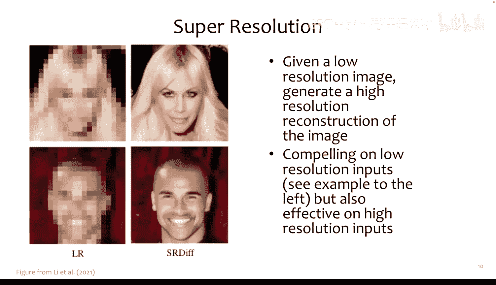
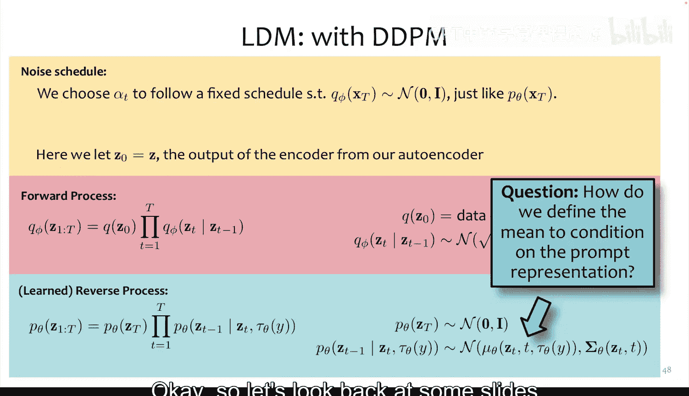
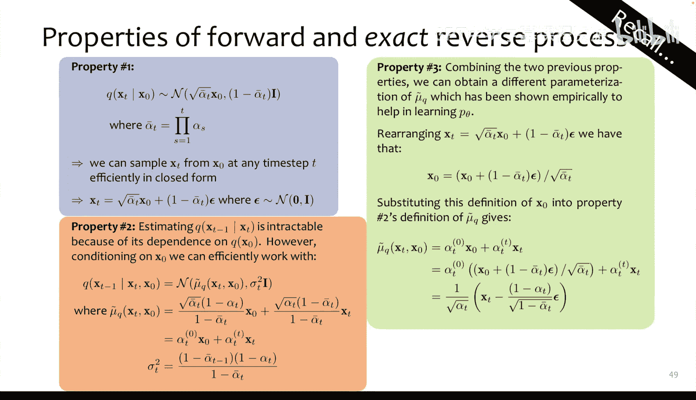
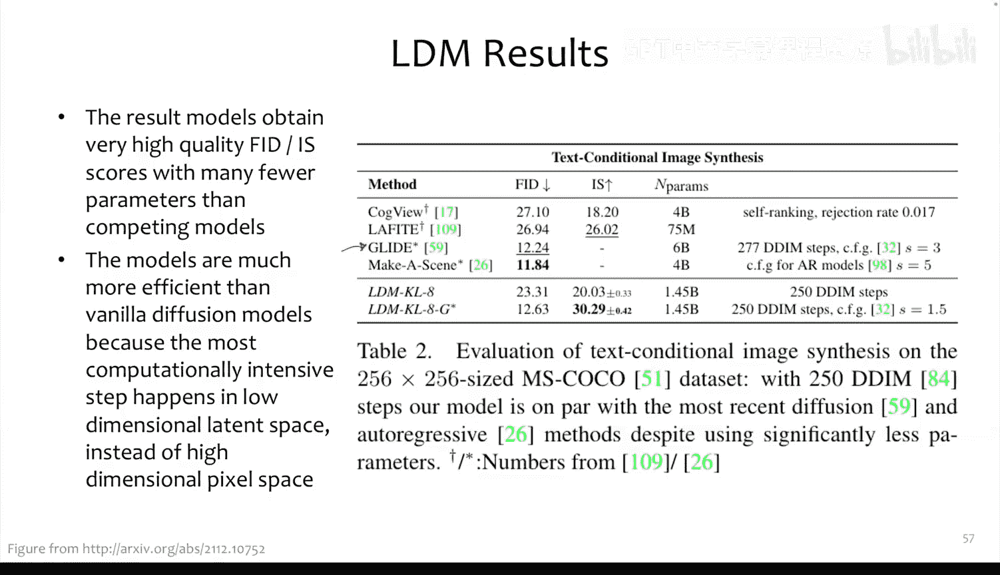
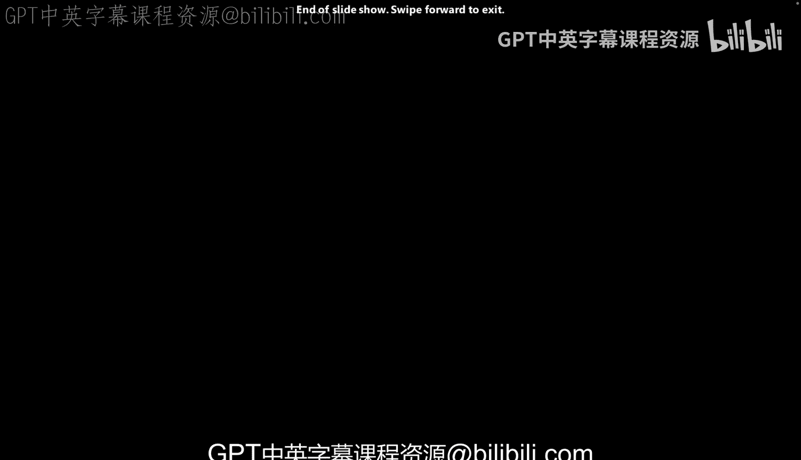

# 13：潜在扩散模型

在本节课中，我们将要学习一种名为潜在扩散模型的技术。如果你听说过Stable Diffusion，那么这项技术就是其背后的核心。Stable Diffusion在其最初发布时，可以说是第一个潜在扩散模型。除了这个模型，我们还将概览其他一些文本到图像生成模型，以便对当前使用的技术范围有一个宏观的了解，然后我们将聚焦于潜在扩散模型。

## 课程安排与项目预告

上一节我们介绍了课程的整体进度，本节中我们来看看后续的安排。作业三将于明天截止，作业四将在春假后发布。我们计划在春假后探索一种名为“提示到提示”的方法以及其他图像生成方面的内容。

今天是我本学期的最后一节课。春假后，将由Huanzi接替授课。他曾在MSR有过许多合作，并在相关论文中有所贡献，将为课程带来新的视角。

展望未来，我们已经完成了五分之三的测验，学期后半段将有一次考试，但大部分时间将投入到项目工作中。我们基本遵循了学期初制定的计划，虽然这占用了大家不少时间去实现这些具有挑战性的任务，但我希望这些努力是值得的，并能帮助大家在后续的项目中做出出色的成果。

关于项目，我们暂时不会发布全部细节，但现在是与课程中其他同学交流、思考你想做什么项目的好时机。我们努力展示了广泛的生成式AI主题，但尚未深入探讨将大型语言模型扩展到海量数据和计算资源的系统层面。我们认为这可能是项目中一个相对小众的方向。如果你还没有找到队友，我们鼓励你通过Piazza的组队功能联系他人，分享你的兴趣或加入他人的想法。

## 文本到图像生成概览

我们之前提到过条件图像生成，但尚未深入探讨。以下是几种主要的条件图像生成任务：
*   **类别条件生成**：给定一个类别标签，生成该类型的图像。
*   **超分辨率**：从低分辨率图像生成高分辨率图像。
*   **图像编辑**：包括修复、上色、扩展画布、风格迁移等。
*   **文本到图像生成**：根据文本描述生成图像。

今天讨论的技术虽然以文本到图像生成为例，但可以非常直接地推广到上述其他任务。这些任务的核心主题都是基于某些数据进行条件生成，无论是标签、带掩码的现有图像还是文本提示，都可以表示为模型在生成时依赖的条件数据。

## 文本到图像生成模型概览

接下来，我们来看看文本到图像生成领域的几类主要方法。

以下是三类主要方法：
*   **GAN方法**：用于文本到图像生成的生成对抗网络方法。
*   **自回归模型**：主要由基于Transformer的模型构成。
*   **扩散方法**：潜在扩散模型是其中的一个例子。

在这些方法中，最早的文本到图像生成工作实际上来自GAN或其风格的方法。相比之下，基于Transformer的自回归模型主要出现在视觉Transformer及其后续生成工作之后。第三类是扩散模型，值得注意的是，DALL-E是自回归领域的先驱之一，而GLIDE则是扩散模型领域的早期代表。我们还将涉及Imagen和LDM。

### GAN方法

当我们最初讨论GAN时，提到进行类别条件生成的一种简单方法是让生成器将标签作为输入。你可以将标签（例如其独热编码）与噪声向量一起输入生成器。类似地，要对文本进行条件生成，也可以采用相同的方式，但需要一个函数 **Φ** 将文本转换为向量表示。这个向量表示可以来自我们讨论过的大型语言模型，如仅编码器或仅解码器的Transformer模型。

以下是2016年最早的生成对抗文本图像合成方法的示意图。其基本思路与类别条件生成类似，只是函数 **Φ** 首先获取提示的嵌入表示，然后将其与噪声拼接。这个完整的表示（噪声+提示嵌入）被传递给生成器 **G** 以生成图像 **x̂**。

判别器 **D** 同样是一个卷积网络，但在卷积过程中，它再次拼接了文本的表示。因此，判别器在判断输入图像是真实图像还是伪造图像时，也依赖于该提示。通过联合训练提示表示模型 **Φ**、生成器和判别器，判别器会迫使生成器利用 **Φ** 的表示，从而生成与提示相符的图像。

### 自回归模型

我们之前已经见过这类模型的一个例子，即Parti。其核心思想是将图像通过类似VQ-GAN的方法标记化为离散表示。这个离散表示就像一个由小图像块组成的码本，可以组合起来重建图像。

我们可以将其视为一个编码器-解码器模型。编码器将图像转换为中间的离散表示，解码器则将该离散表示重建为原始图像。这就像一个自动编码器，但其潜在表示是离散的。

一旦我们有了编码和解码这种离散潜在表示的方法，就可以将文本条件图像生成问题转化为自回归问题。对于许多训练样本，我们有提示文本，后跟图像的离散表示。

我们首先预训练编码器-解码器模型，以获得能够从该潜在空间进行良好重建的模型。然后，我们训练一个自回归模型，其训练样本是提示文本与编码器给出的离散表示配对。因此，自回归模型实际上并不需要查看原始图像，它只查看图像的离散表示，并学习这些离散表示上的良好分布。

**生成过程**：要生成图像，你向自回归模型输入提示文本和起始标记，然后开始采样。采样得到 **I₁**，将其反馈回模型，再采样 **I₂**，依此类推，直到生成 **M** 个标记。然后，将这些标记 **I₁** 到 **Iₘ** 交给解码器，解码器会从该离散表示生成图像。

**训练过程**：
1.  训练编码器-解码器部分，以最小化重建损失（通常包含对抗性成分）。
2.  使用自回归模型和编码器，最小化已观测序列的负对数似然。
3.  生成时，使用自回归模型和“解标记器”（即解码器）来生成图像。

### 扩散方法：DALL-E 2 与 CLIP

现在，我们进入今天重点关注的领域：文本到图像扩散模型。但在深入潜在扩散之前，我们先简要了解一下DALL-E 2，这需要我们先理解CLIP。

CLIP本身不是生成模型，但其思想非常简单。它包含一个文本编码器（如Transformer语言模型）和一个图像编码器（如CNN或ViT）。对于一批 **N** 个图像-文本对，文本编码器产生 **N** 个文本表示向量 **T₁...Tₙ**，图像编码器产生 **N** 个图像表示向量 **I₁...Iₙ**，且确保它们长度相同。

CLIP的目标是构建一个矩阵，计算所有配对向量之间的点积，并尝试提高对角线上的值（即匹配的图像-文本对），同时降低非对角线上的值。本质上，它试图最大化匹配对的点积，使它们的嵌入表示接近。

CLIP的关键在于其规模：它在4亿个图像-文本对上进行了训练。通过扩展到如此巨大的规模，CLIP获得了强大的能力，可用于图像的零样本分类等任务。

**零样本分类**：对输入图像进行编码得到向量。对于每个可能的标签（如“飞机”、“汽车”、“狗”、“鸟”），将其填入提示模板“a photo of a {object}”，通过文本编码器得到标签的向量表示。然后计算图像向量与每个标签向量的点积，选择得分最高的标签作为预测结果。

CLIP的成功使得其文本编码器和图像编码器被广泛用于各种任务，包括图像生成。DALL-E 2 就利用了这一点。

**DALL-E 2 的生成过程**：首先，单独训练CLIP模型，获得高质量的图像编码器和文本编码器。然后，训练一个扩散模型，利用文本的实际表示作为先验，来影响扩散概率分布。这个先验试图引导扩散模型，使其生成那些编码后表示与给定文本表示接近的图像。需要注意的是，DALL-E 2 的扩散解码器仍然在像素空间操作。

**Imagen 模型**：Imagen是另一个扩散模型，它采用了一个文本到图像扩散模型，并耦合了额外的扩散模型进行超分辨率。首先生成一个64x64的图像，然后通过一个超分辨率扩散模型将其提升到256x256，再通过第二个超分辨率模型提升到1024x1024。将文本嵌入传递给超分辨率模型，可能是为了让模型在提升分辨率时也能利用丰富的文本信息。

## 潜在扩散模型

现在，让我们深入探讨潜在扩散模型。

在像素空间运行扩散模型存在一个问题：训练通常需要数百个GPU天，推理速度也很慢。潜在扩散的核心思想是训练一个自动编码器，学习一个与数据空间在感知上等效的高效潜在空间。这意味着你可以将原始图像压缩到潜在空间，再解码回来，重建结果非常接近原始图像。

保持自动编码器固定不变，然后在真实图像的潜在表示上训练一个扩散模型。编码器将图像 **x** 转换为潜在表示 **z₀**。扩散过程包括前向过程（从 **z₀** 逐步添加高斯噪声得到 **z_T**）和反向过程（从噪声 **z_T** 学习回到 **z₀**）。

**生成图像**：
1.  在潜在空间中采样一个随机噪声向量 **z_T**。
2.  应用反向扩散过程，从 **z_T** 得到 **z₀**。
3.  使用自动编码器阶段学习的解码器，将 **z₀** 解码回真实图像 **x**。

最后，为了能够对提示或其他条件进行生成，可以在潜在空间中使用交叉注意力机制。

**类比**：想象你很难直接将想法画在画布上。但也许你在梦中非常有创造力，可以从白天的随机“噪声”中产生丰富、超现实的意象 **z₀**。然而，你无法将 **z₀** 直接变成画作。如果你是一位出色的作家，你的潜在表示可能就是文字。你可以用寥寥数语（如10个词）捕捉这个高层次的想法，然后将这10个词交给一位专业画家，画家就能根据这些词生成逼真的图像。这就是潜在扩散的思想。

### 潜在扩散模型详解

**自动编码器**：在像素空间操作，将图像 **x** 编码为 **z**，并能将 **z** 解码回 **x** 的忠实重建。原始LDM论文考察了两种选项：一种是类似VAE的模型，添加了朝向高斯分布的额外正则化；另一种是VQ-GAN，在解码器中进行向量量化，使用图像的离散码本表示。无论使用哪种，自动编码器都提前训练并固定参数，其编解码器被设计为能高效处理高分辨率图像。

**提示模型**：这部分很简单，就是一个Transformer语言模型或仅编码器模型。我们将其参数与扩散模型一起学习，目标是构建好的文本提示表示，以指导潜在扩散过程。

**扩散模型**：它遵循DDPM模型。前向过程与标准DDPM相同，只是添加高斯噪声。反向过程也类似，但现在是条件于 **ŷ = τ_θ(y)**，即提示文本的嵌入表示。具体来说，我们将 **τ_θ(y)** 传递给我们学习的用于预测均值 **μ_θ** 的函数。

**如何定义 μ_θ**：回顾标准DDPM，我们曾参数化 **μ_θ**。在潜在扩散中，我们定义 **μ_θ**（实际上是预测噪声的 **ε_θ**）时，加入了交叉注意力机制。

在U-Net的每一层，除了层归一化、卷积、自注意力和MLP外，还加入了交叉注意力层。交叉注意力的关键在于其键和值与查询来自不同的来源。

**交叉注意力机制**：
*   **查询**：来自U-Net当前层的表示 **φ_i(z_t)**。
*   **键和值**：由文本提示的表示 **τ_θ(y)** 经过线性变换（**W_K**, **W_V**）得到。

公式表示为：`Attention(Q, K, V) = softmax(QK^T / sqrt(d)) * V`，其中 **Q = φ_i(z_t)**，**K = W_K * τ_θ(y)**，**V = W_V * τ_θ(y)**。

这允许图像的每个部分（通过查询表示）与文本提示的不同部分进行注意力交互，从而更精细地利用文本信息。

**训练**：训练算法与DDPM几乎相同，只是现在 **ε_θ** 条件于文本提示的表示。模型同时优化U-Net噪声模型的参数和大型语言模型的参数。

**作用**：通过在每个反向扩散步骤中传入文本提示的表示，U-Net会利用这些信息来决定如何去除噪声，从而将图像朝着与该文本提示相关的方向移动。

### 潜在扩散模型的优势

将所有这些部分组合起来，潜在扩散模型能够在潜在空间中，利用带交叉注意力的U-Net，生成与训练中特定文本提示相对应的 **z**。在测试时，我们输入提示得到 **ŷ**，从随机噪声开始，以 **ŷ** 为条件生成某个 **z**，然后将其解码为实际图像。

潜在扩散模型的关键优势在于效率。例如，早期的Stable Diffusion模型仅有14.5亿参数，但其性能与参数量大得多的模型（如拥有60亿参数的GLIDE）相当甚至更好。这使得高质量文本到图像生成模型首次以开源形式出现，并且规模适中，其他研究人员可以在此基础上进行构建，而不再仅限于拥有海量计算资源的机构。

## 总结

本节课中，我们一起学习了潜在扩散模型。我们从文本到图像生成的概览开始，介绍了GAN、自回归和扩散三类主要方法。然后，我们深入探讨了潜在扩散模型的核心思想：通过一个预训练的自动编码器在高效潜在空间中进行扩散，并利用交叉注意力机制将文本条件集成到扩散过程中。这种方法显著降低了计算需求，使得高性能的文本到图像生成模型得以普及。