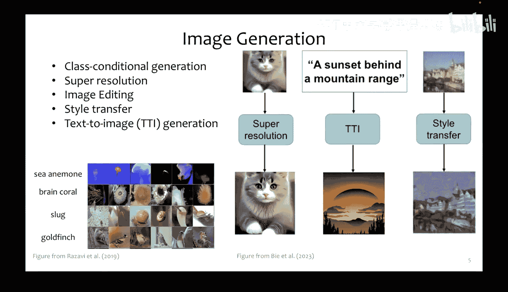
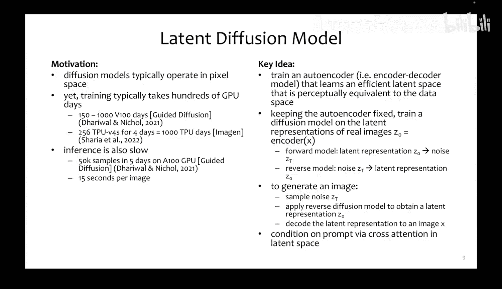
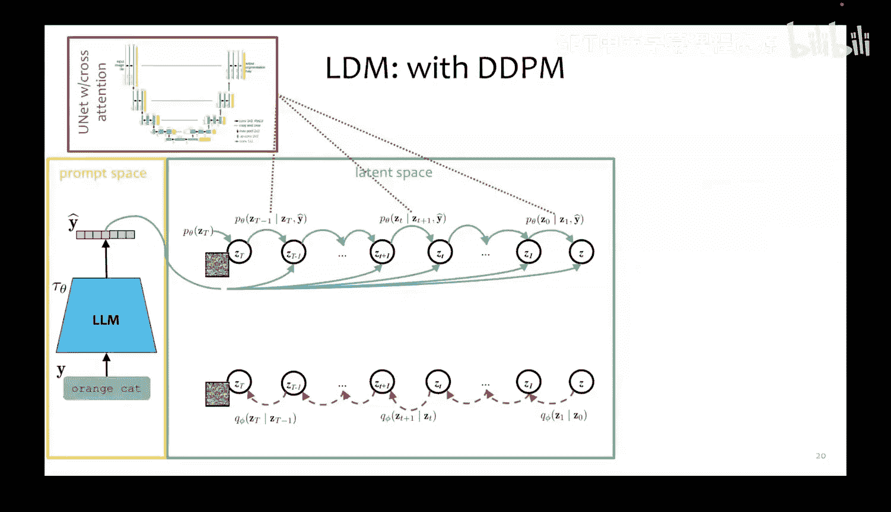
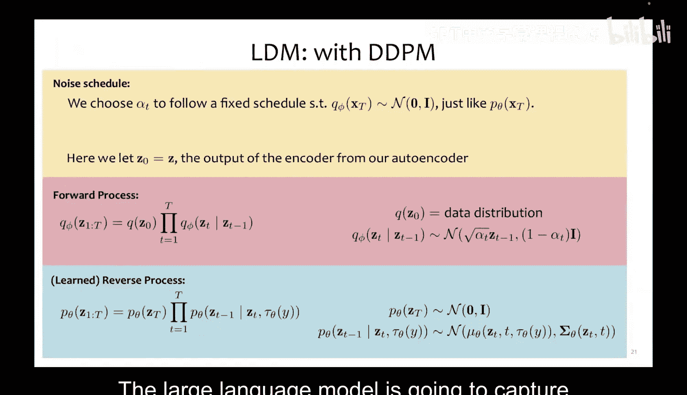
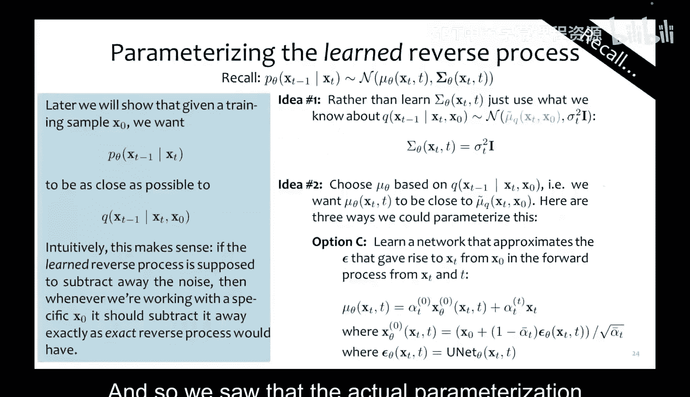
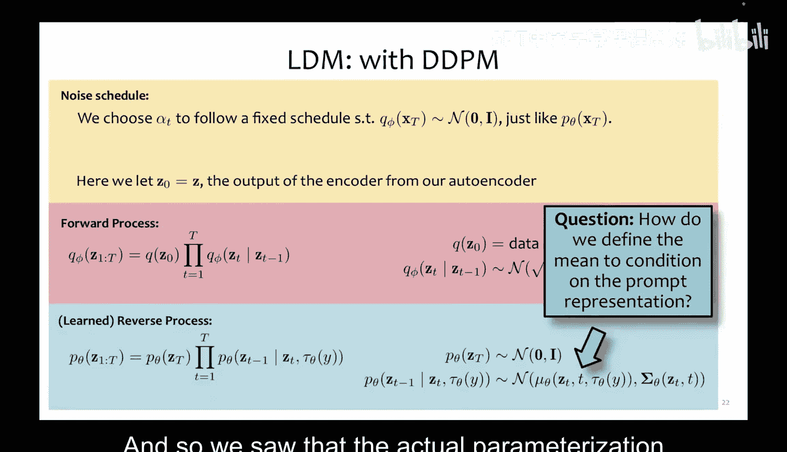
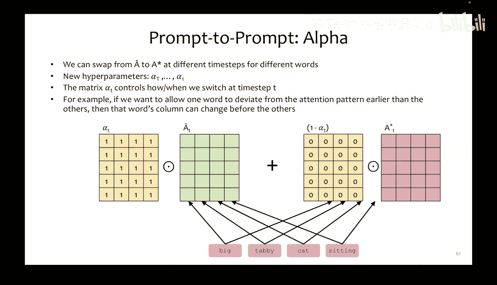
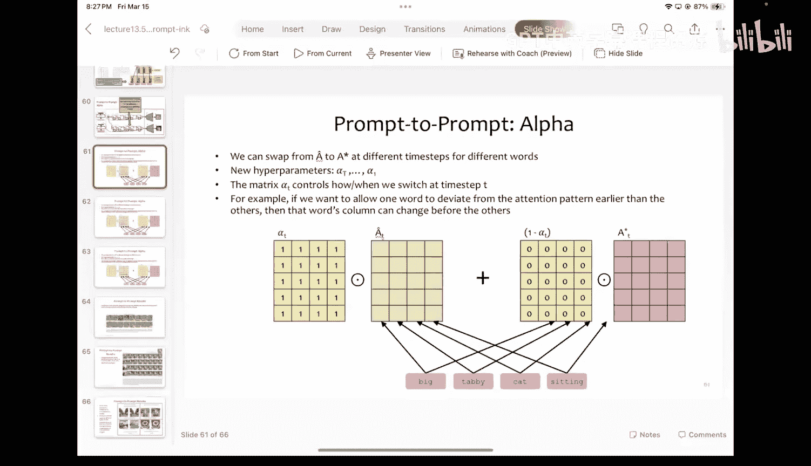
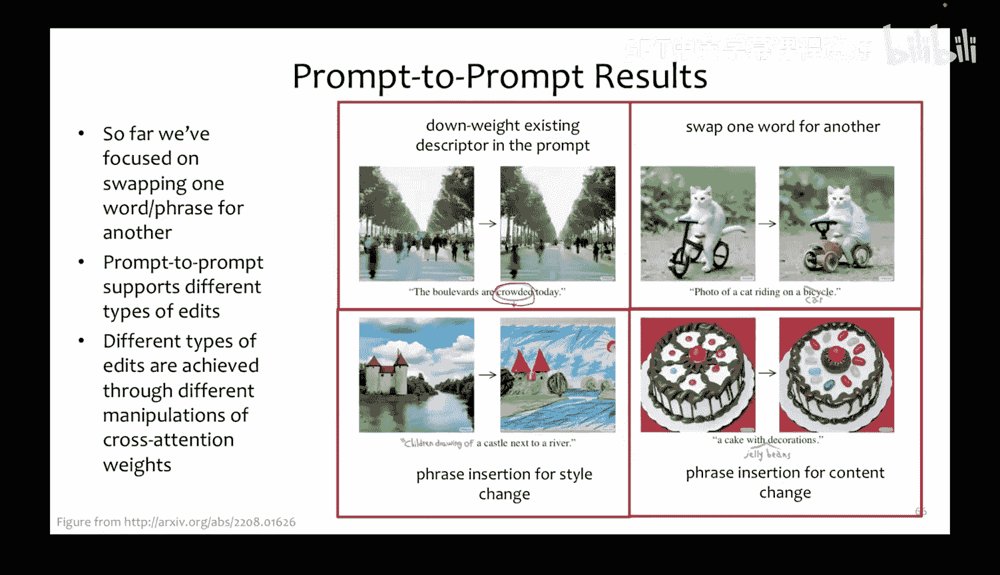
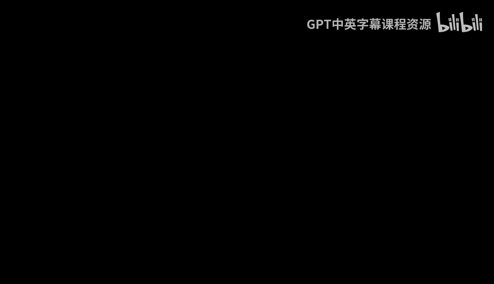

# 14：Prompt to Prompt 图像编辑教程 🎨

在本节课中，我们将学习一种名为 **Prompt to Prompt** 的强大图像编辑技术。该方法允许我们仅通过修改文本提示词，来编辑由扩散模型生成的图像，而无需进行任何额外的模型训练。

## 背景：条件图像生成与编辑

上一节我们介绍了条件图像生成的概念。在图像编辑领域，常见的技术包括修复缺失像素的 **Inpainting**、为黑白图像上色的 **Colorization** 以及重构图像缺失部分的 **Uncropping**。本节中，我们将重点探讨如何通过文本提示词来编辑图像。

Prompt to Prompt 方法的核心在于，它能够接收一个由扩散模型生成的图像，并通过简单地调整其生成时使用的文本提示词来对其进行编辑。

## 理论基础：潜在扩散模型回顾

为了理解 Prompt to Prompt，我们首先需要回顾其运行的基础——潜在扩散模型。

LDM 的核心思想是：为了提升扩散模型的效率，我们不在高维的像素空间直接操作，而是先在一个低维的**潜在空间**中进行扩散过程。这个潜在空间通过一个预训练的**编码器-解码器**模型获得，它能将图像压缩为低维表示，并能将其解码回像素图像。

同时，我们使用一个**大语言模型**将文本提示词编码为向量表示。在反向扩散过程中，我们通过**交叉注意力**机制，将文本编码作为条件信息注入到模型中，从而引导图像的生成。

LDM 的反向过程参数化遵循我们之前见过的形式，其均值函数 `μ_θ` 是 UNet 模型的输出，并且额外条件依赖于文本编码 `τ_θ(y)`：

`μ_θ(z_t, t, τ_θ(y))`

模型的训练目标是，通过梯度下降最小化损失函数，使模型预测的噪声 `ε_θ` 接近真实噪声 `ε`。

## 核心机制：交叉注意力详解

Prompt to Prompt 方法的关键在于操纵**交叉注意力**权重。因此，我们需要深入理解交叉注意力在 LDM 中是如何工作的。

在交叉注意力中，我们有两组不同的输入：
1.  来自 UNet 中间层的**图像潜在表示**（记为 `X`）。
2.  来自文本编码器的**文本提示词表示**（记为 `Y`）。

以下是交叉注意力的计算过程：
*   **键**和**值**矩阵由文本表示 `X` 通过线性变换得到：`K = X * W_K`, `V = X * W_V`。
*   **查询**矩阵由图像潜在表示 `Y` 通过线性变换得到：`Q = Y * W_Q`。
*   注意力分数通过查询和键的点积计算，并经过缩放和 Softmax 得到注意力权重矩阵 `A`。
*   最终的输出是注意力权重 `A` 与值矩阵 `V` 的加权和。

用矩阵形式可以简洁地表示为：
`Attention(Q, K, V) = softmax((Q * K^T) / sqrt(d_k)) * V`

其中，`d_k` 是键向量的维度。注意力权重矩阵 `A` 的每一列对应一个文本词，每一行对应潜在空间的一个位置（或图像的一个区域）。这建立了文本词与图像区域之间的关联映射。

## Prompt to Prompt 方法原理

了解了交叉注意力后，我们现在可以探讨 Prompt to Prompt 的具体实现。该方法旨在无需用户提供掩码的情况下，仅通过修改文本来编辑图像。

其核心思想是：利用原始提示词生成图像时保存的交叉注意力图，在根据新提示词生成图像时，有选择地“注入”这些旧的注意力图，从而在改变内容的同时保持图像的整体结构和布局。

以下是该方法的算法步骤概述：

1.  **输入**：原始提示词 `y`，目标提示词 `y*`，随机种子 `s`。
2.  **首次扩散**：使用原始提示词 `y` 和随机种子 `s` 运行完整的反向扩散过程，并保存每一步的交叉注意力权重矩阵 `A_t`。
3.  **二次扩散**：使用目标提示词 `y*` 和**相同的**随机种子 `s` 初始化噪声，再次运行反向扩散过程。
    *   在扩散的早期时间步（例如前50%），不使用当前步骤计算出的注意力权重 `A*_t`，而是**注入**之前保存的、来自原始生成的注意力权重 `A_t`（可能经过调整，见下文）。
    *   在扩散的后期时间步，则切换回使用当前计算的注意力权重 `A*_t`。
4.  **输出**：得到由新提示词 `y*` 生成的、但结构与原图相似的编辑后图像。

这种方法之所以有效，是因为图像的大部分**结构和布局信息**在扩散过程的早期就已确定。早期注入原图的注意力图，可以引导新图像继承相似的构图；后期切换回新提示词的注意力，则允许模型根据新内容自由发挥细节。

## 关键技术：注意力图对齐与混合

一个实际挑战是：原始提示词和目标提示词的词数（或标记数）可能不同，导致它们的注意力权重矩阵 `A` 和 `A*` 形状不匹配，无法直接替换。

Prompt to Prompt 通过定义一个**映射矩阵 M** 来解决这个问题。该矩阵负责将原始提示词的注意力权重“分配”到目标提示词的各个词上。

*   **词数相同**：`M` 近似为单位矩阵，直接对应替换。
*   **目标词数更多**（如“orange cat” -> “big tabby cat”）：需要将原词（如“orange”）的注意力权重分配到多个新词（“big”和“tabby”）上。`M` 中对应的列会包含如 `[0.5, 0.5]` 的权重，表示平均分配。
*   **目标词数更少**（如“big orange cat” -> “tabby cat”）：需要将多个原词（“big”和“orange”）的注意力权重合并到一个新词（“tabby”）上。`M` 中对应的行会包含合并权重。

通过计算 `Â = A * M`，我们得到一个与 `A*` 形状相同的、调整后的注意力矩阵 `Â`，它可以被注入到新提示词的生成过程中。

此外，控制何时从注入的注意力 `Â` 切换回标准注意力 `A*` 是一个重要的超参数。我们可以为**每个时间步**甚至**每个词**单独定义切换点，从而实现对图像不同部分编辑程度的精细控制。混合公式可以表示为：
`A_final = α ⊙ Â + (1 - α) ⊙ A*`
其中 `α` 是一个与注意力矩阵同形的矩阵，其元素在 `0` 到 `1` 之间，用于控制混合比例。

## 应用与效果

通过操纵交叉注意力，Prompt to Prompt 支持多种类型的图像编辑：

*   **单词替换**：如将“猫”替换为“狗”，保持骑自行车的姿势。
*   **属性调整**：减弱“拥挤的”这个词的注意力权重，让场景变得空旷。
*   **风格转换**：通过注入与艺术风格相关的短语，将照片变为油画。
*   **内容添加**：插入新的短语来为图像添加原本没有的元素。

这些操作都无需训练新模型，只需在采样过程中巧妙地操纵预训练模型的注意力机制即可实现。

## 总结

本节课我们一起学习了 **Prompt to Prompt** 这一创新的图像编辑方法。我们回顾了其基础——潜在扩散模型与交叉注意力机制，深入剖析了该方法通过保存并注入原始生成过程的注意力图，以实现仅用文本编辑图像的核心原理。我们还探讨了处理不同长度提示词的**注意力图对齐技术**，以及控制编辑强度的**注意力混合策略**。这种方法展示了如何在不更新模型权重的情况下，通过深入理解并操纵模型内部表示（特别是注意力），来实现强大而灵活的生成后控制。