# 14：视觉语言模型（第二部分） 👁️📖

在本节课中，我们将要学习视觉语言模型的核心概念、两种主要的图像编码器架构以及相关的训练数据。视觉语言模型是一种能够同时处理图像和文本输入，并生成文本或图像输出的模型，是实现通用人工智能愿景的重要一步。

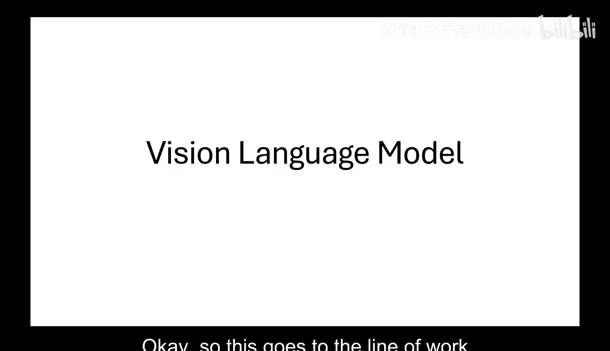

---

## 视觉语言模型概述

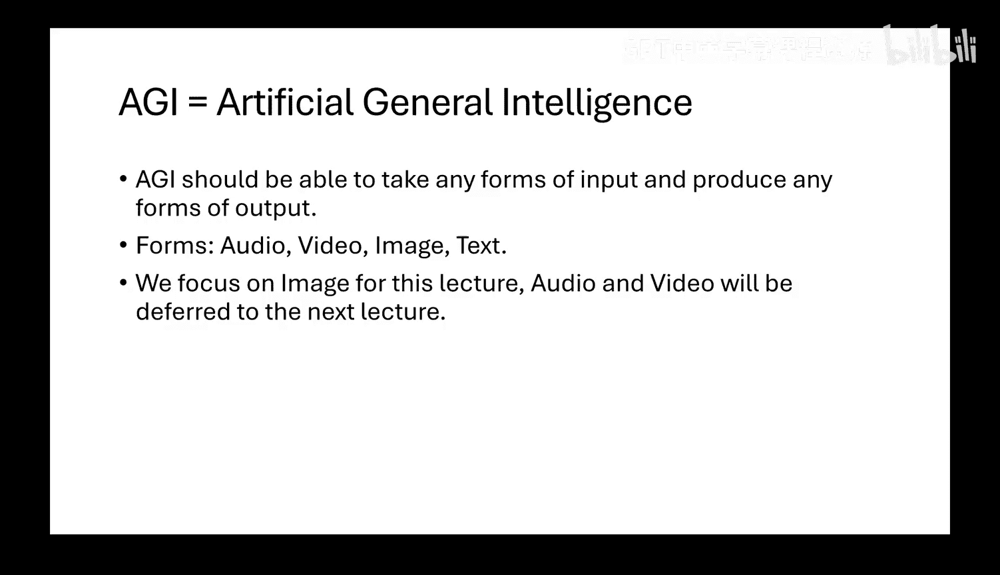

上一节我们介绍了视觉语言模型的基本概念。本节中我们来看看其核心架构。视觉语言模型的目标是让语言模型能够“看见”并理解图像。其基本思想是将图像转换为语言模型能够理解的格式。

一个标准的、基于Transformer的纯文本语言模型，其输入是一个文本序列 `X`。这个序列通过分词器被转换成一个整数列表，即**词元**。这些词元是Transformer能够接受的输入形式。

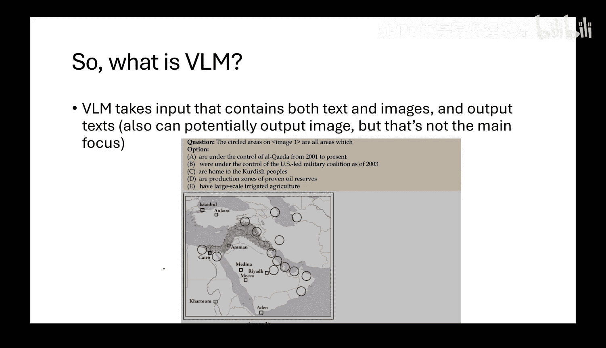

视觉语言模型的核心挑战在于，图像本身并不是Transformer能直接接受的词元序列。因此，我们需要一个**视觉编码器**，将图像映射为一系列向量或整数。

视觉语言模型通常由两部分组成：
1.  一个标准的语言模型。
2.  一个视觉编码器。

视觉编码器接收图像作为输入，并输出一个与语言模型输入兼容的序列（向量或整数）。然后，这个序列与文本词元一起被送入语言模型进行处理。

---

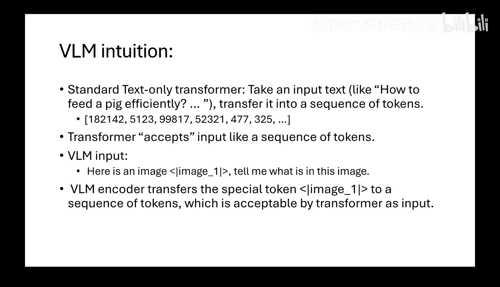

## 图像编码器类型：VQ-VAE 🎨

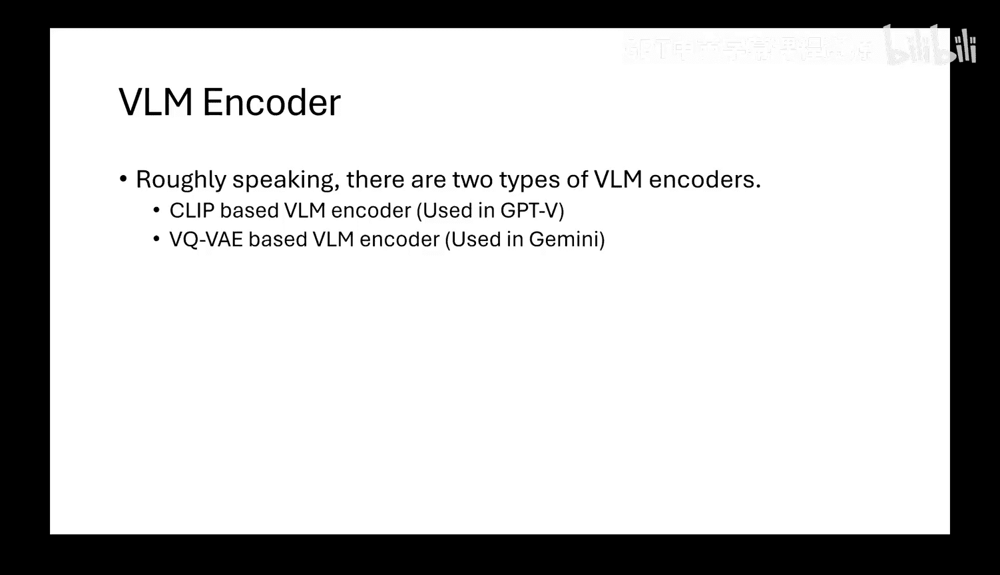

现在，我们来深入探讨第一种图像编码器。目前，业界主要使用两种类型的图像编码器：**基于VQ-VAE的编码器**（被Google Gemini等模型使用）和**基于CLIP的编码器**（被OpenAI GPT-4V等模型使用）。本节我们先介绍VQ-VAE。

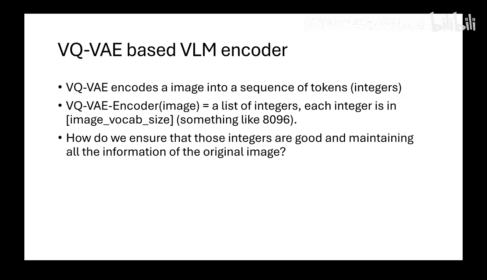

### VQ-VAE编码器原理

VQ-VAE（Vector Quantized Variational Autoencoder）的核心目标是将一张任意尺寸的图像编码成一个**整数词元序列**。每个整数都来自一个固定的“图像词汇表”，其大小通常远小于语言模型的词汇表。

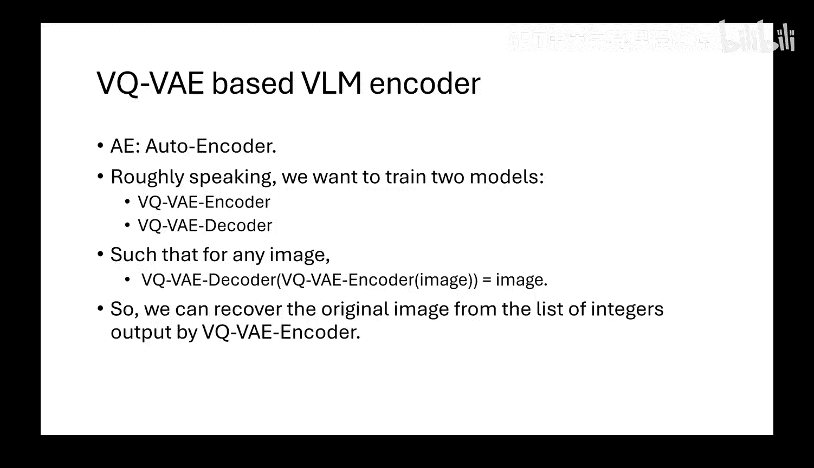

关键在于，我们如何确保这个整数序列能够有效地代表原始图像？VQ-VAE通过**自编码器**结构来解决这个问题。

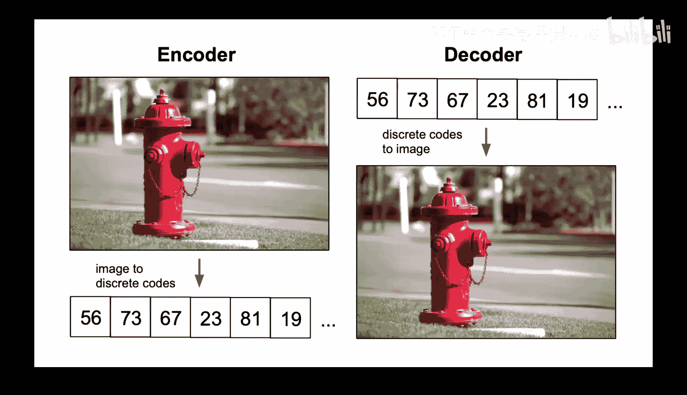

VQ-VAE包含一个编码器和一个解码器，它们被同时训练。编码器将图像映射为整数序列，解码器则尝试根据这个整数序列重建原始图像。训练目标是使重建的图像尽可能接近原始图像。

**公式表示的重建目标**：
`L_ae = E[ || Decoder(Encoder(I)) - I ||^2 ]`
其中 `I` 代表原始图像。

如果解码器能够从整数序列中较好地恢复图像，那么就证明这个序列包含了图像的足够信息。

### 离散化的训练技巧

然而，编码器的输出是离散的整数，这导致梯度无法回传，无法直接使用梯度下降法训练。VQ-VAE使用了一个巧妙的训练技巧。

编码器实际上先输出一个**连续的向量序列**。然后，我们维护一个可学习的**码本**，其中包含 `N` 个向量 `{E1, E2, ..., EN}`。对于编码器输出的每个连续向量，我们找到码本中与之最接近的向量 `E_i`，并用该向量的索引 `i` 作为最终的离散词元。

**向量量化损失**：
`L_vq = Σ_i || vector_i - E_{R(i)} ||^2`
其中 `R(i)` 表示将第 `i` 个向量映射到的码本向量的索引。

这个损失函数鼓励编码器输出的连续向量聚集在码本向量周围，使得离散化过程的信息损失最小。在反向传播时，`argmin` 操作被视为常数，梯度通过“直通估计器”直接从解码器传到编码器的连续输出。

### 整合到视觉语言模型中

当VQ-VAE编码器训练完成后，它就被固定下来。对于任何图像，我们都能通过它得到一个固定的整数词元序列。

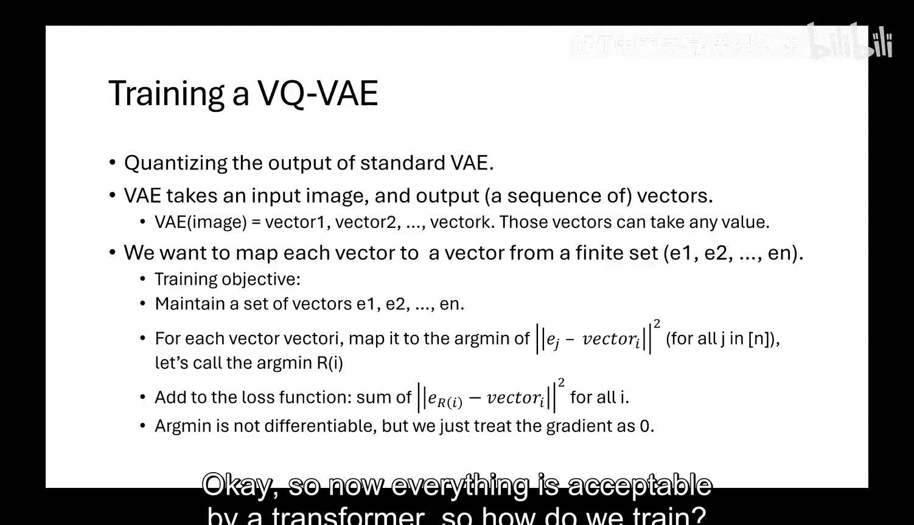

在训练视觉语言模型时，我们需要为图像词元和文本词元使用**不同的嵌入层**。模型通过特殊的标记（如 `<image>`）来区分输入中的图像部分和文本部分。语言模型头也需要区分下一个要预测的是图像词元还是文本词元。

**训练目标**是标准的自回归下一个词元预测，同时作用于图像词元和文本词元。这意味着该架构不仅可以根据文本生成文本，还可以根据文本生成图像词元序列，再通过VQ-VAE解码器生成图像。

---

## 图像编码器类型：CLIP 🔗

上一节我们介绍了能生成图像的VQ-VAE编码器。本节中我们来看看另一种思路不同的编码器：CLIP。

### CLIP编码器原理

CLIP（Contrastive Language-Image Pre-training）编码器与VQ-VAE有根本不同。它不输出离散的词元，而是将图像编码为一个**连续的向量序列**。每个向量位于一个高维空间中（例如768维）。

CLIP的训练目标不是重建图像，而是学习图像和文本在语义上的对齐。它同时训练一个**图像编码器**和一个**文本编码器**。

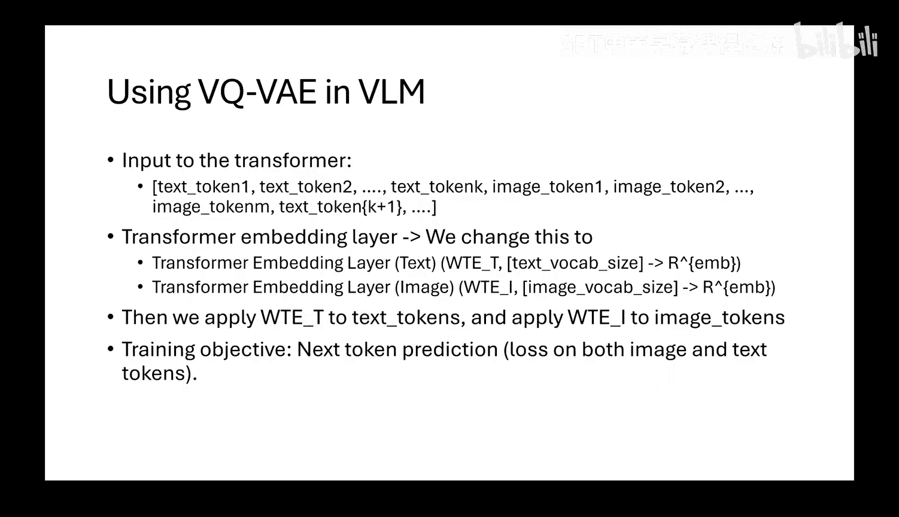

**CLIP训练目标**是：对于匹配的图像-文本对，它们的编码应该相似；对于不匹配的对，它们的编码应该不同。这通过对比损失函数实现。

**公式化的对比损失（简化）**：
模型需要最大化匹配对 `(image_i, text_i)` 的编码相似度 `sim(E_img(image_i), E_txt(text_i))`，同时最小化它与所有其他非匹配文本 `text_j (j≠i)` 的相似度。

这使得CLIP学习到的图像向量序列天然具有与文本向量相似的语义结构，非常适合被后续的语言模型理解。

### 整合到视觉语言模型中

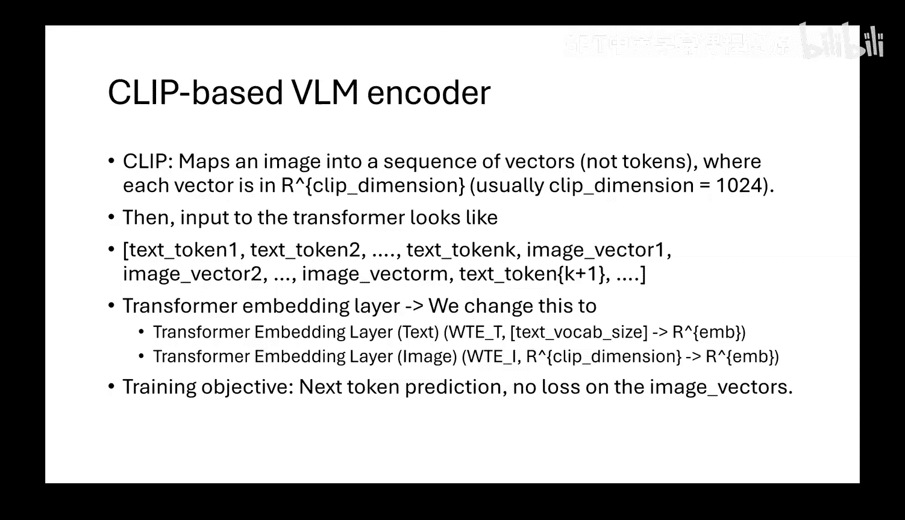

使用CLIP编码器的视觉语言模型，其架构与使用VQ-VAE时类似，但有一个关键区别：由于图像输入是连续向量而非离散词元，因此**训练损失只作用于文本词元**。

模型流程如下：
1.  文本被转换为词元序列。
2.  图像被CLIP编码器转换为向量序列。
3.  文本词元和图像向量通过各自的嵌入层映射到同一空间，并拼接在一起。
4.  序列经过Transformer块处理。
5.  在语言模型头处，只对文本部分的位置计算下一个词元预测损失，图像部分的位置被忽略。

因此，基于CLIP的视觉语言模型**只能生成文本，不能直接生成图像**。它的优势在于图像表示更丰富、训练更简单，且语义对齐更好。

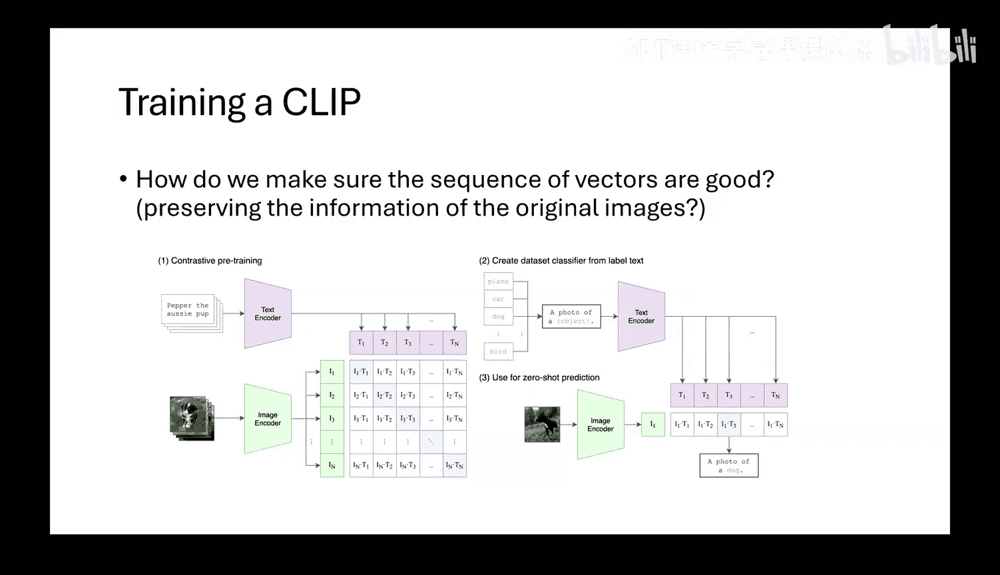

---

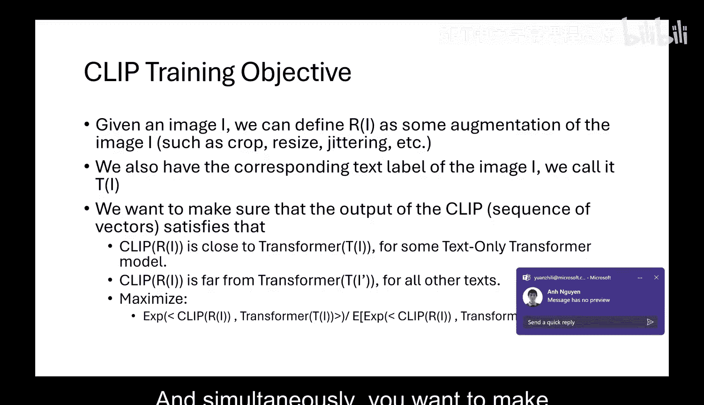

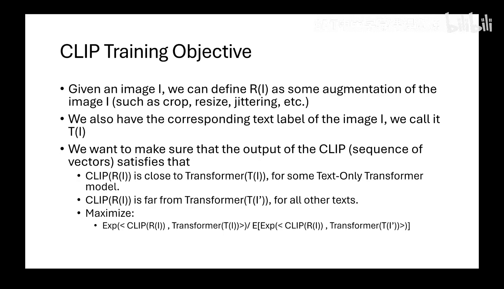

## 训练数据与评估基准 📊

我们已经了解了视觉语言模型的架构。然而，在生成式AI中，**训练数据往往比模型架构更重要**。以下是训练视觉语言模型常用的几种数据类型：

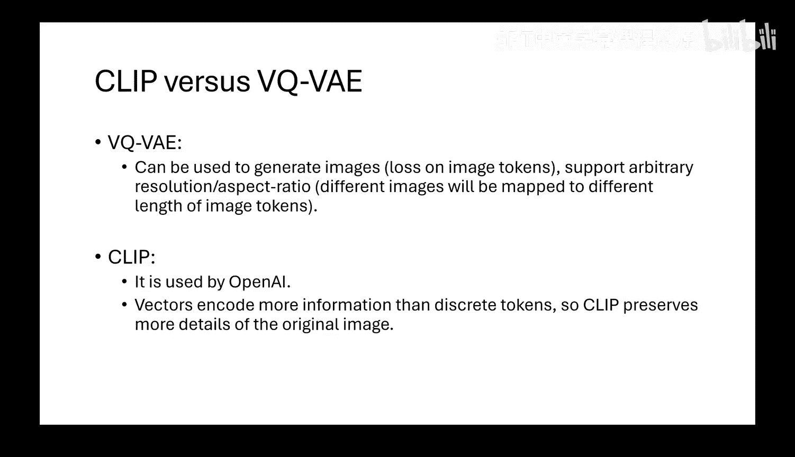

1.  **图像-标题对**：从网络（如谷歌图片）爬取的带有描述性文本的图像。
2.  **交错图文数据**：网页、PDF、学术论文中的图文混排内容。这是数据量最大但解析最困难的一类。
3.  **教科书与练习题**：包含图表、公式的学术材料，对提升模型推理能力至关重要。
4.  **合成数据（Chart QA/Table QA）**：使用代码或语言模型自动生成的图表、表格及其相关问题。这是可无限扩展的高质量数据源。
5.  **文档布局理解数据**：对网页或文档截图进行人工标注，用于训练模型理解UI元素、布局结构。
6.  **OCR（光学字符识别）数据**：将PDF页面作为图像输入，原始文本/LaTeX作为输出，训练模型“阅读”文档。

为了评估视觉语言模型的能力，业界也建立了一系列基准测试，它们与上述训练数据紧密对应：
*   **MMMU**：涵盖大学级别多学科问题的综合基准。
*   **Chart QA / DocVQA**：测试图表和文档理解能力。
*   **TextVQA**：测试图像中文本的阅读和理解能力。
*   **OCR基准**：测试光学字符识别精度。
*   **视觉细节理解**：测试高分辨率图像下的细粒度识别能力。

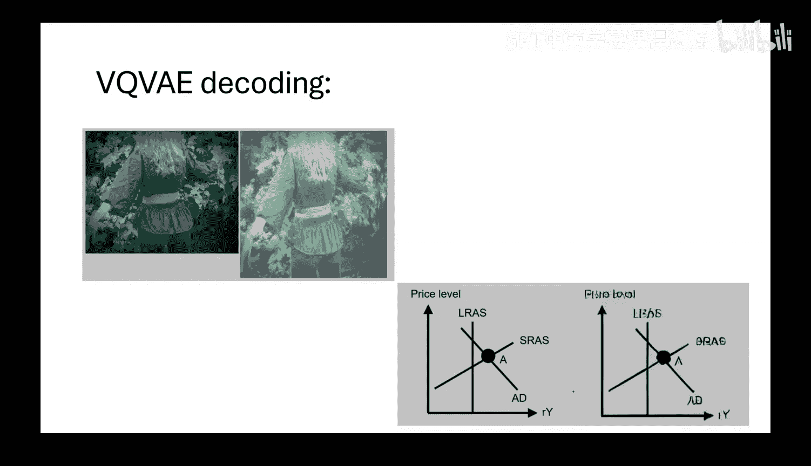

---

## 总结 🎯

本节课中我们一起学习了视觉语言模型的核心内容。

我们首先了解了视觉语言模型的基本架构，即通过一个视觉编码器将图像转换为语言模型可处理的序列。接着，我们深入探讨了两种主流的图像编码器：**基于VQ-VAE的编码器**和**基于CLIP的编码器**。VQ-VAE通过向量量化将图像离散化为词元序列，支持图像生成；而CLIP通过对比学习得到连续的图像向量序列，语义对齐更好，但不支持直接图像生成。

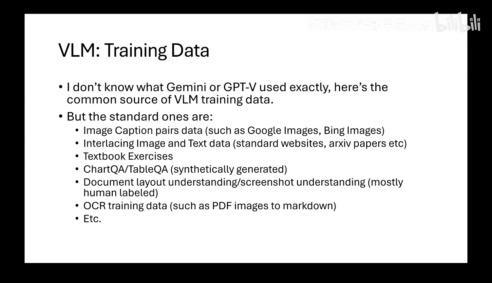

最后，我们认识到对于视觉语言模型乃至所有大模型而言，**高质量、多样化的训练数据**是性能提升的关键，并介绍了几类重要的训练数据源和评估基准。

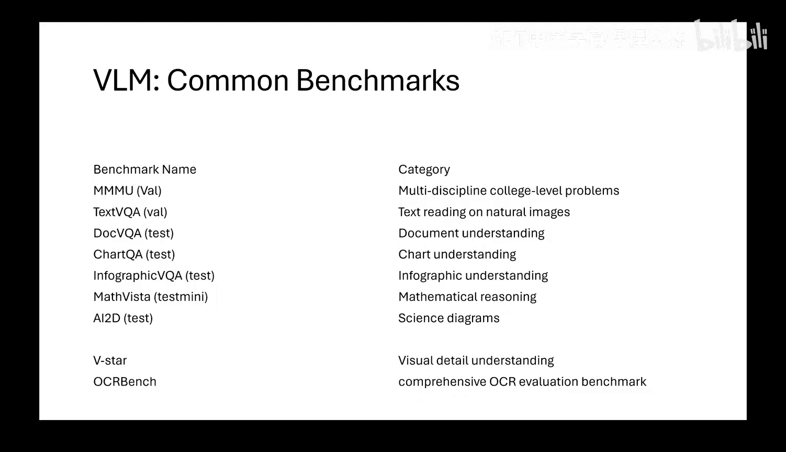

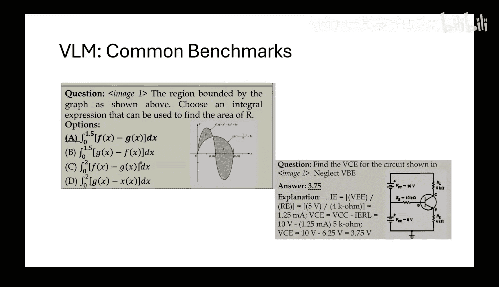

视觉语言模型是迈向多模态通用人工智能的重要一步，它将视觉感知与语言推理相结合，极大地扩展了模型的理解和应用边界。