# 15：缩放定律 (第二部分)

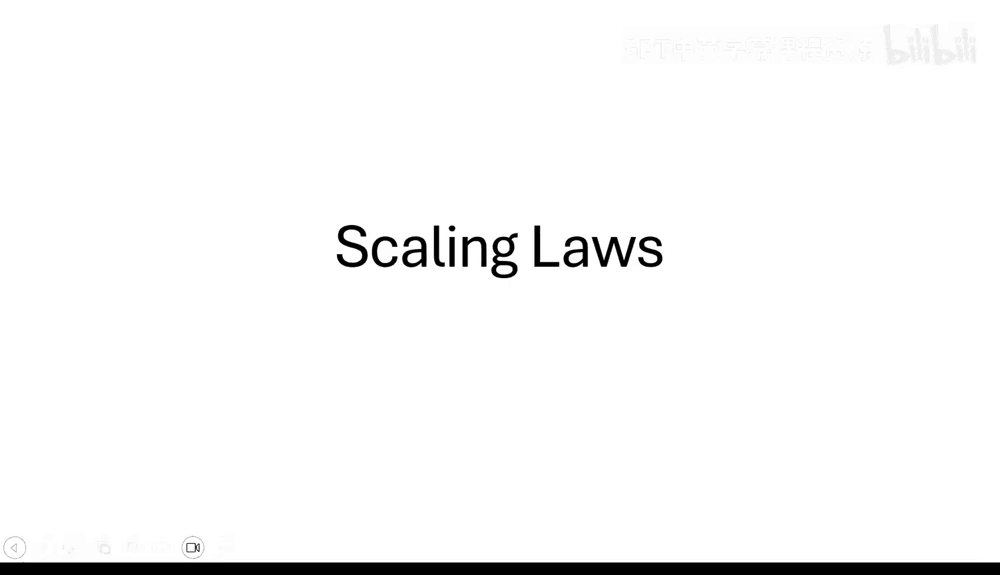

在本节课中，我们将探讨一个在大型语言模型训练中至关重要但通常被视为商业机密的概念：**缩放定律**。我们将学习两种核心的缩放定律，它们能帮助我们科学地预测模型性能与模型规模、训练计算量之间的关系。

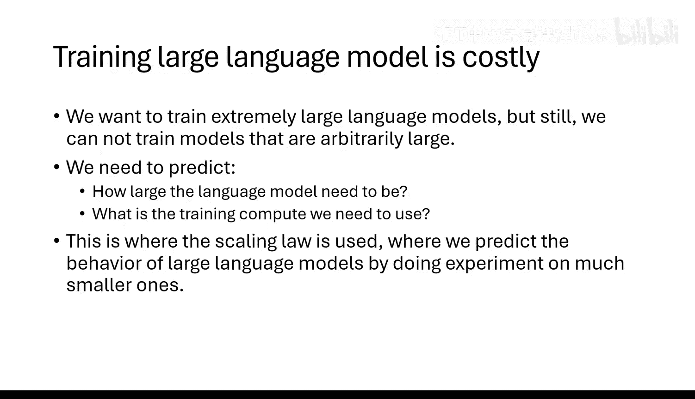

---

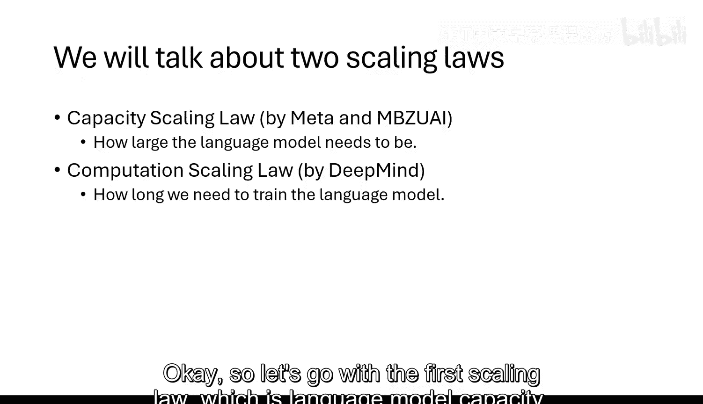

## 缩放定律概述

训练大型语言模型的计算成本极高。例如，GPT-4是一个拥有1.6万亿参数的模型，在约100万亿个令牌上进行训练。在投入如此巨大的资源之前，我们需要进行预测：对于一个给定规模的模型，投入多少计算量能获得怎样的性能？这就是**缩放定律**要解决的问题。它通过在较小规模的模型上进行实验，总结规律，并外推预测大规模模型的行为。

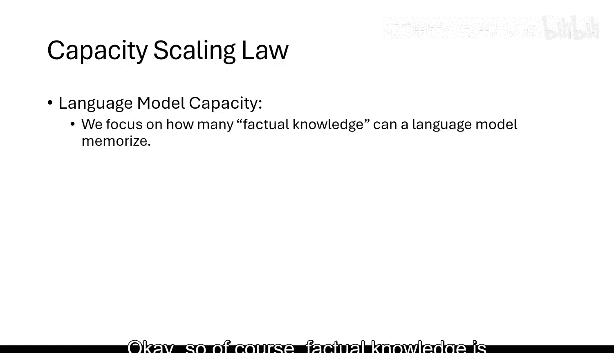

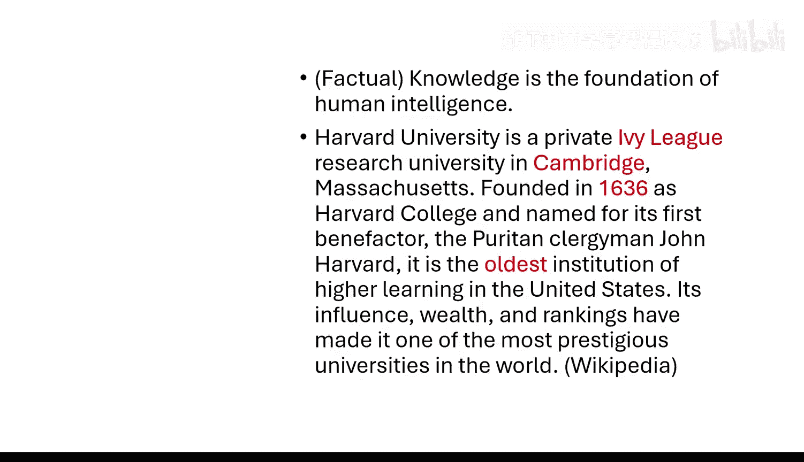

---

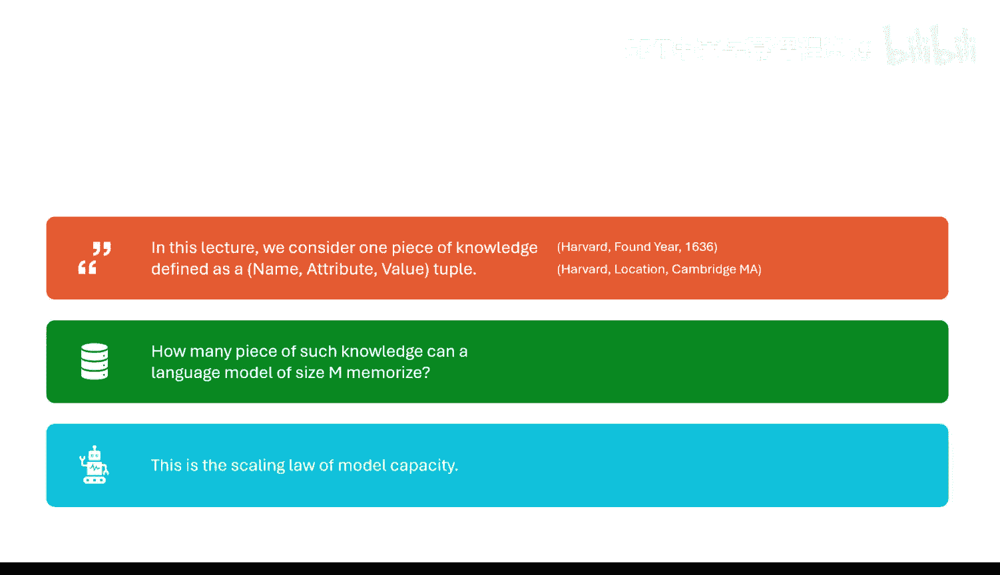

## 容量缩放定律：模型能记住多少知识？

上一节我们介绍了缩放定律的基本概念，本节中我们来看看第一种具体的定律：**容量缩放定律**。它回答一个核心问题：一个拥有 **M** 个参数的模型，最多能记住多少条事实性知识？

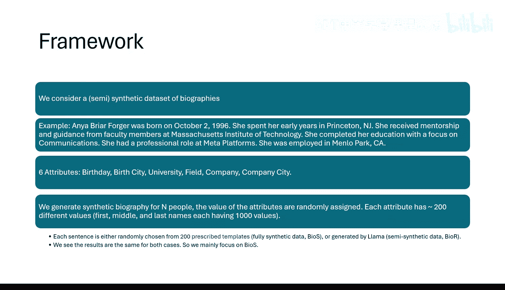

### 如何定义和测量“知识”？

为了精确研究，我们需要一个可控的实验环境。我们不会在真实的互联网数据上进行，因为几乎无法精确统计模型记住了多少知识。

我们采用一种简化的“传记”数据。每条知识被定义为一个 **（名称，属性，值）** 三元组。例如：（哈佛大学，所在地，马萨诸塞州剑桥市）。我们创建一批合成传记数据，每条包含6个固定属性（如生日、大学等），属性值随机生成。这样，知识的总量和结构是完全已知且可控的。

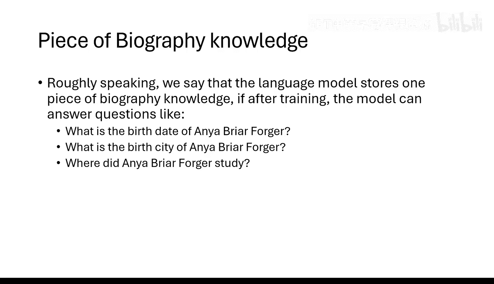

**核心测量方法**：
1.  用纯传记数据训练一个语言模型。
2.  训练后，向模型提问（例如，“某人的生日是什么？”），并测量其回答的准确率（精确匹配）。
3.  模型能正确回答的知识数量，即为其记忆的知识量。

### 信息理论边界

模型记忆知识的方式可以很“聪明”。例如，如果所有人的生日只集中在10个日期，模型可以建立一个映射表，而不是为每个人单独存储日期字符串。因此，我们需要一个基准来衡量模型记忆效率的上限：即**信息理论最优编码**所需的最少比特数。

对于我们的传记数据结构，存在一个数学公式可以计算这个最优比特数 **B_opt**。它取决于多个因素，例如知识条目数 **N**、属性值的多样性、以及模型达到的损失值 **L**。公式大致形式如下（具体系数取决于数据特性）：

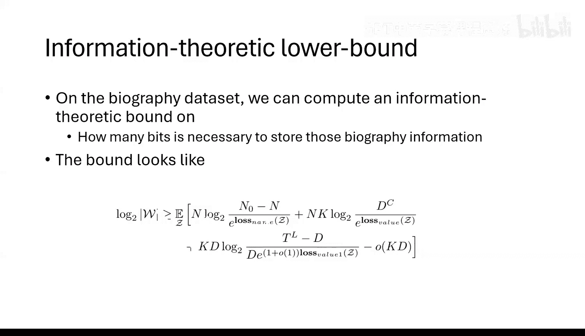

```
B_opt ≈ C1 * N * L + C2 * N * log(D) + C3 * T * log(L)
```
其中，`D` 代表属性值的可能取值数量，`T` 与文本长度相关，`L` 是交叉熵损失。这个 **B_opt** 值代表了存储这些知识所需信息量的理论下限，我们将用它来衡量模型实际记忆的“知识量”。

### 实验结果与惊人发现

我们在不同规模（从2600万到10亿参数）的Transformer模型上进行实验，并充分训练它们（约1000个数据轮次），直至性能不再提升。

以下是关键发现：
*   **2比特/参数定律**：无论模型架构细节如何（层数、头数、MLP与注意力层的比例），所有充分训练的Transformer模型，其有效记忆容量都趋近于 **每参数2比特**。这意味着一个 **M** 个参数的模型，最多能记忆约 **2M** 比特的最优编码信息。
*   **量化几乎无损**：使用FP8甚至INT8格式训练模型，依然遵循相同的2比特/参数定律。这表明低精度训练是可行且高效的。
*   **对GPT-4的启示**：GPT-4约有1.6万亿参数，其理论记忆容量约为 **3.2万亿比特**。而估算所有人类教科书知识总量大约在 **200亿比特** 左右。因此，仅从记忆所有教科书知识的角度看，一个约100亿参数的模型就足够了。GPT-4的规模远超此需求。

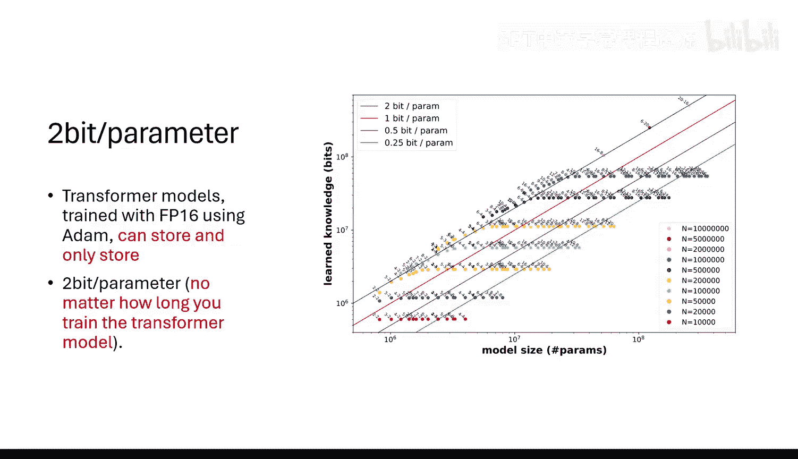

### 数据质量的关键影响

然而，上述理想定律的前提是训练数据纯净（全是需要记忆的知识）。如果数据中混杂了大量“垃圾”信息（无用或随机的互联网文本），模型的训练效率会急剧下降。

实验表明，如果信号（有用知识）与噪声（垃圾信息）的比例为 1:7，那么要达到接近最优的容量，所需的训练数据量（或等效训练步数）将增加约 **64倍**。因此，**高质量的数据过滤对于高效训练至关重要**。

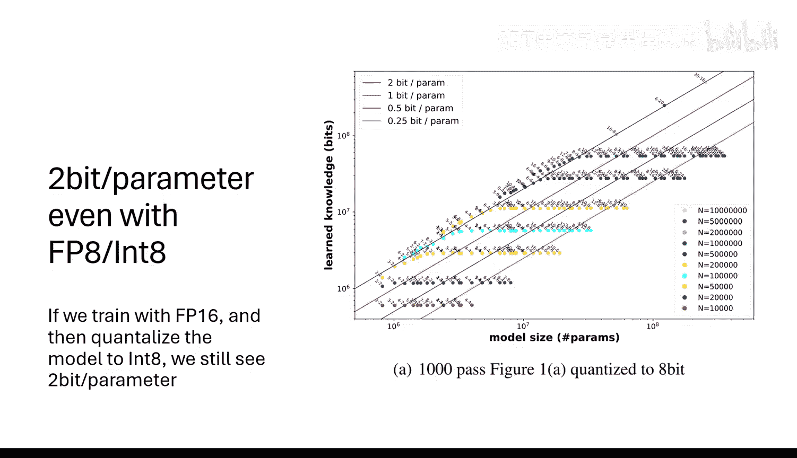

---

## 计算缩放定律：如何最优分配计算资源？

上一节我们了解了模型容量的上限，本节中我们来看看在有限计算预算下，如何最有效地训练模型。这就是由DeepMind提出的 **Chinchilla 缩放定律**（或称计算缩放定律）。

它研究模型规模（参数数量 **N**）、训练数据量（令牌数 **D**）和最终模型损失 **L** 三者之间的关系。其核心结论是：在固定的总计算预算 **C ≈ 6ND**（用于训练前向和反向传播）下，**模型参数数量和训练数据量应该成比例地增长**。

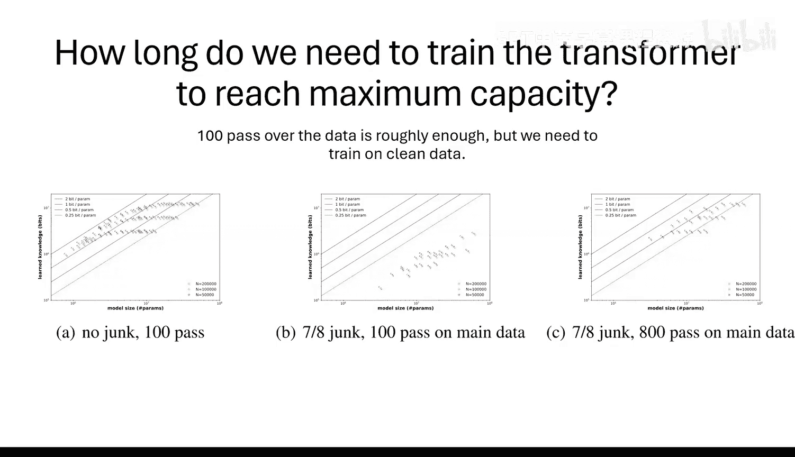

一个经验性的最优比例是：**每10亿参数，大约需要20亿个训练令牌**。例如，一个70亿参数的模型，最优训练数据量应在1.4万亿令牌左右。

### 对当前实践的批判与启示

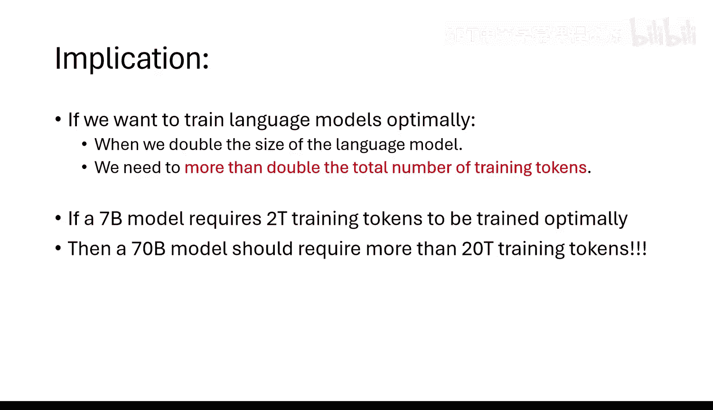

许多现有模型的训练并未遵循此定律：
*   **训练不足**：例如，一些大型模型（如700亿参数）的训练令牌数可能和较小模型（如70亿参数）一样多。根据Chinchilla定律，这意味著大型模型**训练不足**，没有发挥其全部潜力。
*   **规模效率悖论**：一个反直觉但关键的推论是：**扩大模型规模有时能提高训练效率**。如果一个模型处于容量临界点（刚好能记住所有数据），其参数必须被极度压缩利用，优化过程会变慢。而一个规模更大的模型（“过度参数化”）有更宽松的优化空间，可能**用更少的训练步数就能达到相同的性能**。因此，在计算受限时，选择比理论最优容量更大的模型，可能是更快的训练策略。

---

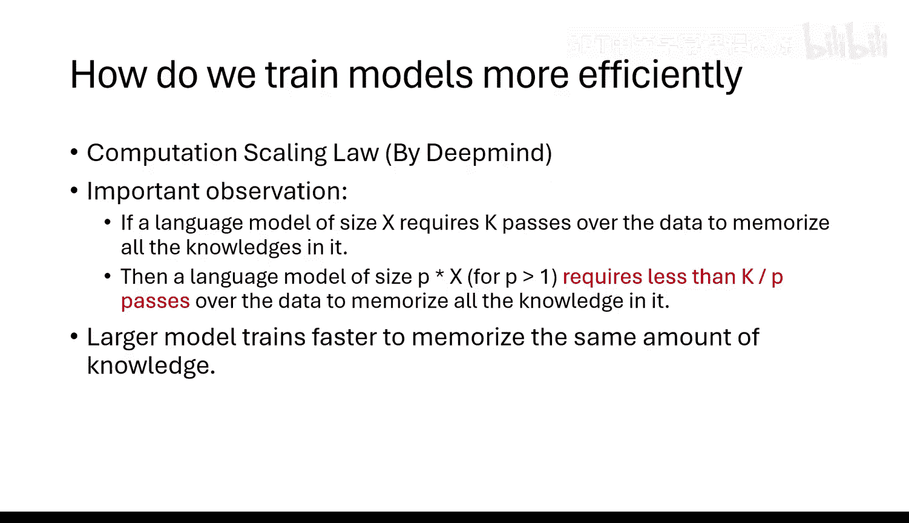

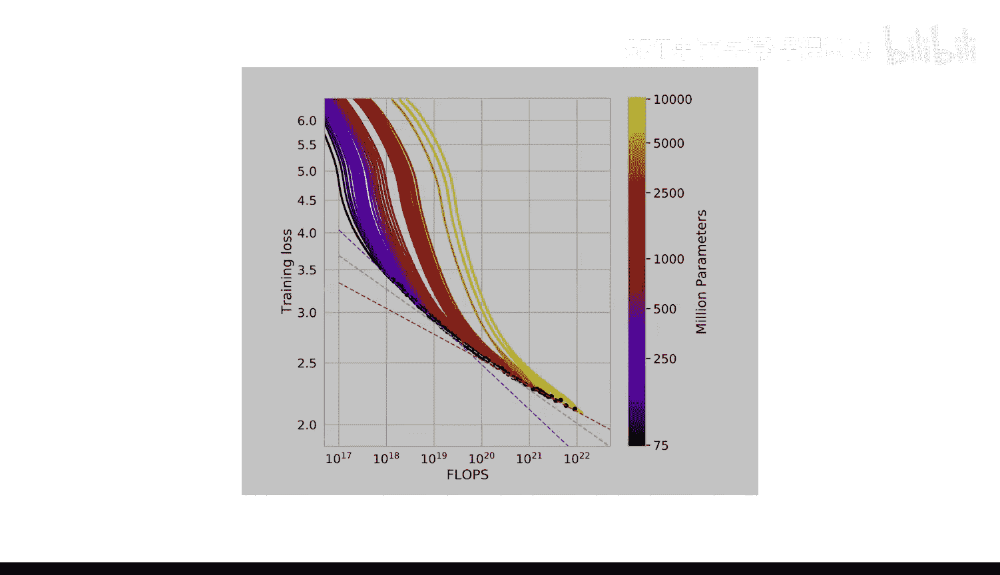

## 总结

本节课我们一起学习了两种核心的缩放定律：
1.  **容量缩放定律**：揭示了Transformer模型记忆能力的理论上限（约每参数2比特），并强调了高质量训练数据过滤的极端重要性。
2.  **计算缩放定律**：指出了在固定计算预算下，模型规模与训练数据量应平衡缩放，并解释了为何在实践中常常会使用“过度参数化”的模型以加速训练。

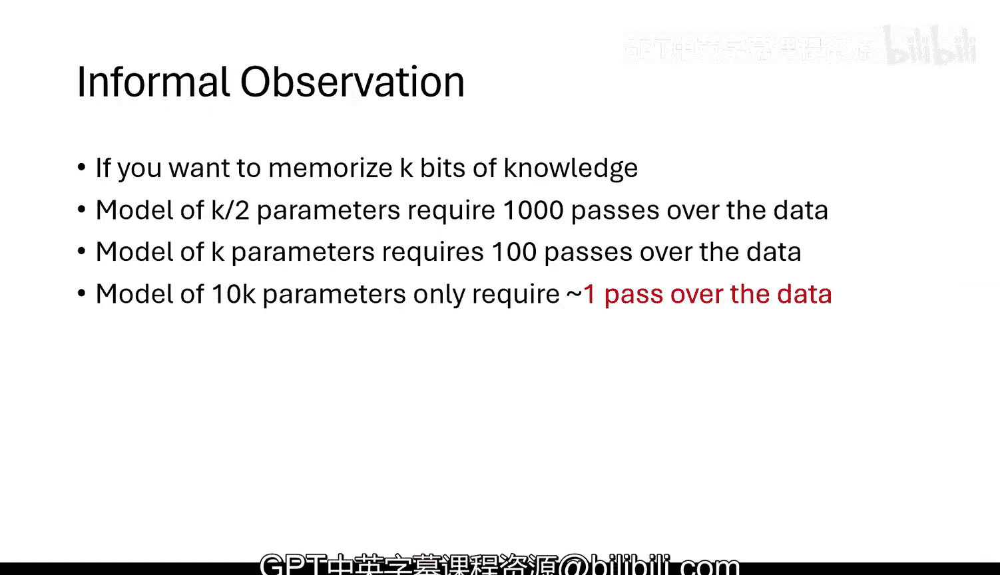

这些定律是指导大型语言模型研发的科学基础，帮助我们在投入海量资源前进行性能预测和资源规划。尽管真实的工业级缩放定律更为复杂且保密，但其核心思想均源于此类基础研究。