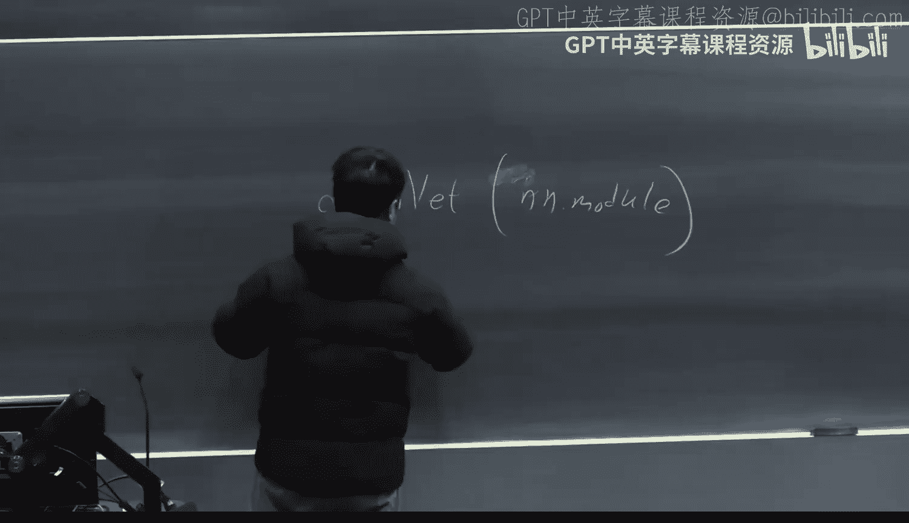
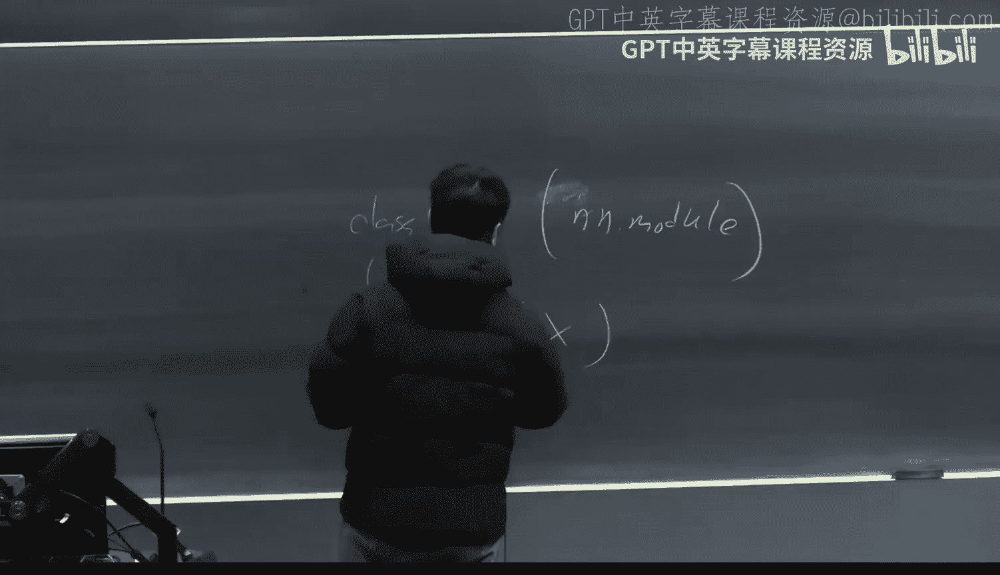
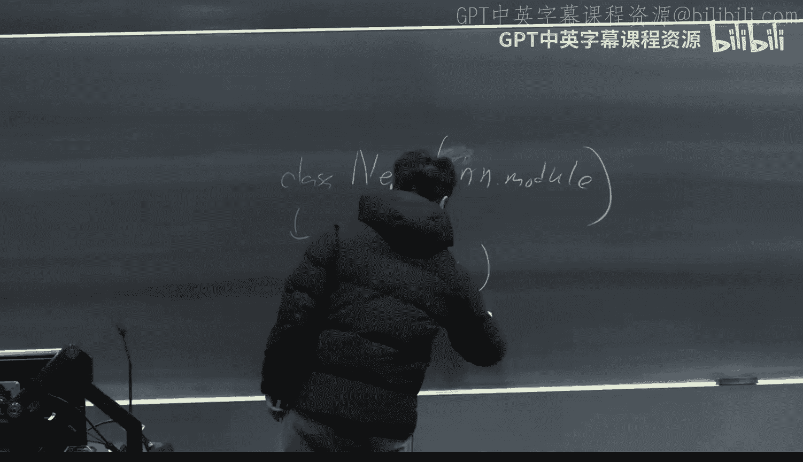
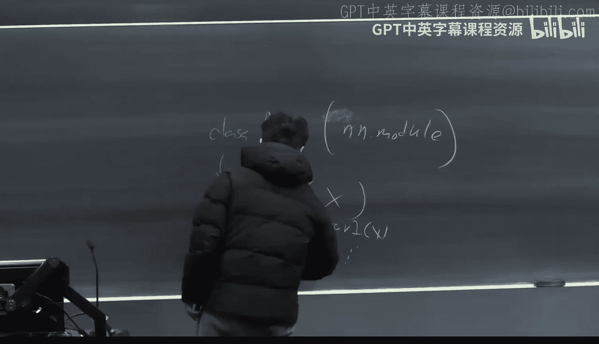
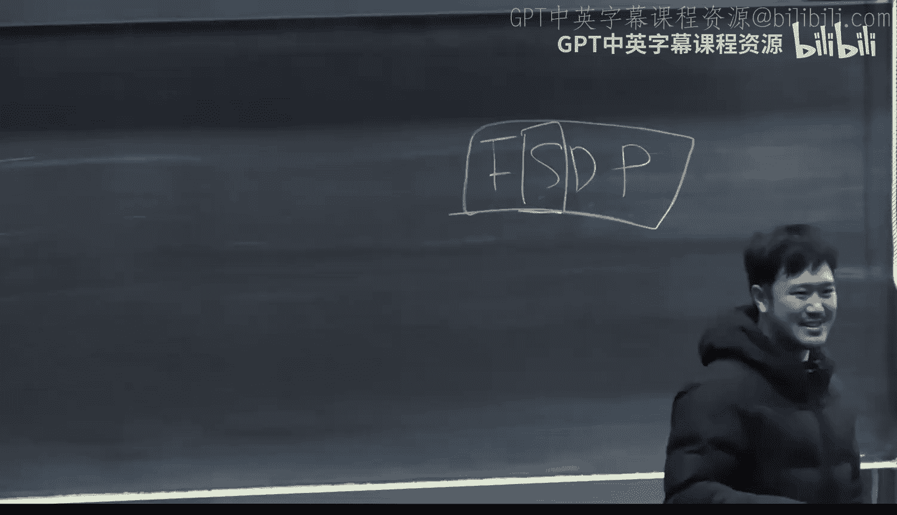
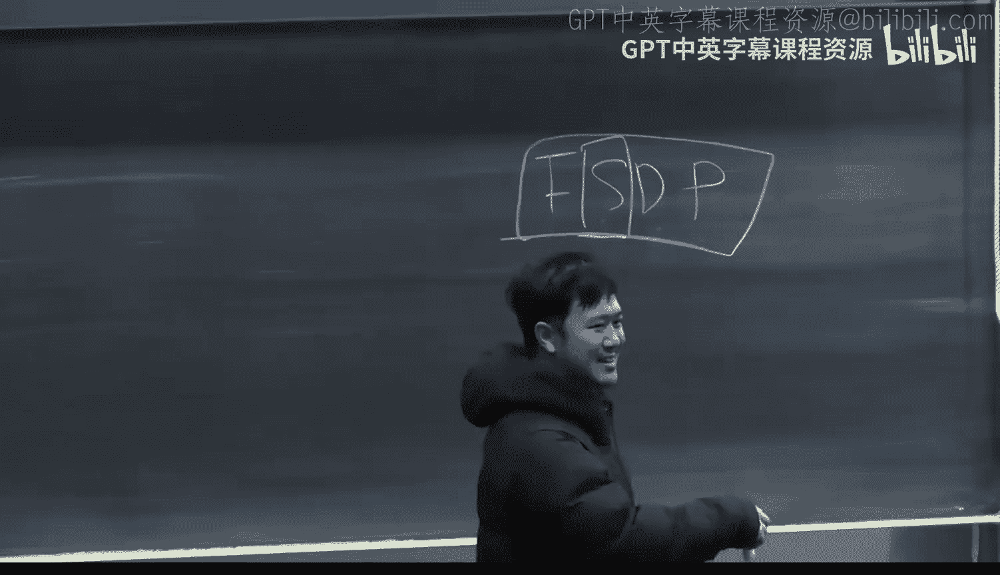
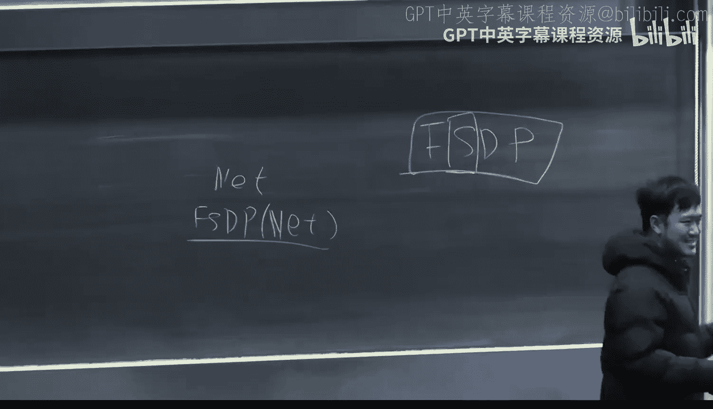
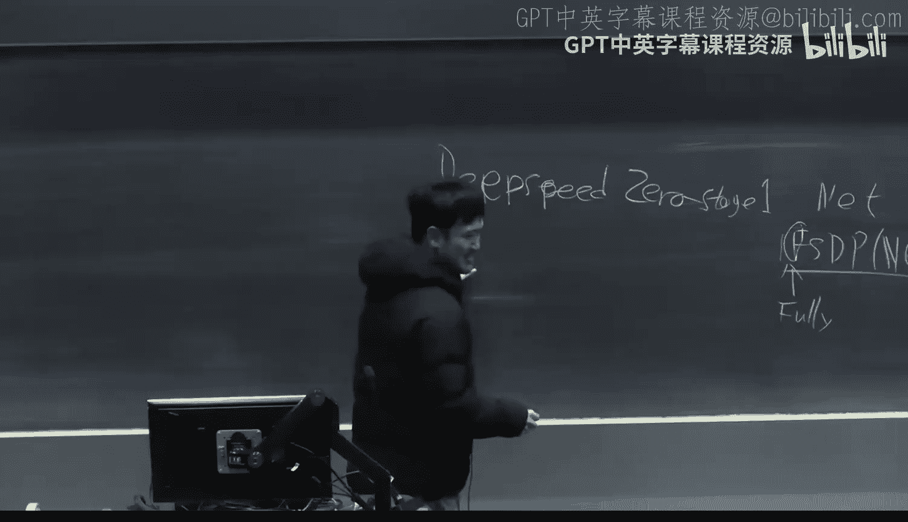

# 18：分布式训练

在本节课中，我们将学习生成式AI中一个至关重要的主题：分布式训练。随着语言模型和生成模型规模的不断扩大，传统的单GPU训练方式已无法满足需求。分布式训练通过在多块GPU上协同工作，解决了大模型训练中的内存和计算瓶颈。我们将从基础概念入手，逐步探讨几种关键的分布式训练技术。









---

## 数据并行：最基础的分布式形式

上一节我们介绍了单GPU训练的简单流程。本节中我们来看看当拥有多块GPU时，最直接的加速方法：数据并行。

在数据并行中，每块GPU都拥有完整的模型副本，但处理不同的数据批次。以下是其核心步骤：

1.  **数据分发**：将训练数据批次分割，每块GPU获得一个子批次。
2.  **独立前向与反向传播**：每块GPU使用自己的数据独立完成前向传播和损失计算，并计算梯度。
3.  **梯度同步**：所有GPU计算出的梯度通过通信操作（如 `all_reduce`）进行求和或平均。
4.  **参数更新**：每块GPU使用同步后的梯度统一更新其模型参数。

数据并行的核心优势是通信开销小，通常只需在梯度同步时进行通信。在PyTorch中，这可以通过一行代码实现：

```python
model = torch.nn.DataParallel(model)
```

然而，数据并行要求每块GPU都能在内存中容纳**完整的模型参数、梯度和优化器状态**。对于当今动辄数十亿参数的大模型，这变得不可能。

---

## 内存挑战：为何需要更高级的技术







上一节我们了解了数据并行的局限性。本节中我们来看看驱动更高级分布式训练技术的核心挑战：GPU内存限制。



训练一个大语言模型时，主要的内存消耗来自三个方面：

1.  **模型参数**：存储模型权重，通常使用 `FP16` 或 `BF16` 精度以节省内存。一个70亿参数的模型约需 **14 GB** 内存（`FP16`）。
2.  **优化器状态**：对于像Adam这样的优化器，需要存储动量和二阶动量。为了数值稳定性，这些状态通常以 `FP32` 精度存储。对于一个70亿参数的模型，优化器状态约需 **56 GB** 内存。
3.  **激活值（Activations）与梯度**：在前向传播中产生的激活值，以及在反向传播中计算的梯度，也会消耗大量内存，其大小与模型参数和批次大小相关。

简单相加，仅存储一个70亿参数模型的权重和优化器状态就可能超过 **70 GB**，这已经接近甚至超过单块高端GPU（如H100的80GB）的内存容量，尚未计算激活值和梯度所需的内存。因此，无法在单GPU上训练此类模型。

---

## 优化器状态分片：减少内存占用的第一步

上一节我们明确了内存是主要瓶颈。本节中我们来看看第一种高级技术：优化器状态分片（也称为DeepSpeed ZeRO阶段1）。

这项技术的核心思想是：**不再在每块GPU上存储完整的优化器状态，而是将其均匀分片，每块GPU只存储其中一份**。

以下是其工作流程：

1.  **模型复制**：每块GPU仍然存储完整的模型参数副本。
2.  **优化器状态分片**：将优化器状态（如Adam的动量和二阶动量）分割成N份（N为GPU数量），每块GPU存储其中一份。
3.  **梯度计算与同步**：每块GPU独立计算其数据子批次对应的梯度。然后，通过一个 **`reduce_scatter`** 通信操作：
    *   **Reduce（规约）**：将所有GPU上对应**同一参数分片**的梯度进行求和。
    *   **Scatter（散射）**：将求和后的梯度分片发送回负责该参数分片优化器状态的GPU。
4.  **参数更新**：每块GPU使用接收到的梯度分片和本地存储的优化器状态分片，更新其负责的**那部分模型参数**。
5.  **参数同步**：更新完成后，通过通信（如 `all_gather`）将更新后的参数分片同步到所有GPU，确保每块GPU上的完整模型参数保持一致。

通过分片优化器状态，我们将其内存占用从 `56 GB` 降低到了约 `56/N GB`。对于8块GPU，这意味着一块70亿参数模型所需的内存从约70GB降至约 `14（参数） + 7（优化器分片） + 梯度内存 ≈ 28 GB` 左右，使得训练成为可能。

---

## 完全分片数据并行：进一步分片模型参数

上一节我们通过分片优化器状态节省了大量内存。本节中我们来看看更激进的方案：完全分片数据并行，它同时分片模型参数、梯度和优化器状态。

FSDP是优化器状态分片的自然延伸。其核心思想是：
*   不仅将优化器状态分片，也将**模型参数本身**进行分片存储。
*   每块GPU只存储整个模型的**一个参数子集**以及对应的优化器状态分片。

其工作流程更为复杂：

1.  **前向传播**：当计算需要某些不在本地的参数时，通过 **`all_gather`** 通信从其他GPU收集这些参数，在本地临时组装成完整层进行计算，计算后释放这些临时参数。
2.  **反向传播**：类似地，在计算梯度时，再次通过 `all_gather` 组装所需参数。计算出的梯度根据其对应的参数分片进行分片。
3.  **梯度同步与更新**：使用类似优化器分片中的 `reduce_scatter` 操作同步梯度分片。每块GPU然后使用本地存储的参数分片、梯度分片和优化器状态分片进行更新。
4.  **参数同步**：更新后的参数分片可能需要同步（取决于实现）。

FSDP的优势在于：
*   **内存效率极高**：理论上可以训练模型的大小与GPU总数成线性比例。
*   **支持更高精度**：可以在本地以 `FP32` 精度维护参数分片和优化器状态，进行更精确的更新，同时在前向/反向传播时使用 `FP16/BF16` 以节省内存和加速计算。

在PyTorch中，FSDP可以通过一个包装器使用：
```python
from torch.distributed.fsdp import FullyShardedDataParallel as FSDP
model = FSDP(model)
```

---

## 张量并行：将计算图本身进行分割

上一节介绍的FSDP通过在垂直方向（参数）上分片来节省内存。本节中我们来看看另一种维度：张量并行，它通过水平分割单个层的计算来分布内存和计算负载。

张量并行的核心是将一个大型神经网络层（如线性层）的矩阵运算分布到多个GPU上。以线性层 `Y = XA` 为例（`X` 输入，`A` 权重矩阵）。

主要有两种分割方式：

1.  **列并行（Column Parallel）**：将权重矩阵 `A` 按列分割。每块GPU持有 `A` 的一部分列。计算时，每块GPU计算 `X` 与本地权重子矩阵的乘积，得到输出子部分，然后通过 **`all_gather`** 通信将所有GPU的输出子部分拼接成完整的 `Y`。
    *   **前向传播公式**：`Y = [X * A1, X * A2, ...]`，然后 `all_gather`。
    *   **内存**：每块GPU存储的 `A` 的大小变为原来的 `1/N`。

2.  **行并行（Row Parallel）**：将权重矩阵 `A` 按行分割。此时，需要先将输入 `X` 通过 **`all_gather`** 广播到所有GPU（或更高效地，按行分割 `X` 并 `all_gather` 结果）。每块GPU计算本地 `X` 子部分与本地 `A` 子矩阵的乘积，然后通过 **`reduce_sum`** 通信对所有GPU的结果求和，得到完整的 `Y`。
    *   **前向传播公式**：每块GPU计算 `Yi = Xi * Ai`，然后对所有 `Yi` 进行 `reduce_sum`。

在实践中，一个线性层的前向传播可能采用列并行，而为了高效地进行反向传播，其对应的梯度计算会自然地采用行并行。像Megatron-LM这样的库提供了封装好的并行线性层，用户只需用它们替换标准线性层即可构建张量并行模型。

张量并行的主要挑战是**通信频繁**，因为几乎每一层的前后向传播都需要GPU间通信。它通常用于模型实在太大，无法用FSDP装入单个GPU内存的情况。

---

## 混合并行与总结

在实际的超大规模模型训练中（如训练GPT-4或Llama），通常会**混合使用**多种并行策略：

*   **数据并行**：在不同的GPU组上处理不同的数据批次。用于扩大有效批次大小。
*   **张量并行**：在单个GPU组内，将大型模型层拆分到多个GPU上。用于解决单层参数过大的问题。
*   **流水线并行**：将模型的不同层组放置在不同的GPU上。一个批次的数据像流水线一样依次经过这些GPU。用于解决模型深度过大的问题。
*   **专家并行**：用于混合专家模型，将不同的专家分布到不同的GPU上。

系统会根据硬件拓扑（如NVLink连接）和模型结构，将数千块GPU划分成不同的并行组，以最大化计算效率和最小化通信开销。

本节课中我们一起学习了分布式训练的核心概念。我们从最简单的数据并行开始，揭示了其内存瓶颈，进而深入探讨了优化器状态分片、完全分片数据并行和张量并行等高级技术。这些技术通过巧妙地分割模型参数、优化器状态和计算图，使得训练拥有数千亿参数的大模型成为可能。理解这些原理是从事前沿大模型开发和优化的基础。