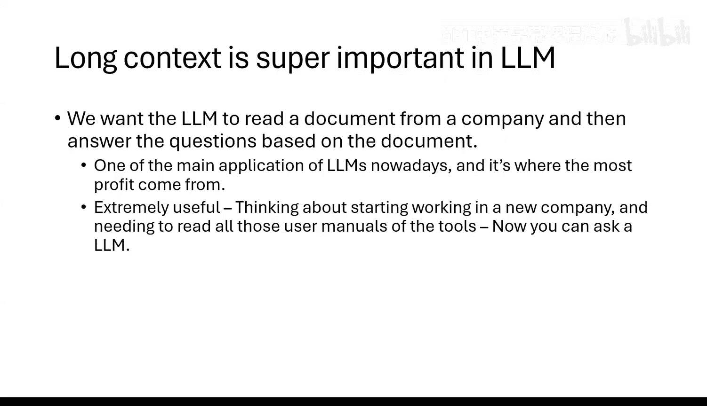
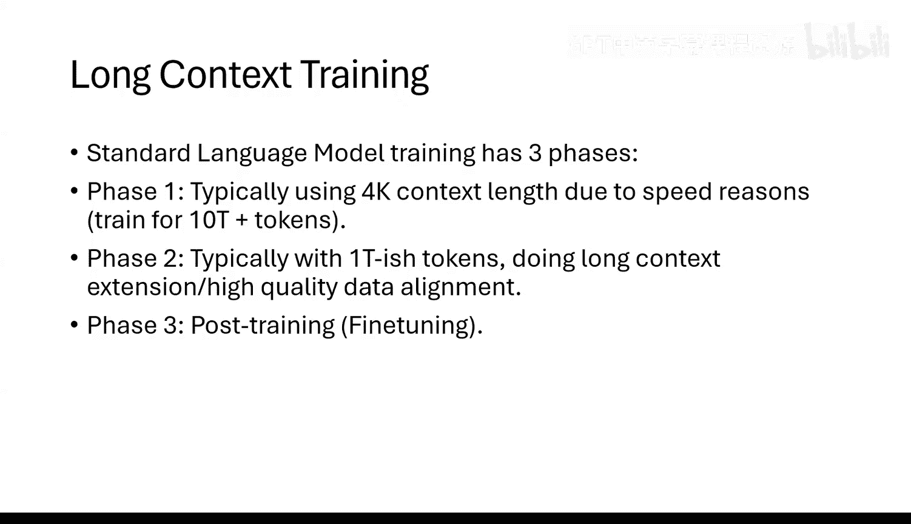
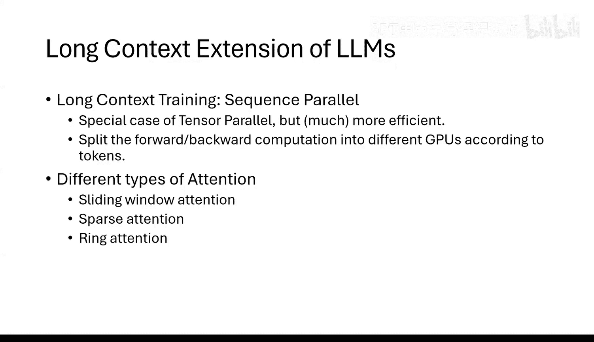
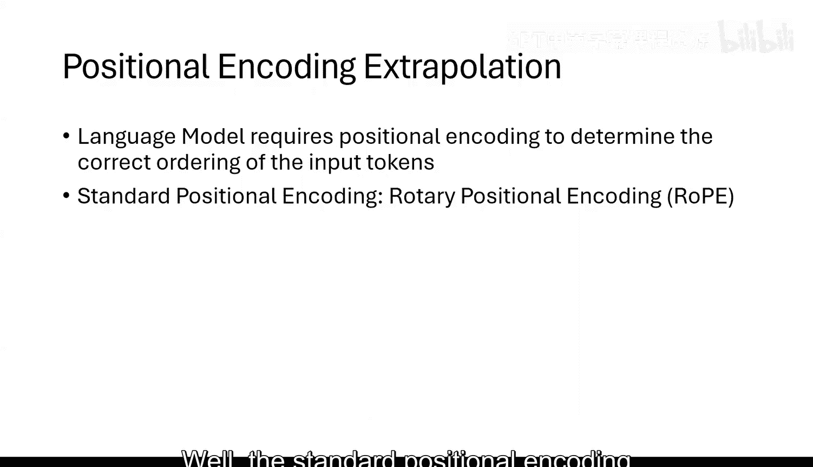
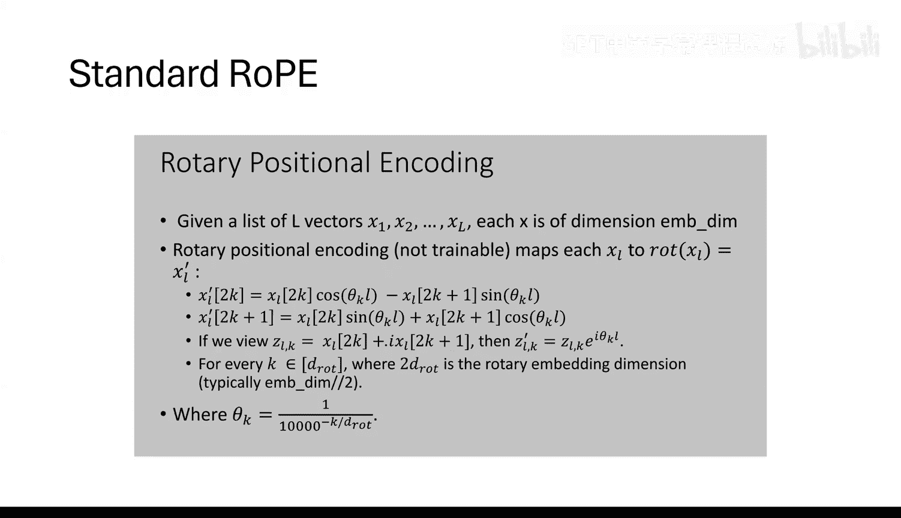
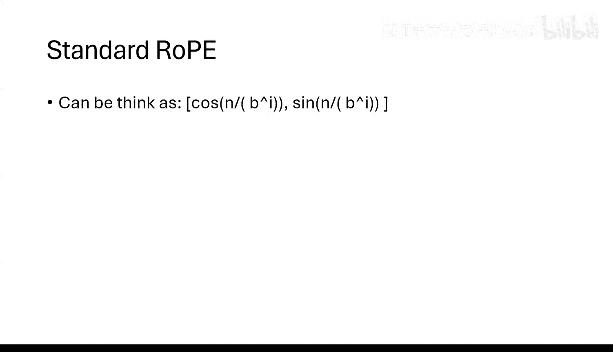
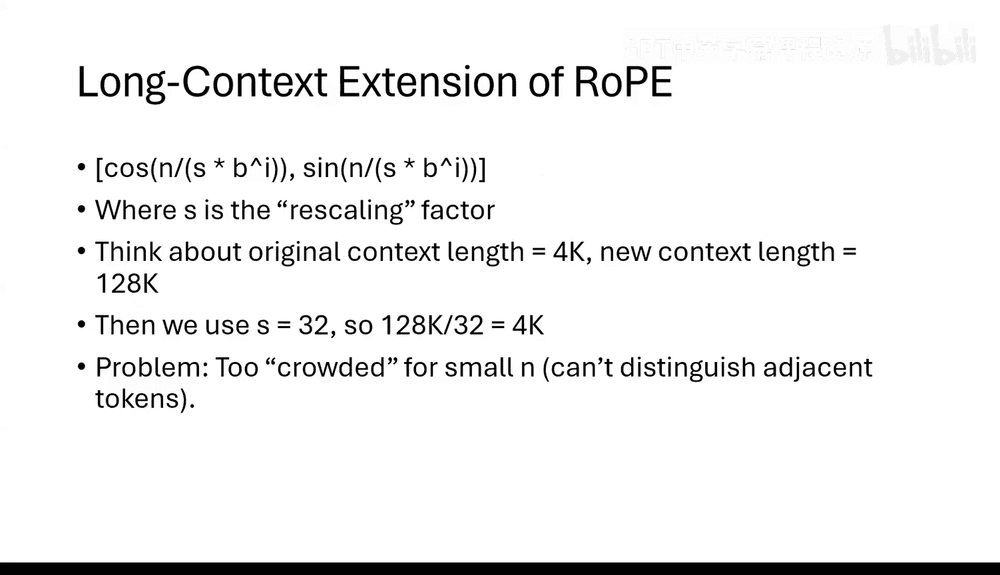
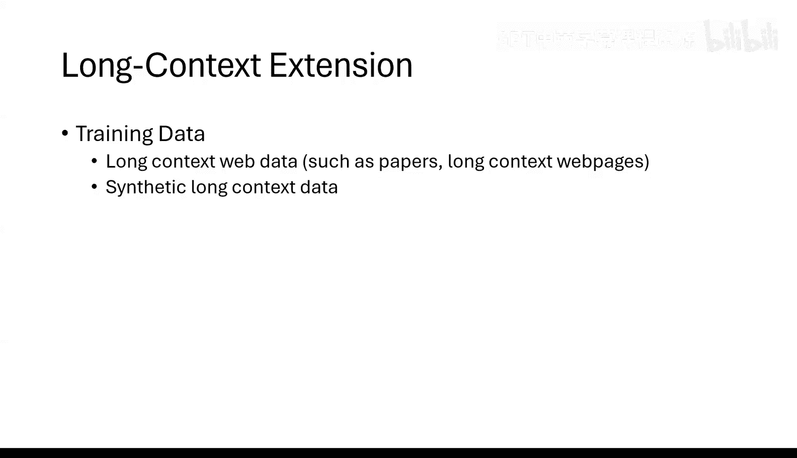

# 20：大语言模型的长上下文处理（第二部分）

在本节课中，我们将探讨大语言模型中长上下文处理的核心技术。我们将了解为何长上下文至关重要，以及如何通过序列并行化、改进的注意力机制和位置编码外推等技术来高效地训练和使用具有长上下文能力的模型。

---

## 为什么长上下文很重要？

上一节我们介绍了长上下文的基本概念。本节中，我们来看看长上下文为何成为现代大语言模型的核心能力。

目前，大语言模型最重要的应用之一是作为智能体，阅读和理解企业文档，例如公司政策或工具使用说明。模型需要能够从这些文档中提取信息并可靠地回答相关问题。

例如，如果你向一个支持100万令牌上下文的模型输入一本“书”，然后询问“要完成XX任务，我应该使用公司的哪个特定工具？”，模型需要能够从这海量信息中准确找到答案。这对于新员工快速熟悉公司架构和工具非常有价值，也是当前语言模型商业化的主要方向。

因此，长上下文能力是当前大语言模型产品的核心竞争力，仅仅支持4K上下文的模型已无法满足市场需求。

---

## 长上下文训练的挑战与策略

我们了解到长上下文很重要，但直接训练支持长上下文的模型并非易事。本节将探讨其中的挑战和主流训练策略。

回顾之前的内容，标准的语言模型训练通常分为三个阶段。在第一阶段（预训练），出于速度和效率考虑，上下文长度通常限制在4K。如果一开始就使用过长的上下文（如16K以上），模型在训练初期会感到“困惑”，因为它不知道在预测下一个词时应该关注前文中的哪个部分，导致损失难以下降。

较短的上下文强制模型专注于局部一致性，使训练更容易。因此，长上下文的扩展通常在第二阶段进行，此时模型已经理解了语言的基本规律。第二阶段通常是长短上下文混合训练，以保持模型在短上下文任务上的性能。第三阶段（后训练）则保持长上下文进行微调。

---

## 关键技术：序列并行化

要训练支持长上下文的模型，首先需要解决计算和内存的挑战。本节介绍一个关键的基础技术：序列并行化。

对于一个大模型（例如70亿参数），如果使用8K上下文，在不进行任何并行优化的情况下，一个微批次就可能占满一张H100 GPU（80GB）的内存。当上下文长度扩展到128K时，内存消耗可能增加16倍以上，单卡根本无法容纳。

序列并行化是一种高效的解决方案。其核心思想是沿着序列维度对训练样本进行切分。

假设我们有一个长度为128K的序列。我们可以将其切分成多个片段，例如：
*   GPU 0 处理第 1 到 8K 个令牌。
*   GPU 1 处理第 8K 到 16K 个令牌。
*   以此类推。

对于MLP层，每个令牌的计算是独立的，因此序列并行化不需要额外的通信。主要的通信开销发生在注意力层，因为每个令牌在计算注意力时可能需要关注其他GPU上的令牌。为了减少这种通信开销，需要结合使用改进的注意力机制，如滑动窗口注意力、稀疏注意力或环状注意力。

---

## 改进的注意力机制

序列并行化解决了内存问题，但注意力计算本身仍是瓶颈。本节我们看看几种能提升长上下文处理效率的注意力变体。

以下是几种常见的用于长上下文的注意力机制：

1.  **滑动窗口注意力**
    *   **公式/概念**：每个令牌 `i` 只关注其前面一个固定窗口大小 `W`（例如2047）内的令牌，即关注 `[i-W, i-1]` 范围内的令牌。
    *   **优点**：极大减少了计算和通信量，因为注意力范围是局部的。
    *   **缺点**：纯局部注意力可能难以捕捉长距离依赖，尽管信息可以通过多层网络间接传递。

2.  **稀疏注意力**
    *   **公式/概念**：在不同层使用不同的注意力模式。例如，第一层使用局部滑动窗口注意力；第二层则让令牌 `i` 关注 `i-100`, `i-200`, `i-300` 等间隔较远的令牌。
    *   **优点**：这种“跳跃式”连接非常适合信息检索任务。低层汇总局部窗口信息，高层则在这些汇总信息间进行搜索。
    *   **缺点**：实现更复杂，需要精心设计稀疏模式。

3.  **环状注意力**
    *   **概念**：一种更极致的优化，确保通信只发生在相邻GPU之间，类似于滑动窗口，但设计上可能更高效。

结合序列并行化和这些稀疏注意力机制，可以有效地训练和运行支持长上下文的模型。

---

## 位置编码的外推

解决了计算问题后，另一个关键挑战是位置编码。模型需要知道令牌的顺序。本节探讨如何将位置编码扩展到训练时未见过的超长上下文。

标准的旋转位置编码（RoPE）可以理解为：将词嵌入向量的每两个维度视为一个复数，然后根据令牌的位置 `pos` 和该维度对应的旋转速度 `θ_k` 进行旋转。
*   **公式**：对于位置 `pos` 上词嵌入向量的第 `k` 个二维分量 `(x_k, y_k)`，旋转后变为：
    `(x_k * cos(pos * θ_k) - y_k * sin(pos * θ_k), x_k * sin(pos * θ_k) + y_k * cos(pos * θ_k))`
*   **直观理解**：不同维度以不同速度旋转。快速旋转的维度擅长捕捉局部位置信息（周期短），慢速旋转的维度擅长区分全局位置（周期长）。

在预训练阶段，`θ_k` 的设置通常使最慢旋转维度的周期覆盖训练时的最大上下文长度（如4K或10K）。当我们需要将上下文长度扩展到远大于这个周期（如100K）时，直接使用原来的 `θ_k` 会导致周期外的位置无法被正确区分（因为 `cos` 和 `sin` 函数是周期性的）。

因此，需要进行位置编码外推。一种在实践中有效的策略是**非均匀缩放**：
*   **方法**：不直接缩放所有位置的旋转角度，而是定义一个临界位置 `N`。对于位置 `pos < N` 的令牌，使用原始的旋转速度（保持短上下文性能）。对于 `pos >= N` 的令牌，让旋转速度随着位置增加而逐渐变慢。
*   **公式（概念性）**：`θ_k’(pos) = θ_k * f(pos)`，其中 `f(pos)` 在 `pos < N` 时为1，在 `pos >= N` 时是一个缓慢衰减的函数。
*   **优点**：最大程度地保留了模型在短上下文上的性能，为长上下文微调提供了良好的起点。具体的 `f(pos)` 函数形式可以通过超参数搜索确定。

---

## 生成长上下文训练数据

拥有了训练长上下文模型的技术，我们还需要合适的数据。本节介绍如何构建用于训练和评估的长上下文数据。

高质量、包含长距离依赖的自然文本数据很难大量获取。因此，目前主流的方法是**合成数据生成**。

核心思路是“藏宝于海”：
1.  从一个短的文档-问答对 `(D, Q, A)` 开始，其中 `A` 的答案明确依赖于文档 `D`。
2.  用大量其他无关或相似的文档将目标文档 `D` 包围起来，形成一个超长的合成文档。
3.  将问题 `Q` 放在这个长文档的末尾，并要求模型给出答案 `A`。
4.  为了增加难度，甚至可以将目标文档 `D` 拆分成多个片段，分散插入到长文档的不同位置，要求模型进行信息聚合。

通过这种方式，可以大规模生成用于训练和评测模型长上下文理解与信息检索能力的数据集。

---

## 总结

本节课我们一起学习了实现大语言模型长上下文能力的核心技术。

我们首先了解了长上下文对于智能体应用的重要性。接着，探讨了分阶段训练的策略，即在模型掌握语言基础后再进行长上下文扩展。然后，我们深入研究了实现长上下文训练的关键技术：**序列并行化** 用于解决内存瓶颈，**滑动窗口/稀疏注意力** 用于降低计算和通信开销，以及**位置编码的外推**（特别是非均匀缩放策略）用于让模型理解超长序列中的位置信息。最后，我们介绍了通过合成数据生成来构建训练和评估数据集的方法。

掌握这些知识，有助于理解当前主流大语言模型如何突破上下文长度的限制，以及在这一前沿领域进行探索和创新的可能方向。