# 21：视频生成模型 🎬

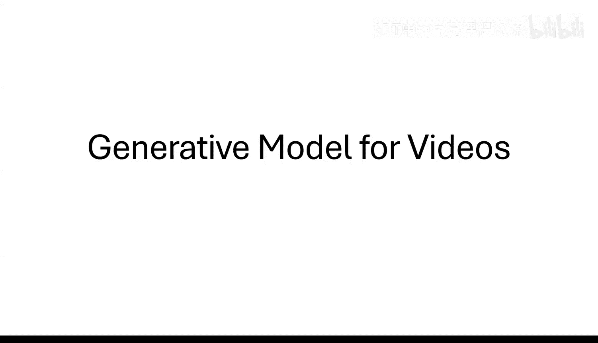

在本节课中，我们将学习如何将图像生成的扩散模型技术扩展到视频生成领域。我们将深入探讨其背后的数学原理，特别是扩散模型的理论基础，并了解OpenAI的Sora模型是如何应用这些原理的。

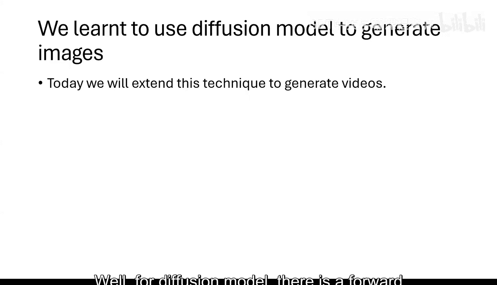

## 扩散模型的数学基础

上一节我们提到了扩散模型在视频生成中的应用。为了理解其工作原理，本节中我们来看看扩散模型背后的核心数学原理。

扩散模型包含一个前向过程和一个反向过程。前向过程将一个给定的分布转换为高斯分布，而反向过程则将高斯分布转换回原始分布。其数学基础是所谓的**Wasserstein梯度流**。

从数学角度看，概率分布可以视为一个度量空间中的点。这个空间的标准度量是**Wasserstein度量**。两个分布P和Q之间的Wasserstein距离（W₂）定义为：

```
W₂(P, Q) = inf_{(X, Y)} E[|X - Y|²]^(1/2)
```

其中，(X, Y) 是满足X服从P、Y服从Q的联合分布。这个度量衡量的是将分布P“移动”到分布Q所需的最小“工作量”。

扩散过程的前向过程，本质上就是沿着Wasserstein度量空间中的梯度流，将原始分布移动到高斯分布。这条路径是连接两个分布的最短路径。反向过程则是这条路径的逆过程。

在实践中，我们通过离散化（例如100个时间步）来近似这条连续的路径，类似于用梯度下降法近似梯度流。

## 前向过程与随机微分方程

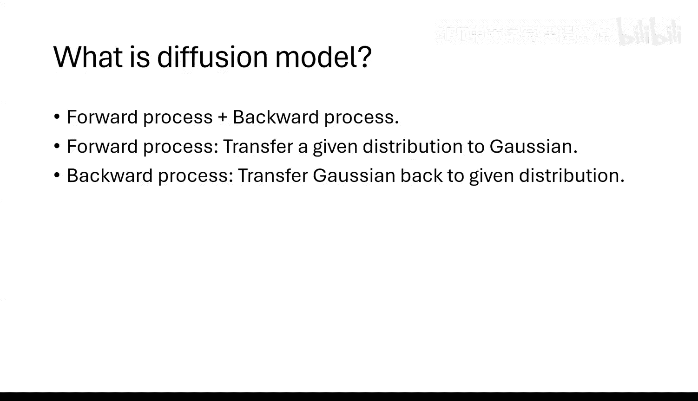

上一节我们介绍了Wasserstein梯度流的概念。本节中我们来看看如何用具体的方程来描述这个过程。

Wasserstein梯度流有一个简洁的数学表征，即一个**随机微分方程**。假设我们想从初始分布P₀移动到最终的高斯分布P_∞。在时间t，变量X_t的分布为P_t，并且X_t满足以下关系：

```
X_t = e^{-t} * X_0 + sqrt(1 - e^{-2t}) * Z
```

其中，X₀ 服从初始分布P₀，Z 服从标准高斯分布。这意味着，前向过程本质上就是不断向原始数据添加噪声。

这个X_t作为时间t的函数，满足以下随机微分方程：

```
dX_t = -X_t dt + sqrt(2) dB_t
```

这里，dB_t是布朗运动。方程中的 `-X_t dt` 项使X_t收缩，而 `sqrt(2) dB_t` 项则不断添加噪声。随着时间t增大，X_t的分布逐渐趋近于高斯分布。

## 反向过程与福克-普朗克方程

上一节我们描述了前向过程的随机微分方程。为了生成数据，我们需要一个反向过程。本节中我们来看看如何推导反向过程。

我们的目标是从高斯噪声（X_T）开始，通过一个反向过程恢复出原始数据（X₀）。我们定义一个新的变量Y_t = X_{T-t}。那么Y_0 = X_T（近似高斯分布），Y_T = X₀（目标分布）。

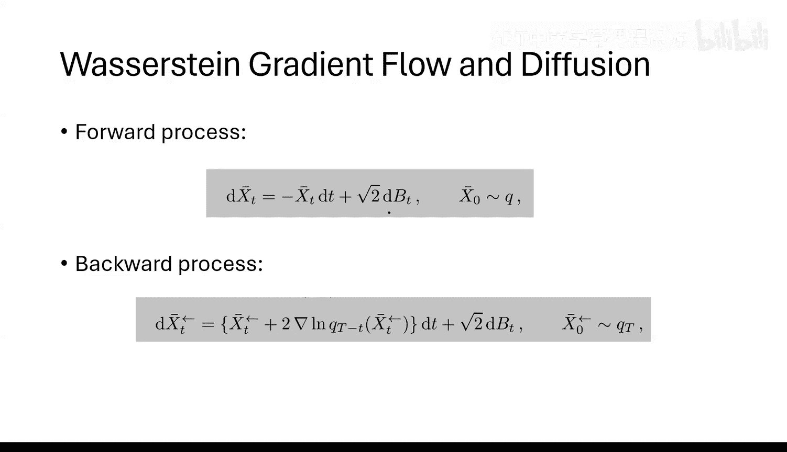

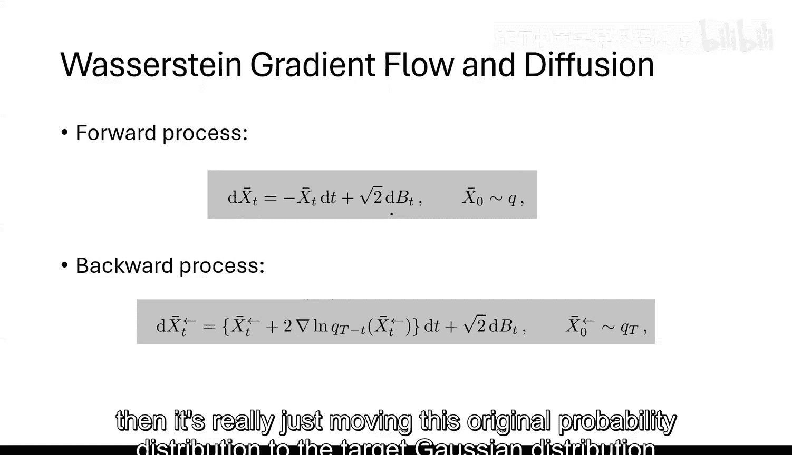

根据**福克-普朗克方程**，我们可以推导出Y_t满足的随机微分方程：

```
dY_t = [Y_t + 2 * ∇ log p_{T-t}(Y_t)] dt + sqrt(2) dB_t
```

其中，`p_{T-t}(·)` 是在时间 `T-t` 时变量的概率密度函数。与简单的前向过程相比，反向方程中多出了一项 `2 * ∇ log p_{T-t}(Y_t)`，即概率密度函数对数的梯度，这被称为**得分函数**。

因此，运行反向过程、从噪声生成数据的关键，就在于估计这个得分函数。

## 得分匹配与神经网络

上一节我们得出结论，反向过程的核心是估计得分函数。本节中我们来看看如何利用神经网络来实现这一点。

为了运行反向的随机微分方程，我们需要计算 `∇ log p_t(y)`。我们可以训练一个神经网络 `s(y, t)` 来近似这个得分函数。


一个重要的数学结论是：**训练神经网络去预测添加到数据中的噪声，在数学上等价于最小化得分匹配的目标函数**。也就是说，如果我们给一个带噪声的图像，让神经网络预测所添加的噪声，那么训练好的网络输出就是得分函数的一个近似。

因此，整个扩散模型的流程在数学上是严谨的：
1.  前向过程：通过添加噪声将数据分布变为高斯分布。
2.  训练：训练神经网络来预测给定噪声数据所对应的噪声。
3.  反向过程：从高斯噪声开始，使用训练好的神经网络来近似得分函数，运行反向SDE，逐步生成数据样本。

这个方法适用于任何分布，只要我们能最小化得分匹配目标。这就是为什么它可以被推广到图像、视频、音频等各种生成任务。

## 从图像到视频的扩展

上一节我们明确了扩散模型是分布无关的通用方法。本节中我们来看看如何将其直接应用于视频生成。

视频可以看作是一系列图像的序列。因此，视频的分布就是图像序列的联合分布。从原理上讲，我们可以简单地将视频数据（所有帧的像素）视为一个非常高维的随机变量X₀，然后直接应用扩散模型。

然而，这里存在一个挑战：扩散模型的收敛速度和样本复杂度与随机变量的维度D大致成正比。对于视频，维度D = (帧高) × (帧宽) × (通道数) × (帧数)。当帧数很多时，维度会非常高，导致需要更精确的得分估计和更多的训练数据。

所以，虽然理论上可以直接应用，但为了高效地生成长视频，我们需要一些技术来降低处理维度。

## 潜在扩散与维度缩减

上一节我们提到了视频生成中的维度挑战。本节中我们来看看一种常用的解决方案：潜在扩散模型。

为了降低数据维度，我们可以使用**自动编码器**。首先，用一个编码器E将高维数据x映射到一个低维的潜在空间z = E(x)，其中z的维度远小于x。同时，存在一个解码器D，可以（近似地）从z重建回x，即 D(E(x)) ≈ x。

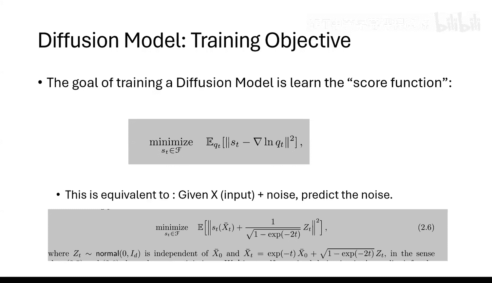

理想情况下，我们应该在低维的潜在空间z上运行扩散过程（即对z加噪和去噪）。这被称为潜在扩散。

但在一些实际实现（如早期的潜在扩散模型）中，噪声仍然被添加到原始数据x上，而不是潜在表示z上。从数学角度看，这导致过程不再是原始Wasserstein度量空间上的梯度流，而是在编码器诱导出的新度量空间上的梯度流。

这个差异意味着，在反向过程中，除了要估计得分函数，理论上还需要考虑一个由诱导度量带来的额外项（与局部曲率相关）。为了获得更高质量的生成结果，需要在训练目标中加入对这个项的近似。

## Sora的架构：扩散Transformer

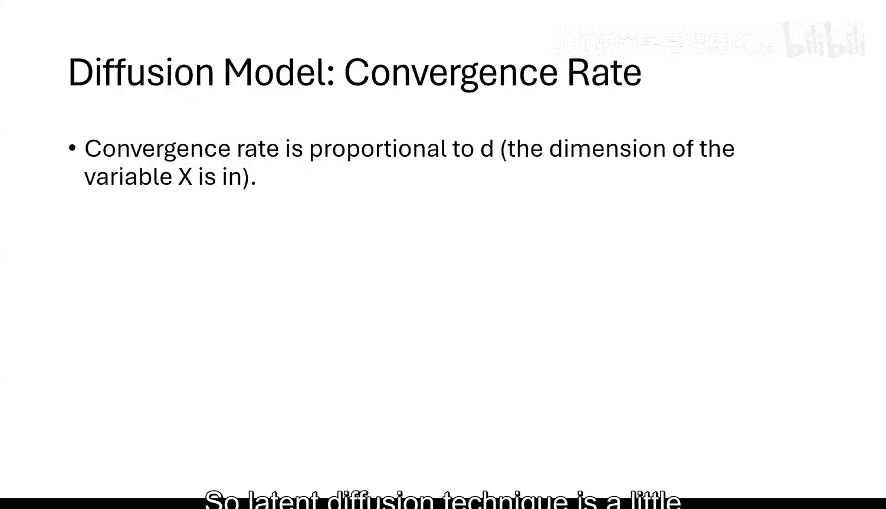

上一节我们讨论了潜在扩散的思想。本节中我们来看看OpenAI Sora模型采用的具体架构：扩散Transformer。

Sora的核心是一个基于Transformer架构的扩散模型，称为**扩散Transformer**。其工作流程如下：

1.  **编码**：使用预训练的编码器将视频帧（或图像块）映射到低维潜在空间。
2.  **标记化**：将潜在表示展平为一序列的标记，作为Transformer的输入。
3.  **Transformer处理**：序列标记通过多个Transformer块。每个块包含多头注意力层和前馈网络。
4.  **条件注入**：在Transformer块中，通过交叉注意力等方式融入文本描述条件，指导视频生成。
5.  **预测**：Transformer的输出被重新整形，用于预测噪声（得分函数）。
6.  **解码**：去噪后的潜在表示通过解码器恢复为像素空间的视频。

以下是架构的简化表示：

```
[视频帧] -> [编码器] -> [潜在表示] -> [展平/标记化] -> [Transformer块 + 文本条件] -> [预测噪声] -> [去噪] -> [解码器] -> [生成视频]
```

## 关键技术：三维位置编码

上一节介绍了扩散Transformer的整体架构。本节中我们来看一个支持可变长度视频生成的关键技术：三维位置编码。

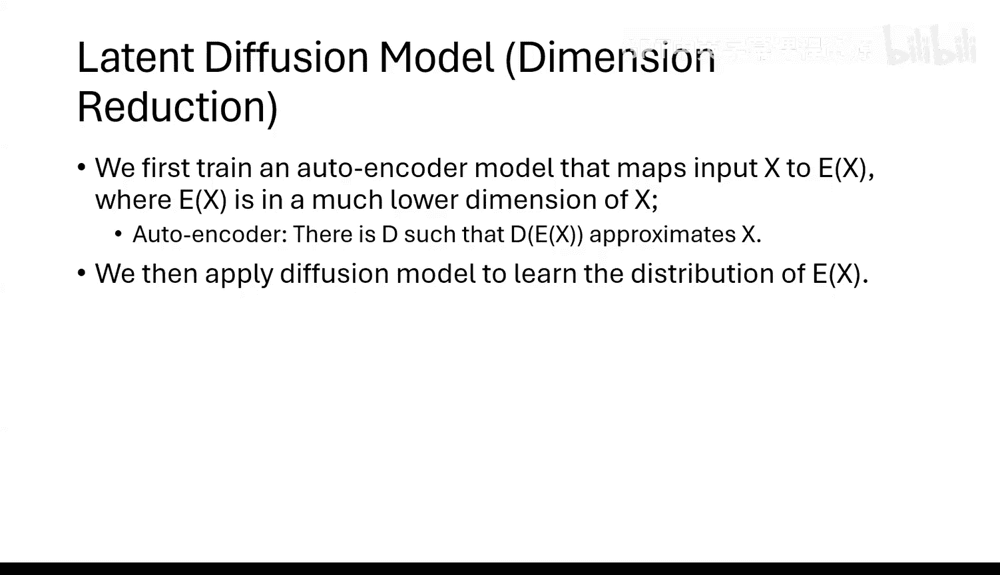

视频数据具有三维结构：宽度（X）、高度（Y）和时间（T）。为了将视频块输入Transformer，我们需要告诉模型每个块在三维空间中的位置。

Sora采用了类似Google **NaViT** 模型的思想，使用分解式的**三维位置编码**。对于一个位于坐标 (x, y, t) 的视频块，其位置编码是三个独立的一维位置编码之和：

```
位置编码(x, y, t) = PE_x(x) + PE_y(y) + PE_t(t)
```

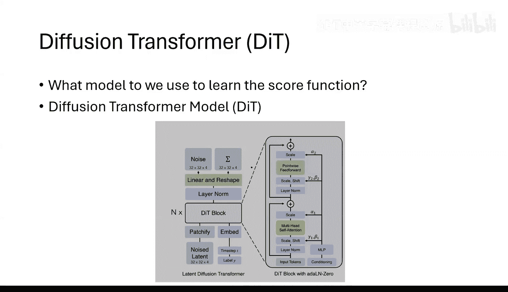

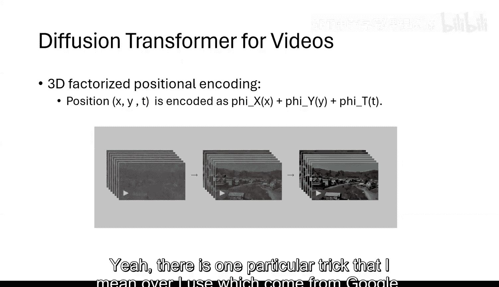

这种方法的优势在于：
*   **支持原生分辨率**：视频可以保持原有的宽高比和帧率，无需强制缩放到统一尺寸。
*   **支持可变长度**：可以处理不同时长和不同尺寸的视频。
*   **灵活性高**：为模型提供了明确的空间和时间结构信息。

## 总结与展望

本节课中我们一起学习了视频生成扩散模型的原理与实现。

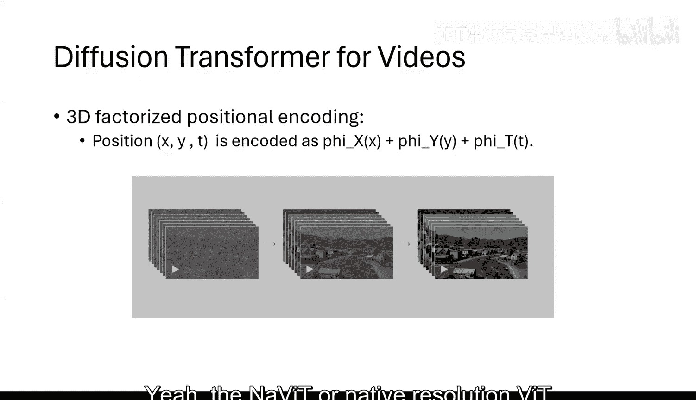

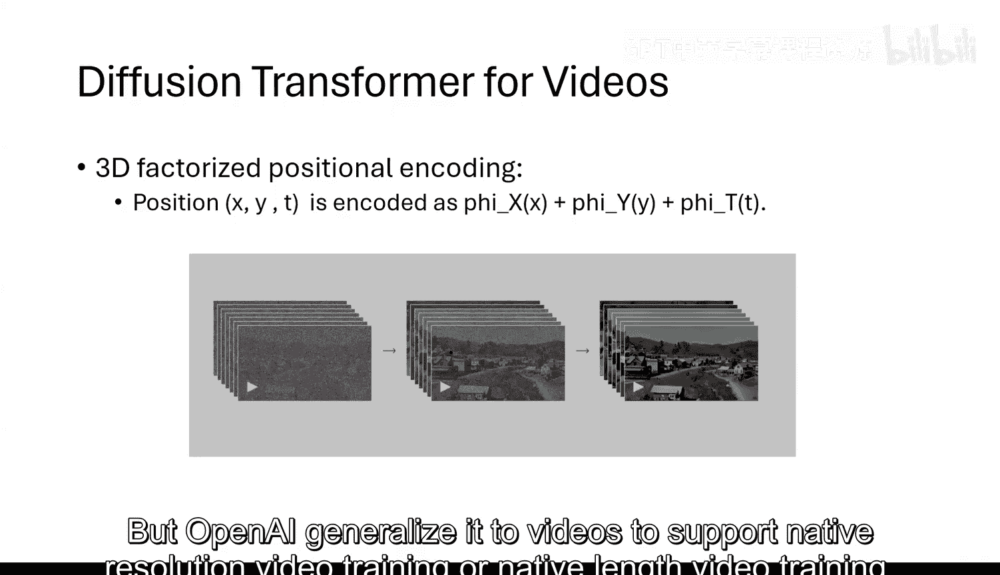

我们从扩散模型的数学基础出发，理解了其核心是Wasserstein梯度流，并通过随机微分方程和福克-普朗克方程描述了前向和反向过程。生成的关键在于使用神经网络进行得分匹配。

我们看到，该理论具有普适性，可直接应用于视频分布。为了应对高维挑战，采用了潜在扩散技术来降低维度。OpenAI的Sora模型基于扩散Transformer架构，并利用三维位置编码来处理可变长度的视频数据。

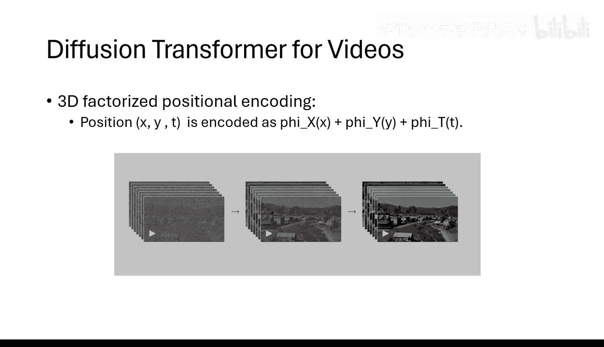

当前，这类模型的主要限制在于巨大的计算成本，无论是训练还是推理。然而，由于其坚实的数学基础，性能主要遵循扩展定律：更多的数据和更大的模型将直接带来更好的结果。这为未来的发展提供了清晰的方向。