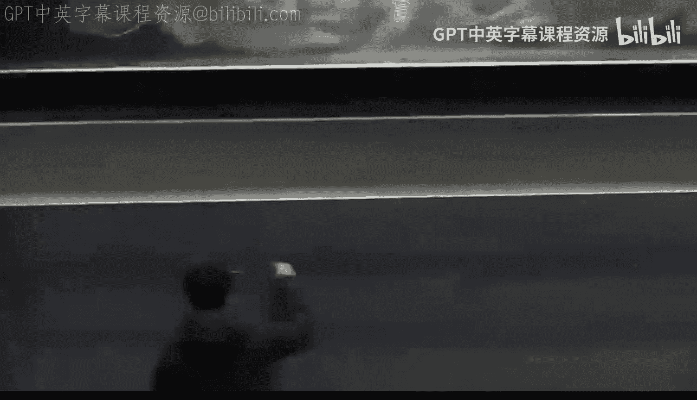
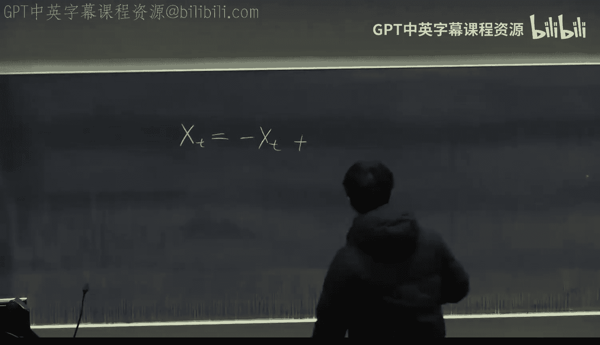
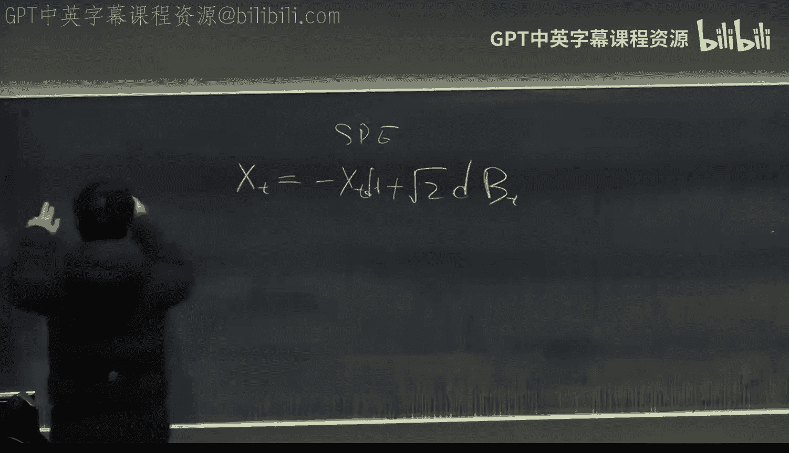
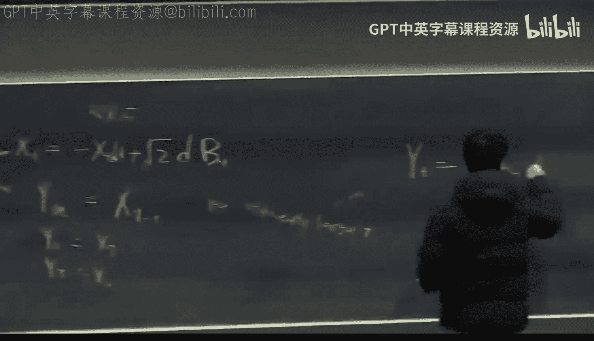
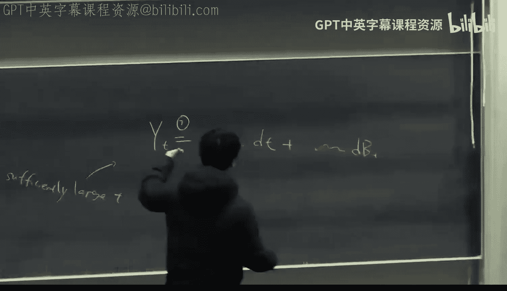
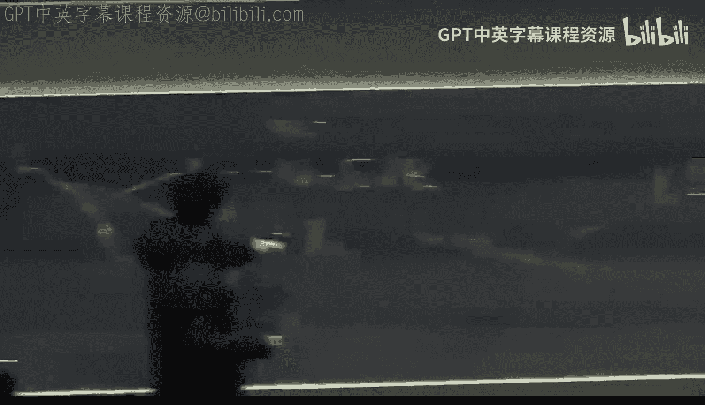

# 21：视频生成模型 🎬

在本节课中，我们将学习如何将图像生成中的扩散模型技术扩展到视频生成领域。我们将深入探讨其背后的数学原理，特别是瓦瑟斯坦梯度流，并了解OpenAI的Sora模型所采用的核心架构。

## 数学基础：扩散模型与瓦瑟斯坦梯度流 🔢

上一节我们介绍了扩散模型的基本概念，本节中我们来看看其背后的数学原理。扩散模型的核心在于其前向过程和反向过程。

从数学角度看，扩散过程实际上是在一个特殊的度量空间——瓦瑟斯坦空间中，沿着梯度流路径移动概率分布。我们可以将一个概率分布视为这个度量空间中的一个点。

**瓦瑟斯坦距离** 的公式定义如下：
\[
W_2(P, Q) = \inf_{\gamma \in \Gamma(P, Q)} \sqrt{\mathbb{E}_{(x, y) \sim \gamma} [\|x - y\|^2]}
\]
其中，\(\Gamma(P, Q)\) 是所有边缘分布分别为 \(P\) 和 \(Q\) 的联合分布 \(\gamma\) 的集合。

扩散模型的前向过程，就是将原始数据分布 \(P_0\) 沿着该空间中的最短路径（即梯度流）转化为高斯分布 \(P_\infty\)。反向过程则是这条路径的逆过程。

## 前向过程：随机微分方程视角 📈

理解了梯度流的视角后，我们来看看如何用具体的方程来描述这个过程。前向过程可以通过一个随机微分方程来刻画。

假设 \(X_t\) 是一个遵循分布 \(P_t\) 的随机变量。那么，存在一个随机过程满足以下随机微分方程：
\[
dX_t = -X_t dt + \sqrt{2} dB_t
\]
其中 \(B_t\) 是标准布朗运动。这个方程描述了如何通过“收缩”信号并添加噪声，将分布逐渐推向高斯分布。

从采样角度看，在时间 \(t\)，变量 \(X_t\) 的分布等同于以下过程的结果：
\[
X_t \stackrel{d}{=} e^{-t} X_0 + \sqrt{1 - e^{-2t}} Z
\]
其中 \(X_0 \sim P_0\)， \(Z \sim \mathcal{N}(0, I)\)。这正是我们在扩散模型前向过程中看到的“不断加噪”操作。

## 反向过程与福克-普朗克方程 🔄

为了从噪声中生成数据，我们需要运行反向过程。这涉及到随机微分方程的反转，而福克-普朗克方程为此提供了数学工具。

定义一个新的过程 \(Y_t = X_{T-t}\)，其中 \(T\) 是一个足够大的时间。那么 \(Y_t\) 从近似高斯分布（\(Y_0 \approx X_T\)）出发，最终应能恢复原始分布（\(Y_T = X_0\)）。

利用福克-普朗克方程，可以推导出 \(Y_t\) 满足的反向随机微分方程为：
\[
dY_t = [Y_t + 2 \nabla_{y} \log p_t(Y_t)] dt + \sqrt{2} dB_t
\]
其中 \(p_t(\cdot)\) 是 \(X_t\) 的概率密度函数。与正向方程相比，反向方程多出了一项 \(\nabla \log p_t(y)\)，即概率密度对数（得分函数）的梯度。

## 得分匹配与神经网络训练 🧠

反向过程的核心在于估计得分函数 \(\nabla \log p_t(x)\)。在实践中，我们训练一个神经网络来近似这个函数。

训练目标是最小化得分匹配损失。一个关键结论是，对于上述特定的前向过程，训练神经网络根据含噪输入预测所添加的噪声，在数学上等价于学习得分函数。因此，扩散模型的训练可以归结为一个去噪任务。

这个过程是数学上严格的，没有近似。只要我们能完美地学习到得分函数，运行反向SDE就能精确地采样出目标数据分布。这解释了扩散模型为何是一种通用的生成方法，可应用于图像、视频、音频等任何数据分布。

## 扩展到视频生成 🎥

现在，我们将上述原理应用到视频生成。视频本质上是一个图像序列的概率分布。

我们可以将一段视频视为一个高维随机变量 \(X \in \mathbb{R}^{H \times W \times C \times T}\)，其中 \(T\) 是帧数。扩散模型的理论保证，只要我们能学习该视频分布的得分函数，就能生成视频。

然而，维度 \(D = H \times W \times C \times T\) 可能非常大。扩散模型的收敛速度和样本复杂度通常与维度 \(D\) 成正比，这意味着生成长视频需要极高的计算成本和数据量。

## 潜在扩散与维度约减 🗜️

为了应对高维度的挑战，常用的技术是潜在扩散。其核心思想是先用一个编码器将高维数据（如图像/视频帧）压缩到一个低维潜在空间，然后在潜在空间中进行扩散过程。

设编码器为 \(E\)，解码器为 \(D\)，满足 \(D(E(x)) \approx x\)。理想情况下，我们应在潜在变量 \(z = E(x)\) 上运行扩散过程。但许多实际实现（如Stable Diffusion的早期版本）仍然在原始像素空间加噪，这相当于在由编码器诱导的度量空间中进行梯度流，而非标准的瓦瑟斯坦梯度流。

这引入了额外的几何项（与诱导度量相关）。为了获得高质量的生成结果，在训练目标中需要考虑这个项，例如除了预测噪声外，还可能预测一个与局部协方差相关的项 \(\Sigma\)。最新的潜在扩散模型已开始纳入这些修正。

## Sora的架构：扩散Transformer (DiT) 🏗️

OpenAI的Sora模型基于扩散Transformer架构。其核心思想是将扩散模型中的U-Net主干替换为Transformer。

以下是该架构的关键步骤：
1.  **输入处理**：视频经过编码器被映射到潜在空间。潜在表示被展平为一序列的令牌（tokens），作为Transformer的输入。
2.  **位置编码**：Sora采用了类似Google“原生分辨率ViT”的技术，使用3D位置编码。一个令牌的位置编码是其空间坐标 \((x, y)\) 和时间坐标 \(t\) 的位置编码之和：\(PE = PE_x(x) + PE_y(y) + PE_t(t)\)。这支持可变分辨率、可变长度的视频输入，无需将视频裁剪成固定尺寸。
3.  **Transformer块**：序列令牌通过一系列Transformer块。这些块集成了多头自注意力机制和前馈网络。
4.  **条件注入**：生成的条件信息（如文本描述）被注入到每个Transformer块中，通常通过交叉注意力或直接添加到隐藏状态来实现。
5.  **输出与训练**：Transformer的输出被重新变换回潜在空间的形状，用于预测噪声（得分函数）以及可能的方差项 \(\Sigma\)。训练目标是最小化去噪得分匹配损失。

## 总结 📝

本节课我们一起学习了视频生成扩散模型的数学基础与核心架构。

我们首先回顾了扩散模型的本质，即瓦瑟斯坦空间中的梯度流，并通过随机微分方程和福克-普朗克方程理解了其严格的反向过程。我们认识到，训练神经网络进行去噪等价于学习得分函数，这使得扩散模型成为适用于任何数据分布的通用生成框架。

接着，我们将该框架应用于视频生成，指出了高维度带来的挑战，并介绍了潜在扩散技术作为解决方案。最后，我们剖析了OpenAI Sora模型所使用的扩散Transformer架构，其关键创新在于使用了支持可变长视频的3D位置编码，并将Transformer的强大表达能力与扩散模型的严格生成理论相结合。

视频生成的突破主要得益于扩散模型的数学保证和计算规模的扩大，而非魔法般的算法创新。随着模型规模和数据量的持续增长，遵循缩放定律，我们有望看到更加强大和通用的生成模型。