# 23：遗留主题 - 流水线并行与μP初始化


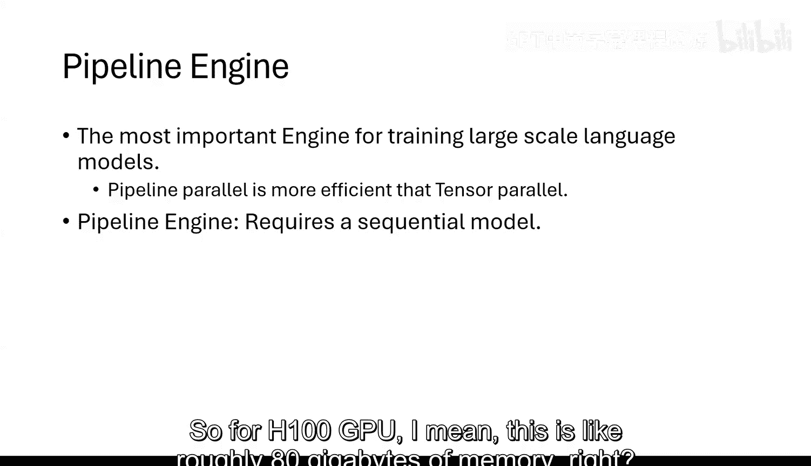

在本节课中，我们将学习两个之前课程中未深入讨论的重要遗留主题：用于分布式优化的流水线引擎，以及一种用于初始化Transformer网络的新方法——μP。这些技术是当前训练超大规模模型（如万亿参数模型）的关键。

## 流水线并行引擎

上一节我们介绍了专家并行，它主要解决了MLP层的内存问题。本节中我们来看看另一种关键的并行化技术——流水线并行，它能够处理模型深度（层数）的扩展问题。


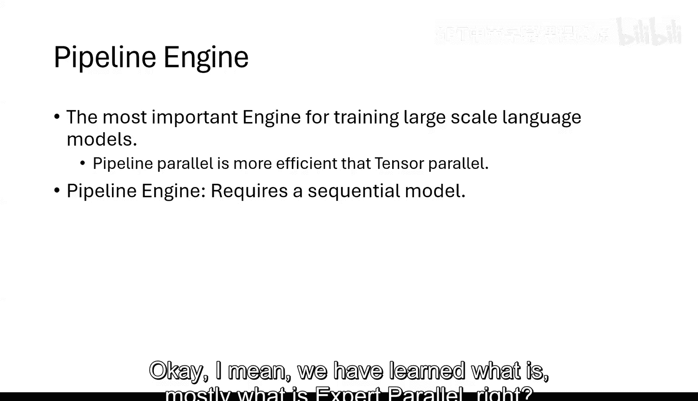


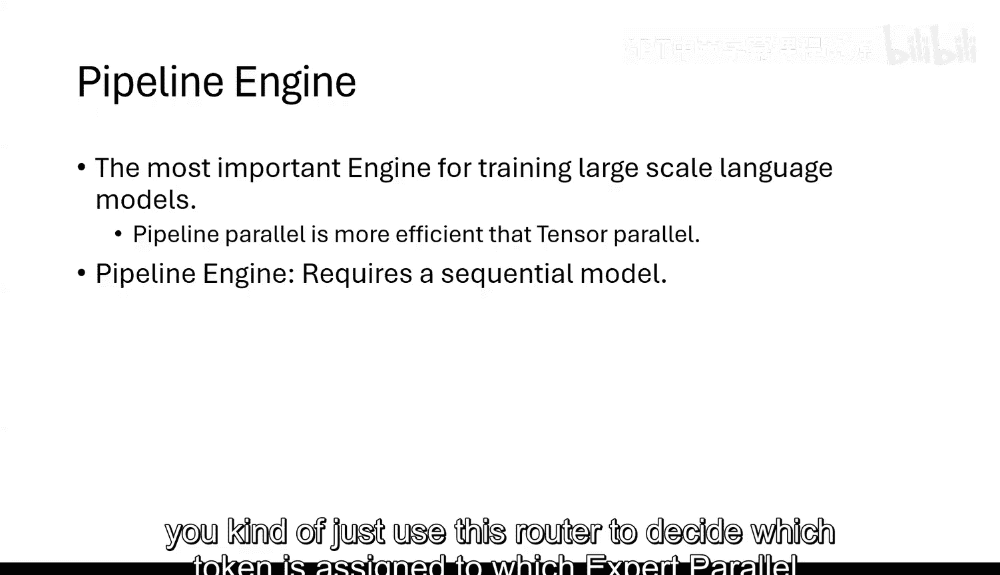

### 什么是流水线并行？

流水线并行的核心思想非常简单：将神经网络按层切分，并将不同的层放置在不同的GPU上。对于一个由多个Transformer块顺序堆叠的网络，最自然的并行方式就是将每一层放在一个独立的GPU节点上。

例如，如果你的网络定义为一个`nn.Sequential`模块：
```python
net = nn.Sequential(layer1, layer2, layer3, ..., layerL)
```
那么流水线引擎在精神上会自动将`layer1`放在GPU1，`layer2`放在GPU2，依此类推。这种方法理论上可以扩展到无限深度，只要你有足够多的GPU。

### 朴素实现的挑战

然而，这种按层切分的方式带来了一个核心问题：计算是顺序的，而非并行的。GPU1必须先完成第1层的计算，才能将结果传给GPU2进行第2层的计算。这导致了大量的GPU空闲时间，计算效率极低。如果有100层，计算时间可能比单GPU单层模型慢100倍。

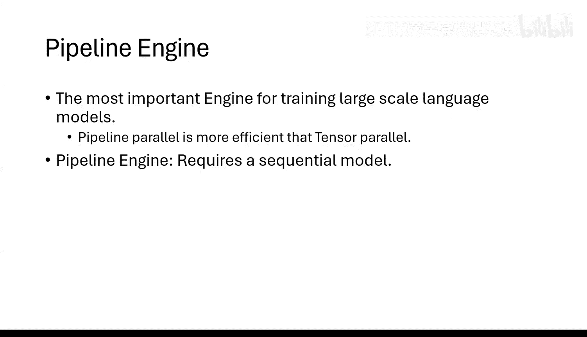


### 高效的流水线引擎

如何解决GPU空闲问题，让流水线引擎更高效？核心思路是利用空闲时间。

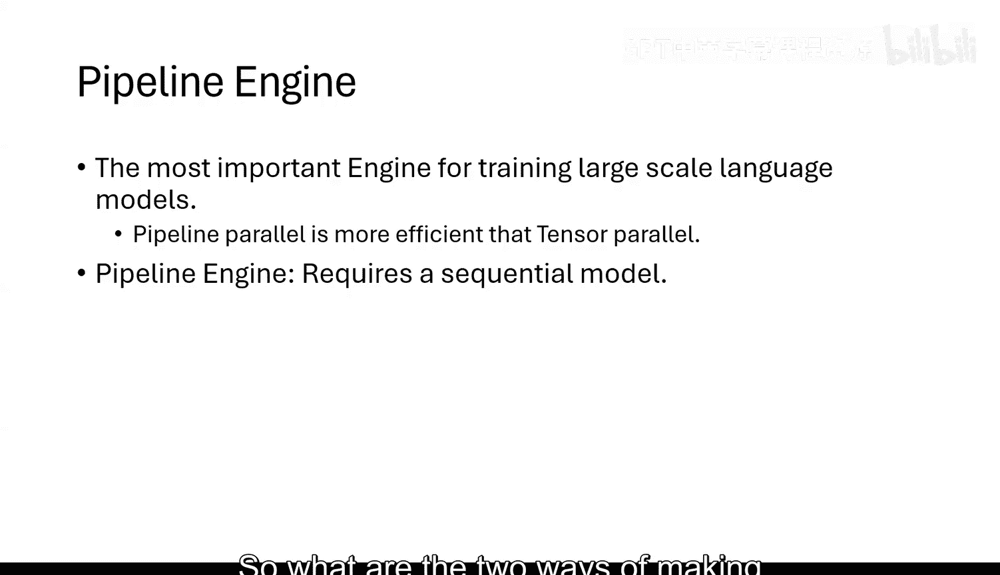

观察计算图，当一个GPU完成当前数据（例如`x1`）在当前层的计算后，在等待下一层GPU接收并开始计算时，它处于空闲状态。高效的流水线引擎会利用这个空闲时间，开始处理下一个数据（例如`x2`）在当前层的计算。


以下是实现高效流水线的关键机制：

1.  **状态卸载与加载**：在完成`x1`的前向计算后，GPU立即将其激活状态（用于后续反向传播）卸载（offload）到CPU内存。由于卸载到CPU是非阻塞操作，GPU可以立刻开始计算`x2`的前向传播。
2.  **调度与重叠**：通过精心调度，让不同数据样本（`x1`， `x2`， `x3`...）在不同层上的计算相互重叠，形成一种“流水线”效果，从而填满GPU的空闲时间。
3.  **周期性同步**：在实践中，为了鲁棒性和内存管理，流水线引擎通常会设置一个“微批次”（micro-batch）边界。在完成一定数量的重叠计算后，会进行一次同步，清空中间状态，然后开始新的计算周期。这比完全无休止的重叠更稳定，也更容易处理故障恢复。

### 流水线并行的优势与局限

流水线并行非常适合Transformer这类结构，因为每一层的计算量和张量形状大致相同，易于负载均衡。它与专家并行、数据并行结合，构成了训练超大模型的“3D并行”范式。

*   **流水线并行**：跨层切分，解决模型深度问题。
*   **数据并行**：跨数据批次切分，增加吞吐量。
*   **模型并行（如专家并行）**：跨层内组件切分，解决层宽度问题。

对于注意力层，如果单层仍然无法放入内存，还可以使用序列并行等技术。

**重要提示**：流水线并行的实现（如Hugging Face的Pipeline Optimizer）对用户几乎是透明的。你只需要将模型定义为顺序模块，优化器会自动处理层间通信和调度，无需像张量并行那样手动指定复杂的张量切分。


---


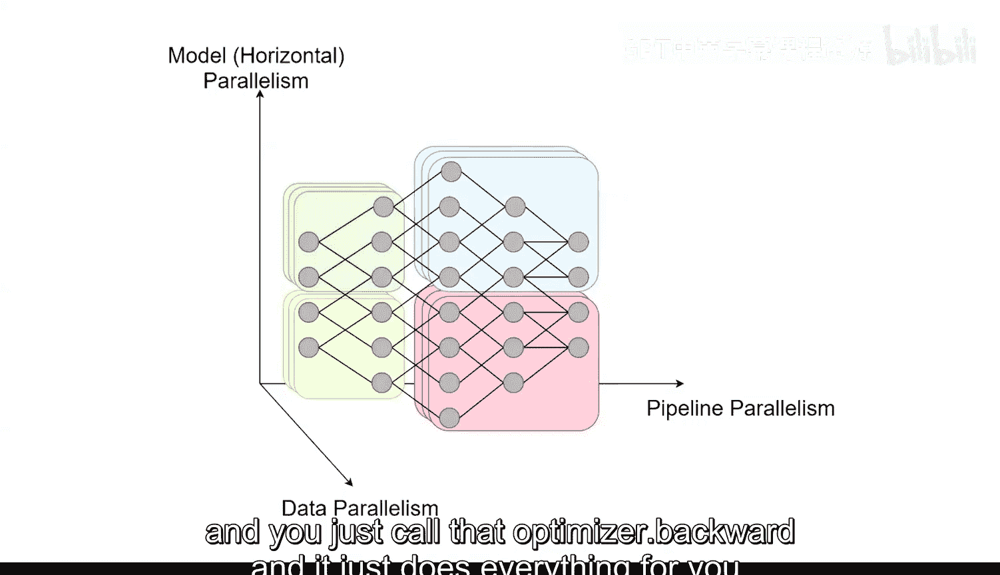

## μP 初始化

接下来，我们探讨另一个主题：μP（Maximal Update Parametrization）。这是一种有争议但被OpenAI成功用于训练MOE模型的技术。它主要调整了Transformer网络的初始化和学习率调度策略。


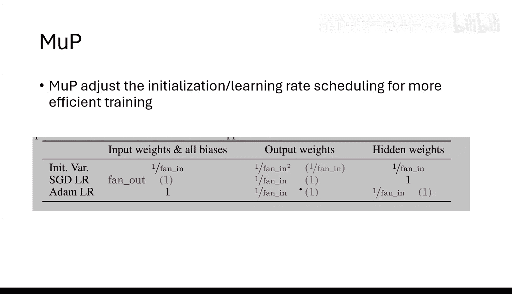

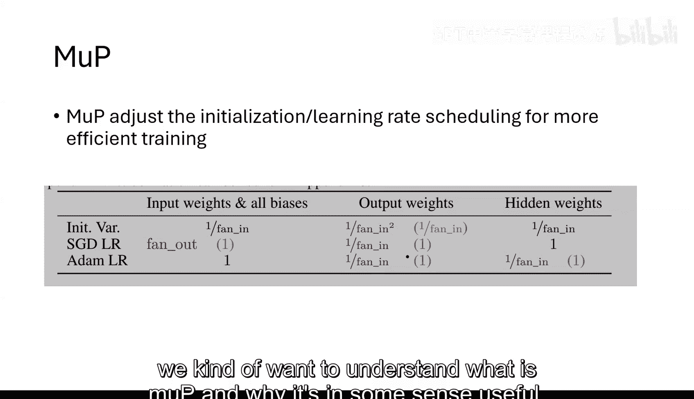

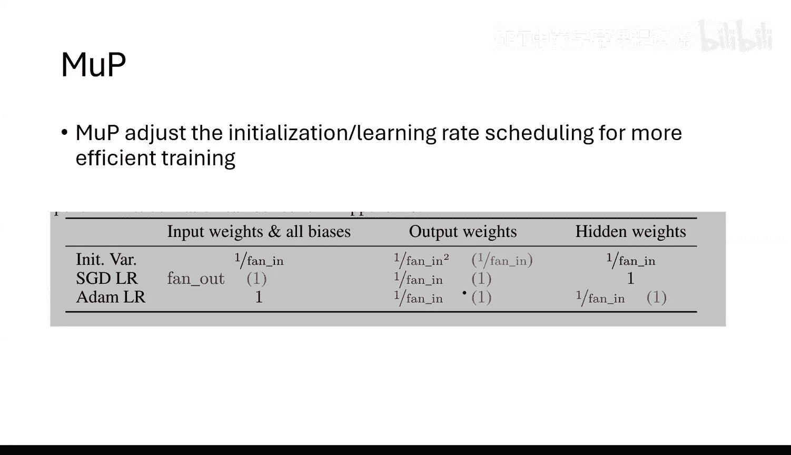

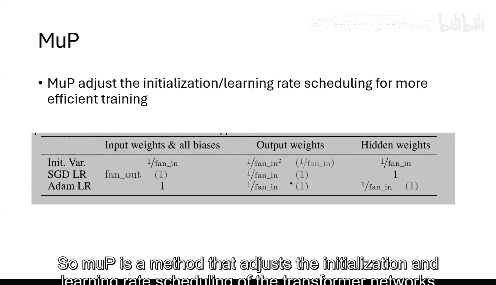

### 为什么需要μP？


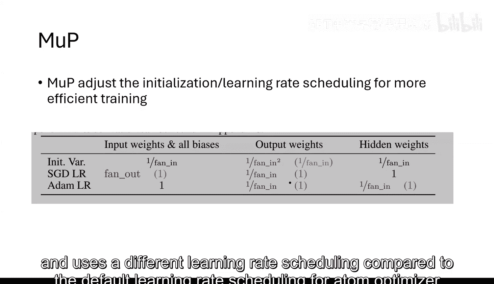

要理解μP，我们先思考一个根本问题：当模型尺寸（例如宽度`N`）趋向无穷大时，我们常用的优化器（如Adam）和固定学习率还能稳定工作吗？

考虑一个简单的单层线性网络：`y = Wx + b`。假设使用标准初始化：`W`和`b`的元素服从`N(0, 1/N)`。
*   **初始化输出**：在`N`很大时，输出`y`的尺度是`O(1)`，这是合理的。
*   **一次更新后**：Adam等优化器的参数更新量级通常是`O(1)`（经过梯度归一化）。对于偏置`b`，更新`Δb`是`O(1)`。那么更新后的输出包含一项`Δb * x`。由于`Δb`与梯度相关，而梯度又与权重`W`相关，这项的期望尺度可能是`O(√N)`。这意味着仅一次更新，网络输出就可能爆炸（或变得极大），导致训练不稳定。

如果为了避免爆炸而将学习率设为`O(1/√N)`，那么更新权重所需的**有效步数**将变为`O(√N)`。当`N`很大时，这意味着需要极多的步骤才能有意义地更新网络，训练效率极低。

### μP的设计目标

μP旨在寻找一个参数化（初始化+学习率缩放）方案，使得在模型宽度`N → ∞`的极限下，满足两个核心条件：
1.  **网络可快速更新**：每个参数都能在常数步数内被有效更新。
2.  **更新过程稳定**：单次参数更新不会导致网络输出发生剧烈（`O(√N)`）变化。

这需要在“更新幅度不能太小”（目标1）和“更新幅度不能太大”（目标2）之间找到一个精妙的平衡点。

### μP的解决方案


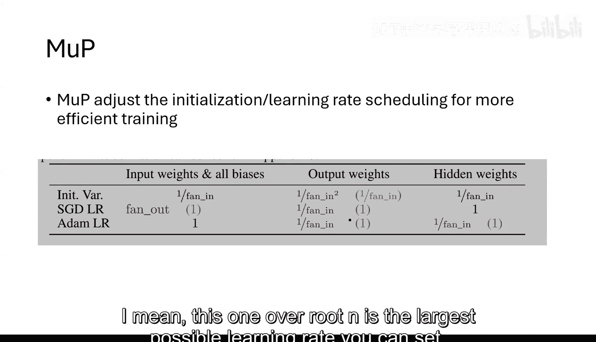

μP通过层间差异化的初始化方差和学习率缩放来实现这一目标。其推导基于理论分析，确保在前向传播和反向传播过程中，各层激活值和梯度的尺度保持一致且可控。

一个简化的示意是，对于深度为`L`的Transformer，μP可能会规定：
*   **输入嵌入层**：保持标准初始化（如`N(0, 1)`）和常数学习率。
*   **中间层**：初始化方差需要按`1/N`或`1/(N√L)`等因子缩放。
*   **输出层**：初始化方差需要按`1/N^2`等因子缩放，并且其学习率可能需要按`1/N`缩放。

这些缩放因子确保了即使在超宽网络中，前向信号、反向梯度以及参数更新量的尺度都是`O(1)`，从而满足上述两个设计目标。

### μP的意义与争议

μP提供了一种**原则性的**方法来初始化和大规模训练Transformer，尤其是宽度极大的模型或MOE模型。OpenAI的成功经验表明，这种精细的缩放对训练稳定性至关重要。

然而，μP在学术界和工业界其他团队中并未被广泛验证为“唯一有效”的方法。一些替代方案，例如使用极大的权重衰减（`weight decay`）配合层归一化（LayerNorm），也能起到类似的稳定作用。但μP的价值在于它从一个理论极限（`N → ∞`）出发，给出了一个系统性的超参数设置框架。

---

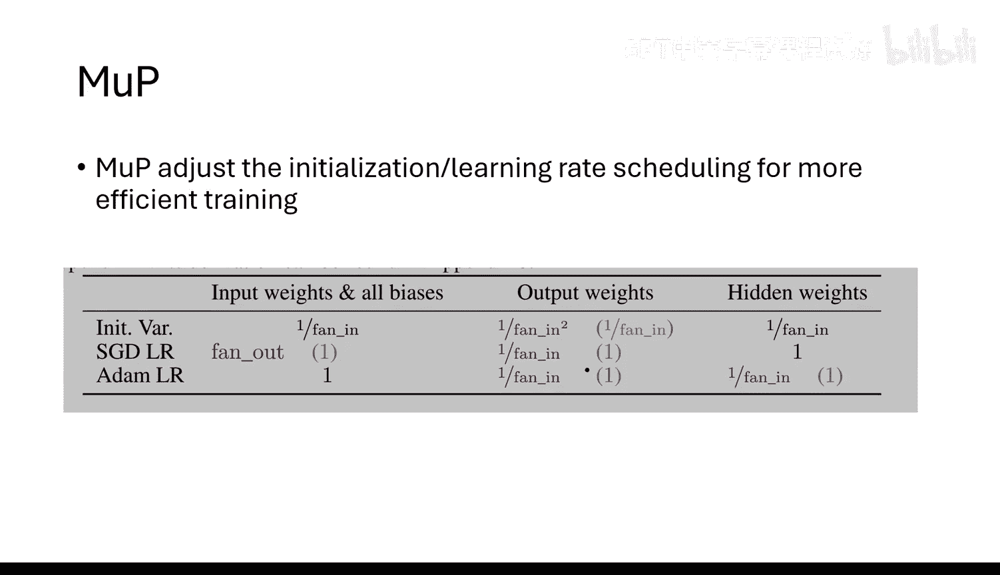

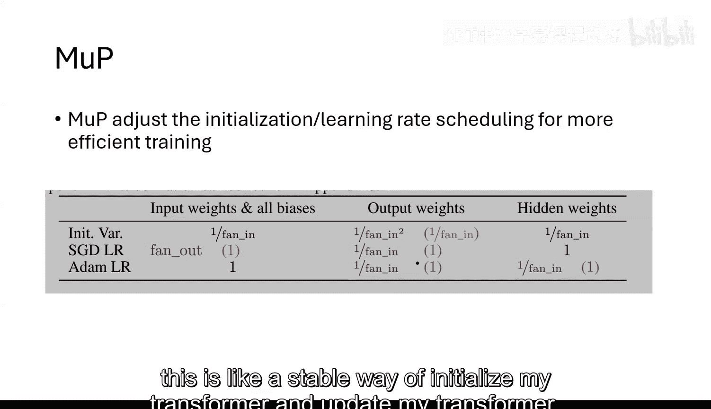

## 总结

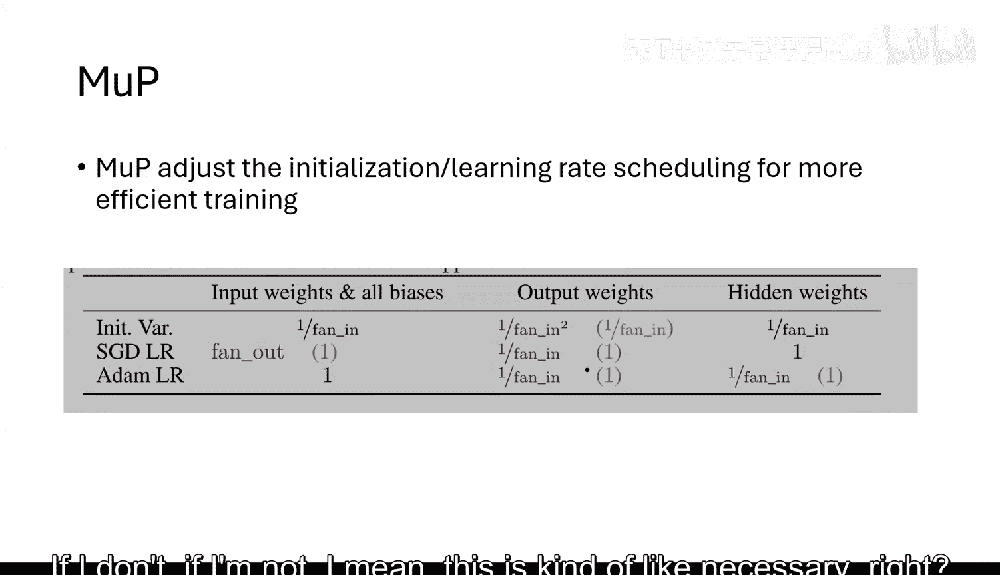

本节课中我们一起学习了两个支撑当今超大规模生成式AI模型训练的关键技术：

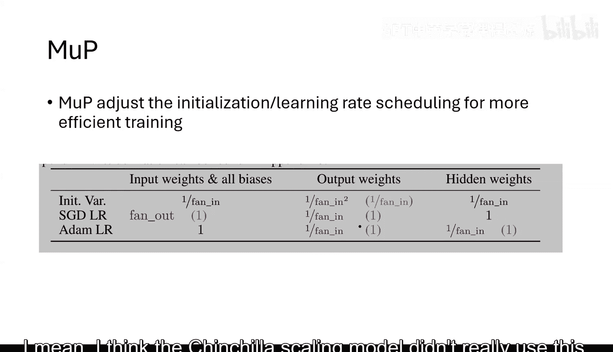

1.  **流水线并行引擎**：通过将模型按层切分到不同GPU，并利用巧妙的调度重叠不同数据样本的计算，极大地提高了深度模型的训练效率，是实现模型深度扩展的核心手段。
2.  **μP初始化**：通过理论推导出一套针对超宽网络的初始化与学习率缩放方案，旨在保证模型在宽度趋向无穷时，仍能保持快速且稳定的训练动态。这是OpenAI成功训练MOE等巨型模型的重要“秘方”之一。


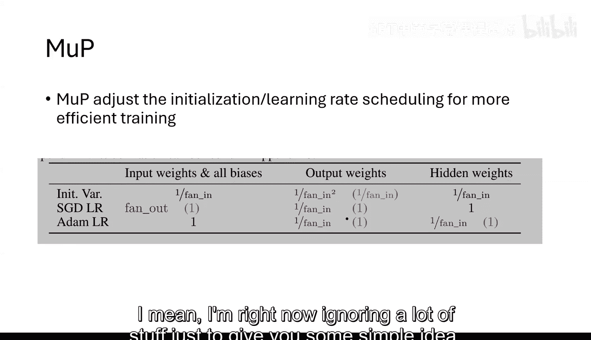

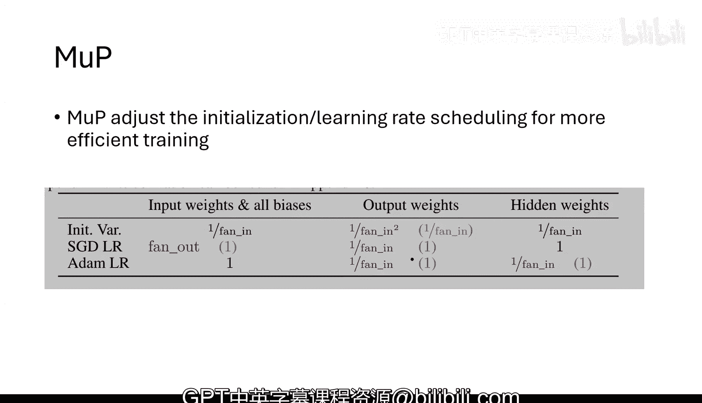

理解这些底层优化技术，有助于我们更好地把握大模型训练的工程挑战和前沿方向。