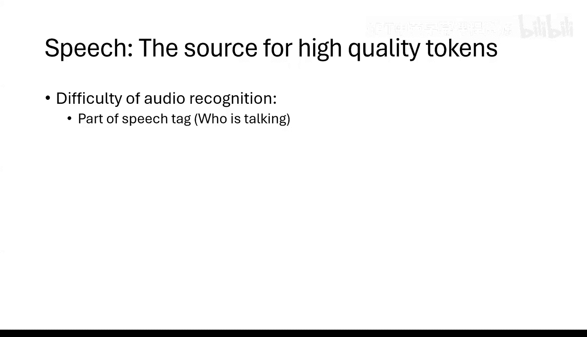
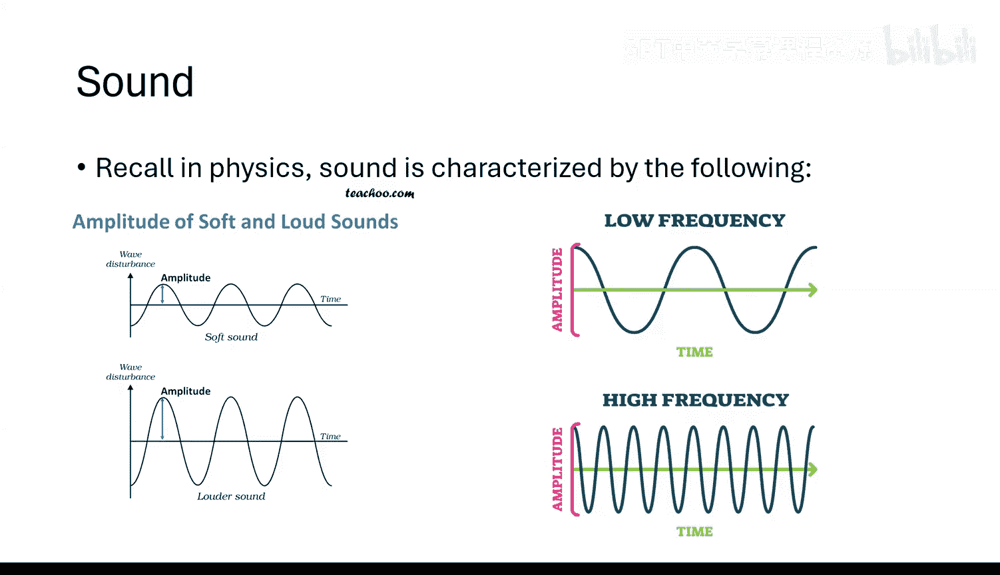
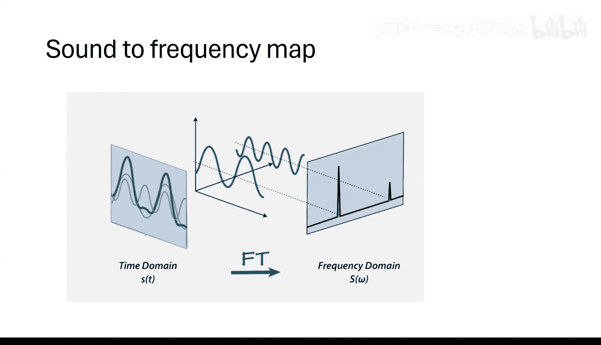
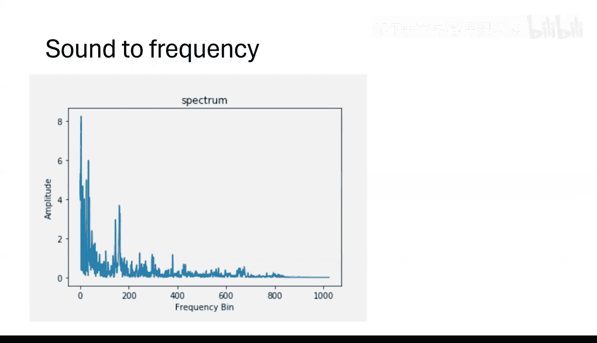
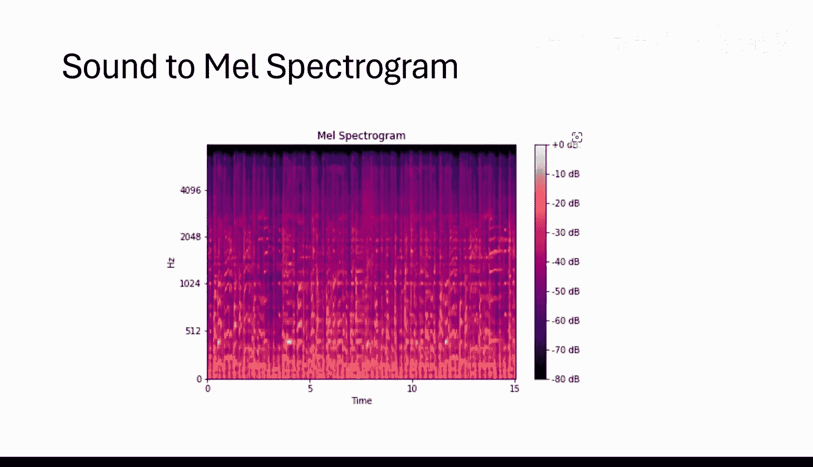
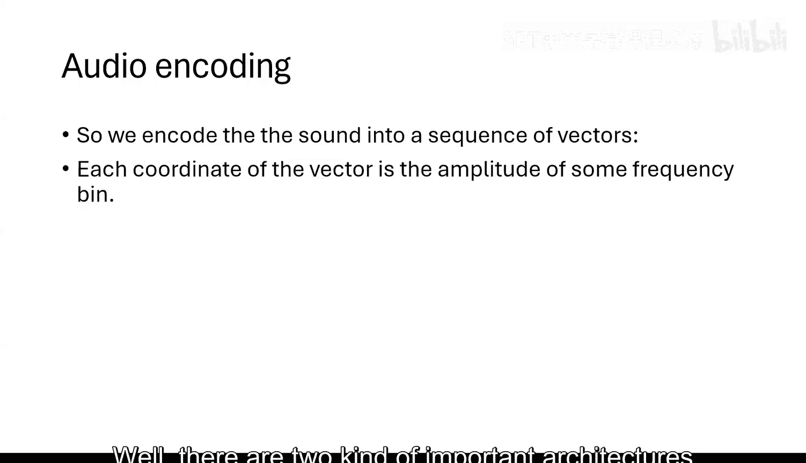
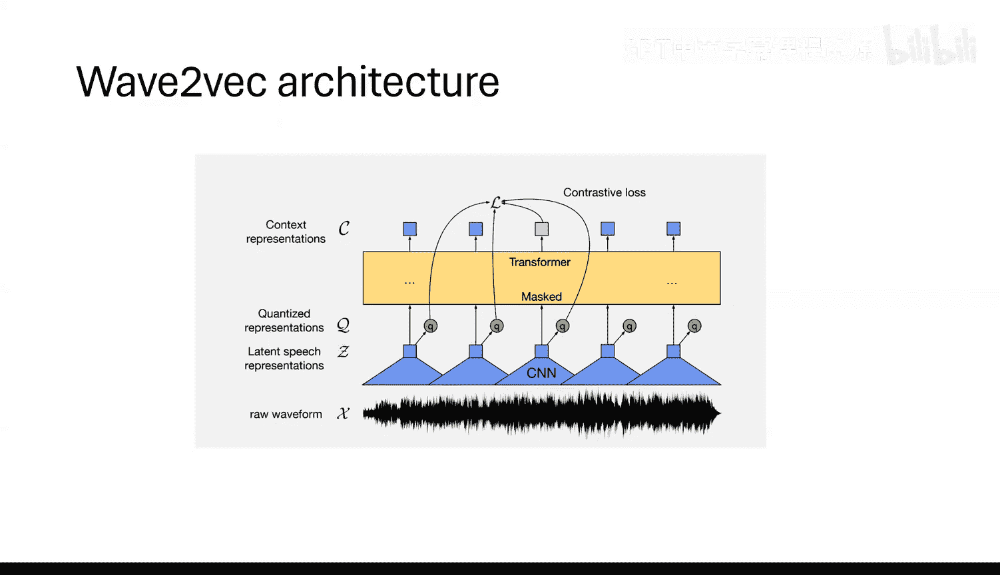
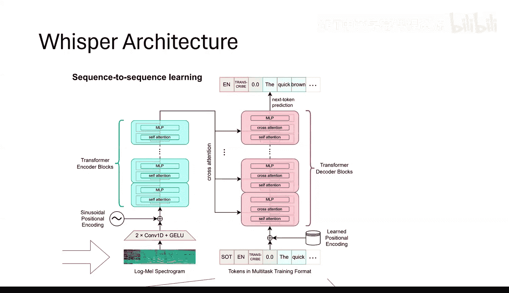

# 25：语音识别模型 🎤

在本节课中，我们将学习语音识别模型。虽然语音识别在技术上并非纯粹的生成式模型，但它使用了与生成式模型相似的架构，并且在生成式机器学习中扮演着重要角色。我们将了解如何将语音信号转换为文本，以及两种主流的模型架构。

---

## 概述：语音数据的重要性



语音数据正变得越来越重要，因为它是训练语言模型的高质量数据源。例如，播客、辩论甚至总统演讲的文本记录，都是极其重要且高质量的数据。这些数据中没有广告，信息密度高。仅YouTube视频的字幕就可能包含超过10万亿个高质量的词元。然而，我们需要将语音转换为自然语言文本才能利用它们。本节课，我们将学习如何实现这一点。

---



## 声音的数学表示：从波形到向量

上一节我们提到了语音数据的重要性，本节中我们来看看如何将连续的语音信号转换为计算机可以处理的数字形式。

声音在物理学上由两个基本特征描述：
1.  **振幅**：决定声音的响度。
2.  **频率**：决定声音的音高。频率越高，音调越高；频率越低，音调越低沉。



任何复杂的声音波形都可以分解为一系列具有特定振幅和频率的简单正弦波的组合。这种分解方法称为**傅里叶变换**。

一个在区间 `[0, 2π]` 上的连续函数 `f(x)` 可以表示为：
```
f(x) = Σ (α_j * e^(i * θ_j * x))
```
其中，`α_j` 是复数系数（代表振幅和相位），`θ_j` 是频率。

通过傅里叶变换，我们可以将时域中的声音信号转换到频域，用一个（理论上无限维的）系数向量 `[α_0, α_1, α_2, ...]` 来表示。在实际应用中，由于系数会衰减，我们可以找到一个有限的截断点 `N`，用前 `N` 个系数 `[α_0, α_1, ..., α_N]` 来足够精确地近似原始声音。

因此，对于一段较长的音频，我们可以先将其切分为多个时间窗口，然后将每个窗口内的声音信号转换为一个频域系数向量。最终，整个音频就被表示为一个向量序列，这与自然语言处理中词元序列的形式非常相似。

---

## 梅尔频谱：更优的频域表示



上一节我们介绍了通过傅里叶系数向量表示声音的方法，但这种方法存在一个问题：它生成的向量维度过高，且不符合人耳的感知特性。

原始的频谱系数在高频区域非常集中，振幅较大。然而，人耳对高频变化的敏感度低于中低频。例如，人耳很难区分600Hz和800Hz的声音，但对1000Hz附近的变化非常敏感。因此，我们需要一种更符合人耳感知特性的表示方法。

直接将高维向量截断或均匀分组（池化）会丢失重要信息。一个更聪明的方法是**非均匀分组**，即根据一个特定的函数将频率系数分组到不同的“桶”中，并对每个桶内的系数进行平均。这个函数近似于指数函数，被称为**梅尔尺度**。



梅尔频谱的计算过程如下：
1.  计算音频窗口的傅里叶系数。
2.  根据梅尔尺度函数，将频率系数分组到多个频带（例如80个）中。
3.  对每个频带内的系数进行加权平均，得到该频带的能量值。

这样，我们就将一个高维的傅里叶系数向量，压缩成了一个低维的梅尔频谱向量。每个向量元素代表一个特定频带在某个时间窗口内的平均能量。整个音频因此被表示为一个二维矩阵：一个维度是时间窗口序列，另一个维度是梅尔频带。

这种表示不仅是维度上的压缩，更是对声音信息的一种感知优化，为后续的模型处理奠定了更好的基础。

---



## 模型架构一：Wave2Vec（无监督学习）

现在我们已经将音频转换为向量序列，接下来看看如何训练模型来理解这些向量。第一种主流架构是 **Wave2Vec**，它主要采用无监督学习。

Wave2Vec 的训练数据大部分是未标注的纯音频。其核心思想是学习音频信号的良好表示，类似于 BERT 在文本领域所做的工作。

以下是 Wave2Vec 的无监督训练流程：

1.  **输入**：音频经过梅尔频谱处理后的向量序列 `Q = [q_1, q_2, ..., q_T]`。
2.  **掩码**：随机掩码掉其中约15%的向量（类似于 BERT 的掩码语言模型）。
3.  **编码**：将掩码后的序列输入一个 Transformer 编码器。
4.  **输出**：Transformer 输出一个上下文向量序列 `C = [c_1, c_2, ..., c_T]`。
5.  **对比损失**：训练目标是让被掩码位置 `t` 的输出向量 `c_t` 尽可能接近其真实的向量 `q_t`，同时远离其他所有时间步的向量 `q_{t'}` (t' ≠ t)。

其对比损失函数可以简化为：
```
Loss = -log[ exp(sim(c_t, q_t)) / Σ_{t'} exp(sim(c_t, q_{t'})) ]
```
其中 `sim` 是相似度函数，如余弦相似度。

**为什么使用对比损失而非简单的预测损失？**
因为相邻时间窗口的音频向量 `q_t` 和 `q_{t-1}` 通常非常相似。简单的回归损失会让模型倾向于复制前一个向量，而无法学习到有区分度的特征。对比损失能迫使模型关注于每个时间窗口的独特特征，并忽略持续的背景噪音，这更接近人脑处理声音的方式。

训练完成后，Wave2Vec 得到了音频信号的高质量上下文表示。要用于语音识别等下游任务，只需在其顶部添加一个简单的线性分类层，并用少量有标注数据进行微调即可。这种架构特别擅长声音分类、说话人分割等任务。

---

## 模型架构二：Whisper（有监督编码器-解码器）

上一节我们学习了无监督的 Wave2Vec 模型，本节我们来看另一种主流的架构：**Whisper**。这是一个完全基于有监督学习的编码器-解码器模型，专门用于语音到文本的转录。

Whisper 模型的训练数据是成对的音频和文本字幕。但这里有一个关键挑战：字幕通常是整个音频段的概括，**没有与音频时间轴精确对齐**。我们不知道哪句文本对应哪段音频。

Whisper 巧妙地利用了解码器的**自回归生成**能力和**交叉注意力**机制来解决这个问题。

以下是 Whisper 的工作流程：

1.  **编码**：音频被转换为梅尔频谱向量序列，然后送入一个编码器（可能包含CNN和Transformer）进行编码，得到音频的上下文表示。
2.  **解码**：使用一个 Transformer 解码器来生成文本词元序列。
3.  **交叉注意力**：解码器的核心创新在于其注意力机制。在预测下一个文本词元时，解码器不仅会关注之前已生成的所有文本词元（自注意力），还会通过**交叉注意力**层关注整个音频编码序列。
4.  **训练目标**：模型的学习目标是最简单的**下一个词元预测**。给定一段音频和对应的文本字幕，模型需要根据音频信息和已生成的文本，预测出下一个正确的文本词元。

这类似于图像生成的扩散模型或DALL-E，只不过这里是条件于音频来生成文本。由于解码器在生成每个词时都能“听到”整个音频，理论上它应该能生成准确的转录文本。



Whisper 模型因其出色的开箱即用转录能力和多语言支持而广受欢迎。它代表了当前大规模有监督训练在语音识别领域的成功应用。

---

## 总结与展望

本节课我们一起学习了语音识别模型的基础知识。

我们首先了解了语音作为高质量数据源的重要性。接着，探讨了如何将声音从连续的波形，通过傅里叶变换和梅尔频谱处理，转换为适合神经网络处理的向量序列。

然后，我们深入分析了两种主流的模型架构：
*   **Wave2Vec**：采用无监督对比学习，旨在学习音频信号本身的优良表示，适用于需要音频理解的分类任务。
*   **Whisper**：采用有监督的编码器-解码器架构，利用交叉注意力机制，直接条件于音频生成文本，是目前主流的高质量语音转录方案。



目前，语音识别模型仍有改进空间，例如更好地处理说话人分离、背景音过滤等。未来的方向可能是结合 Wave2Vec 的无监督学习能力与 Whisper 的强转录能力，以更少的有标注数据获得更强大、更鲁棒的模型。这是一个非常活跃且重要的研究领域。