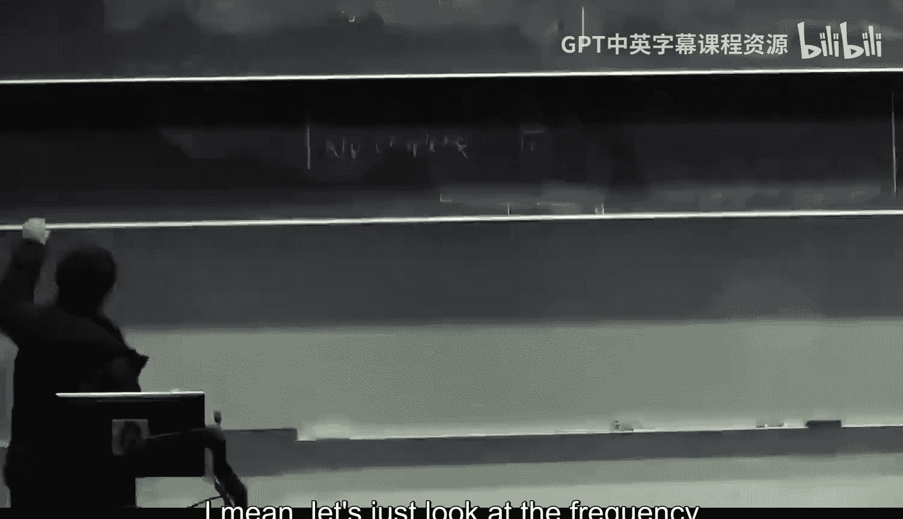
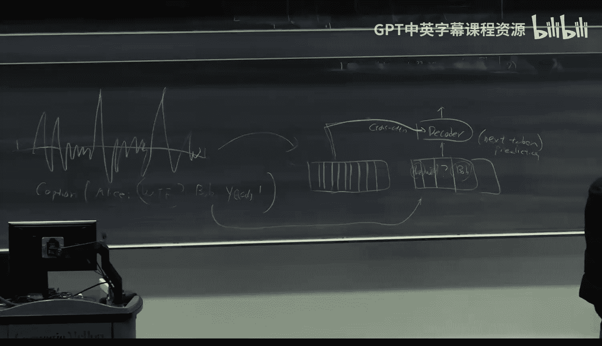

# 26：语音识别模型

在本节课中，我们将学习语音识别模型。虽然语音识别在技术上并非纯粹的生成式模型，但它使用了与生成式模型相似的架构，并且在机器学习领域非常重要。我们将了解如何将语音信号转换为自然语言文本，并探讨两种关键的模型架构。

## 概述：语音数据的重要性

语音数据正变得越来越重要，因为它是训练语言模型的高质量数据来源。例如，播客、辩论甚至总统演讲的文本记录，都是极其重要且高质量的数据。这些数据不包含广告，信息密度高。粗略估计，仅YouTube转录文本就可能提供超过10万亿的高质量词元。然而，我们需要将语音转换为自然语言才能利用这些数据。本节课，我们将学习如何实现这一点。

## 从声音到向量：信号处理基础

上一节我们介绍了语音数据的重要性，本节中我们来看看如何将原始的语音信号转换为计算机可以处理的格式。

回想一下物理知识，声音由两个基本特征描述：
*   **振幅**：决定声音的响度。
*   **频率**：决定声音的音高。频率越高，音调越高；频率越低，声音越低沉。

任何复杂的声音波形都可以分解为一系列具有特定振幅和频率的简单正弦波的组合。这种分解方法称为**傅里叶变换**。

通过傅里叶变换，我们可以将时域中的声音信号转换到频域。在频域中，一个声音片段（例如一个时间窗口内的声音）可以表示为一个向量，向量的每个维度对应一个特定频率分量的振幅。

然而，原始傅里叶系数向量维度可能非常高（例如对应高达100kHz的频率）。直接使用这样的高维向量作为模型输入效率低下。此外，人耳对不同频率的敏感度不同，对中频区间的变化更敏感。

因此，我们需要一种更智能的降维方法，而不是简单截断高频系数。

## 梅尔频谱：更优的频域表示

上一节我们提到了直接使用傅里叶系数的局限性，本节中我们来看看如何更有效地表示频域信息。

解决方案是使用**梅尔频谱**。其核心思想是：根据一个类似指数函数的“梅尔尺度”将频率分组到不同的“频带”或“桶”中。

在梅尔尺度下：
*   低频区域（如0-100Hz）被划分为较少的频带，分辨率较粗。
*   高频区域（如8000-10000Hz）被划分为较多的频带，分辨率较细。

然后，我们将同一个频带内的多个傅里叶系数振幅进行平均（或采取其他聚合方式），用这个平均值作为该频带的代表值。这样，我们就将一个高维的傅里叶系数向量压缩成了一个低维的梅尔频谱向量。

这个过程可以总结为以下步骤：
1.  对音频时间窗口进行傅里叶变换，得到频域系数。
2.  根据梅尔尺度将频率分组到多个频带。
3.  聚合（如平均）每个频带内的系数值，形成最终的梅尔频谱向量。

最终，一个完整的音频文件被处理成一个向量序列：`[向量_窗口1， 向量_窗口2， ...， 向量_窗口T]`。这与自然语言处理中的词元序列非常相似，因此可以输入给Transformer等序列模型。

## 语音识别模型架构（一）：Wave2Vec 2.0

现在我们已经将语音转换为向量序列，接下来看看如何训练模型来理解这些向量。首先介绍一种以无监督学习为主的架构：**Wave2Vec 2.0**。

Wave2Vec 2.0 的训练主要使用大量无标注的纯语音数据。其灵感来源于BERT的掩码语言模型（MLM）目标，但针对语音数据的特点进行了调整。

以下是其无监督训练的核心流程：
1.  **输入**：经过梅尔频谱编码的语音向量序列 `Q = [q1， q2， ..., qT]`。
2.  **掩码**：随机掩码（例如遮盖15%）序列中的部分向量，用特殊的`[MASK]`向量替换。
3.  **编码**：将掩码后的序列输入一个Transformer编码器。
4.  **输出**：Transformer输出一个上下文向量序列 `C = [c1， c2， ..., cT]`，其中每个 `ct` 对应输入位置 `t` 的编码。
5.  **对比损失**：对于每个被掩码的位置 `t`，训练目标是：
    *   使输出 `ct` 与真实的、被掩码的输入向量 `qt` 尽可能接近。
    *   同时，使 `ct` 与序列中所有其他位置的向量 `qt'` （`t' ≠ t`）尽可能远离。

这被称为**对比损失**。为什么在语音中要使用对比损失，而不是像BERT那样直接预测被掩码的词元呢？

原因在于语音数据的连续性。相邻时间窗口的语音向量 `qt` 和 `qt-1` 通常非常相似。如果使用简单的预测损失，模型可能学会简单地复制前一个向量，而无法捕捉细微的、有意义的改变（如音素变化）。对比损失迫使模型学习每个时间窗口的**独特表征**，从而更好地区分不同的声音片段，并忽略持续的背景噪音。

训练完成后，Wave2Vec 2.0 模型获得了一个强大的语音特征编码器。要用于语音识别（转写文字），只需要在编码器的输出上添加一个简单的线性分类层，并用少量有标注的（语音，文本）配对数据进行微调即可。这种架构特别适合语音分类任务，如说话人分割、语音活动检测等。

## 语音识别模型架构（二）：Whisper

上一节我们介绍了无监督的Wave2Vec模型，本节中我们来看看另一种更近期、专注于有监督语音识别的架构：**Whisper**。

Whisper 是一个基于Transformer的编码器-解码器模型，主要用于有监督的语音转写任务。其训练数据是大量的（音频，转录文本）对。注意，这些数据通常是**非对齐**的，即我们只知道一段音频的整体转录文本，但不知道文本中每个词具体对应音频的哪一部分。

Whisper 的核心思想是将语音识别构建为一个**条件生成任务**：给定音频输入，生成对应的转录文本。这类似于图像生成模型根据文本描述生成图像。

以下是Whisper模型的工作流程：
1.  **编码**：音频信号通过一个编码器（包含卷积层和Transformer层）被处理成一个特征向量序列。这类似于之前得到的梅尔频谱序列的进一步抽象。
2.  **解码**：一个Transformer解码器负责自回归地生成文本词元（转录结果）。
3.  **交叉注意力**：解码器的关键机制是**交叉注意力**。在生成每一个文本词元时，解码器不仅会关注之前已生成的所有文本词元（自注意力），还会通过交叉注意力机制去“聆听”或“关注”编码器输出的整个音频特征序列。

这意味着，在生成“apple”这个词时，模型不仅考虑了上文“I eat an”，还同时考虑了整个音频上下文的信息，从而能更准确地预测当前词。

通过在大规模有监督数据上训练这个编码器-解码器架构（使用标准的自回归语言建模损失），Whisper学会了将音频内容准确地翻译成文本。它无需显式的对齐信息，而是通过注意力机制隐式地学习音频与文本之间的对应关系。

## 总结与展望

本节课中我们一起学习了语音识别模型的基础知识和两种主流架构。

我们首先了解了语音数据作为高质量训练语料的重要性。接着，学习了如何通过傅里叶变换和梅尔频谱将连续的语音信号转换为离散的向量序列，为神经网络处理做好准备。

然后，我们深入探讨了两种模型：
1.  **Wave2Vec 2.0**：一种基于对比学习的无监督/自监督模型，擅长学习语音的通用表征，适用于多种语音任务，经过微调后可进行语音识别。
2.  **Whisper**：一种基于编码器-解码器架构的有监督模型，直接学习从音频到文本的端到端映射，在语音转写任务上表现出色。

目前，语音识别模型仍有改进空间，其质量尚不及最先进的语言模型。一个有趣的研究方向是结合Wave2Vec的无监督学习能力和Whisper的强大生成能力，以利用海量的无标注语音数据，同时提升有监督任务的性能。这将是获得更多高质量训练数据、推动生成式AI发展的重要一步。