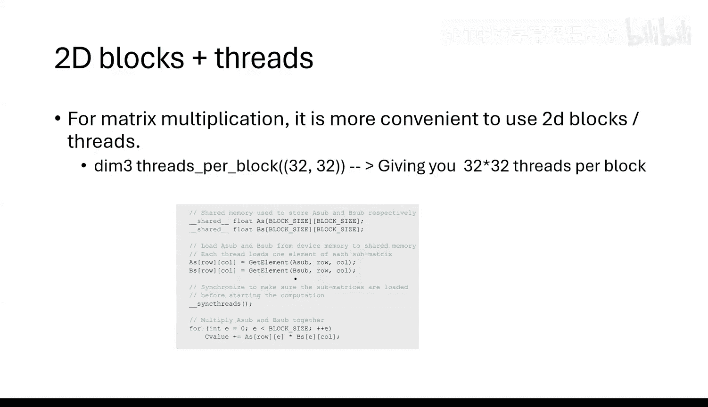

# 27：CUDA编程入门教程 🚀

在本节课中，我们将学习CUDA编程的基础知识。CUDA编程对于希望从零开始训练大型语言模型至关重要，因为它能让我们直接控制GPU的计算和内存访问，从而实现远超现有库（如PyTorch）的性能优化。我们将了解为什么大公司需要编写自己的CUDA内核，并探索其背后的核心架构和编程模式。

## 概述

CUDA编程是使用C/C++在NVIDIA GPU上进行计算的过程。理解CUDA对于优化生成式AI模型（如大型语言模型）的训练至关重要。标准深度学习框架（如PyTorch）虽然方便，但其通用性设计使其在极致性能优化上存在瓶颈。为了处理万亿参数级别的模型并应对GPU固有的硬件错误，顶尖的AI公司（如OpenAI）需要编写高度定制化的CUDA内核，以控制内存访问、实现计算冗余校验，并融合操作以减少数据移动。

## GPU架构与内存层次结构

上一节我们介绍了学习CUDA编程的必要性，本节中我们来看看CUDA编程所基于的GPU架构。

CUDA编程的核心在于理解GPU的内存层次结构，这直接决定了代码的性能。GPU的计算单元组织如下：

*   **线程**：最基本的执行单元，类似于CPU中的寄存器。
*   **线程块**：一组线程的集合，它们可以协作并**共享一块高速的片上内存，称为共享内存**。
*   **网格**：由多个线程块组成，负责执行一个完整的CUDA内核。

内存访问速度是关键瓶颈。以下是主要的内存类型：

*   **全局内存**：即GPU的显存，容量大但访问速度慢。
*   **共享内存**：每个线程块独有的小块高速内存，访问速度极快。

CUDA编程的主要目标就是尽可能多地将数据保留在共享内存中进行计算，从而减少对缓慢的全局内存的访问。

## CUDA编程基础

理解了架构后，我们来看看如何编写一个基本的CUDA程序。

一个典型的CUDA程序包含两部分：

1.  **内核函数**：在GPU上每个线程中执行的函数。使用 `__global__` 关键字声明。
2.  **主机函数**：在CPU上运行的函数，负责配置并启动内核。

以下是一个向量加法的内核函数示例：
```c
__global__ void vectorAdd(float *A, float *B, float *C, int n) {
    int i = threadIdx.x;
    if (i < n) {
        C[i] = A[i] + B[i];
    }
}
```
这个内核假设只使用一个线程块。`threadIdx.x` 是CUDA内置变量，表示当前线程在线程块内的索引。

主机函数调用内核的语法如下：
```c
// 定义执行配置：使用1个线程块，该块包含n个线程
dim3 threadsPerBlock(n);
dim3 blocksPerGrid(1);
// 启动内核
vectorAdd<<<blocksPerGrid, threadsPerBlock>>>(A, B, C, n);
```
`<<<blocksPerGrid, threadsPerBlock>>>` 语法指定了网格和线程块的维度，告诉GPU如何组织线程来执行这个内核。

## 并行化与线程索引

上一节我们看到了一个简单的单线程块内核，本节中我们来看看如何利用所有线程实现真正的并行计算。

为了让所有线程协作处理整个向量，我们需要修改内核，使每个线程处理不同的数据片段。这通过结合 `threadIdx.x` 和 `blockDim.x`（线程块内的线程总数）来实现。

以下是优化后的并行向量加法内核：
```c
__global__ void parallelVectorAdd(float *A, float *B, float *C, int n) {
    int i = blockIdx.x * blockDim.x + threadIdx.x; // 计算全局线程ID
    int stride = blockDim.x * gridDim.x; // 计算总线程数作为步长
    for (; i < n; i += stride) {
        C[i] = A[i] + B[i];
    }
}
```
这个内核的关键点在于：
*   `blockIdx.x`：当前线程块在网格中的索引。
*   `blockDim.x`：每个线程块中的线程数。
*   通过 `i = blockIdx.x * blockDim.x + threadIdx.x` 计算出每个线程负责的全局起始索引。
*   使用 `stride` 进行循环，使有限数量的线程能够处理任意大小的数组。

主机调用需要配置合适的网格和线程块大小：
```c
int threadsPerBlock = 256;
int blocksPerGrid = (n + threadsPerBlock - 1) / threadsPerBlock; // 向上取整
parallelVectorAdd<<<blocksPerGrid, threadsPerBlock>>>(A, B, C, n);
```

## 利用共享内存优化：矩阵乘法示例

仅仅启动并行线程还不够，性能优化的核心在于智能地使用共享内存。我们以矩阵乘法为例。

一个朴素的矩阵乘法内核会频繁地从全局内存读取数据，速度很慢。优化的思路是将计算分块，先将数据块从全局内存加载到共享内存，然后在共享内存中进行高速计算。

以下是利用共享内存的矩阵乘法核心思想（伪代码表示）：
```c
__global__ void matrixMulShared(float *A, float *B, float *C, int width) {
    // 为子矩阵A和B声明共享内存
    __shared__ float sA[TILE_WIDTH][TILE_WIDTH];
    __shared__ float sB[TILE_WIDTH][TILE_WIDTH];

    int bx = blockIdx.x, by = blockIdx.y;
    int tx = threadIdx.x, ty = threadIdx.y;

    // 计算C中当前线程要处理的元素坐标
    int row = by * TILE_WIDTH + ty;
    int col = bx * TILE_WIDTH + tx;

    float sum = 0;
    // 循环遍历所有数据块
    for (int m = 0; m < width/TILE_WIDTH; ++m) {
        // 协作地将数据块从全局内存加载到共享内存
        sA[ty][tx] = A[row * width + (m * TILE_WIDTH + tx)];
        sB[ty][tx] = B[(m * TILE_WIDTH + ty) * width + col];
        __syncthreads(); // 等待块内所有线程完成加载

        // 在共享内存中进行子矩阵乘法计算
        for (int k = 0; k < TILE_WIDTH; ++k) {
            sum += sA[ty][k] * sB[k][tx];
        }
        __syncthreads(); // 等待计算完成，再进行下一轮数据加载
    }
    // 将结果写回全局内存
    C[row * width + col] = sum;
}
```
这种分块策略将全局内存访问量从 `O(n^3)` 显著降低到 `O(n^2)`，因为每个数据块只需从全局内存加载一次到共享内存，然后在该块内的所有计算中重复使用。

## 内核融合

除了使用共享内存，另一个关键的优化技术是内核融合。在标准框架中，连续的运算（如矩阵乘法和ReLU激活）会分别启动独立的内核，每个内核都会将中间结果写回全局内存，再由下一个内核读回，造成了不必要的延迟和带宽消耗。

内核融合将多个连续操作合并到单个CUDA内核中执行。例如，将 `Y = matmul(M, X)` 和 `Z = relu(Y)` 融合成一个内核 `fused_matmul_relu`。这样，中间结果 `Y` 可以保留在寄存器或共享内存中，直接用于ReLU计算，完全避免了写回和读取全局内存的开销。



这种优化虽然增加了内核编写的复杂性，但通常能带来10%-20%的性能提升，对于大规模训练至关重要。这也是为什么追求极致性能的定制化AI系统（如Flash Attention）会将整个注意力机制实现为一个融合内核的原因。

## 总结


本节课中我们一起学习了CUDA编程的核心概念。我们了解到，为了极致优化生成式AI模型的训练性能，尤其是应对超大规模模型和硬件错误，直接进行CUDA级编程是必要的。关键要点包括：理解GPU的线程-块-网格层次结构和共享内存的重要性；掌握编写并行内核的基本方法；学会通过分块策略利用共享内存优化数据密集型运算（如矩阵乘法）；以及认识内核融合技术对于减少冗余内存访问的巨大价值。这些知识是理解现代高性能AI系统底层实现的基础。