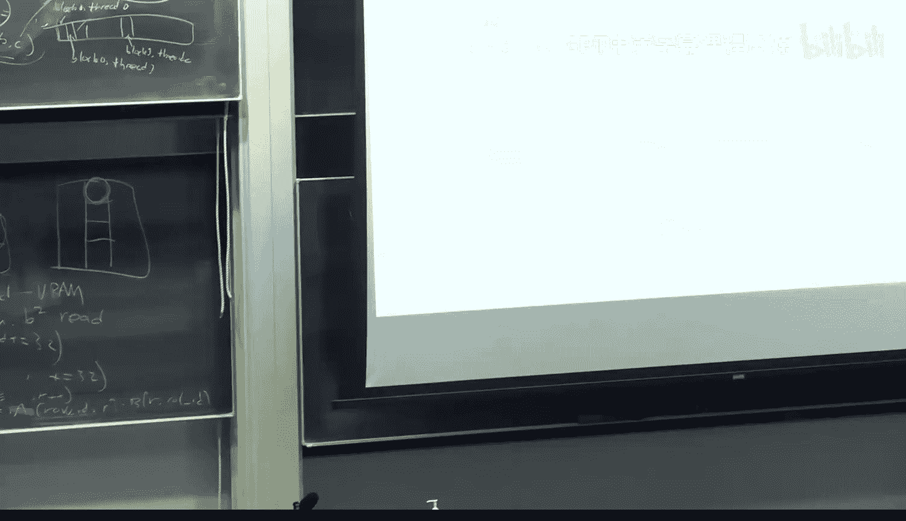

# 28：CUDA编程基础 🚀

在本节课中，我们将学习CUDA编程的基础知识。理解CUDA编程对于希望从底层优化和训练大型语言模型至关重要。我们将探讨为何需要CUDA编程、GPU的基本架构、如何编写简单的CUDA内核，以及如何利用共享内存和融合内核来提升计算效率。

## 概述 📋

CUDA编程是使用C/C++在NVIDIA GPU上进行编程的简称。在生成式AI领域，为了高效训练大型语言模型，我们常常需要绕过现有的高级库（如PyTorch），直接编写底层的CUDA代码以获得显著的性能提升。本节课将介绍CUDA编程的核心概念，包括线程、块、网格的结构，以及如何通过优化内存访问来加速计算。

## GPU架构与CUDA编程模型 🏗️

上一节我们介绍了学习CUDA编程的必要性，本节中我们来看看GPU的基本架构和CUDA编程模型。

GPU的计算核心组织成一种层次结构。在最底层是**线程**，每个线程类似于CPU中的一个寄存器，执行最基本的计算单元。多个线程被组织成一个**线程块**。多个线程块进一步组成一个**网格**。一个CUDA内核调用通常对应整个网格。

这种结构设计主要与内存层次有关，而非纯粹的计算结构。在一个线程块内的所有线程共享一块快速的**共享内存**。这块内存比GPU的全局内存（显存）访问速度快得多。CUDA编程的核心挑战之一就是尽量减少从慢速的全局内存中读取数据的次数，尽可能多地利用快速的共享内存进行计算。

## 编写第一个CUDA内核：向量加法 ➕

理解了基本架构后，我们通过一个简单的例子来学习如何编写CUDA内核函数。

一个CUDA内核函数是一个在GPU上每个线程上并行执行的函数。我们以向量加法 `C = A + B` 为例。一个天真的实现是只使用一个线程，通过一个循环遍历所有元素进行加法。但这完全没有利用GPU的并行能力。

为了并行化，我们需要让多个线程同时工作。每个线程负责计算结果向量中不同位置的和。CUDA运行时提供了内置变量，如 `threadIdx.x` 和 `blockDim.x`，它们分别表示当前线程在线程块内的索引和线程块中的线程总数。

以下是利用多线程进行向量加法的核心思路：
```c
// 假设每个线程块有 blockDim.x 个线程
int i = threadIdx.x + blockIdx.x * blockDim.x;
int stride = blockDim.x * gridDim.x; // 总线程数
for (; i < N; i += stride) {
    C[i] = A[i] + B[i];
}
```
这段代码中，每个线程根据其唯一的全局索引 `i` 计算对应的向量元素。循环中的 `stride` 确保了即使向量长度 `N` 远大于总线程数，所有元素也能被覆盖到。通过这种方式，我们实现了计算的完全并行化。

## 优化关键：利用共享内存进行矩阵乘法 ✖️

上一节我们看到了如何并行化简单的向量操作，本节中我们来看看更复杂的操作——矩阵乘法，并学习如何使用共享内存进行优化。

在矩阵乘法 `C = A * B` 中，朴素的方法是每个线程计算输出矩阵 `C` 中的一个元素。这需要该线程读取 `A` 的一整行和 `B` 的一整列数据，这些数据都来自全局内存，访问速度很慢。

优化的关键在于利用线程块的共享内存。基本思想是将大矩阵分块。例如，将矩阵 `A` 和 `B` 划分为多个 `BxB` 的子块。计算时，先将 `A` 和 `B` 对应的子块从全局内存加载到共享内存中，然后线程块内的所有线程协作，在共享内存中完成子块的矩阵乘法计算。

以下是这个过程的简化描述：
1.  将矩阵 `A` 的一个 `BxB` 子块加载到共享内存 `As`。
2.  将矩阵 `B` 的一个 `BxB` 子块加载到共享内存 `Bs`。
3.  线程块内所有线程同步，确保数据加载完成。
4.  每个线程使用 `As` 和 `Bs` 中的数据计算输出子块中自己负责的部分。
5.  重复步骤1-4，遍历所有需要的子块对，并累加结果。

如果不使用共享内存，计算一个 `BxB` 输出子块需要 `O(B^3)` 次全局内存访问。而使用共享内存后，只需要 `O(B^2)` 次全局内存访问（用于加载子块），后续的 `O(B^3)` 次计算全部在快速的共享内存中进行，从而大幅提升性能。


## 进阶技巧：融合内核 ⚡

我们了解了如何用共享内存优化单个操作。但在实际模型中，多个操作常常连续发生。本节介绍一种重要的优化技术：**融合内核**。

考虑一个简单的操作序列：先进行矩阵乘法 `Y = matmul(M, X)`，然后对结果 `Y` 应用ReLU激活函数。在标准的PyTorch写法中，这两个操作是独立的。计算流程如下：
1.  计算 `matmul(M, X)`，结果 `Y` 被写回全局内存。
2.  从全局内存读取 `Y`，计算 `relu(Y)`，结果再写回全局内存。



这个过程在全局内存和计算单元之间产生了不必要的往返。融合内核的思想是将多个操作合并到单个CUDA内核中。对于这个例子，我们可以编写一个“MatMul + ReLU”融合内核：
1.  线程计算 `matmul` 的部分结果。
2.  该部分结果保留在寄存器或共享内存中，**不写回全局内存**。
3.  立即对该中间结果应用 `ReLU` 函数。
4.  将最终结果写回全局内存。

通过避免中间结果的全局内存读写，融合内核可以显著减少内存带宽压力，通常能带来10%-20%的性能提升。像Flash Attention这样的先进优化，本质上就是将注意力机制中的矩阵乘、Softmax、缩放等多个步骤融合到一个精心设计的内核中。

## 总结 🎯

本节课我们一起学习了CUDA编程的基础知识。我们首先了解了为什么在训练超大语言模型时需要绕过PyTorch等框架进行底层CUDA编程。接着，我们探讨了GPU的线程-块-网格架构及其对应的内存层次（共享内存 vs. 全局内存）。通过向量加法和矩阵乘法的例子，我们学习了如何编写并行化的CUDA内核，并利用共享内存优化数据访问。最后，我们介绍了融合内核的概念，它将多个连续操作合并，以减少耗时的全局内存访问。

掌握这些基础概念对于理解现代大模型训练中的高性能计算优化至关重要。