# 29：状态空间模型 🧠

在本节课中，我们将要学习状态空间模型。这是一种结合了循环神经网络和Transformer架构思想的新型模型，旨在解决传统RNN在并行化和长程记忆方面的不足，同时保持线性计算复杂度。我们将从基础概念开始，逐步探讨其核心公式、优化方法以及实际应用。

---

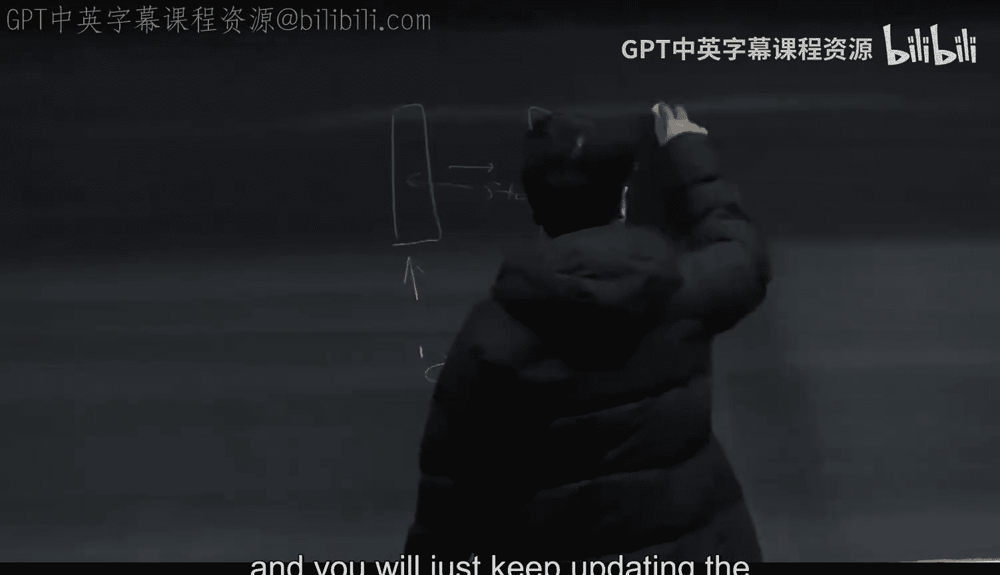

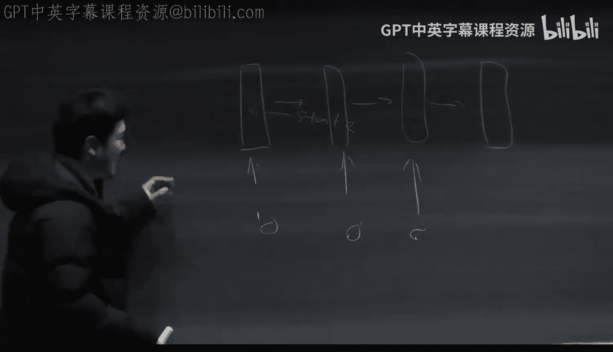

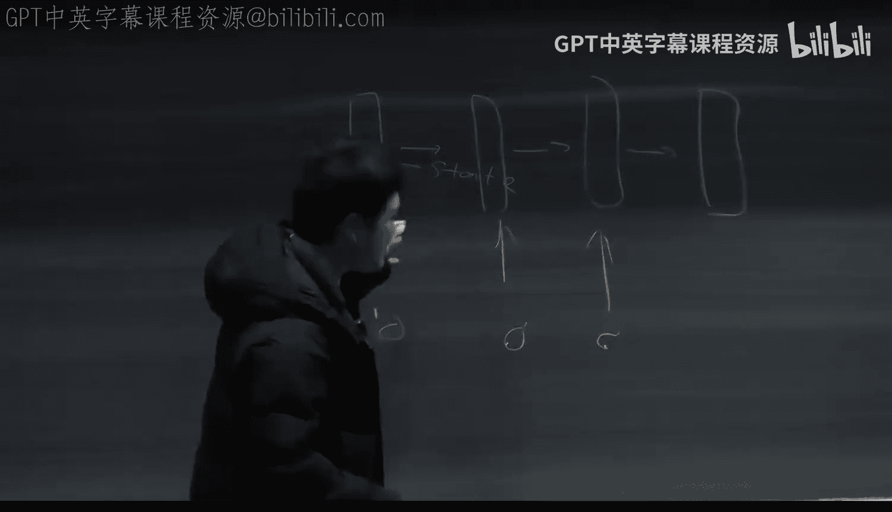

## 状态空间模型的基础

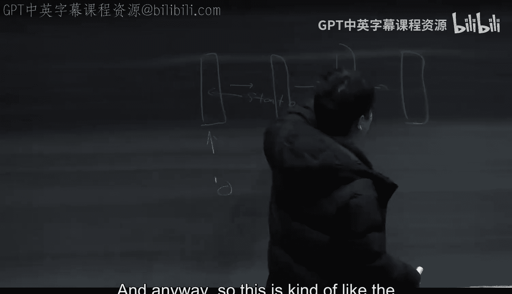

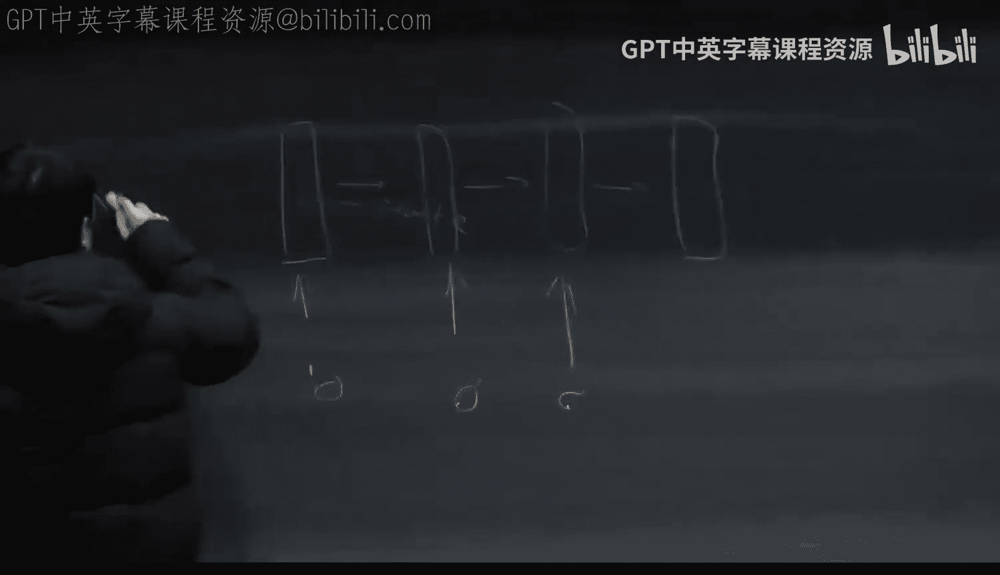

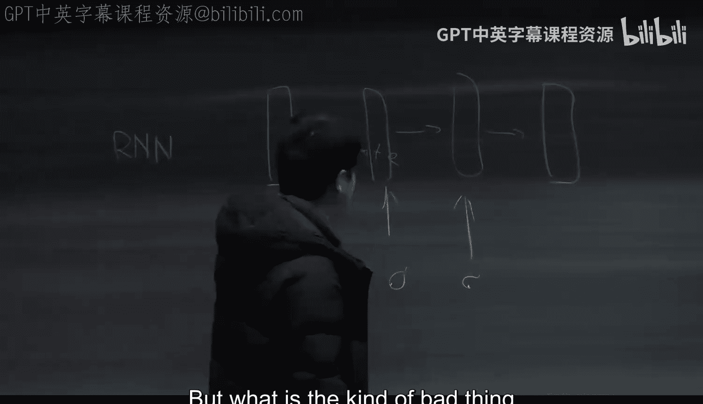

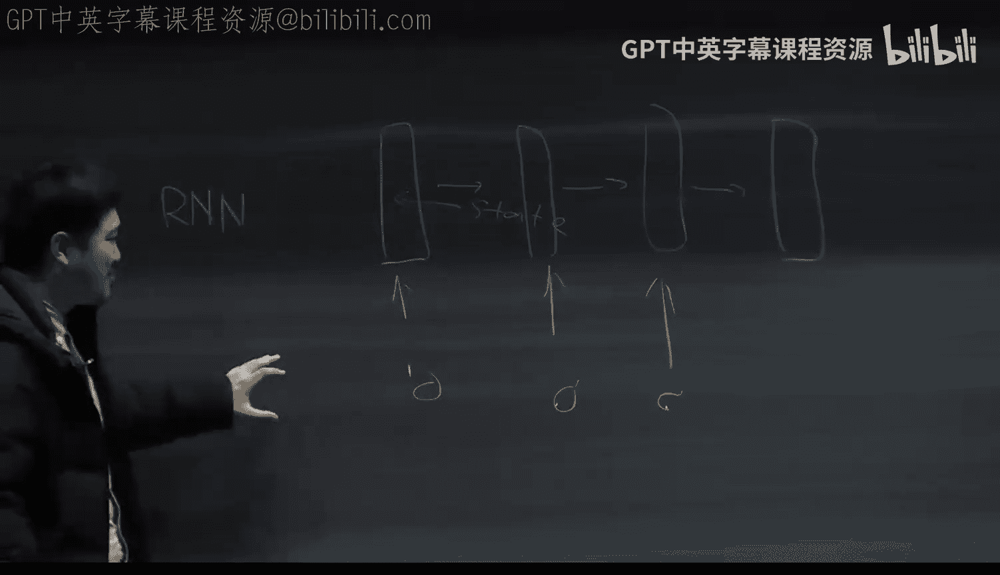

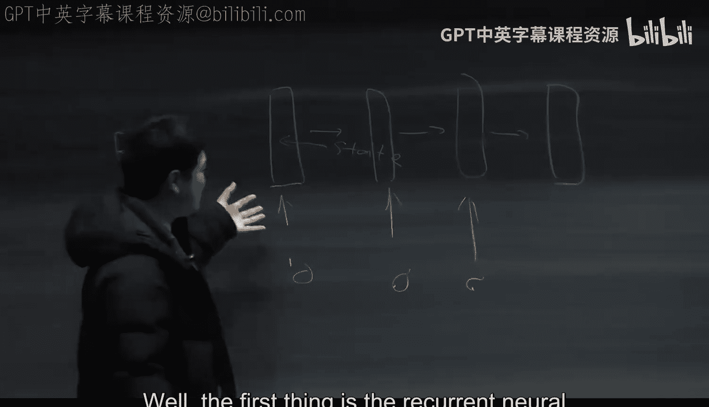

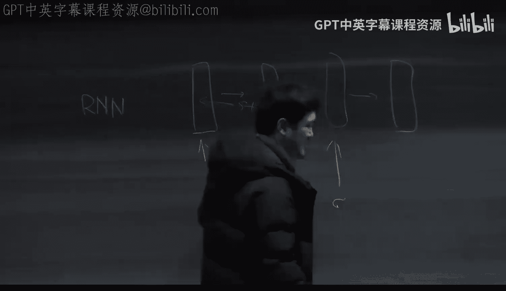

上一节我们介绍了生成式AI的背景，本节中我们来看看状态空间模型的基本概念。

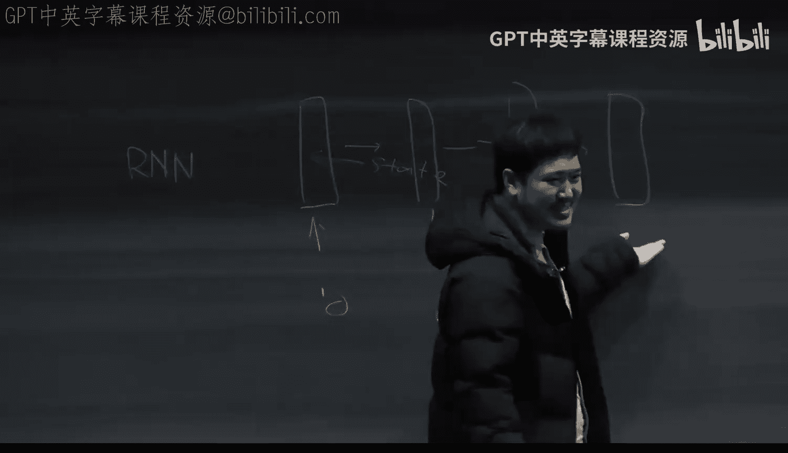

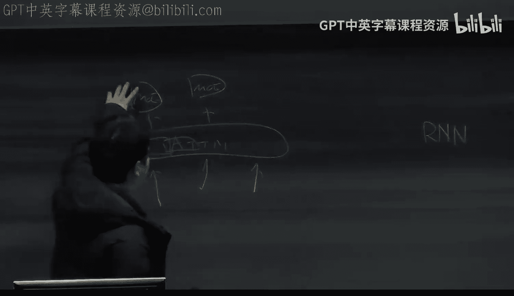

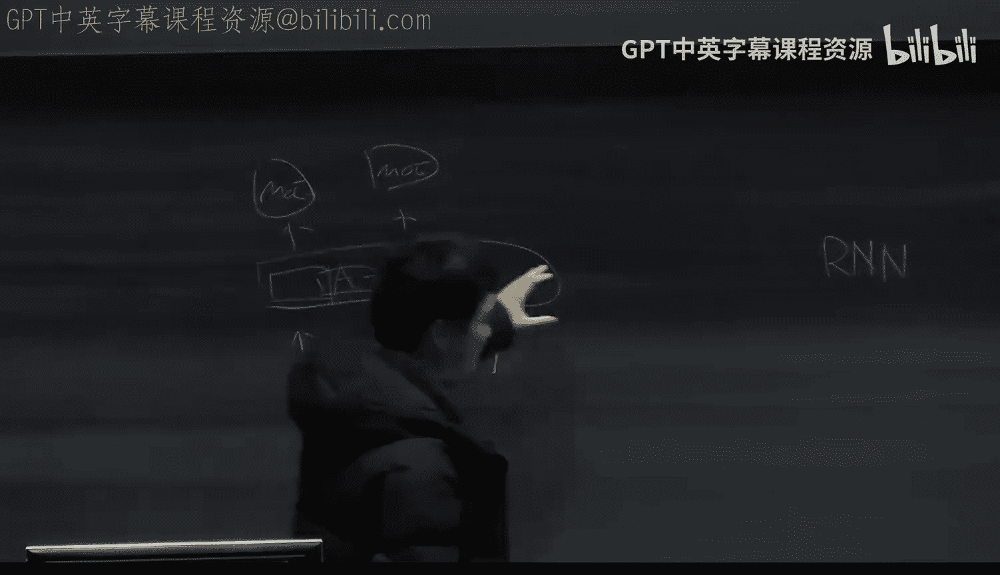

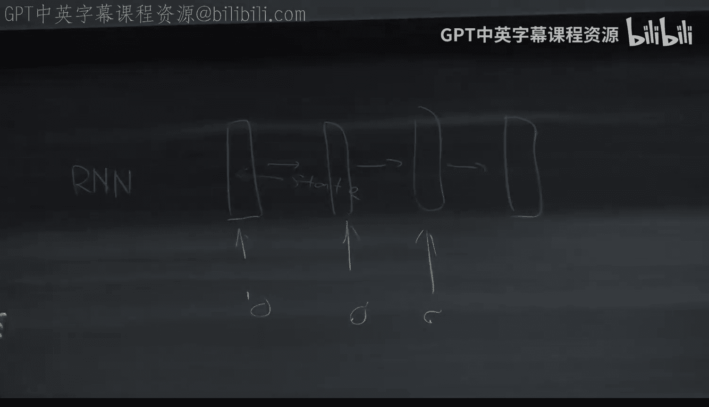

状态空间模型是由Albert Gu等人提出的一系列工作。它本质上是对Transformer出现之前的循环神经网络的一种升级。在Transformer架构之前，人们主要使用循环神经网络处理自然语言。

### 循环神经网络的回顾

循环神经网络的核心思想是维护一个状态。当输入一个序列时，RNN会根据输入逐步更新这个状态。

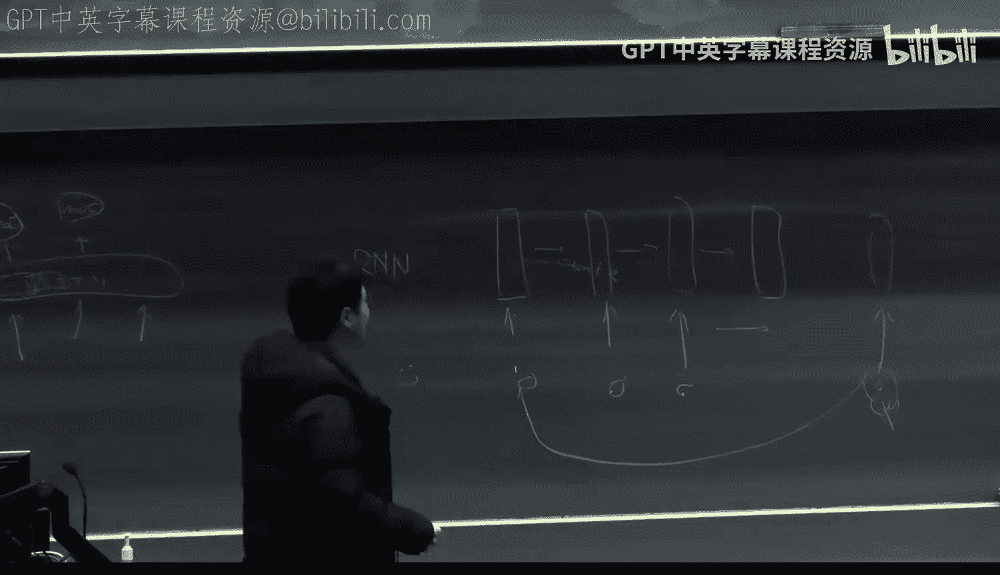

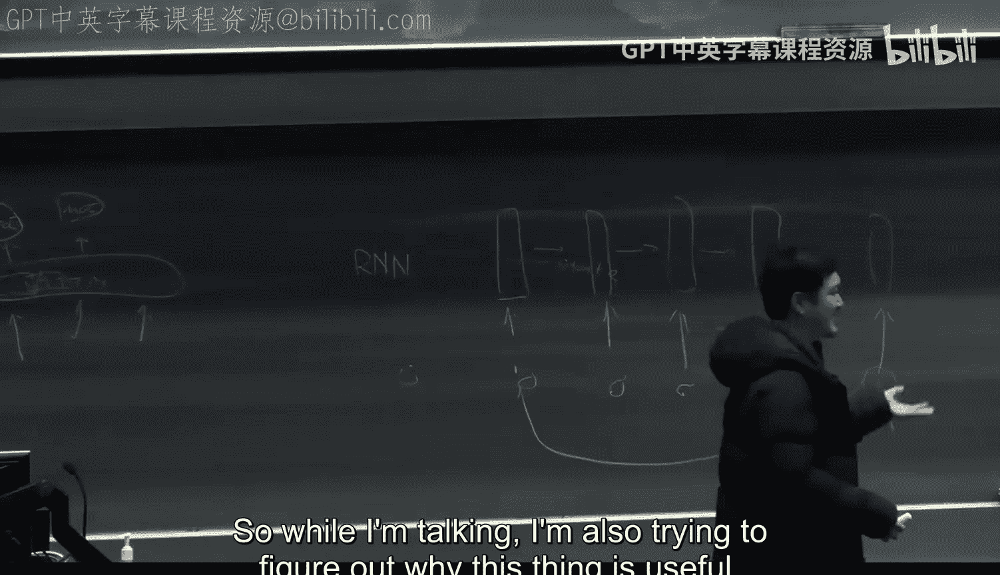

其最简单的形式可以用以下公式描述：
`h_t = f(h_{t-1}, x_t)`
其中 `h_t` 是时刻 `t` 的隐藏状态，`x_t` 是时刻 `t` 的输入，`f` 是状态更新函数。

这种架构类似于人脑的工作方式：你逐词阅读，大脑状态随之逐步更新。

### RNN的局限性

然而，传统的RNN存在两个主要问题：

1.  **缺乏并行化**：RNN的更新是严格顺序的，这与现代GPU偏好并行计算的特点不兼容。Transformer则通过自注意力层和前馈层实现了高度并行计算。
2.  **缺乏长程记忆**：RNN的状态是逐步更新的，某个时刻的标记（Token）难以直接回溯到很久之前的上下文去寻找答案。而Transformer的自注意力机制允许任何标记直接关注序列中任何位置的标记。

正是这些缺点导致RNN一度被Transformer取代。但状态空间模型的出现，似乎让这种RNN结构重新焕发了活力。

---

## 状态空间模型的架构

上一节我们回顾了RNN的优缺点，本节中我们来看看状态空间模型是如何构建的。

状态空间模型可以看作是RNN与Transformer的一种结合。其核心思想是用一个类RNN的结构替换Transformer中的自注意力层，同时保留其前馈层。

一个基本的状态空间模型块结构如下：
1.  一个**状态空间层**（替代自注意力层），用于处理序列信息。
2.  一个**前馈层**（如MoE或MLP），用于进行逐标记的局部处理。

你可以将多个这样的块堆叠起来，形成一个深度模型，就像堆叠Transformer块一样。

### 核心公式：线性状态空间模型

状态空间模型的核心是一个线性化的RNN。它通过一个连续的或离散的线性过程来更新状态。

考虑一个离散时间的线性状态空间模型，其公式如下：
`h_t = Ā * h_{t-1} + B̄ * x_t`
`y_t = C * h_t`
其中：
*   `x_t` 是输入序列。
*   `y_t` 是输出序列。
*   `h_t` 是隐藏状态。
*   `Ā`, `B̄`, `C` 是可学习的参数矩阵。

`Ā` 和 `B̄` 通常是通过对连续时间公式进行离散化（如零阶保持法）得到的：
`Ā = exp(Δ * A)`
`B̄ = (exp(Δ * A) - I) * (Δ * A)^{-1} * Δ * B`
其中 `Δ` 是步长参数。

### 从状态更新到卷积

如果我们展开上述更新公式，会发现输出 `y_t` 实际上是输入 `x` 与一个卷积核 `K̄` 的卷积结果：
`y = x * K̄`
其中卷积核 `K̄` 的元素由 `C * Ā^{k} * B̄` 决定（`k` 为时间步偏移量）。

这意味着，线性状态空间模型在数学上等价于一个（可能无限长的）卷积操作。

---

## 状态空间模型的优化：S4

上一节我们介绍了基础模型，本节中我们来看看如何优化它，使其更高效、更强大。

基础模型存在计算效率低和缺乏类似Transformer多头机制的问题。S4模型通过**对角化**技术来解决这些问题。

### 对角化与多头机制

在S4中，参数矩阵 `A` 被约束为对角矩阵。这大大减少了参数量（从 `N×N` 降至 `N`），并使得计算 `Ā` 的幂次变得非常简单（只需对每个对角线元素进行幂运算）。

更重要的是，这种对角化形式天然支持一种“多头”机制。我们可以将输入的每个特征维度（通道）视为独立的，并为每个通道配备一组独立的 `A_i`, `B_i`, `C_i` 参数。

以下是其工作原理：
*   输入 `x_t` 是一个向量。
*   对于该向量的第 `i` 个维度（通道），我们应用一个独立的状态空间模型：
    `h_t^i = Ā_i * h_{t-1}^i + B̄_i * x_t^i`
    `y_t^i = C_i * h_t^i`
*   每个通道的卷积核 `K̄_i` 是不同的，这允许模型在不同的特征维度上捕获不同的时间模式。

例如，我们可以让某些通道的 `Ā_i` 接近1，使其关注长期历史（类似于求平均），而让另一些通道的 `Ā_i` 很小，使其只关注近期信息。这实现了某种与位置相关的编码功能。

尽管如此，S4的卷积核是**上下文无关**的，它们在训练后是固定的，不随输入内容变化。

---

## 状态空间模型的进化：Mamba (S6)

上一节我们介绍了S4，本节中我们来看看其关键进化——Mamba模型（在论文中常称为S6），它如何引入上下文感知能力。

S4的主要限制在于其卷积核是静态的。Mamba的核心改进是让参数 `B`, `C` 以及步长 `Δ` 成为输入 `x_t` 的函数，从而使模型能够根据输入内容动态调整其行为。

### 选择性机制

在Mamba中，我们有以下变化：
`B_t = Linear_B(x_t)`
`C_t = Linear_C(x_t)`
`Δ_t = Linear_Δ(x_t)`
其中 `Linear_*` 是简单的线性投影层。

这意味着：
*   `B_t` 和 `C_t` 现在扮演着类似Transformer中“键”和“查询”的角色，它们基于当前上下文动态生成。
*   `Δ_t` 成为一个时间相关的缩放因子。

这个过程被称为**选择性机制**。模型可以根据当前输入 `x_t`（它已编码了之前的上下文信息）来决定当前标记的重要性。例如，对于关键词或实体名称，模型可以生成较大的 `B_t`，让该标记对隐藏状态产生更大影响；对于不重要的虚词，则可以忽略其影响。

### 计算效率与线性时间复杂度

Mamba的另一个巨大优势是其**线性时间复杂度**。与Transformer自注意力的 `O(n²)` 复杂度不同，状态空间模型按顺序处理序列，复杂度为 `O(n)`。这对于处理超长序列（如长文档、视频、音频）至关重要。

为了实现高速计算，Mamba使用了高度优化的CUDA内核，确保关键的中间状态（隐藏状态 `h_t`）始终驻留在GPU的高速缓存（SRAM）中，避免了与慢速显存（VRAM）的频繁数据交换。这是其性能远超朴素PyTorch实现的关键。

### 模型参数与性能权衡

状态空间层（尤其是经过对角化后）的参数数量远小于标准的自注意力层。这意味着，在总参数量固定的情况下，使用状态空间模型的网络可以将更多参数分配给前馈层（如MoE），而前馈层通常对模型的知识存储和复杂模式建模能力贡献更大。因此，在同等计算预算或参数量下，Mamba架构的模型可能表现更优。

---

## 总结与展望

本节课中我们一起学习了状态空间模型，从传统的RNN出发，探讨了其基本形式S4和先进的Mamba模型。

我们了解到：
1.  **状态空间模型** 本质上是线性RNN，可视为一个卷积操作。
2.  **S4模型** 通过对角化和为每个通道配备独立动态，引入了高效的多头机制，但卷积核是静态的。
3.  **Mamba模型** 通过使关键参数依赖于输入，实现了**选择性机制**，从而能够动态聚焦于相关上下文。
4.  该架构的核心优势在于**线性计算复杂度**和**高效的硬件利用**，使其特别适合处理长序列数据。

状态空间模型并非要完全取代Transformer的自注意力机制，而是提供了一种高效的替代方案。在许多任务中，这种线性时间、上下文敏感的“总结”与“筛选”机制已经足够。对于需要精确回溯或多跳推理的复杂任务，未来可能会看到混合架构的出现，例如将Mamba与局部注意力相结合。无论如何，状态空间模型为生成式AI模型的设计开辟了一条富有前景的新路径。