# 30：PyTorch与Weights & Biases入门教程 🚀

在本节课中，我们将学习深度学习库PyTorch的基础知识，以及如何使用Weights & Biases（W&B）工具来记录和可视化训练过程。本教程旨在帮助初学者快速上手，为后续课程作业做好准备。

## PyTorch基础：张量与操作 🔢

PyTorch的核心数据结构是张量（Tensor），可以将其理解为高维数组或矩阵。它与NumPy非常相似，但支持GPU加速和自动微分。

### 创建张量
以下是创建张量的几种基本方法：

*   **从列表创建**：使用 `torch.tensor()` 函数。
    ```python
    data = [[1, 2], [3, 4]]
    x = torch.tensor(data, dtype=torch.float32)
    ```
*   **从NumPy数组创建**：使用 `torch.from_numpy()` 函数。
    ```python
    import numpy as np
    np_array = np.ones((2, 2))
    x = torch.from_numpy(np_array)
    ```
*   **创建特殊张量**：PyTorch提供了类似NumPy的函数来创建全零、全一或随机张量。
    ```python
    zeros_tensor = torch.zeros((2, 3)) # 2x3的全零张量
    ones_tensor = torch.ones((2, 3))   # 2x3的全一张量
    rand_tensor = torch.rand((2, 3))   # 2x3的随机张量（值在0-1之间）
    ```

### 张量操作
创建张量后，可以进行各种数学运算。

*   **基本算术运算**：支持加（`+`）、减（`-`）、乘（`*`）、除（`/`）和矩阵乘法（`@` 或 `torch.matmul`）。
    ```python
    a = torch.rand(2, 2)
    b = torch.rand(2, 2)
    c = a + b  # 逐元素相加
    d = a @ b  # 矩阵乘法
    ```
*   **形状操作**：`view()` 用于改变张量形状（要求内存连续），`reshape()` 更通用。`transpose()` 用于转置，`squeeze()` 和 `unsqueeze()` 用于删除或添加维度。
    ```python
    x = torch.rand(4, 5)
    y = x.view(10, 2)      # 改变形状为10x2
    z = x.transpose(0, 1)  # 转置，形状变为5x4
    ```
*   **拼接与堆叠**：`torch.cat()` 沿现有维度拼接张量，`torch.stack()` 沿新维度堆叠张量。
    ```python
    a = torch.rand(2, 3)
    b = torch.rand(2, 3)
    c = torch.cat([a, b], dim=0) # 沿第0维（行）拼接，形状变为(4, 3)
    d = torch.stack([a, b], dim=0) # 沿新维度堆叠，形状变为(2, 2, 3)
    ```

上一节我们介绍了张量的基本操作，本节中我们来看看PyTorch如何构建计算图以实现自动微分。

### 自动微分（Autograd）
PyTorch的自动微分功能是其核心特性之一。要使用它，只需在创建张量时设置 `requires_grad=True`。

```python
x = torch.tensor([1.0, 2.0], requires_grad=True)
y = x ** 2
z = y.sum()
z.backward() # 计算梯度
print(x.grad) # 输出梯度 tensor([2., 4.])
```

关键点：
1.  调用 `.backward()` 方法后，叶子节点（用户直接创建的张量）的梯度会被计算并存储在 `.grad` 属性中。
2.  非叶子节点（计算中间结果）的梯度默认不会保留，以节省内存。
3.  在训练循环中，通常的模式是：计算损失 -> `loss.backward()` -> 优化器更新参数 (`optimizer.step()`) -> 清空梯度 (`optimizer.zero_grad()`)。

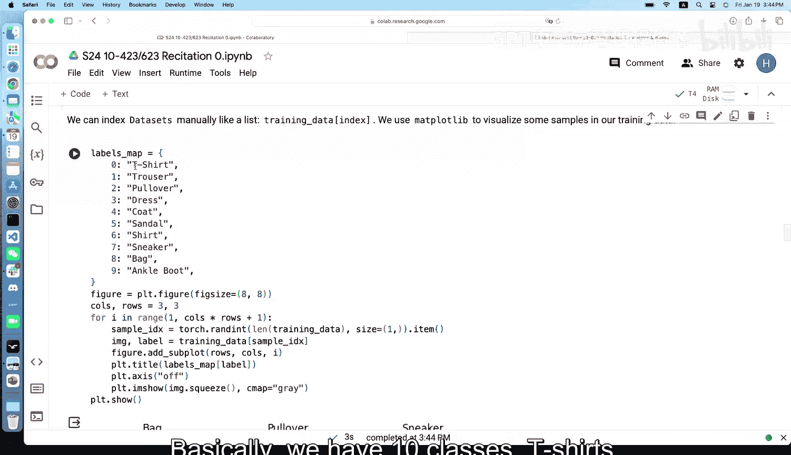

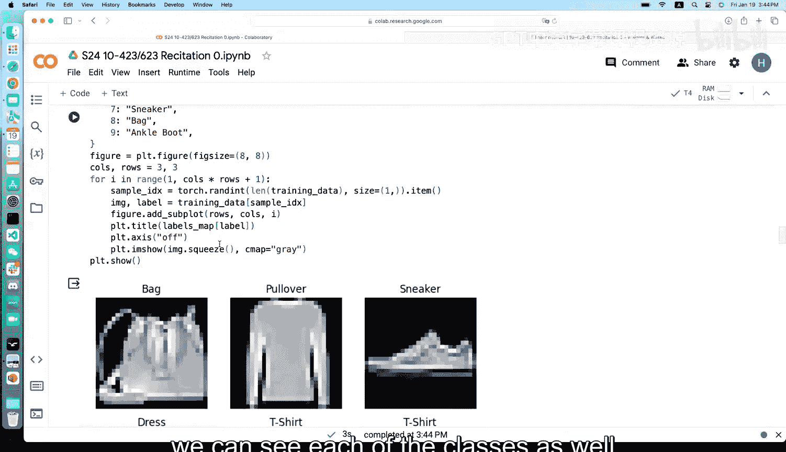

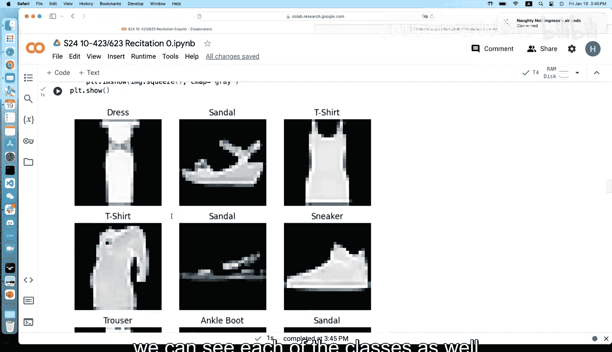

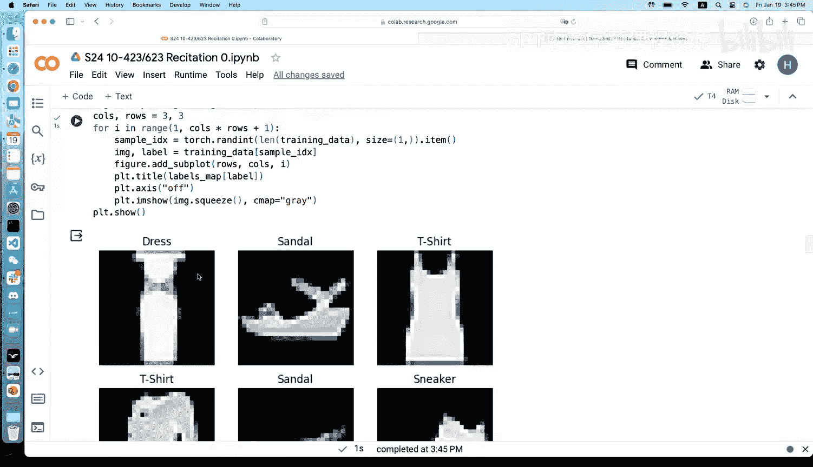

## 数据加载与处理 📂

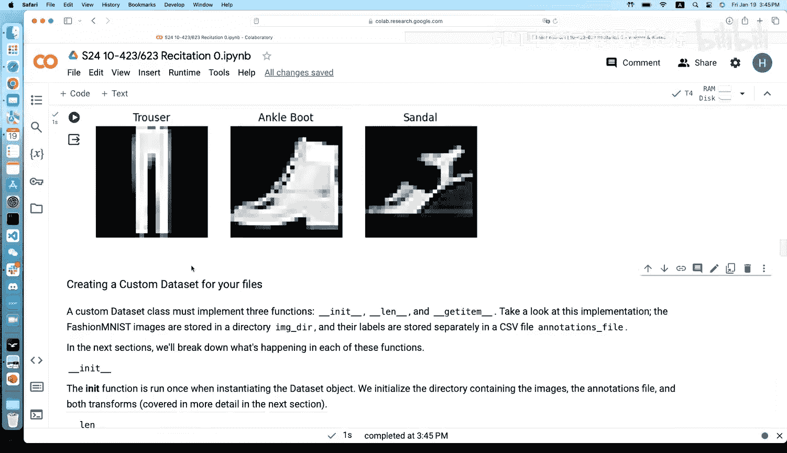

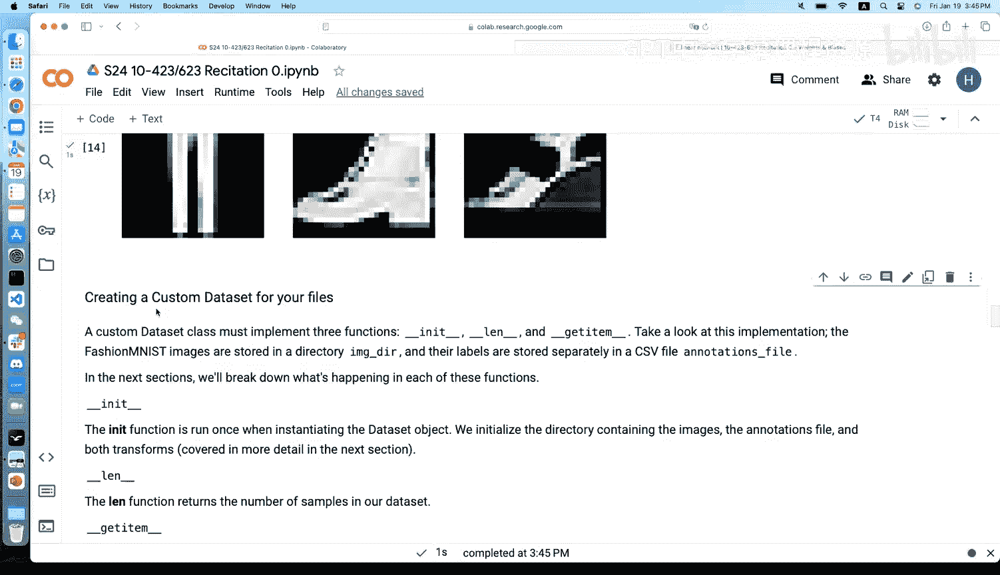

在训练模型前，需要有效地加载和组织数据。PyTorch提供了 `Dataset` 和 `DataLoader` 类来简化这一过程。

### 使用内置数据集
`torchvision` 库包含许多计算机视觉领域的常用数据集。

```python
import torchvision
from torchvision import transforms

# 定义图像转换（如转为张量、归一化）
transform = transforms.Compose([
    transforms.ToTensor(),
    transforms.Normalize((0.5,), (0.5,))
])

# 加载Fashion-MNIST数据集
train_dataset = torchvision.datasets.FashionMNIST(
    root='./data',
    train=True,
    download=True,
    transform=transform
)

test_dataset = torchvision.datasets.FashionMNIST(
    root='./data',
    train=False,
    download=True,
    transform=transform
)
```

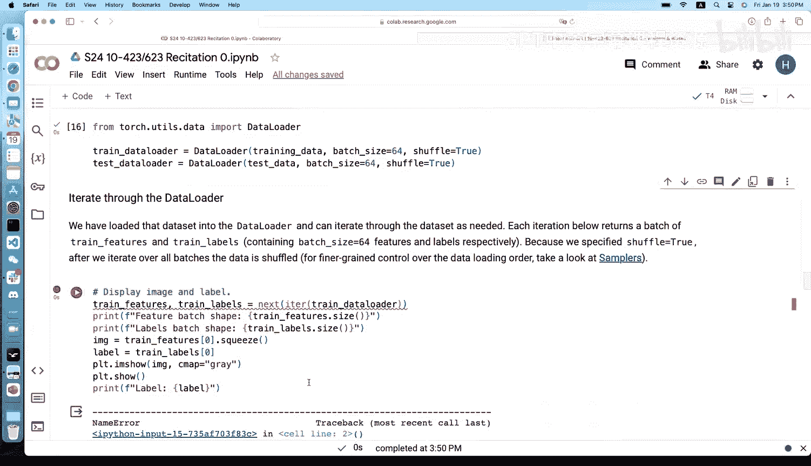

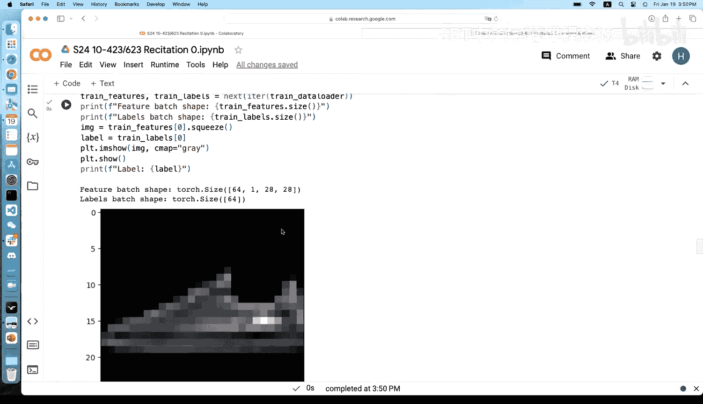

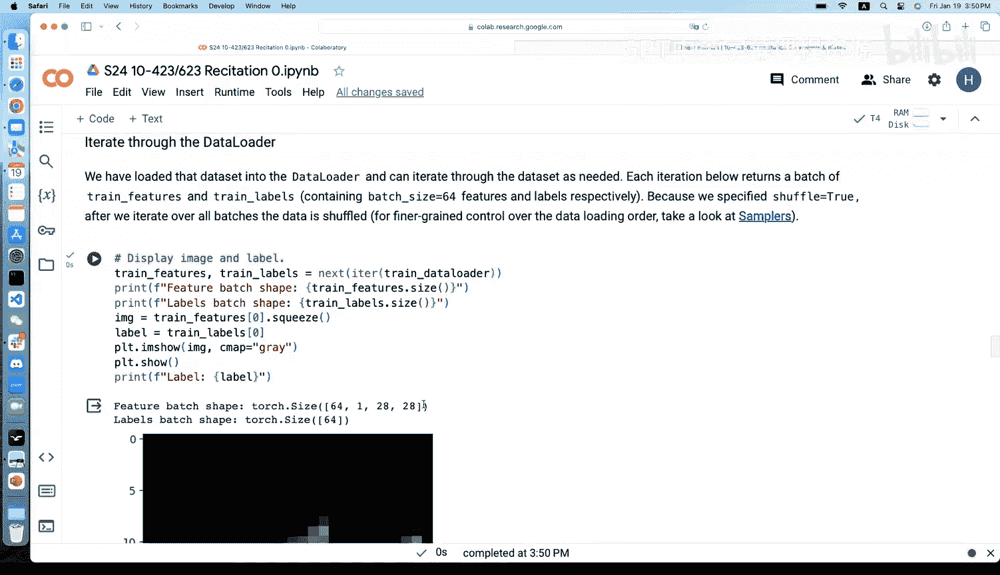

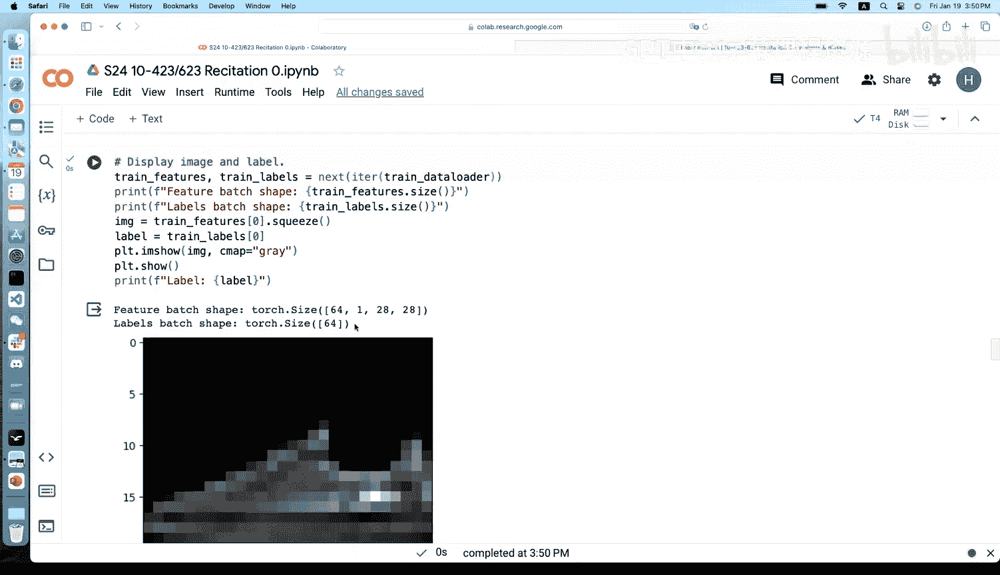

Fashion-MNIST数据集包含10类服装的灰度图像，训练集60000张，测试集10000张，每张图像大小为28x28。

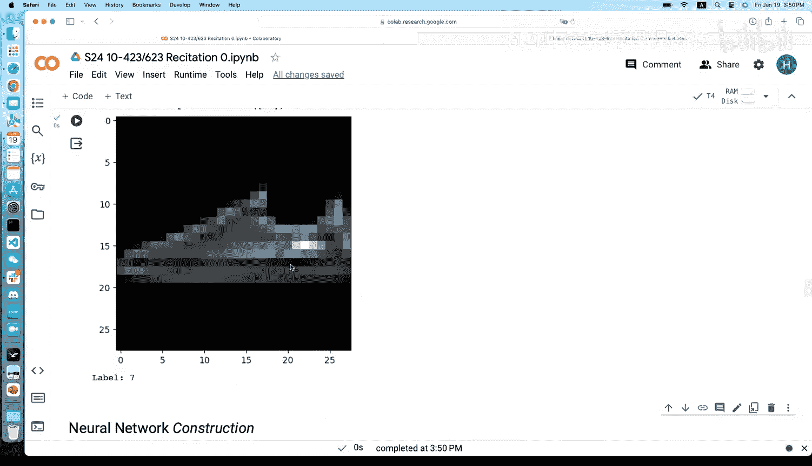

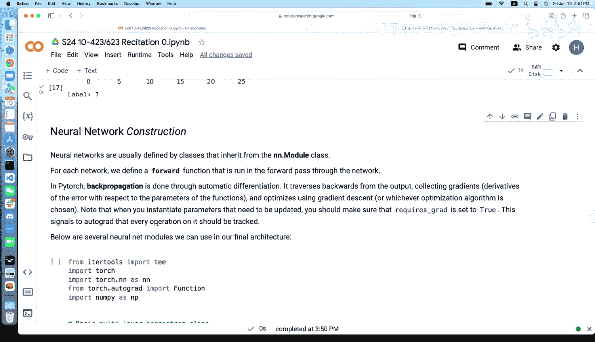

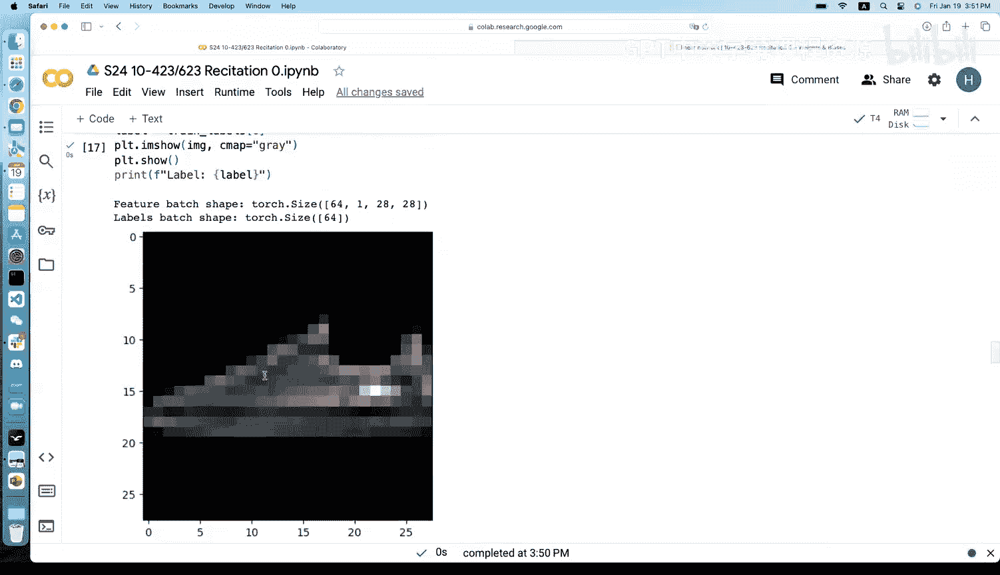

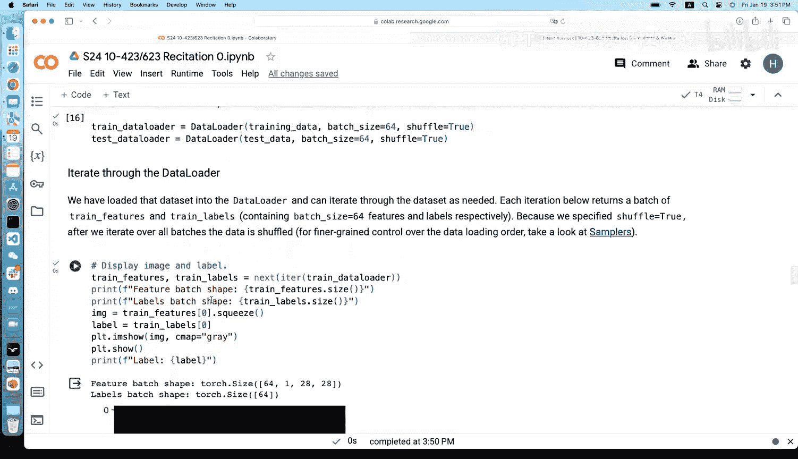

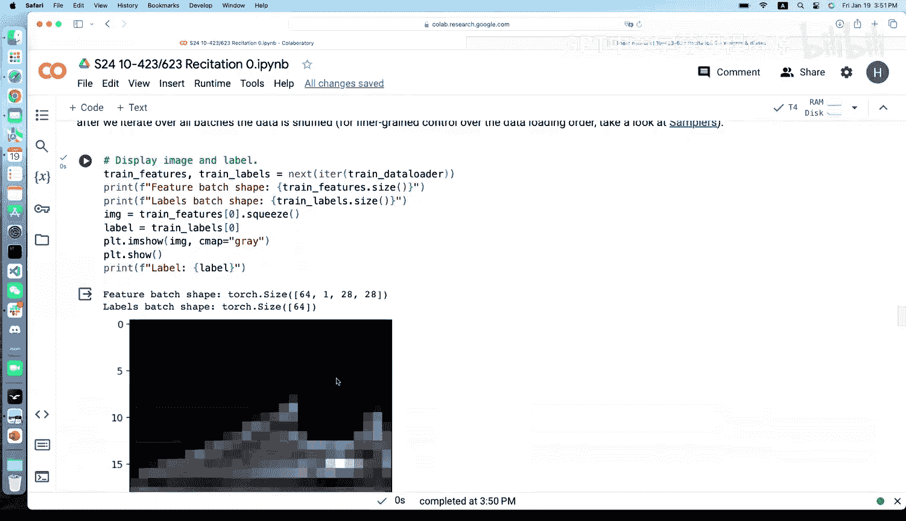

### 创建自定义数据集
对于自己的数据，可以通过继承 `torch.utils.data.Dataset` 类来创建数据集。

```python
from torch.utils.data import Dataset

class CustomDataset(Dataset):
    def __init__(self, feature_files, annotation_files, transform=None):
        # 初始化，加载文件路径等元数据
        self.features = feature_files
        self.labels = annotation_files
        self.transform = transform

    def __len__(self):
        # 返回数据集大小
        return len(self.features)

    def __getitem__(self, idx):
        # 根据索引加载单个样本（如图像）和标签
        feature = load_feature(self.features[idx]) # 需实现load_feature函数
        label = self.labels[idx]

        if self.transform:
            feature = self.transform(feature)

        return feature, label
```

**最佳实践**：对于大型数据集，建议在 `__getitem__` 方法中动态加载数据（如从磁盘读取图像），而不是在 `__init__` 中全部加载到内存。这样便于进行随机数据增强。

### 使用DataLoader
`DataLoader` 负责从 `Dataset` 中按批次抽取数据，并支持多进程加载、数据打乱等功能。

```python
from torch.utils.data import DataLoader

train_loader = DataLoader(
    train_dataset,
    batch_size=64,
    shuffle=True,      # 训练时打乱数据顺序
    num_workers=2      # 使用2个子进程加载数据
)

test_loader = DataLoader(
    test_dataset,
    batch_size=64,
    shuffle=False,     # 测试时通常不需要打乱
    num_workers=2
)

# 迭代数据
for batch_idx, (images, labels) in enumerate(train_loader):
    # images形状: [64, 1, 28, 28]
    # labels形状: [64]
    # ... 进行训练 ...
    pass
```

## 构建神经网络模型 🧠

在PyTorch中，神经网络通常通过继承 `torch.nn.Module` 类来定义。

### 定义基础模型
你需要定义 `__init__` 方法来初始化网络层，以及 `forward` 方法来定义前向传播过程。

```python
import torch.nn as nn
import torch.nn.functional as F

class SimpleMLP(nn.Module):
    def __init__(self, input_size=784, hidden_size=128, num_classes=10):
        super(SimpleMLP, self).__init__()
        self.fc1 = nn.Linear(input_size, hidden_size)
        self.fc2 = nn.Linear(hidden_size, num_classes)

    def forward(self, x):
        # 将图像展平
        x = x.view(-1, 28*28)
        x = F.relu(self.fc1(x))
        x = self.fc2(x)
        return x
```

**注意**：你只需定义 `forward` 方法。反向传播（计算梯度）由PyTorch的 `autograd` 系统自动处理，只需调用 `loss.backward()`。

### 自定义网络层
虽然不常用，但你可以通过继承 `nn.Module` 或 `torch.autograd.Function` 来创建自定义层。

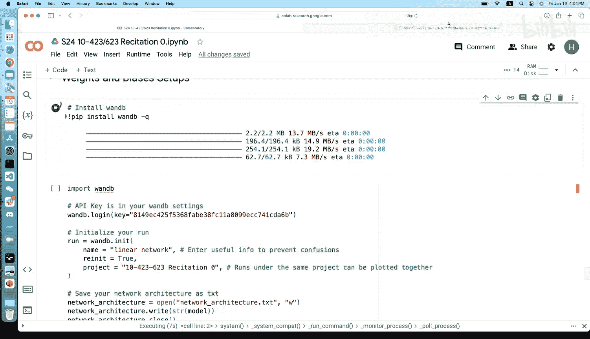

```python
class CustomLinearFunction(torch.autograd.Function):
    @staticmethod
    def forward(ctx, input, weight, bias=None):
        ctx.save_for_backward(input, weight, bias)
        output = input @ weight.t()
        if bias is not None:
            output += bias
        return output

    @staticmethod
    def backward(ctx, grad_output):
        input, weight, bias = ctx.saved_tensors
        grad_input = grad_weight = grad_bias = None
        # ... 计算梯度 ...
        return grad_input, grad_weight, grad_bias

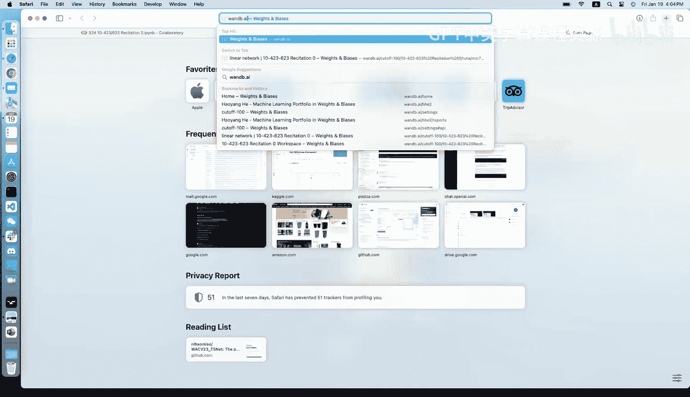

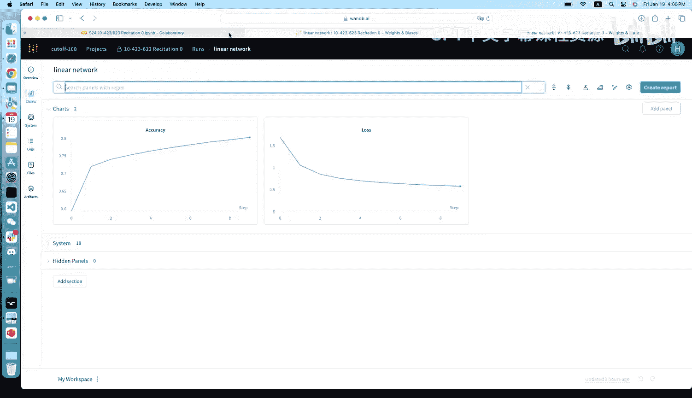

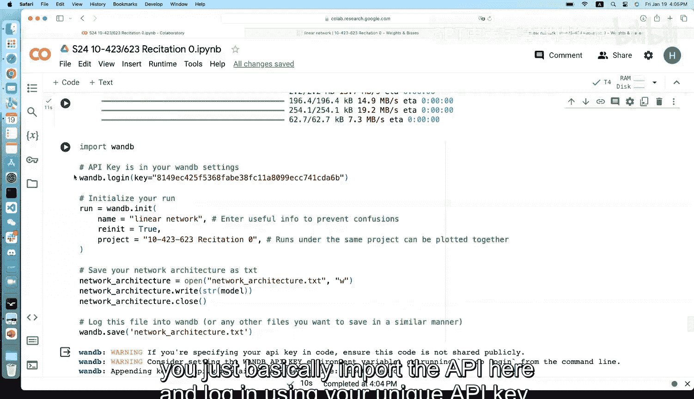

# 使用自定义函数封装成模块
class CustomLinear(nn.Module):
    def __init__(self, in_features, out_features):
        super().__init__()
        self.weight = nn.Parameter(torch.randn(out_features, in_features))
        self.bias = nn.Parameter(torch.randn(out_features))

    def forward(self, x):
        return CustomLinearFunction.apply(x, self.weight, self.bias)
```

### 评估指标与损失函数
以下是计算分类准确率的示例：

```python
def accuracy(predictions, labels):
    # predictions形状: [batch_size, num_classes]
    # labels形状: [batch_size]
    _, predicted = torch.max(predictions, dim=1) # 获取预测类别
    correct = (predicted == labels)
    acc = correct.float().mean() # 计算正确率
    return acc
```

对于损失函数，PyTorch提供了许多内置选项（如 `nn.CrossEntropyLoss`, `nn.MSELoss`）。你也可以自定义，但通常利用PyTorch的自动微分，只需用基本运算组合出损失计算即可。

## 模型训练与Weights & Biases日志记录 📊

现在，我们将把前面所有的部分组合起来，进行模型训练，并使用Weights & Biases（W&B）来记录实验过程。

### 初始化模型与W&B
首先，安装W&B库并初始化一个运行（run）。

```bash
pip install wandb
```

```python
import wandb

# 登录W&B（需要API Key，在wandb.ai官网获取）
wandb.login(key='your_api_key_here')

# 初始化一个W&B运行
wandb.init(
    project="my-first-project", # 项目名称，用于分组实验
    name="simple-mlp-run-1",    # 本次运行的名称
    config={                    # 记录超参数
        "learning_rate": 0.001,
        "batch_size": 64,
        "epochs": 10
    }
)

# 实例化模型、损失函数和优化器
model = SimpleMLP()
criterion = nn.CrossEntropyLoss()
optimizer = torch.optim.Adam(model.parameters(), lr=0.001)

# 将模型架构保存为文件并记录到W&B
torch.save(model.state_dict(), 'model_architecture.pth')
wandb.save('model_architecture.pth')
```

### 训练循环
在训练循环中，关键步骤包括设置训练模式、将数据移至GPU、前向传播、计算损失、反向传播和优化器更新。

```python
device = torch.device('cuda' if torch.cuda.is_available() else 'cpu')
model.to(device)

num_epochs = 10
for epoch in range(num_epochs):
    model.train()  # 设置为训练模式（影响Dropout、BatchNorm等层）
    running_loss = 0.0
    running_acc = 0.0

    for batch_idx, (images, labels) in enumerate(train_loader):
        # 1. 将数据移至GPU
        images, labels = images.to(device), labels.to(device)

        # 2. 梯度清零
        optimizer.zero_grad()

        # 3. 前向传播
        outputs = model(images)
        loss = criterion(outputs, labels)
        acc = accuracy(outputs, labels)

        # 4. 反向传播
        loss.backward()

        # 5. 优化器更新参数
        optimizer.step()

        # 记录批次损失和准确率
        running_loss += loss.item()
        running_acc += acc.item()

    # 计算平均损失和准确率
    epoch_loss = running_loss / len(train_loader)
    epoch_acc = running_acc / len(train_loader)

    # 6. 记录到W&B
    wandb.log({
        "epoch": epoch,
        "train_loss": epoch_loss,
        "train_accuracy": epoch_acc
    })

    print(f'Epoch [{epoch+1}/{num_epochs}], Loss: {epoch_loss:.4f}, Acc: {epoch_acc:.4f}')

    # 7. （可选）保存模型检查点
    checkpoint = {
        'epoch': epoch,
        'model_state_dict': model.state_dict(),
        'optimizer_state_dict': optimizer.state_dict(),
        'loss': epoch_loss,
    }
    torch.save(checkpoint, f'checkpoint_epoch_{epoch}.pth')
    wandb.save(f'checkpoint_epoch_{epoch}.pth') # 备份到W&B云端
```

### W&B仪表板
训练开始后，你可以在W&B网站查看实时更新的图表：
*   **损失和准确率曲线**：自动根据 `wandb.log()` 记录的数据生成。
*   **系统资源监控**：如GPU、CPU和内存使用情况。
*   **记录的文件**：包括保存的模型架构文件和检查点。
*   **控制台日志**：训练过程中打印的信息也会被记录。

**重要提示**：在Colab等临时环境中，将检查点保存到W&B云端至关重要，这样即使运行时断开连接，也能恢复训练。

### 模型评估
训练完成后，在测试集上评估模型性能。

```python
model.eval()  # 设置为评估模式
test_loss = 0.0
test_acc = 0.0

with torch.no_grad():  # 禁用梯度计算，节省内存和计算资源
    for images, labels in test_loader:
        images, labels = images.to(device), labels.to(device)
        outputs = model(images)
        loss = criterion(outputs, labels)
        acc = accuracy(outputs, labels)

        test_loss += loss.item()
        test_acc += acc.item()

test_loss /= len(test_loader)
test_acc /= len(test_loader)

print(f'Test Loss: {test_loss:.4f}, Test Acc: {test_acc:.4f}')
wandb.log({"final_test_loss": test_loss, "final_test_accuracy": test_acc})

# 结束W&B运行
wandb.finish()
```

## 总结 🎯

本节课中我们一起学习了PyTorch和Weights & Biases的核心基础：

1.  **PyTorch张量**：学习了如何创建和操作张量，这是构建所有计算的基础。
2.  **自动微分**：理解了PyTorch如何通过 `autograd` 自动计算梯度，这是训练神经网络的关键。
3.  **数据管道**：掌握了使用 `Dataset` 和 `DataLoader` 高效加载和处理数据的方法。
4.  **神经网络构建**：学会了通过继承 `nn.Module` 来定义自己的模型结构。
5.  **训练流程**：实现了完整的训练循环，包括前向传播、损失计算、反向传播和参数更新。
6.  **实验跟踪**：使用Weights & Biases记录超参数、指标、日志和模型文件，实现了实验的可视化与管理。

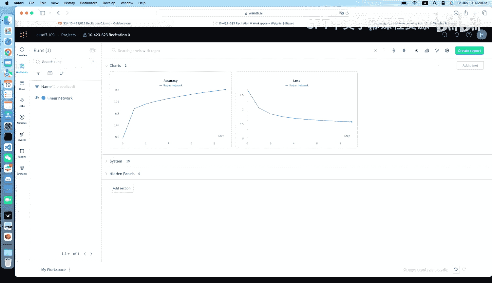


掌握这些基础知识，将为你顺利完成本课程的作业和深入理解生成式AI模型打下坚实的基础。