# 31：构建你自己的Transformer模型 🧠

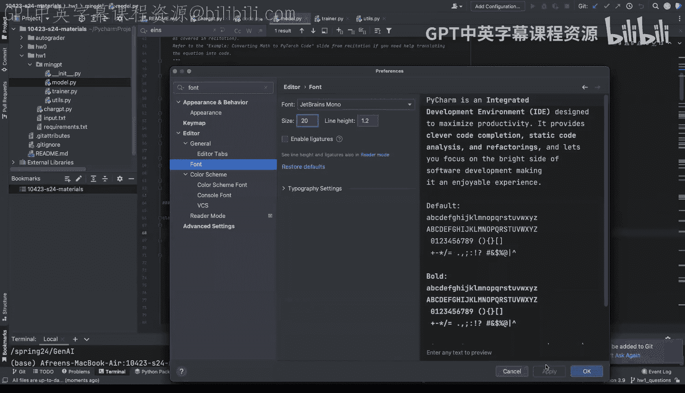

在本节课中，我们将学习如何从零开始构建一个基于Transformer的GPT模型。我们将使用莎士比亚的作品作为训练数据，并逐步了解模型的结构、数据加载、训练流程以及需要你实现的核心功能。

## 概述

我们将使用一个名为 `minGPT` 的代码库。它包含几个核心文件，我们将逐一介绍它们的功能。你的主要任务是修改 `model.py` 文件，以实现诸如旋转位置编码和分组查询注意力等高级功能。

## 代码结构

以下是起始代码的文件夹结构：

*   `minGPT/`：主文件夹。
    *   `model.py`：**这是你需要修改的主要文件**，包含了模型的核心架构。
    *   `trainer.py`：负责训练循环（前向传播、反向传播、权重更新）。
    *   `utils.py`：处理日志记录和配置的辅助文件。
*   `cadgpt.py`：主运行文件，你不需要修改它。
*   `input.txt`：训练数据（莎士比亚全集）。

### 数据加载与处理

`cadgpt.py` 文件首先会加载数据。为了简化，我们的词表大小仅为65，对应莎士比亚作品中使用的所有字符（包括大小写字母、标点和空格）。数据集的功能是将每个字符映射为一个整数，然后将这些整数序列分割成块，供模型训练。

**核心概念**：字符级词表映射。
```python
# 伪代码示例：将字符映射为索引
vocab = {‘a‘: 0, ‘b‘: 1, ..., ‘ ‘: 64}
```

使用小词表的好处是模型参数量更少，训练更快。未来你可以将其替换为更复杂的子词分词器。

### 训练流程

`trainer.py` 文件实现了标准的训练循环：
1.  从数据加载器中获取一个批次的数据。
2.  将模型设置为训练模式。
3.  执行前向传播，计算损失。
4.  执行反向传播，更新模型权重。
5.  循环上述步骤直至达到最大迭代次数。

你不需要修改这个文件，它已经提供了完整的训练逻辑。

### 模型架构

现在，让我们深入 `model.py`，看看Transformer模型是如何构建的。

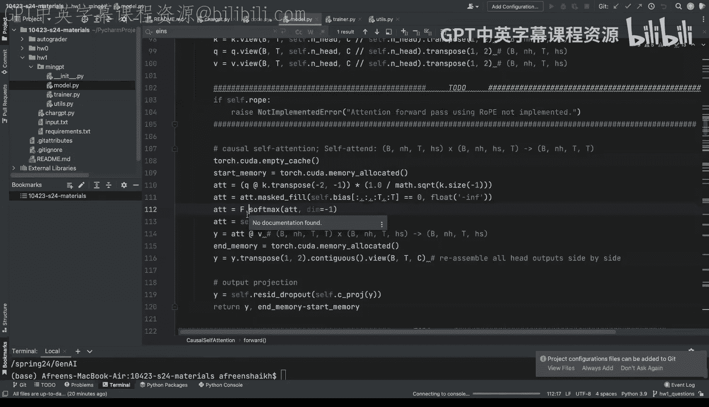

`model.py` 中定义了一个 `GPT` 类。它的结构如下：
1.  **输入嵌入层**：将输入的词元索引映射为向量。
2.  **Dropout层**：用于正则化，防止过拟合。
3.  **Transformer块列表**：模型的核心，由多个相同的块堆叠而成。
4.  **输出线性层**：将最终的隐藏状态映射回词表大小的输出。

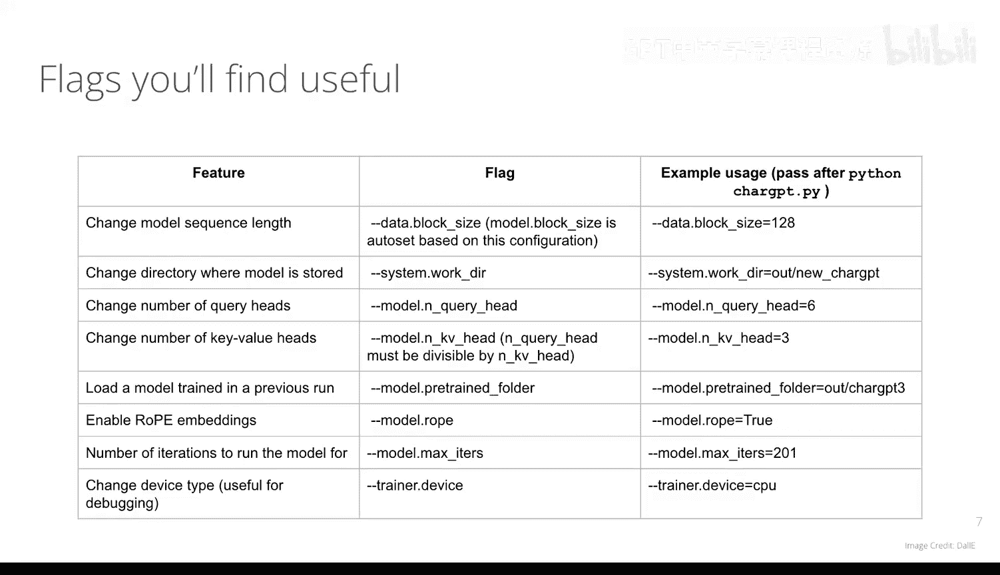

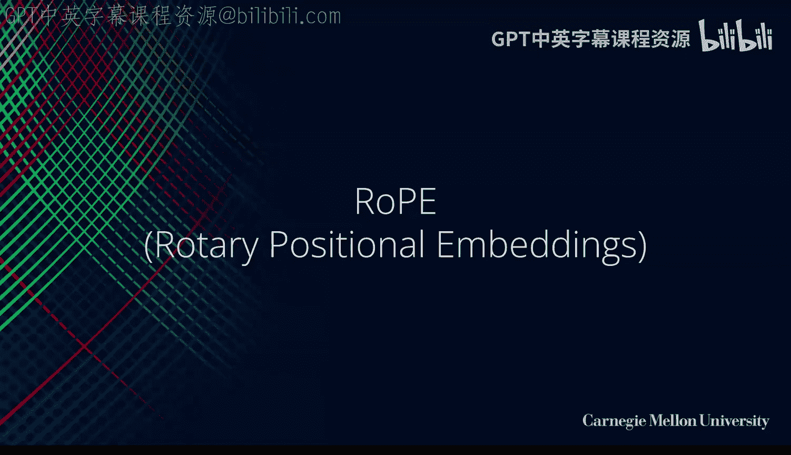

每个 **Transformer块** 又包含两个主要部分：
*   **自注意力层**：计算输入序列中各个位置之间的关系。
*   **前馈神经网络**：一个简单的两层线性网络，用于非线性变换。

前向传播时，输入依次通过嵌入层、各个Transformer块，最后通过输出层。代码中还包含了对注意力计算时间和内存消耗的测量，这将用于后续的性能分析。

## 注意力机制详解

上一节我们介绍了模型的整体结构，本节中我们来看看其核心组件——因果自注意力机制。

### 因果自注意力

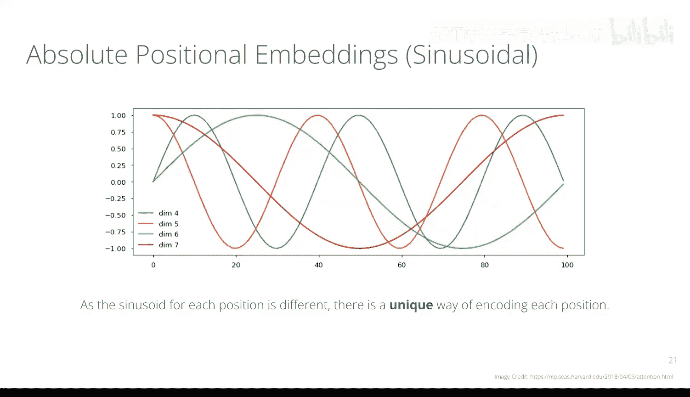

在 `model.py` 的 `CausalSelfAttention` 类中实现了注意力机制。其步骤如下：

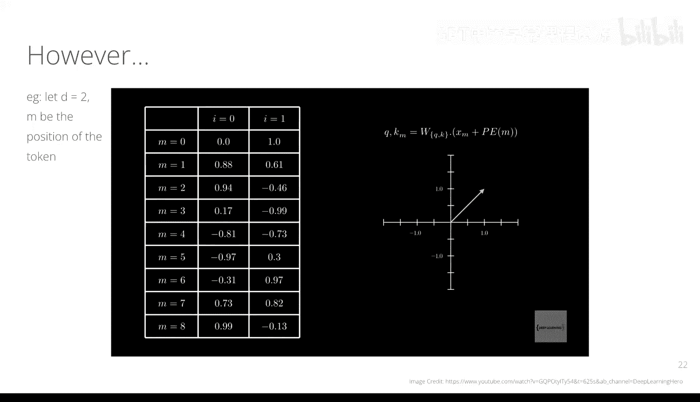

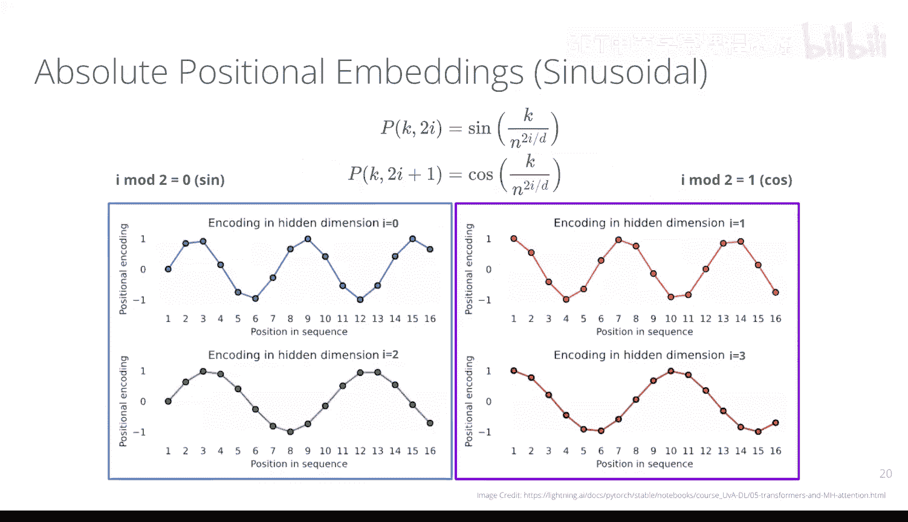

1.  **线性投影**：输入 `X` 通过一个线性层，同时被投影为查询、键和值矩阵。代码中通过一个线性层输出后再分割，这比使用三个独立的层更高效。
    ```python
    # 伪代码：Q, K, V = split(linear(X))
    ```
2.  **维度重排**：为了计算效率，将张量维度调整为 `(batch, heads, seq_len, head_dim)`，确保计算维度在最右侧。
3.  **注意力计算**：计算 `Q` 和 `K` 的点积，得到原始注意力分数。
4.  **应用掩码**：为了防止模型在训练时“偷看”未来的信息，我们需要应用一个因果掩码。这将未来位置（即当前词元之后的位置）的注意力分数设置为一个非常大的负数（如 `-1e9`），这样在后续的 softmax 操作中，这些位置的权重会接近于零。
    ```python
    # 伪代码：mask = torch.tril(torch.ones(seq_len, seq_len))
    ```
5.  **Softmax与Dropout**：对掩码后的注意力分数进行缩放（除以 `sqrt(head_dim)`），应用 softmax 归一化得到注意力权重，然后使用 dropout 进行正则化。
6.  **加权求和**：将注意力权重与值矩阵 `V` 相乘，得到每个位置的上下文感知表示。
7.  **输出投影**：将多个注意力头的输出拼接起来，并通过一个最终的线性投影层。

在实现分组查询注意力时，你需要深刻理解这段代码，因为其核心逻辑是相似的。

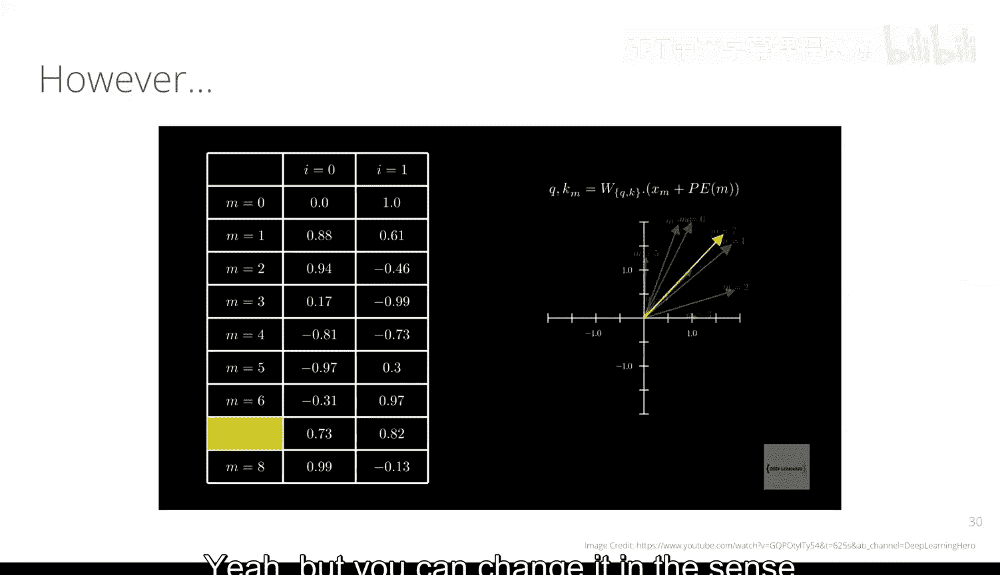

## 旋转位置编码

上一节我们了解了标准的注意力机制，本节中我们来看看如何让模型感知词元的位置信息，特别是通过**旋转位置编码**。

### 为什么需要位置编码？

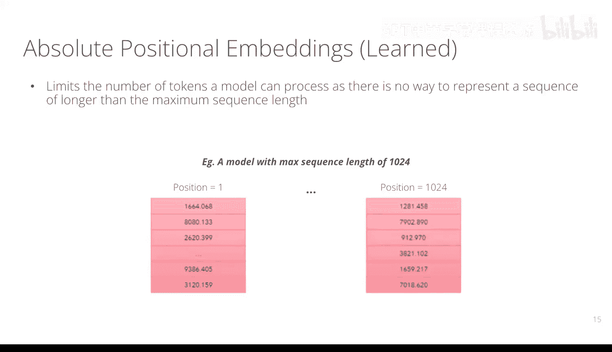

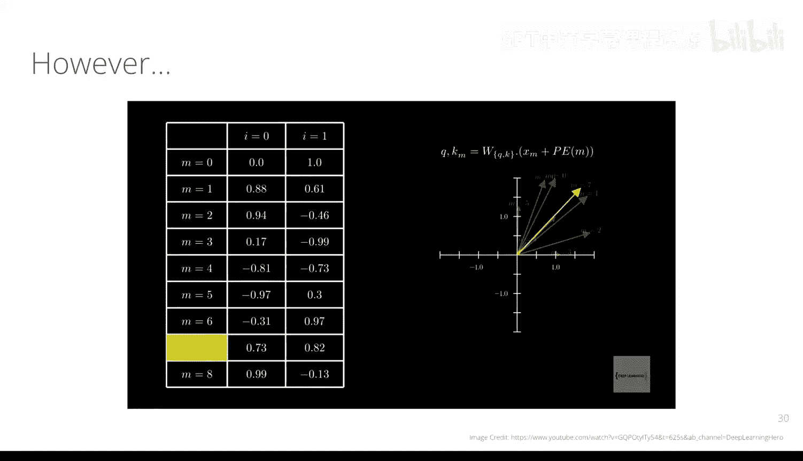

标准的注意力机制对输入顺序是不敏感的。例如，句子“Your cat is a lovely cat”中，两个“cat”在初始嵌入中是相同的。但第一个“cat”是主语，第二个是宾语，位置信息至关重要。因此，我们需要向模型注入位置信息。

### 位置编码的类型

主要有两种类型：
1.  **绝对位置编码**：为序列中的每个绝对位置学习或计算一个固定的向量，然后加到词嵌入上。
    *   **学习式嵌入**：直接作为模型参数学习。缺点是模型无法处理比训练时更长的序列。
    *   **正弦编码**：使用正弦和余弦函数生成固定模式的位置编码，具有一定的外推性，但距离关系不直观。
2.  **相对位置编码**：编码词元之间的相对距离。虽然更符合直觉，但计算更复杂，通常需要在注意力计算中引入额外的项，导致速度较慢。

### 旋转位置编码

RoPE 巧妙地通过**旋转矩阵**将绝对位置信息编码到查询和键向量中，使得注意力分数仅依赖于它们的相对位置。

**核心思想**：对于一个位置为 `m` 的词元嵌入向量 `x`，我们将其视为二维空间中的一组点对 `(x_i, x_{i+1})`。RoPE 使用一个旋转矩阵 `R` 对这个点对进行旋转，旋转角度 `θ` 与位置 `m` 和维度 `i` 相关。
```python
# 二维旋转矩阵公式
R = [[cosθ, -sinθ],
     [sinθ,  cosθ]]
```
对于高维向量，我们将其分成若干二维子空间，分别应用旋转。最终，经过旋转的查询 `q` 和键 `k` 的点积会自然地包含它们的位置差信息。

**优势**：
*   **外推性好**：可以处理比训练序列更长的输入。
*   **相对性**：注意力分数自动包含相对位置信息，无需修改注意力计算式。
*   **性能佳**：被 LLaMA、GPT-NeoX 等众多先进模型采用，能带来更快的收敛速度和更低的验证损失。

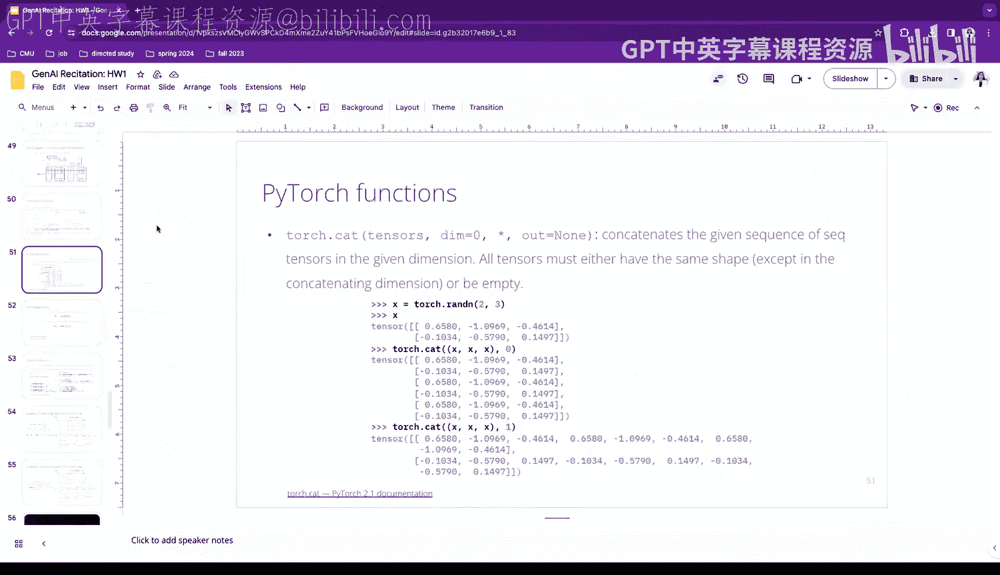

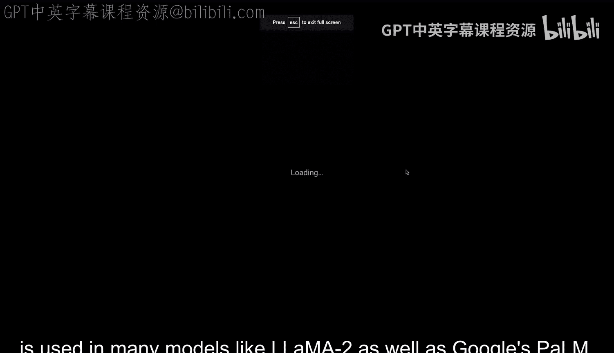

在作业中，你将在注意力计算前，对查询和键应用 RoPE。

## 分组查询注意力

上一节我们探讨了如何改进位置编码，本节我们来看如何优化注意力机制本身，以在性能和效率间取得平衡，即**分组查询注意力**。

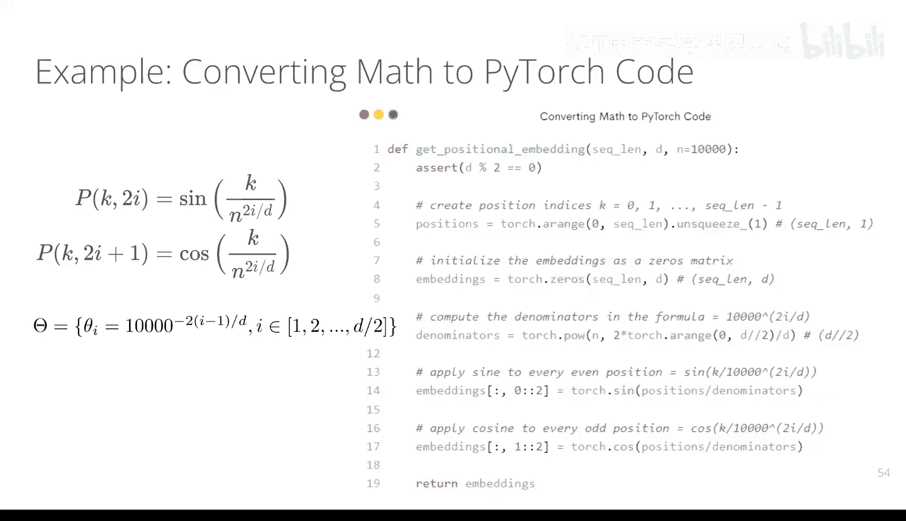

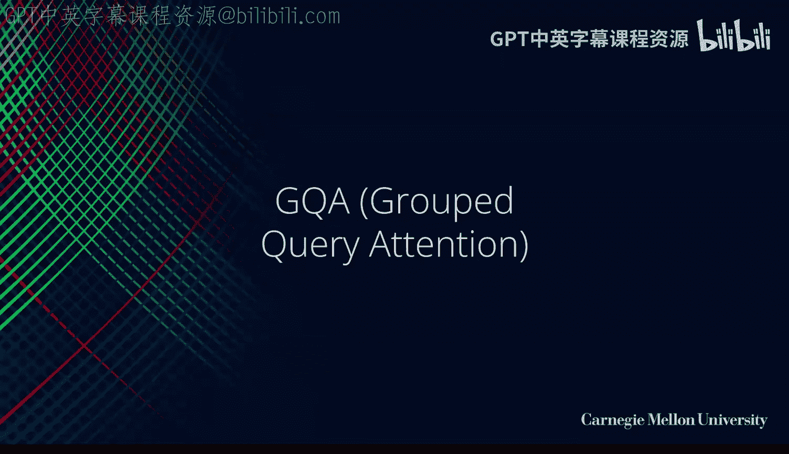


### 从多头注意力到多查询注意力

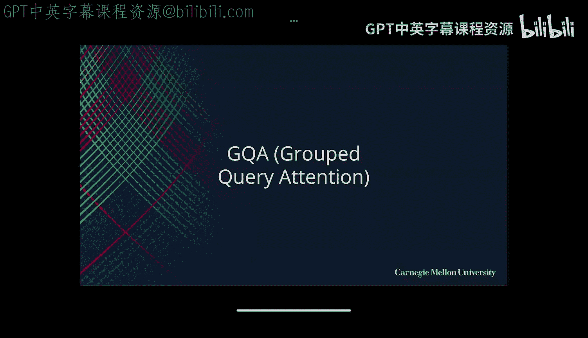

*   **多头注意力**：将模型维度分割成 `H` 个头，每个头有独立的 `Q, K, V` 矩阵。计算精度高，但存储所有头的 `K, V` 缓存需要大量内存，特别是在长序列生成时。
*   **多查询注意力**：所有头**共享**同一个 `K` 和 `V` 矩阵。这大幅减少了内存占用和推理时间，但可能导致模型容量下降，性能受损。

### 分组查询注意力

GQA 是两者的折中方案。它将查询头分成 `G` 个组，**每个组共享一套 `K` 和 `V` 矩阵**。

**工作原理**：
1.  假设有 `H_q` 个查询头，`H_kv` 个键值头（`H_kv < H_q`）。
2.  将 `H_q` 个查询头分成 `G = H_kv` 个组。
3.  每个组内的查询头共享同一套 `K` 和 `V`。
4.  注意力计算仍在每个查询头上独立进行，但使用的 `K` 和 `V` 来自其所属的组。

**优势**：
*   **内存效率**：介于 MHA 和 MQA 之间，显著减少了 `K, V` 缓存。
*   **性能**：通过分组保留了一定的模型容量，性能通常优于 MQA，接近 MHA。
*   **推理速度**：比 MHA 更快。

在作业中，你需要修改注意力代码，实现分组查询注意力机制。

## 滑动窗口注意力

最后，我们简要介绍另一种用于处理长序列的技术——**滑动窗口注意力**，它将在作业的书面部分涉及。

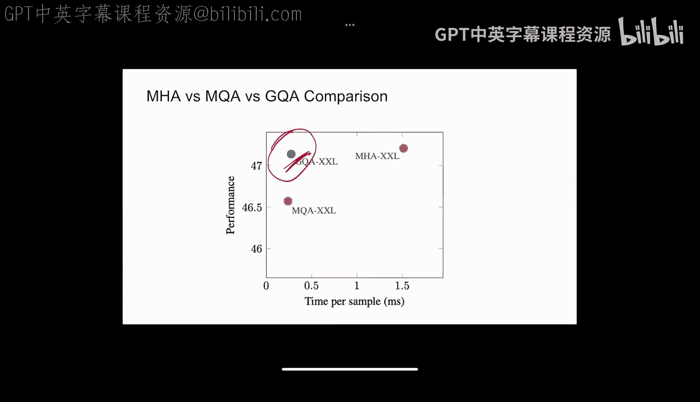

### 动机

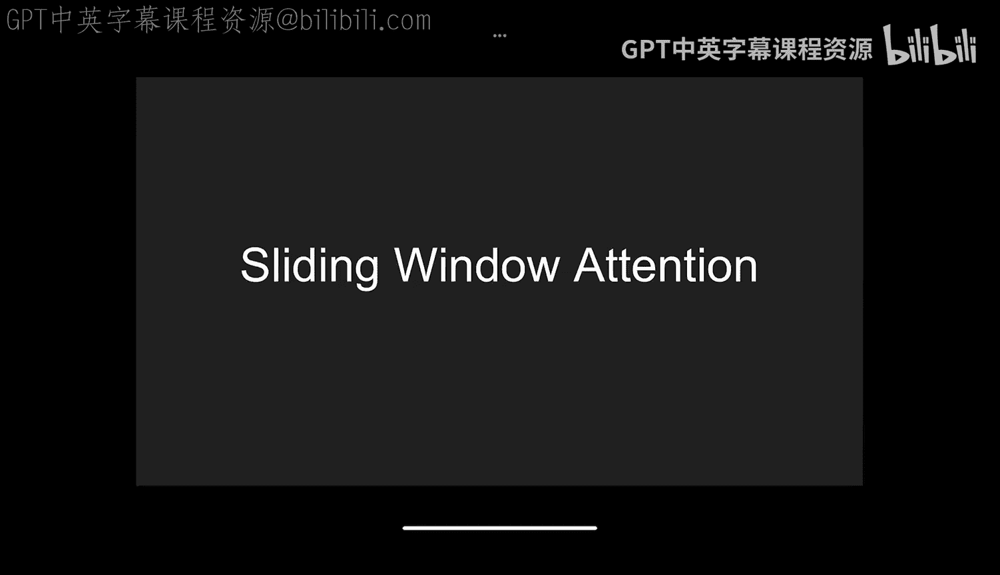

标准的全注意力时间复杂度为 `O(n²)`，对于长文档（如数十页文本）来说，计算和内存开销是无法承受的。

### 实现

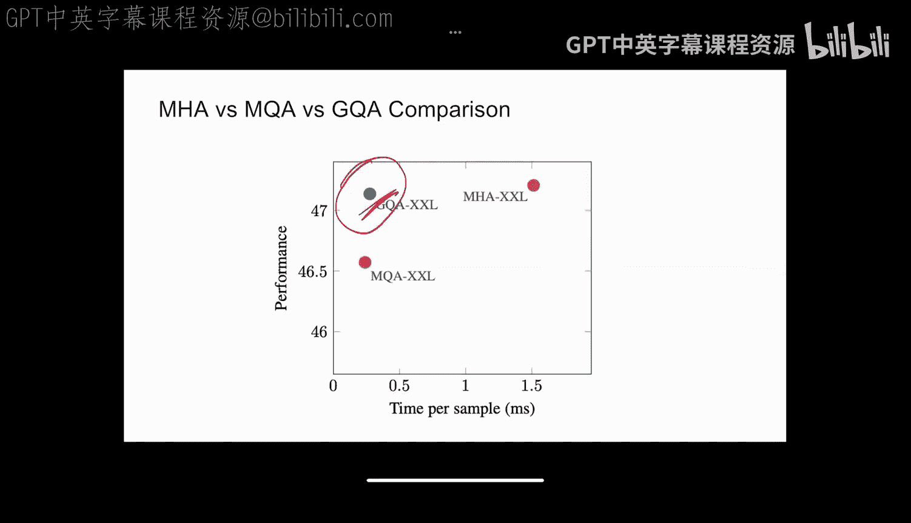

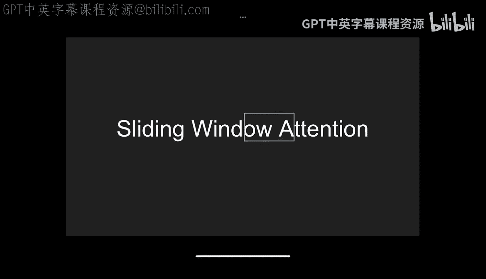

滑动窗口注意力限制每个词元只关注其前后一定窗口大小 `W` 内的词元。
*   **因果滑动窗口**：在生成任务中，每个词元只关注其左侧的 `W` 个词元。
*   **复杂度**：时间复杂度降低到 `O(n * W)`。当 `W` 远小于 `n` 时，近似为线性复杂度。

**信息传递**：虽然单层只能看到局部窗口，但通过堆叠多个注意力层，高层词元可以间接地接收到更远距离词元的信息（类似于感受野的扩大）。

**注意**：一个简单的实现可能仍然会计算完整的 `n x n` 注意力矩阵然后掩码，但这并不能节省内存。高效的实现需要避免计算被掩码的部分。

## 有用的工具函数

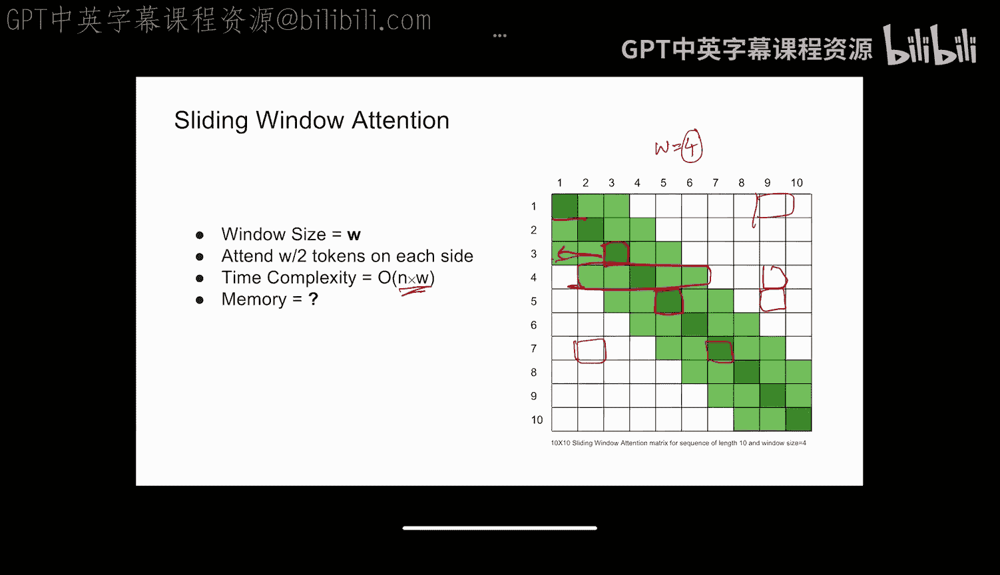

在实现上述功能时，以下两个函数可能会非常有用：

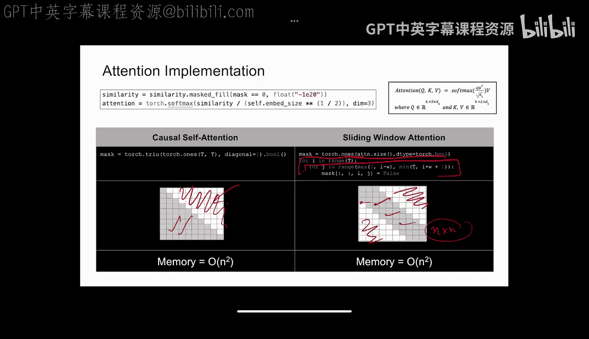

1.  **`rearrange` (来自 `einops` 库)**：可以直观地描述张量的维度重排和重塑操作，比一连串的 `permute` 和 `view` 更清晰。
2.  **`einsum`**：用于简洁地表示复杂的张量运算（如矩阵乘法、求和等）。`torch.einsum` 和 `einops.einsum` 功能类似，后者允许使用更易读的维度名。

## 总结

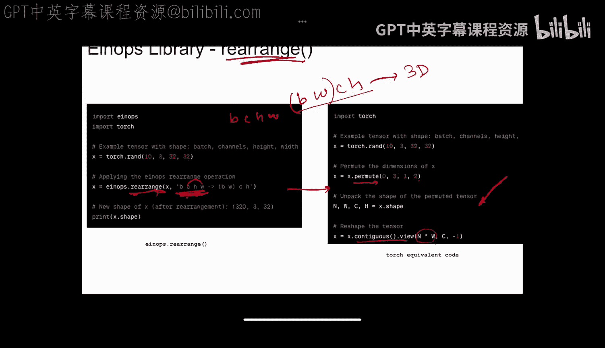

本节课我们一起学习了构建一个简易GPT模型的完整流程：
1.  我们了解了代码库的结构和数据预处理方式。
2.  我们深入分析了Transformer模型的核心架构，特别是因果自注意力机制。
3.  我们探讨了**旋转位置编码**的原理与优势，它是让模型感知位置信息的关键。
4.  我们学习了**分组查询注意力**，这是一种在模型性能和推理效率之间取得平衡的有效技术。
5.  我们简介了用于处理长序列的**滑动窗口注意力**。
6.  最后，我们介绍了一些能简化实现的工具函数。

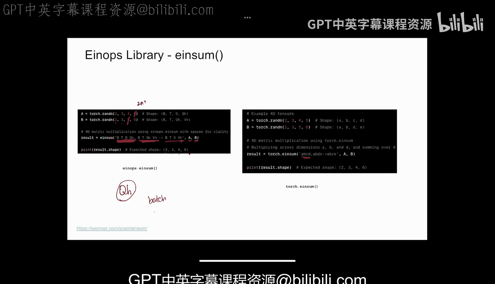

你的主要编码任务是在 `model.py` 中实现 RoPE 和 GQA。建议先在本地CPU上调试代码，确保无误后再上传到Colab等GPU环境进行实验和性能测量。祝你编码顺利！