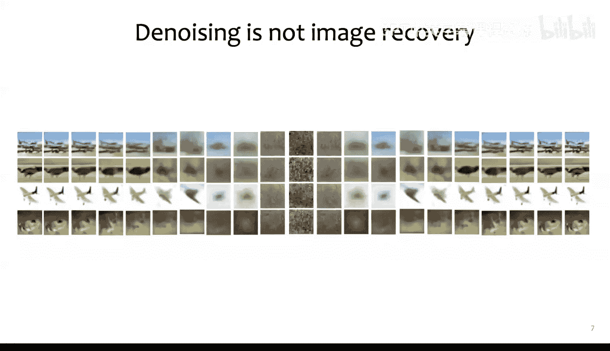
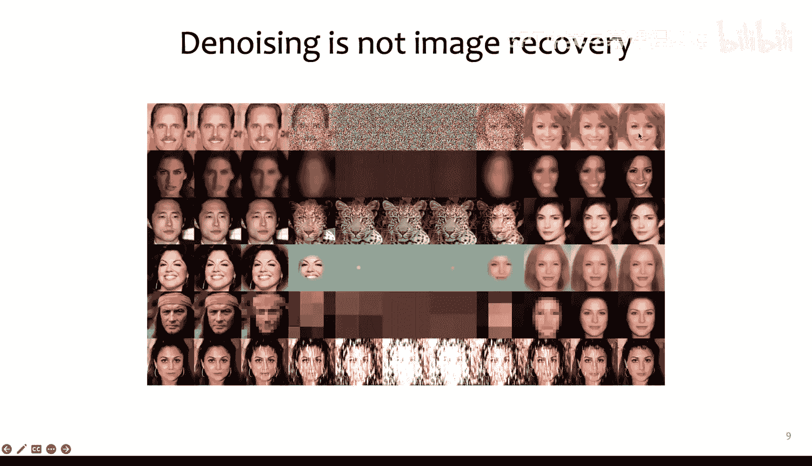
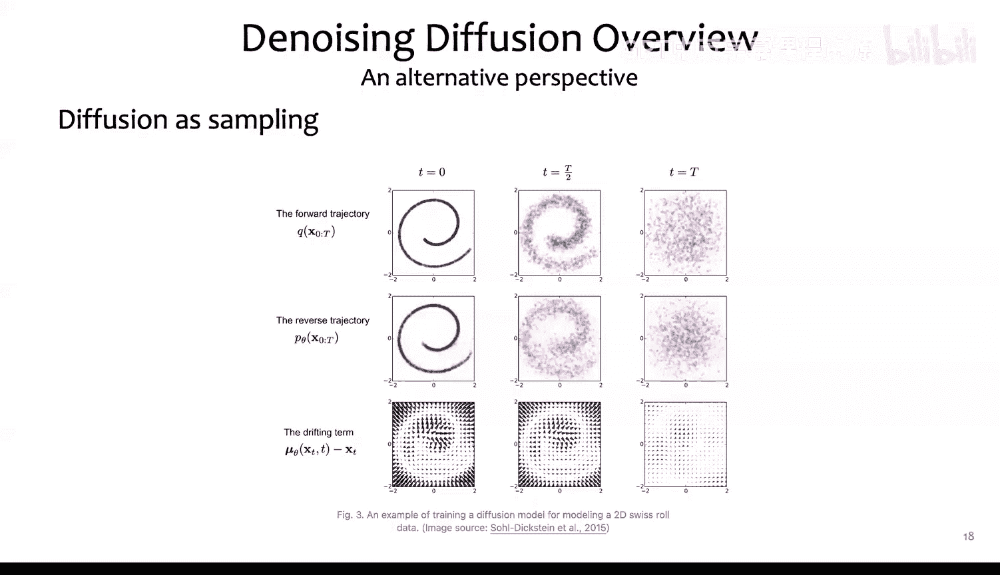
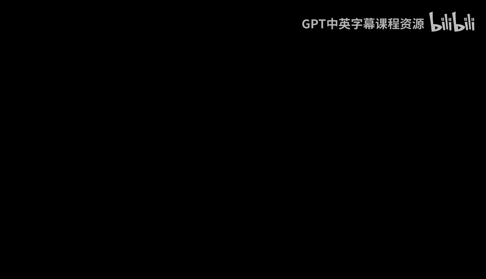
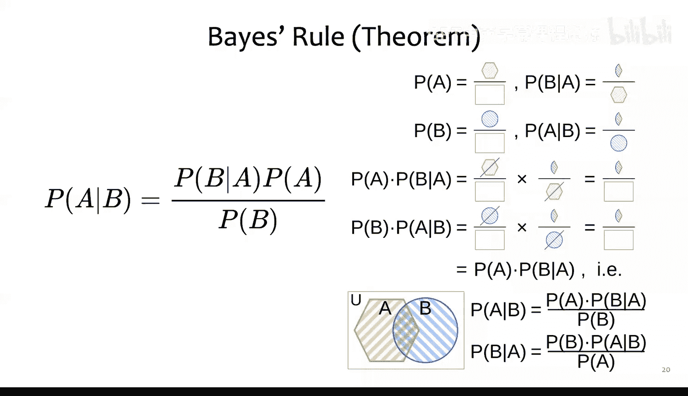
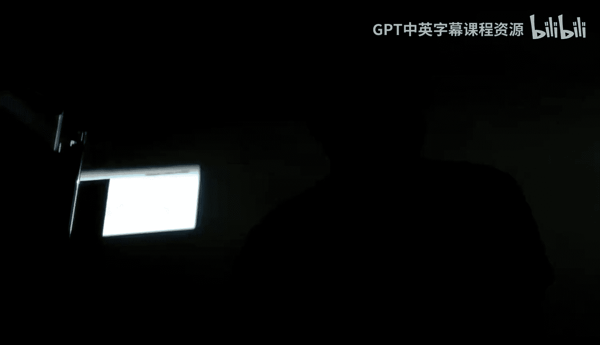
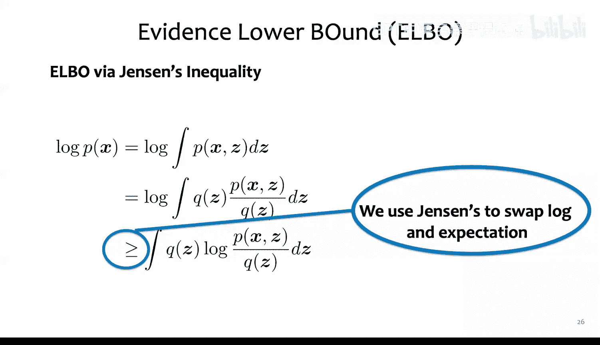
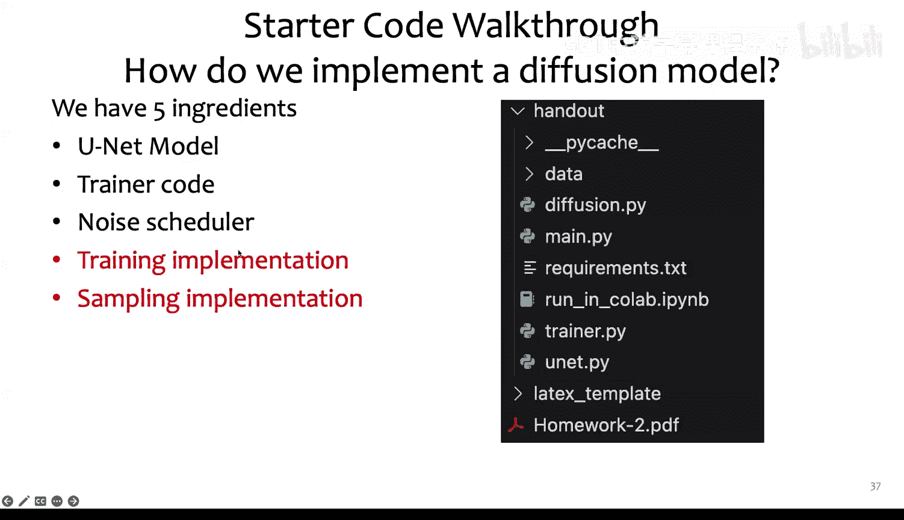
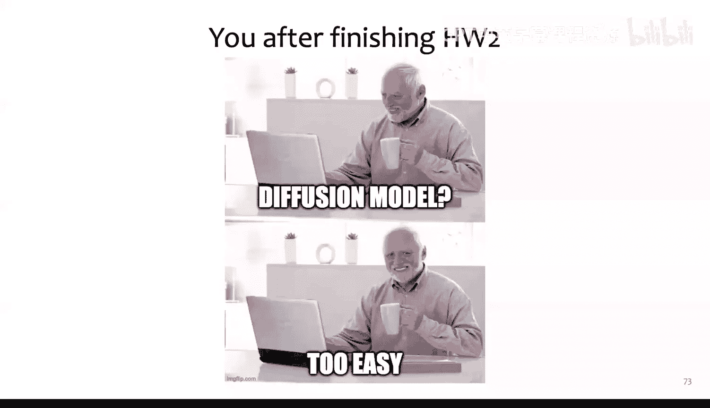

# 32：扩散模型与作业二辅导

在本节课中，我们将学习扩散模型的核心概念、相关数学原理，并了解作业二的编程实现细节。课程内容涵盖扩散模型概述、数学证明、代码结构、评估指标以及实用编程技巧。

## 扩散模型概述

上一节我们介绍了课程安排，本节中我们来看看扩散模型的基本概念。

在扩散模型中，我们有一个前向扩散过程和一个反向扩散过程。前向扩散过程随时间逐步向图像添加噪声，直到图像完全被破坏。反向扩散过程则使用一个神经网络（通常是U-Net）来逐步去除噪声，从而恢复或生成图像。

需要明确的是，前向扩散与神经网络的前向传播是不同的概念。前向扩散是添加噪声的过程，而神经网络的前向传播是计算网络输出的过程。





扩散模型的前向过程是一个马尔可夫链，即每一步只依赖于前一步的状态。反向过程，在我们当前讨论的版本中，通常也被建模为只依赖于前一步的马尔可夫链。

我们的目标是训练一个U-Net网络，使其能够学习从噪声图像中去除噪声，从而执行反向扩散过程。这里，`x_0` 代表无噪声的原始图像，而 `x_T` 代表完全被噪声破坏的图像。

一个常见的误解是，去噪过程仅仅是移除了之前添加的“垃圾”信息，从而恢复原始图像。实际上，经过反向扩散生成的图像通常是全新的，并非训练集中的某张图片。这表明模型学习的是图像数据本身的分布，而非简单的记忆和恢复。

## 理解扩散：从噪声到信息



上一节我们澄清了扩散模型并非简单的图像恢复，本节中我们来看看如何从另一个角度理解扩散过程。

我们可以将一张图像视为一个高维空间中的向量。例如，一张32x32的RGB图像可以展开成一个3072维的向量。流形假设认为，所有可能的有效图像（例如所有猫的图片）构成了这个高维空间中的一个低维流形（子空间）。我们的目标是从这个复杂的图像分布中采样。



然而，直接定义和从这个分布中采样非常困难。扩散模型提供了一种解决方案：它从一个易于采样的简单分布（如高斯分布）开始，然后学习沿着目标图像分布梯度的方向移动，最终到达高概率区域（即有效的图像）。这个过程属于一类称为“分数匹配”的生成模型。

以下是该过程的核心思想：
*   从一个简单分布（如高斯噪声）开始采样。
*   使用神经网络（U-Net）估计目标图像分布的梯度（分数）。
*   沿着梯度方向，结合朗之万动力学进行采样，逐步移动到图像流形上的高概率点。

通过这种方式，模型学会了如何将随机噪声“塑造”成符合目标数据分布的图像。

## 核心数学原理

上一节我们从概念上理解了扩散模型，本节中我们来看看支撑其训练的一些关键数学原理，这些将有助于完成作业的书面部分。

### 贝叶斯定理与琴生不等式

首先，回顾两个基础工具：
*   **贝叶斯定理**：`P(A|B) = P(B|A) * P(A) / P(B)`。这是概率推理的基石。
*   **琴生不等式**：对于一个凹函数 `f`，有 `E[f(X)] <= f(E[X])`。这在推导优化目标时至关重要。



### 证据下界

在扩散模型中，我们通常不直接优化难以处理的目标函数，而是优化其**证据下界**。
我们的目标是最大化数据的对数似然 `log p(x)`。通过引入潜变量 `z` 和一个任意的变分分布 `q(z)`，我们可以推导出ELBO：
`log p(x) >= E_{z~q(z)}[log (p(x, z) / q(z))]`
这里，我们利用了琴生不等式，其中函数 `f` 是 `log(p(x,z)/q(z))`，期望是关于 `q(z)` 计算的。优化这个下界等价于间接优化原始目标。


### 重参数化技巧



在采样和训练过程中，我们需要从参数化的分布（如高斯分布）中采样，并计算梯度。直接采样操作是不可导的。重参数化技巧解决了这个问题。
例如，要从一个均值为 `μ`、方差为 `σ^2` 的高斯分布 `N(μ, σ^2)` 中采样 `z`，我们可以这样做：
`z = μ + σ * ε`，其中 `ε ~ N(0, 1)`
这样，随机性被转移到了标准高斯变量 `ε` 上，而 `z` 可以表示为 `μ` 和 `σ` 的确定性函数，从而允许梯度反向传播。

**注意**：在代码和公式中，要仔细区分方差 (`σ^2`) 和标准差 (`σ`)，这是一个常见的错误来源。

### 数据缩放

理论上，扩散模型的推导是在连续数据上进行的。但实际上，图像像素值是离散的（0到255）。在实现时，我们通常会将图像像素值归一化到[-1, 1]的范围内进行计算，在需要可视化时再转换回来。在严格的数学证明中，需要留意连续与离散设定之间的差异。

## 作业二编程部分详解

上一节我们介绍了相关的数学背景，本节中我们来看看作业二的编程任务具体内容。

作业二的代码框架包含以下几个主要文件，你只需要修改 `diffusion.py`：
*   `main.py`: 程序入口，设置参数和训练流程。
*   `trainer.py`: 训练循环的实现。
*   `unet.py`: U-Net模型架构，用于预测噪声。
*   `diffusion.py`: **需要你实现的核心文件**，包含扩散过程的前向加噪、训练损失计算和反向采样。

### 核心组件

1.  **U-Net**: 这是一个编码器-解码器结构的网络，用于在反向扩散过程的每一步预测所添加的噪声。
2.  **噪声调度器**: 控制前向过程中每一步所添加噪声的量。本次作业采用改进的基于余弦函数的调度器，它比线性调度器能产生更平滑的噪声变化。
3.  **训练算法**:
    *   输入一张训练图像 `x_0`。
    *   随机选择一个时间步 `t`。
    *   采样噪声 `ε ~ N(0, I)`。
    *   通过前向过程计算加噪后的图像 `x_t`。
    *   让U-Net预测噪声 `ε_θ(x_t, t)`。
    *   计算预测噪声与真实噪声之间的L1损失，并执行梯度下降。
4.  **采样算法**: 我们采用讲义中提到的“Option C”方法进行反向采样。
    *   从纯噪声 `x_T ~ N(0, I)` 开始。
    *   从 `t = T` 循环到 `t = 1`：
        *   使用U-Net预测 `x_t` 对应的 `x_0` 的估计值。
        *   根据公式计算 `x_{t-1}` 分布的均值。
        *   该分布的方差是预先计算好的。
        *   利用重参数化技巧，从该分布中采样得到 `x_{t-1}`。
    *   在得到估计的 `x_0` 后，需要将其值裁剪到 `[-1, 1]` 范围内。



### 代码结构与辅助函数



在 `diffusion.py` 中，`extract` 函数是一个有用的辅助函数。它用于从一个包含所有时间步系数的张量中，提取出特定时间步 `t` 对应的系数。
例如：
```python
# a 是一个包含T个系数的张量
# t 是一个形状为(batch_size,)的张量，包含每个样本的时间步索引
# 提取每个样本对应时间步的系数
a_t = extract(a, t, x.shape)
```
在初始化时预计算好各种系数（如 `α`, `β`），然后在采样循环中使用 `extract` 函数高效地获取对应时间步的值，可以提升计算效率。

### 运行与实验

我们提供了Google Colab笔记本，你可以直接运行。主要步骤包括：
1.  挂载Google Drive。
2.  安装依赖包。
3.  下载AFHQ（动物面部高质量）数据集。
4.  运行训练和可视化代码。
你可以通过修改命令行参数来调整图像大小、批次大小等，以适应你的GPU内存。作业还支持启用FID计算和生成过程可视化。

## 评估指标：FID（弗雷歇初始距离）

上一节我们介绍了如何实现和训练模型，本节中我们来看看如何评估生成图像的质量，这需要用到FID指标。

我们需要一个客观的指标来评估生成图像的质量，而不是依赖人工判断。**弗雷歇初始距离**（FID）是目前常用的指标。

### FID的核心思想

FID基于两个概念：
1.  **弗雷歇距离**：又称沃瑟斯坦距离或“推土机距离”。它衡量的是将一个概率分布变换成另一个概率分布所需要移动的“概率质量”的最小总成本。直观上，两个分布越相似，需要移动的质量越少，距离越小。
2.  **Inception-v3模型**：一个在ImageNet上预训练的图像分类网络。我们并不使用其分类层，而是使用其最后一个池化层之前的特征作为强大的图像特征提取器。

### FID的计算步骤

1.  分别取一批真实图像和一批生成图像。
2.  将它们输入Inception-v3网络，提取特征。
3.  将真实图像的特征分布和生成图像的特征分布分别建模为多元高斯分布（这是基于最大熵原理的合理近似）。
4.  计算这两个高斯分布之间的弗雷歇距离。对于高斯分布，该距离有闭合形式：
    `FID = ||μ_r - μ_g||^2 + Tr(Σ_r + Σ_g - 2(Σ_r Σ_g)^{1/2})`
    其中 `μ` 是均值，`Σ` 是协方差矩阵，`Tr` 是迹。

**FID值越低，表示生成图像的特征分布与真实图像的特征分布越接近，即生成质量越高。**

### 重要说明

*   **FID不是损失函数**：我们不会直接用FID来训练模型，因为它计算昂贵且与最终生成目标的联系不够直接。
*   **对特征提取器的依赖**：FID依赖于Inception-v3在自然图像上学习的特征。如果评估领域与自然图像差异很大（如医学影像），FID可能不适用。
*   **与KL散度的对比**：FID是一个对称的距离度量，而KL散度不对称。FID在实践中被证明与人类感知更一致。
*   **实用工具**：在实际应用中，可以使用现成的库（如`clean-fid`）来计算FID，无需自己实现。

## 实用PyTorch函数文档阅读

上一节我们学习了理论评估指标，本节中我们通过阅读几个PyTorch函数的文档，来巩固编程实践中的注意事项。

熟练阅读官方文档是编程的重要技能。以下是作业中可能用到的几个函数，我们一起来分析。

### `torch.clamp`

**功能**：将输入张量中的所有元素限制在 `[min, max]` 区间内。小于 `min` 的值变为 `min`，大于 `max` 的值变为 `max`。

**代码示例分析**：
```python
import torch
import numpy as np
x = torch.tensor([1, 2, 3, 4, 5, 6, 7, 8, 9])
y = torch.clamp(x, min=4, max=6)
print(y) # 输出: tensor([4, 4, 4, 4, 5, 6, 6, 6, 6])
```

### `torch.cumprod`

**功能**：计算输入张量在指定维度上的累积乘积。

**代码示例分析**：
```python
x = torch.tensor([[1, 2, 3], [4, 5, 6]])
# 沿维度0（列方向）累积乘
y0 = torch.cumprod(x, dim=0)
print(y0)
# 输出: tensor([[ 1,  2,  3],
#               [ 4, 10, 18]])
# 计算过程: 第一行不变；第二行: [1*4, 2*5, 3*6] = [4, 10, 18]

# 沿维度1（行方向）累积乘
y1 = torch.cumprod(x, dim=1)
print(y1)
# 输出: tensor([[  1,   2,   6],
#               [  4,  20, 120]])
# 计算过程: 第一行: [1, 1*2, 1*2*3] = [1, 2, 6]
#          第二行: [4, 4*5, 4*5*6] = [4, 20, 120]
```

### `torch.full`

**功能**：创建一个指定形状的张量，并用填充值填满。

**代码示例分析**：
```python
# 正确用法：size参数需要是一个元组或列表
x1 = torch.full((2, 3), 3.0)
print(x1) # 输出一个2行3列，所有元素为3.0的张量

# 错误用法：将尺寸作为多个参数传递会导致错误
# x2 = torch.full(2, 3, 3.0) # 会报错

# 比较两个张量是否完全相等
x3 = torch.ones(2, 3) * 3
print(torch.equal(x1, x3)) # 输出: True
print(x1 == x3) # 输出：一个所有元素为True的布尔张量
```

**阅读文档的关键点**：
1.  注意函数要求的输入类型（如张量、元组、标量）。
2.  理解每个参数的含义。
3.  通过简单例子验证自己的理解。

---



本节课中我们一起学习了扩散模型的工作原理、相关的数学基础（ELBO、重参数化）、作业二的代码实现框架、评估生成质量的FID指标，并通过实例练习了如何阅读PyTorch文档。希望这些内容能帮助你顺利完成作业二。