# 33：第三次习题课

在本节课中，我们将学习如何利用少量数据进行学习，并深入探讨如何通过微调技术，特别是LoRA（低秩适应），来使大型语言模型适应特定任务。

## 从少量数据中学习

上一节我们介绍了生成式模型的基础。本节中，我们来看看当数据量有限时，如何进行学习。这通常分为两种类型：少样本学习和零样本学习。

*   **少样本学习**：模型会看到新任务的少量示例，然后需要处理该任务的新实例。
*   **零样本学习**：模型在没有看到任何示例的情况下，直接处理新任务。

### 少样本学习与上下文学习

如何实现少样本学习？一种方法是**元学习**，即学习如何学习。另一种更直接的方法是将其视为一个标准的监督学习问题，将少量示例输入序列模型（如Transformer）进行训练。

**上下文学习**与元学习密切相关。它指的是大型语言模型仅通过其上下文窗口中提供的少量任务示例或指令，就能学会执行新任务的现象。这令人惊讶，因为模型并未经过明确的“学习如何学习”的训练。

### 提升上下文学习效果：思维链提示

一个自然的疑问是：能否通过提示工程来提升上下文学习的效果？答案是肯定的，一个核心技巧是**思维链提示**。

其基本思想是：在提供给模型的每个任务示例中，除了输入和答案，还提供得出答案的推理过程。例如，在解决数学问题时，不仅给出答案，还写出解题步骤。模型能够学习这种推理模式，并将其应用到新的问题上，从而提升表现。

### 零样本学习：零样本思维链

少样本学习需要为每个任务收集示例，在大规模应用时可能成本高昂。那么，能否在零样本设置下也提升性能呢？可以，灵感同样来自思维链提示。

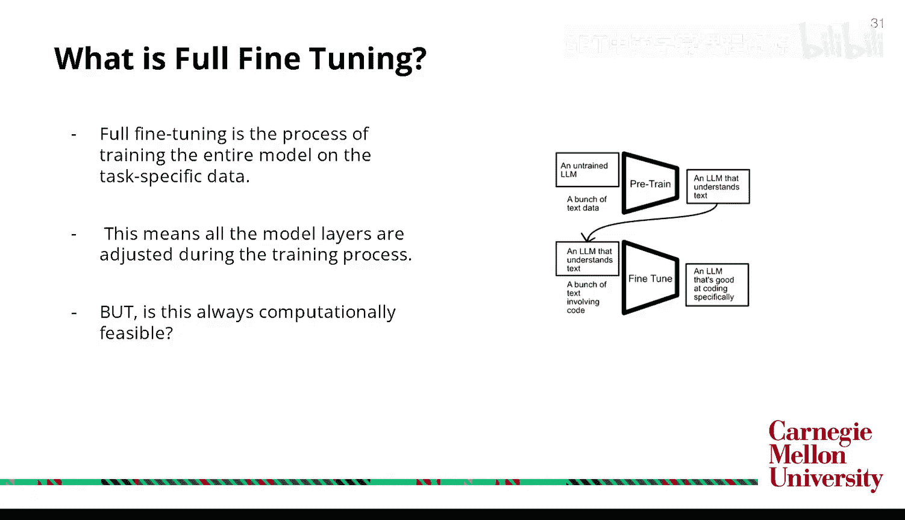

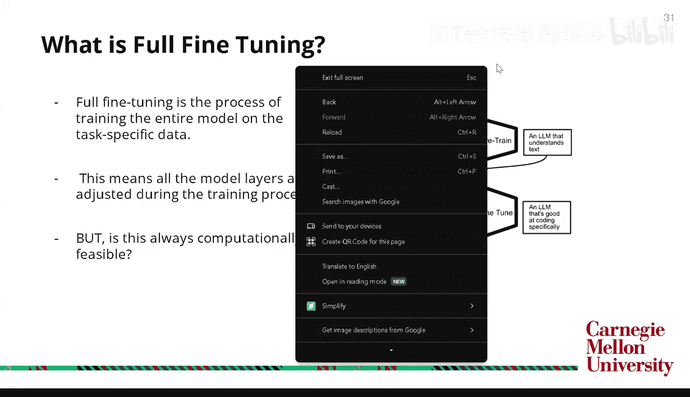

研究发现，如果仅仅在提示中告诉模型“**让我们一步步思考**”，就能获得与展示具体推理过程类似的大部分收益。这是一个非常便捷的技巧，因为它不需要依赖特定任务的示例。

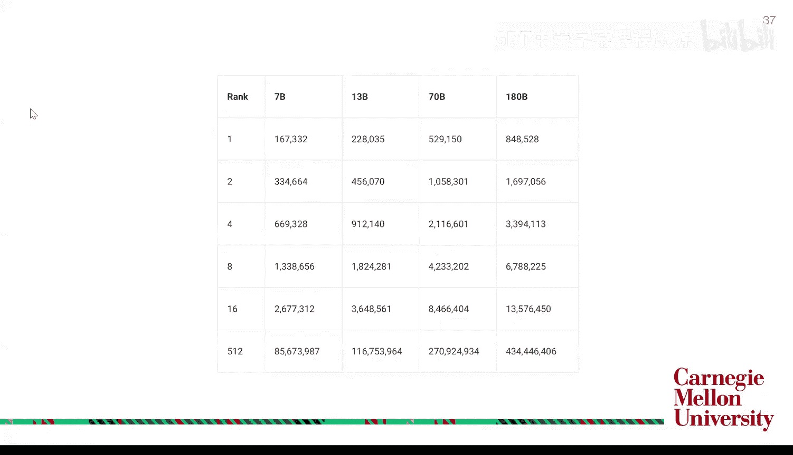

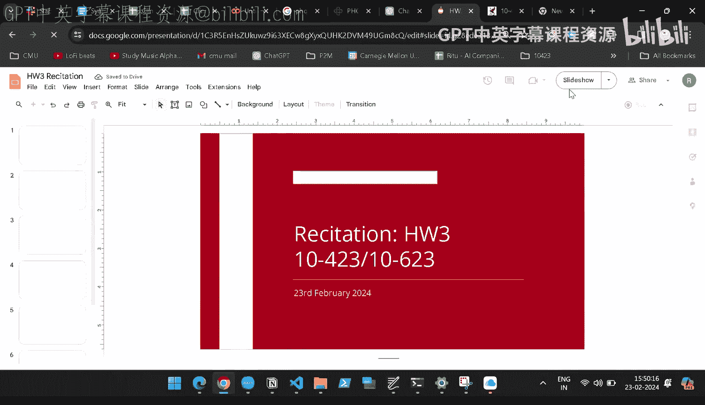

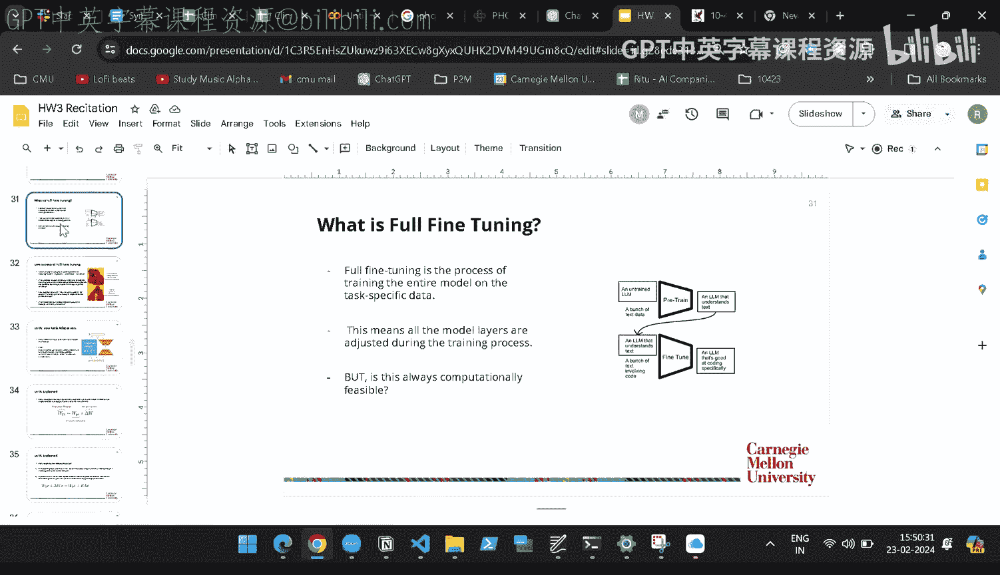

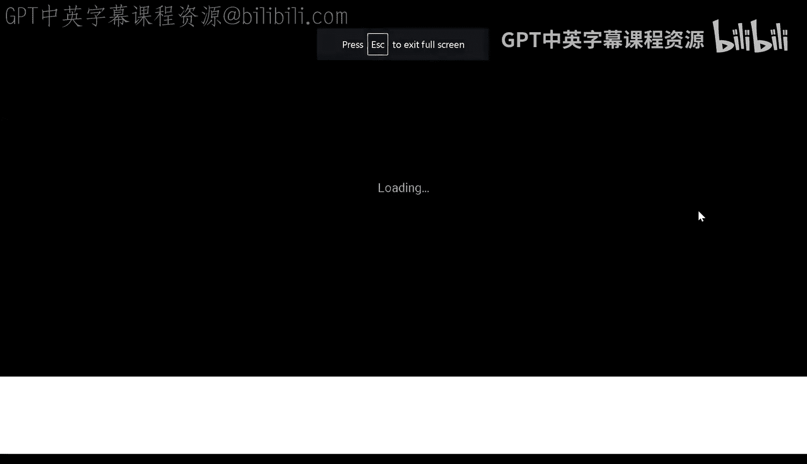

## 为特定任务适配大型语言模型

到目前为止，我们学习了一些有趣的技巧，如上下文学习和提示工程。现在，假设我们有一个预训练好的大型语言模型，想将其用于非常特定的领域（如医疗、法律）。直接提问能得到结果，但答案可能不可靠。

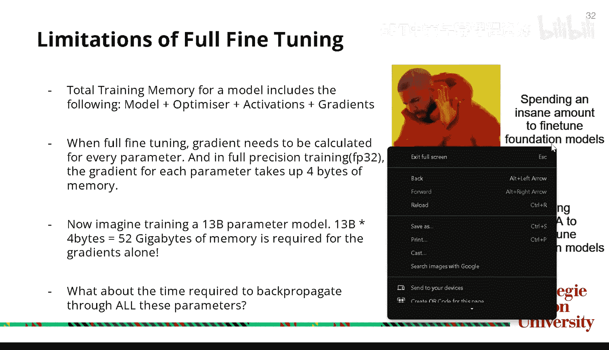

一种选择是使用上下文学习，向模型提供大量领域文本。但上下文学习受限于模型的上下文窗口长度，成本高昂。那么，我们还能做什么？

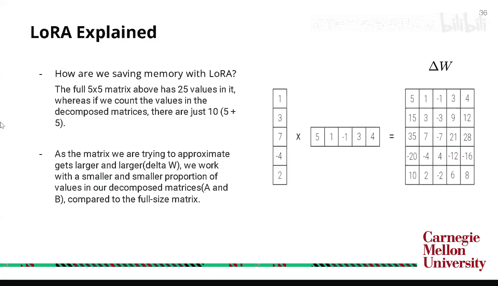

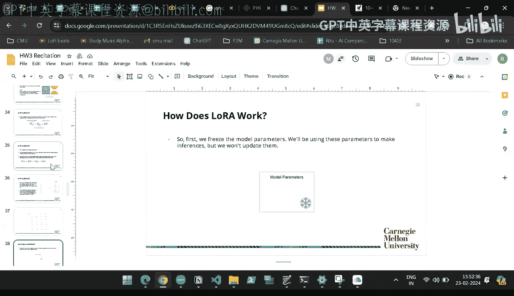

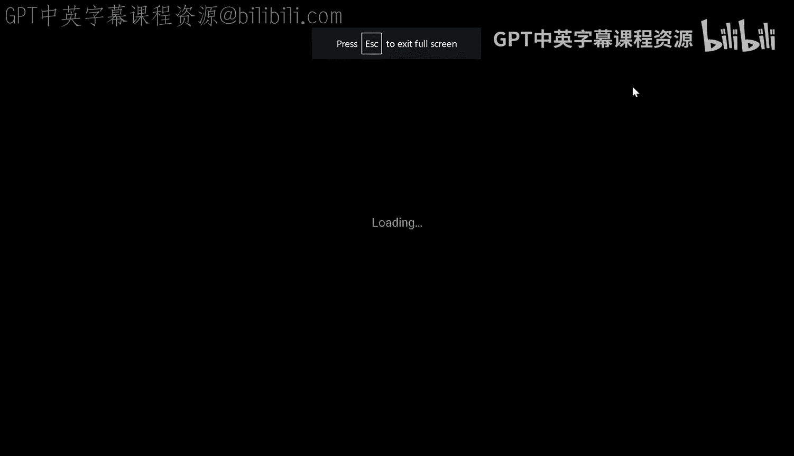

### 微调简介

这时就需要**微调**。微调的基本思想是：在预训练模型权重的基础上进行小幅调整，使其适应新任务。这是通过在特定任务数据上进行额外训练来实现的。这样既能保留模型的语言理解能力，又能使其适应特定领域。

微调有不同的类型，让我们先看看**全参数微调**。

### 全参数微调及其挑战

全参数微调会更新模型每一层、每一个参数。但这对大型模型来说计算上是否可行？让我们分析一下内存需求。

训练模型时，内存主要用于存储模型参数、优化器状态、激活值和梯度。以130亿参数的模型为例，如果使用全精度（32位，即4字节）微调，仅存储梯度就需要：
`13B * 4 bytes = 52 GB`
的内存。这还不包括模型参数、优化器状态和激活值。此外，反向传播通过所有参数也需要大量时间。

### LoRA：低秩适应

LoRA正是为了解决全参数微调的这些挑战而提出的。其核心思想是：冻结预训练模型的权重，并向Transformer架构的每一层注入可训练的低秩分解矩阵。

LoRA重新构想了微调的过程：与其直接更新巨大的权重矩阵 `W`，不如学习一个代表所需调整的增量矩阵 `ΔW`。在推理时，将 `ΔW` 加回原始权重即可。

LoRA基于两个关键概念：
1.  预训练模型具有较低的**内在维度**，这意味着可以将巨大的权重矩阵投影到更小的子空间中，同时保留大部分信息。
2.  可以将这个低内在维度的 `ΔW` 矩阵分解为两个更小的矩阵的乘积。

例如，假设 `ΔW` 是一个 5x5 的矩阵（25个参数）。如果将其分解为两个秩为1的矩阵 `B` (5x1) 和 `A` (1x5) 的乘积，则只需要训练 `5 + 5 = 10` 个参数。当 `ΔW` 非常大时，这种节省尤为显著。

对于一个130亿参数的模型，如果使用秩为4的低秩矩阵进行LoRA微调，可能只需要微调约91.2万个参数，远少于全参数微调。

### LoRA的工作原理

以下是LoRA工作的具体步骤：

1.  **初始化**：保持预训练权重 `W` 冻结。创建两个低秩矩阵 `A` 和 `B`，其维度使得 `B * A` 的乘积与 `W` 的维度相同。通常，`A` 用随机高斯分布初始化，`B` 初始化为零。
2.  **前向传播**：前向传播时，输入同时通过原始权重 `W` 和低秩矩阵的乘积 `B*A`（即 `ΔW`）。
    *   公式：`输出 = (W + (B * A)) * 输入`
3.  **反向传播**：只对矩阵 `A` 和 `B` 进行梯度更新，预训练权重 `W` 保持不变。
4.  **推理**：训练完成后，可以将 `ΔW (B*A)` 加回到 `W` 中，得到一个更新后的权重矩阵用于推理，这样不会引入额外的推理延迟。

在实现中，还有一个缩放因子 `α/r`，其中 `r` 是秩，`α` 是一个超参数。它控制着 `ΔW` 对最终输出的影响程度。

在原始LoRA论文中，通常只将低秩矩阵应用到注意力机制中的查询和值投影矩阵。但在本次作业中，你需要将其应用到查询、键、值以及输出投影矩阵。

### 指令微调

如果我们尝试在分类任务（例如电影评论情感分析）上使用仅预训练的GPT-2模型，它很可能无法正确执行，因为这些模型并非训练来遵循人类指令的。因此，我们需要进行**指令微调**。

指令微调通过构造特定的训练数据来教导模型遵循指令。例如，对于电影评论分类任务，一条训练数据可能被构造成：
`“指令：请判断以下电影评论的情感是正面还是负面。评论：这部电影太棒了！输出：正面”`

模型在整个训练过程中会看到许多这样的“指令+输入+输出”样本，从而学会执行该指令。你可以尝试不同的指令模板，对于摘要任务，指令可能是“请为以下段落生成摘要”。

## 作业实现细节

现在，我们将理论应用于实践，讨论作业中需要实现的代码部分。

### 代码结构概览

你将主要修改以下几个文件：
*   `lora.py`：实现LoRA线性层的核心逻辑（约30-35行代码）。
*   `model.py`：将原有的线性层替换为你实现的LoRA线性层。
*   `dataloader.py`：实现指令微调的数据构造逻辑。
*   `train.py`：修改训练流程以支持LoRA。
*   `generate.py`：编写自己的准确率计算函数。

### 实现LoRA线性层

LoRA的核心是创建一个自定义的线性层。你将继承PyTorch的`nn.Linear`类，并重写其方法。

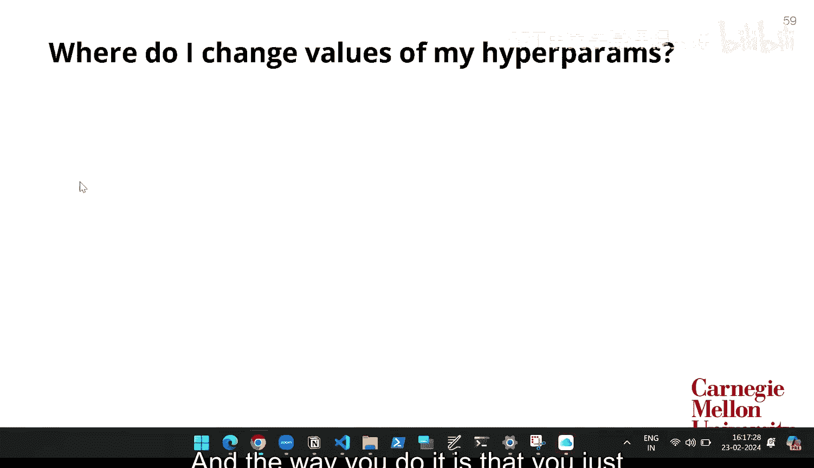

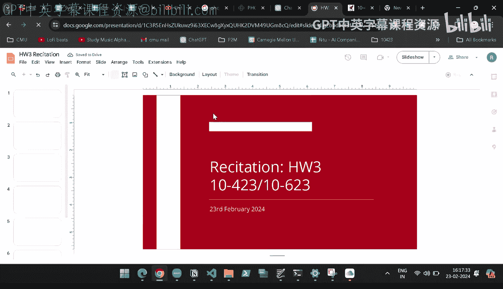

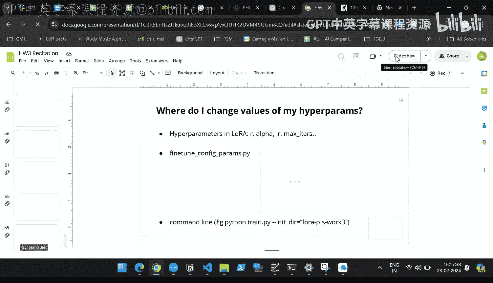

以下是需要在`lora.py`中实现的关键部分：

*   `__init__`函数：在此初始化LoRA的`A`和`B`矩阵（仅当秩`r > 0`时），以及缩放因子。
*   `reset_parameters`函数：设置`A`和`B`的初始化值（如`A`使用`kaiming_uniform`，`B`初始化为零）。
*   `forward`函数：这是核心，实现前向传播公式 `W*x + (B*A)*x * (alpha/r)`。
*   `train`/`eval`模式：你需要管理一个布尔标志，以确定在训练和评估/推理时，是否将`B*A`合并到`W`中。通常训练时保持分离，评估/推理时合并。
*   `make_lora_trainable`函数：此函数遍历模型参数，仅将LoRA相关的参数（`A`和`B`）设置为可训练，冻结其他所有参数。

一个重要的细节是：当秩`r <= 0`时，你的LoRA线性层应退化为标准的线性层。这方便你后续进行全参数微调（只需设置`r=0`即可）。

### 数据集与评估

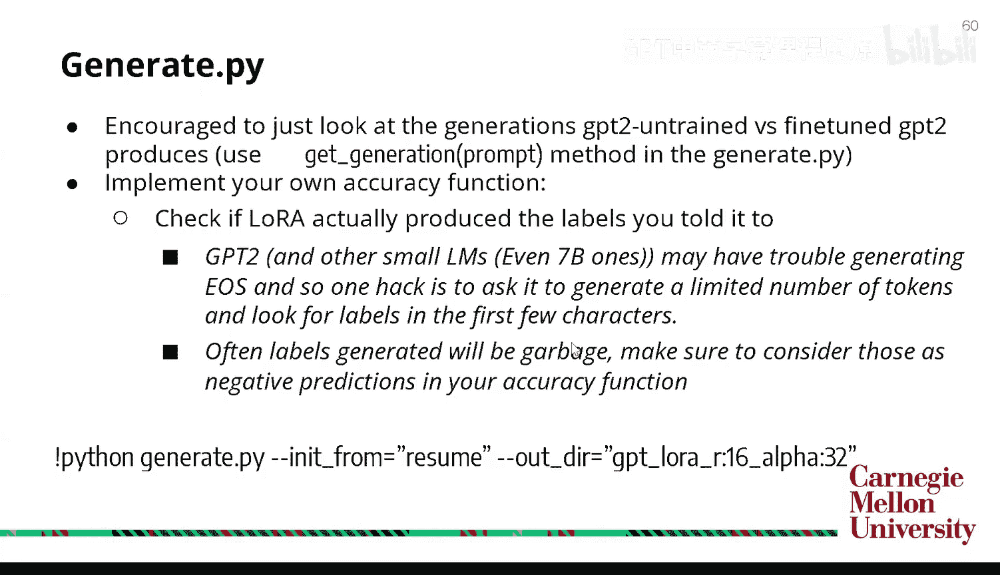

作业将使用“烂番茄”电影评论数据集进行情感分类（正面/负面）。你需要：
1.  在`dataloader.py`中设计并添加指令模板，将原始（文本，标签）数据构造成指令微调格式。
2.  在`generate.py`中编写准确率计算函数。由于小模型（如GPT-2）可能生成不完整或错误的文本（如“半正面”），你的评估函数需要能处理这些情况，例如只检查生成文本的前几个字符是否包含“正面”或“负面”关键词。
3.  进行最低限度的超参数调优（如学习率、秩`r`、缩放因子`α`）。

## 总结

本节课中，我们一起学习了：
1.  **从少量数据学习**：了解了少样本学习、零样本学习，以及大型语言模型令人惊讶的**上下文学习**能力。
2.  **提示工程技巧**：掌握了**思维链提示**和**零样本思维链**这两种提升模型推理能力的有效方法。
3.  **模型适配**：认识到直接使用预训练模型处理专业领域任务的局限性，引入了**微调**的概念。
4.  **高效微调技术**：深入探讨了**LoRA（低秩适应）** 的原理与优势，它通过冻结原有权重、训练低秩增量矩阵，大幅降低了微调的内存和计算成本。
5.  **指令微调**：学习了如何通过构造“指令-输入-输出”格式的数据，教导模型遵循特定指令。
6.  **实践实现**：概述了在编程作业中实现LoRA和指令微调的关键步骤和代码文件。

通过结合这些技术，你可以有效地将通用的大型语言模型定制化，以胜任各种特定的下游任务。