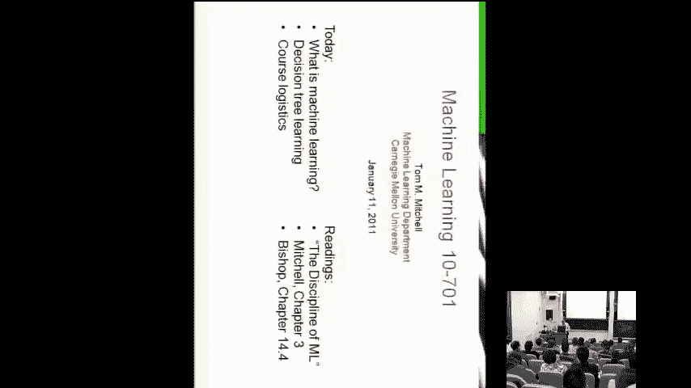
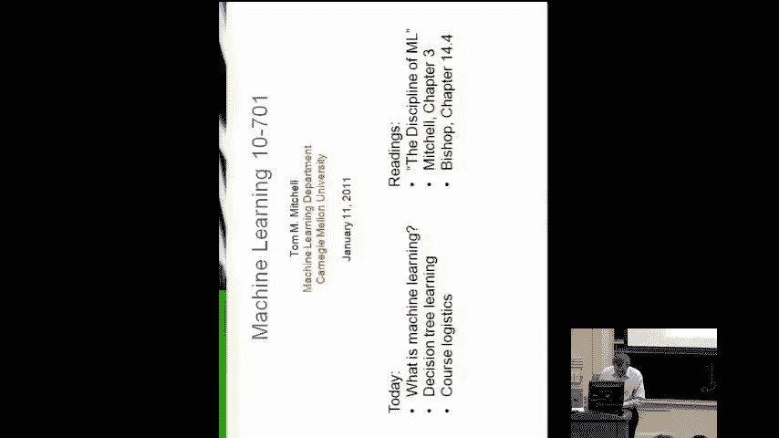
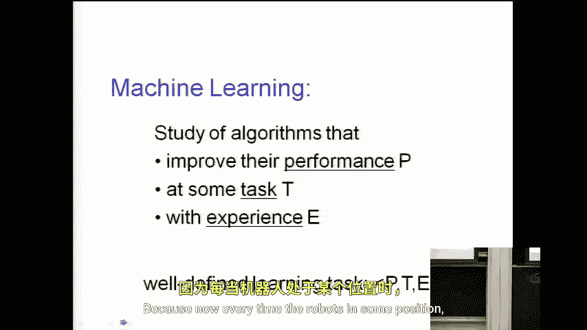

# 027：课程介绍与机器学习概述

在本节课中，我们将要学习机器学习的基本概念，了解其核心定义与构成要素，并通过实际例子来理解机器学习是如何工作的。

## 课程与讲师介绍

欢迎来到机器学习课程。这里有两门机器学习课程，本课程是**10-701**，主要面向博士生。另一门课程是**10-601**，推荐本科生和硕士生选修。如果你认为自己更适合另一门课程，可以自由切换。

我是汤姆·米切尔，本课程的讲师。机器学习是我最喜爱的领域，也是我最喜欢教授的课程。今天，我们将直接开始，探讨什么是机器学习，以及本课程将涵盖哪些内容。随后，我们将介绍第一个机器学习算法——决策树学习，你们将从周四的作业开始有机会实现并实验它。

## 什么是机器学习？

机器学习，顾名思义，是研究如何让计算机进行学习。它在我们的生活中无处不在。

以下是几个常见的例子：
*   **垃圾邮件过滤器**：你的电子邮件阅读器中的垃圾邮件过滤器，其决策策略就是计算机从大量被标记为“垃圾邮件”或“非垃圾邮件”的邮件样本中学习而来的。
*   **信用卡欺诈检测**：当你刷卡消费时，交易会由某个计算机程序进行评估，以判断是否存在欺诈风险。这个程序所使用的决策策略，是从数百万笔历史交易数据（其中一些被证实是欺诈，大部分则不是）中学习得到的。

## 定义机器学习问题

要构成一个定义明确的机器学习问题，我们需要明确以下三个要素：

### 1. 任务
任务是指我们希望计算机学会执行的具体功能。例如，在垃圾邮件检测中，任务是学习一个函数，该函数以任意一封电子邮件作为输入，并输出一个值（例如1或0，或者一个介于0和1之间的概率值）来表示该邮件是否为垃圾邮件。

### 2. 性能度量
学习意味着通过经验来提升性能。因此，我们必须定义一个度量标准来衡量性能的好坏。例如，一个直观的度量标准是分类的正确率。然而，根据具体任务和个人偏好，我们可以选择不同的度量标准。例如，在垃圾邮件过滤中，我可能更倾向于一个能**减少将重要邮件误判为垃圾邮件**的过滤器，即使这意味着会**稍微增加漏掉一些垃圾邮件**的数量。

### 3. 经验
经验是指计算机用来学习的数据。最常见的方式是**监督学习**，即提供输入-输出对的例子。对于垃圾邮件检测，这意味着提供大量已被人工标记为“垃圾邮件”或“非垃圾邮件”的邮件。

然而，经验也可以包含未标记的数据。你可能会认为未标记的数据没有用，但令人惊讶的是，在某些情况下（包括垃圾邮件检测），**同时提供标记和未标记的数据**，其学习效果可能比仅提供标记数据更好。这是当前机器学习的一个活跃研究领域。

## 另一个例子：机器人学习

为了理解不同任务下的学习，让我们设想训练一个在建筑物内移动的机器人。

上一节我们介绍了定义机器学习问题的三个要素，本节中我们来看看如何将它们应用到一个完全不同的任务上。

*   **任务**：让机器人能够在房间内移动并避免碰撞。
*   **性能度量**：我们可以设计一个综合指标，例如，为机器人移动的距离给予正奖励，为发生的碰撞次数给予负惩罚，最终性能是两者的加权差。
*   **经验**：这非常有趣。一种方法是使用操纵杆手动控制机器人移动，这又是一种监督学习——我们在每个位置告诉机器人安全的移动方向。我们将在课程中深入探讨其他让机器人从经验中学习的方法。

## 总结

本节课中我们一起学习了机器学习的基本框架。我们了解到，一个完整的机器学习问题由**任务**、**性能度量**和**经验**三部分精确定义。我们通过垃圾邮件过滤和机器人导航两个例子，看到了这些概念如何应用于实际问题。从下一课开始，我们将深入第一个具体的机器学习算法——决策树学习。