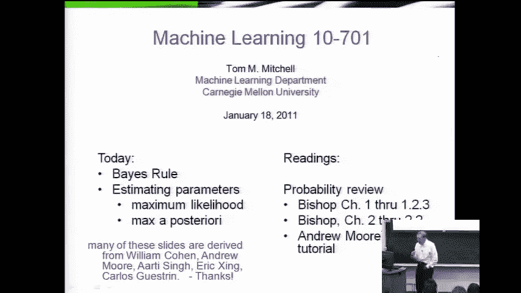
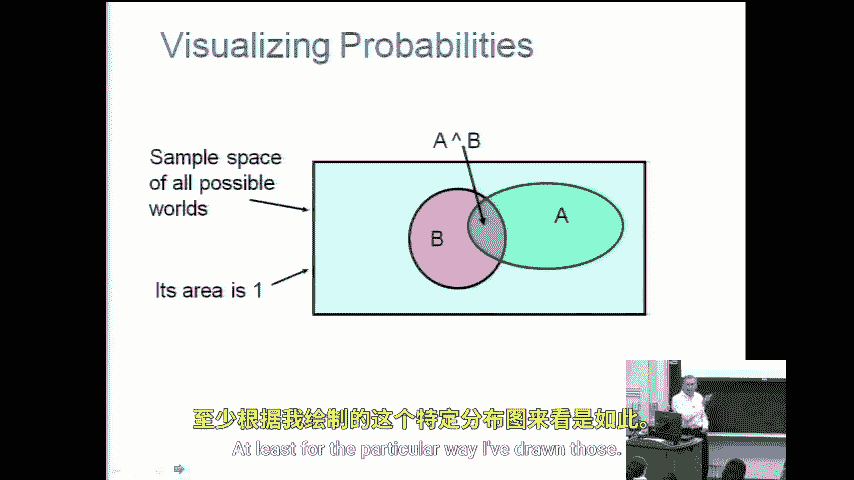
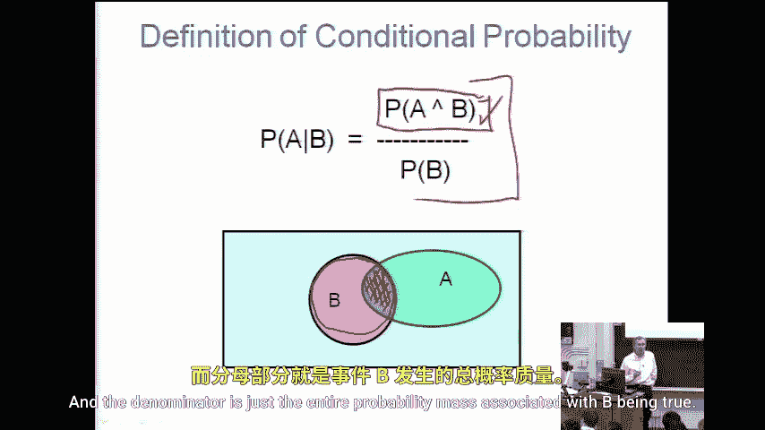
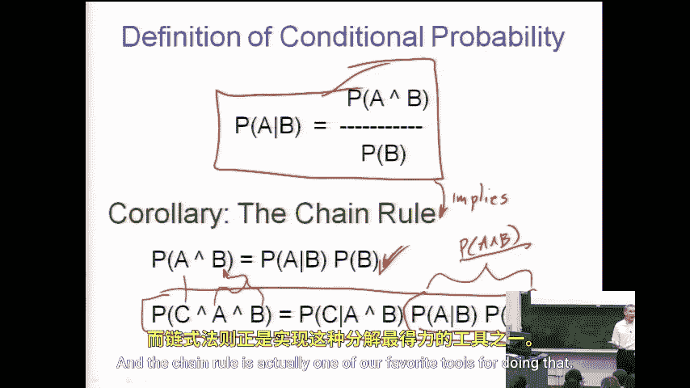
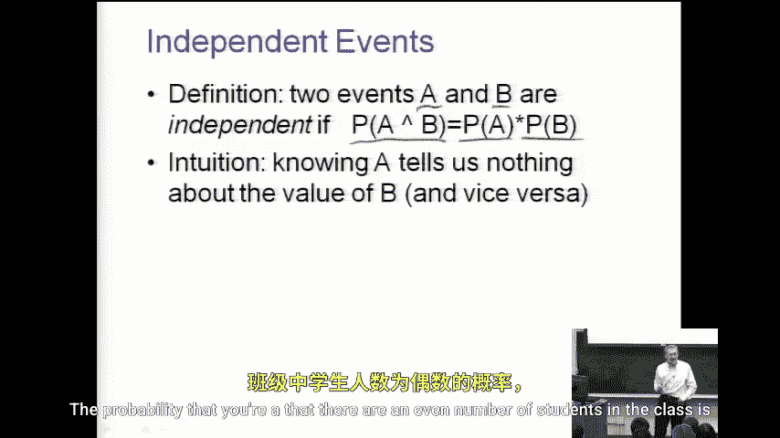

# 029：概率与估计回顾

在本节课中，我们将快速回顾概率论的核心概念，这些概念对于理解后续的机器学习课程至关重要。我们将涵盖条件概率、链式法则、独立事件以及贝叶斯定理。

## 课程公告

在开始之前，先发布几个课程相关的通知。

以下是关于课程安排和作业的重要信息：

*   第一次习题课将于明天下午五点举行。地点信息可在课程网站上查询。
*   习题课虽然是可选的，但强烈建议参加，特别是对于需要巩固课程内容的同学。明天的习题课将涵盖概率和决策树，与作业内容高度相关。
*   第一份作业已于上周五发布。作业整体难度适中，其中包含一道关于泊松分布的题目，可能会考验你对概率论知识的记忆。其余两道题目相对直接。如果你在泊松分布题目上需要帮助，习题课是寻求解答的绝佳机会。
*   关于作业提交：请注意，不同的助教会批改不同的题目。提交作业时，请根据题目旁边标注的助教姓名，将对应的部分分开提交，以便于分发批改。

## 概率论核心概念回顾

上一讲我们初步接触了随机变量和概率分布。为了帮助大家回忆，我们可以用文氏图来可视化概率，其中整个图代表所有可能事件的集合。

例如，布尔随机变量A或B可以定义为事件空间中该变量取值为真的子集。以随机抽取一名学生为例，随机变量A可以是“该学生为女性”，B可以是“该学生是秃头”。那么，A和B的交集就代表“既是女性又是秃头”的学生。从图中可以看出，这个交集事件的概率通常小于其中任何一个事件单独发生的概率。

### 条件概率

理解了事件空间的可视化后，一个显然重要的概念是条件概率。

条件概率的定义如下：我们关心在已知事件B发生的情况下，事件A发生的概率。其公式为：
`P(A|B) = P(A ∩ B) / P(B)`

一种理解方式是：分子 `P(A ∩ B)` 代表A和B同时为真的区域（即交集）。分母 `P(B)` 代表事件B为真的全部区域。因此，条件概率 `P(A|B)` 就是交集区域占整个B区域的比例。如果你忘记了公式，通过这种几何视角也可以重新推导出来。

### 链式法则

从条件概率的定义出发，我们可以推导出一个非常有用的推论。

将条件概率公式两边同时乘以 `P(B)`，我们得到：
`P(A ∩ B) = P(A|B) * P(B)`
这被称为**链式法则**。它表明，事件A和B同时发生的概率，等于在B发生的条件下A发生的概率乘以B本身发生的概率。

链式法则可以推广到任意多个随机变量的联合概率。例如，对于三个事件A、B、C：
`P(A, B, C) = P(A|B, C) * P(B|C) * P(C)`
我们可以通过反复应用基础的链式法则来证明这个更一般的版本。链式法则非常有用，在本节课结束时我们就会看到，当处理涉及大量变量的联合概率分布时，我们经常需要将其分解为一系列可以单独处理的因子相乘的形式，链式法则正是实现这种分解的重要工具。

### 独立事件

接下来，我们看看独立事件。

我们定义两个事件（或随机变量）是独立的，如果它们的联合概率等于各自概率的乘积。即：
`P(A ∩ B) = P(A) * P(B)`
这意味着，知道事件A是否发生，不会给我们提供任何关于事件B是否发生的信息，反之亦然。例如，“班级学生人数为偶数”这一事件的概率，很可能与“明天是晴天”这一事件的概率相互独立。

### 贝叶斯定理

基于条件概率和链式法则，我们可以推导出概率论中另一个基石——贝叶斯定理。

贝叶斯定理的公式如下：
`P(A|B) = [P(B|A) * P(A)] / P(B)`
它建立了两种条件概率 `P(A|B)` 和 `P(B|A)` 之间的联系。这个定理在机器学习中极其重要，因为它提供了一种在获得新证据（B）后，更新我们对某个假设（A）的信念（即概率）的方法。

## 总结

本节课我们一起快速回顾了概率论的核心概念。我们首先通过文氏图可视化了事件和概率，然后学习了条件概率的定义及其直观理解。从条件概率出发，我们推导出了实用的链式法则，并了解了它如何用于分解联合概率。接着，我们定义了独立事件的概念。最后，基于前面的知识，我们介绍了在机器学习中至关重要的贝叶斯定理。掌握这些概念是学习后续课程内容的基础。