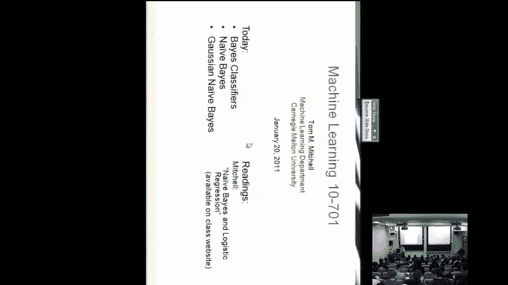
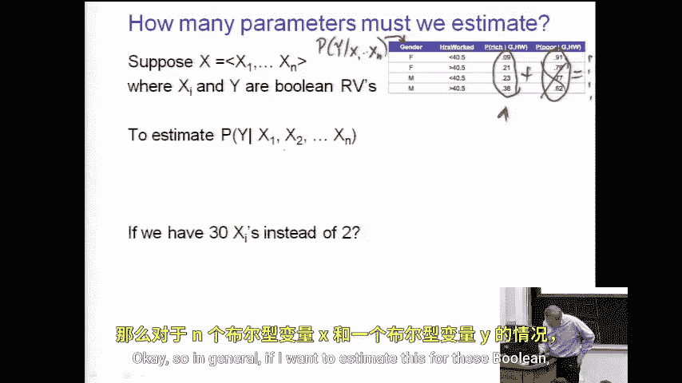

# 030：朴素贝叶斯分类器

在本节课中，我们将学习第一个重要的概率机器学习算法——朴素贝叶斯分类器。我们将从回顾联合概率分布开始，探讨如何利用条件概率进行预测，并理解朴素贝叶斯的核心假设及其实际应用价值。

## 从联合分布到条件概率

上一节我们介绍了多个随机变量的联合概率分布概念。本节中我们来看看如何利用联合分布进行预测。

考虑一个简单的例子，我们拥有三个布尔变量：**性别**、**工作时长**和**财富水平**。下图展示了这三个变量的联合概率分布，表格中的红色数字代表了每个变量组合（即每个“事件”）发生的概率。所有概率之和为1，因为每次随机抽样都会为这三个变量赋予一组确定的值。

在机器学习中，我们通常的目标是根据一些特征变量（例如 `x1, x2, x3`）来预测目标变量 `Y`。一种方法就是学习 `Y` 在给定这些特征值时的条件概率。

例如，我们想根据一个人的**性别**和**工作时长**（是否低于40.5小时）来预测其**财富水平**（富有或贫穷）。由于我们拥有这三个变量的联合分布，我们可以计算出所需的条件概率分布。

以下是从联合分布中计算出的条件概率表，它给出了在特定性别和工作时长条件下，财富为“富有”的概率。

那么，如何从联合分布表中计算出这些条件概率呢？以第一行为例，它表示在**性别为女性**且**工作时长少于40小时**的条件下，此人是**富有**的概率为 `0.09`。

根据条件概率的定义，这个值可以通过以下方式计算：
1.  找到联合概率表中对应“女性、工作时长<40、富有”的概率值（记为 `A`）。
2.  找到联合概率表中所有“女性、工作时长<40”情况的总概率（即 `A + B`，其中 `B` 是“女性、工作时长<40、贫穷”的概率）。
3.  条件概率 `P(富有 | 女性, 工作时长<40) = A / (A + B)`。

通过这种方式，我们可以从联合分布推导出任何我们需要的条件概率表。有了这个条件概率表，我们就得到了一个预测函数：对于任何一个新来的人，我们查询其性别和工作时长，就能给出其富有的概率估计。如果必须做出“是/否”的二元判断，我们可以设定一个阈值（例如0.5）来进行决策。

## 直接估计条件概率

但是，如果我们最终目标就是得到 `P(Y|X)`，我们不一定需要先估计整个联合分布。我们可以直接利用训练数据来估计这些条件概率参数。

这里有一个关键问题：我们需要估计多少个参数？我们是否有足够的数据来可靠地估计它们？

观察上面的条件概率表，虽然表中有8个数字，但每一行的两个概率值（富有和贫穷）之和必须为1。因此，我们实际上只需要估计其中一列（例如“富有”的概率），另一列可以通过 `1 - P(富有)` 得到。所以，这张表只需要估计4个参数。

现在，让我们将问题一般化。假设我们想根据 `N` 个特征变量 `X1, X2, ..., Xn` 来预测目标变量 `Y`。我们需要估计的参数数量是多少？

考虑最直接的方法：为 `X1, X2, ..., Xn` 的每一种可能取值组合，都估计一个 `P(Y|X1, X2, ..., Xn)`。如果每个特征 `Xi` 有 `|Xi|` 种可能的取值，目标变量 `Y` 有 `|Y|` 种取值，那么理论上我们需要估计的参数数量是：
**参数数量 = (∏ |Xi|) * (|Y| - 1)**

这个数字会随着特征数量 `N` 的增加而呈指数级增长。例如，如果每个特征都是二值的（0或1），那么 `∏ |Xi| = 2^N`。即使 `N` 只有20个特征，组合数也将超过100万。这意味着我们需要海量的训练数据才能覆盖所有可能的特征组合并做出可靠估计，这通常是不现实的。这就是所谓的“维数灾难”。

## 朴素贝叶斯的核心假设

为了解决参数过多、数据不足的问题，朴素贝叶斯分类器引入了一个强大的简化假设：**在给定目标变量 Y 的条件下，所有特征变量 X1, X2, ..., Xn 之间是相互独立的**。

这个假设被称为“条件独立性”假设。用公式表示就是：
**P(X1, X2, ..., Xn | Y) = P(X1|Y) * P(X2|Y) * ... * P(Xn|Y)**

这个假设为什么强大？因为它将我们需要估计的参数数量从指数级降低到了线性级。现在，我们不再需要估计整个联合概率 `P(X1, X2, ..., Xn | Y)`，而只需要为每个特征 `Xi` 估计其在每个 `Y` 类别下的条件概率 `P(Xi|Y)`。

参数数量变为：
**参数数量 = (∑ |Xi|) * (|Y| - 1)**

回到之前的例子，如果我们有20个二值特征和一个二值目标变量，参数数量从超过100万骤减到大约 `20 * 2 * (2-1) = 40` 个。这使得我们能够用相对较少的数据就训练出一个模型。

## 朴素贝叶斯分类器的工作原理

基于贝叶斯定理和条件独立性假设，我们可以推导出朴素贝叶斯分类器的决策规则。贝叶斯定理告诉我们：
**P(Y|X) = [P(Y) * P(X|Y)] / P(X)**

在分类时，对于给定的特征 `X`，我们需要计算哪个类别 `Y` 能使后验概率 `P(Y|X)` 最大。由于分母 `P(X)` 对于所有 `Y` 是相同的，因此我们只需要比较分子部分：
**预测的 Y = argmax_Y [ P(Y) * P(X|Y) ]**

代入条件独立性假设：
**预测的 Y = argmax_Y [ P(Y) * ∏ P(Xi|Y) ]**

以下是朴素贝叶斯分类器的步骤：
1.  **训练阶段**：从训练数据中估计以下参数。
    *   **先验概率 P(Y)**：每个类别出现的频率。
    *   **条件概率 P(Xi|Y)**：在每个类别下，每个特征取某个值的频率。
2.  **预测阶段**：对于一个新的样本 `X_new = (x1, x2, ..., xn)`。
    *   对每一个可能的类别 `y`，计算得分：`P(y) * ∏ P(xi|y)`。
    *   选择得分最高的类别作为预测结果。

需要注意的是，在计算连乘积 `∏ P(xi|y)` 时，如果某个 `P(xi|y)` 为0（即训练集中未出现该特征值），会导致整个乘积为0。为了避免这种情况，通常会使用**拉普拉斯平滑**（加一平滑），即在计算概率时，为每个特征的计数加上一个小的常数（通常是1）。

## 总结

本节课中我们一起学习了朴素贝叶斯分类器。我们首先回顾了如何从联合概率分布得到条件概率用于预测，并指出了直接估计高维条件概率面临的参数爆炸问题。接着，我们引入了朴素贝叶斯的核心——条件独立性假设，该假设虽然“朴素”（在现实中往往不成立），但能极大简化模型，将参数估计问题从指数级复杂度降至线性级。最后，我们推导了基于贝叶斯定理和该假设的分类决策规则，并概述了模型的训练与预测流程。朴素贝叶斯因其简单、高效且通常效果不错的特点，在文本分类（如垃圾邮件过滤）、情感分析等众多领域有着广泛应用。