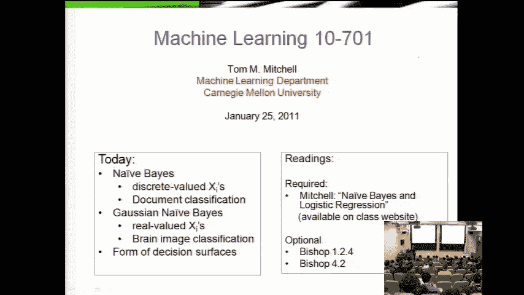
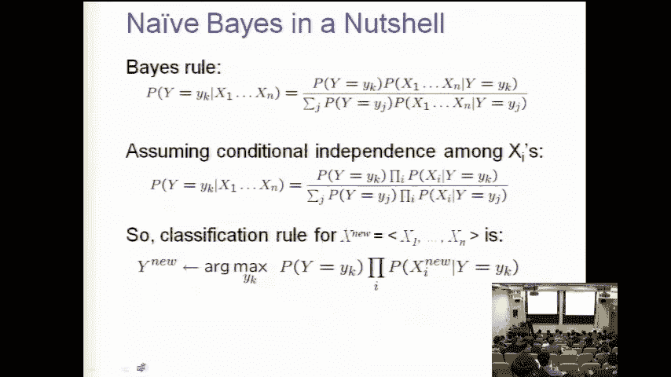
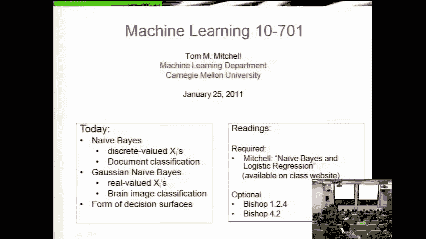
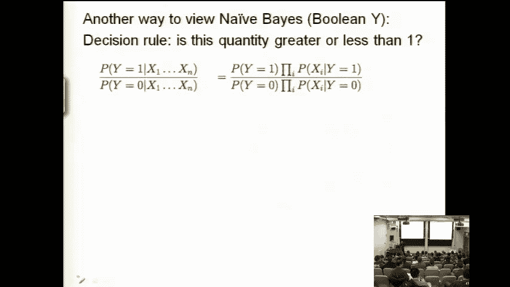
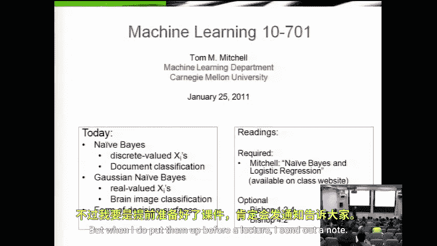
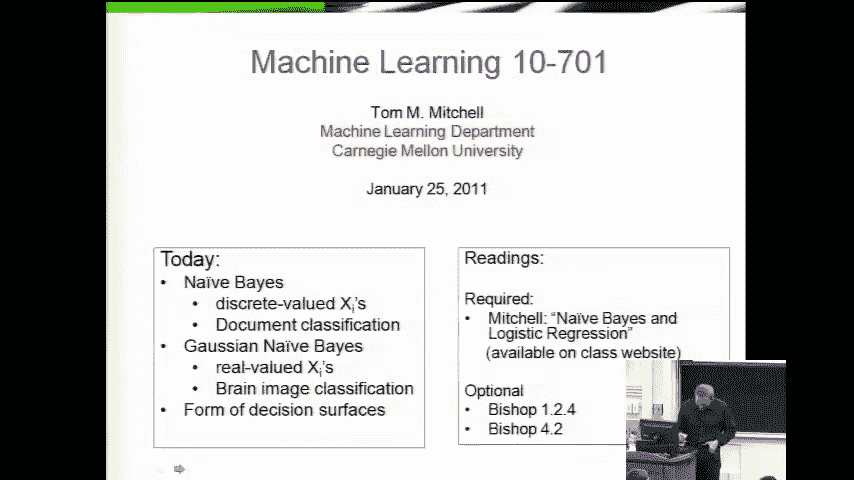
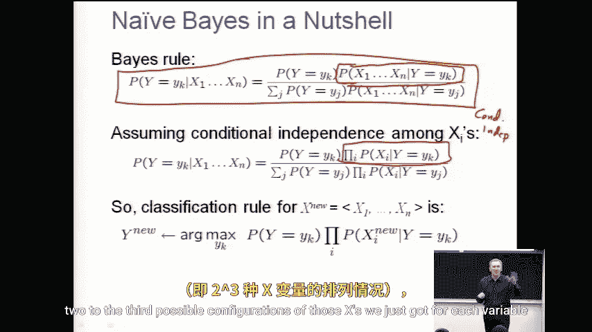

# 031：高斯朴素贝叶斯 📊

在本节课中，我们将学习朴素贝叶斯分类器，特别是当输入特征是连续值时，如何应用高斯分布来构建模型。我们将从回顾朴素贝叶斯的基本原理开始，然后深入探讨其在高斯假设下的具体形式与参数估计方法。

---

## 课程公告与安排

在开始今天的课程内容之前，有几个重要的公告需要说明。

**关于作业与课程项目**

*   作业一已截止提交。部分题目（如涉及泊松分布的题目）更具挑战性，其目的是提醒大家，尽管课程不会涵盖所有概率分布，但你们需要具备学习和理解新分布的能力。
*   新的作业将在近期发布。该作业包含一个实践环节：**实现朴素贝叶斯算法并将其应用于文档分类**。这是将理论付诸实践的重要一步。
*   本学期将有一个**课程项目**，主要在中期考试之后进行。届时作业量会显著减少，以便大家专注于项目。
*   项目可以使用课程提供的众多数据集，也欢迎使用自己的数据集。**唯一的要求是：在提交项目提案时，必须已经拥有数据**。因此，如果你计划使用自己的数据，现在就应该开始收集。

**关于课件与答疑**

*   课件通常在课前才准备完毕并上传，我会在课前通过邮件通知大家。
*   我的办公时间安排在**每天课程结束后，就在这个教室**进行。欢迎大家就课程内容进行讨论。

---

## 回顾：朴素贝叶斯原理 🔄

上一节我们介绍了基于概率原则的机器学习方法。与决策树这类启发式算法不同，我们现在关注的是如何基于贝叶斯规则，设计能够预测目标标签Y在给定属性X下的条件概率 P(Y|X) 的系统。

朴素贝叶斯的美妙之处在于其简洁性，即使忘记也能快速重新推导。其核心是贝叶斯规则与一个条件独立性假设。

**1. 贝叶斯规则**
这是概率论的基础公式，不应尝试推导，而应牢记。其形式之一如下：
`P(Y|X) = [P(X|Y) * P(Y)] / P(X)`

**2. 朴素贝叶斯假设**
朴素贝叶斯的关键在于一个**条件独立性假设**：在给定类别Y的条件下，所有特征`X1, X2, ..., Xn`之间是相互独立的。这使得联合概率可以分解为单个概率的乘积：
`P(X1, X2, ..., Xn | Y) = P(X1|Y) * P(X2|Y) * ... * P(Xn|Y)`

**3. 朴素贝叶斯分类器**
结合以上两点，我们就得到了朴素贝叶斯分类器。以之前课堂上的“松鼠山居民分类器”为例，我们试图用三个布尔特征（是否在Giant Eagle购物、是否开车上班、是否是Rachel Madoff的粉丝）来预测目标布尔变量（是否住在松鼠山）。我们无需估计所有`2^3=8`种特征组合的概率，而只需为每个特征单独估计`P(Xi|Y)`即可。

---

## 高斯朴素贝叶斯 🧮

本节中，我们将看看当输入特征`X`是连续值时，如何具体应用朴素贝叶斯框架。这时，我们需要为条件概率`P(Xi|Y)`选择一个具体的概率分布模型，最常用的选择是**高斯分布（正态分布）**。

**核心假设**
我们假设对于每个类别`y`，每个特征`Xi`都服从一个高斯分布。这意味着：
`P(Xi | Y=y) ~ N(μ_{i,y}, σ_{i,y}^2)`
其中，`μ_{i,y}`是特征`Xi`在类别`y`下的均值，`σ_{i,y}^2`是其方差。

**参数估计**
给定训练数据，我们可以使用**极大似然估计（MLE）** 来计算这些参数，公式非常直观：
*   **均值** `μ_{i,y}`：计算所有属于类别`y`的训练样本中，第`i`个特征值的平均值。
*   **方差** `σ_{i,y}^2`：计算所有属于类别`y`的训练样本中，第`i`个特征值相对于其均值的方差。
*   **先验概率** `P(Y=y)`：计算训练集中类别`y`出现的频率。

**预测过程**
对于一个新样本`x=(x1, x2, ..., xn)`，我们计算它属于每个类别`y`的后验概率：
`P(Y=y | X=x) ∝ P(Y=y) * Π_{i=1}^{n} P(Xi=xi | Y=y)`
其中，`P(Xi=xi | Y=y)`通过将`xi`代入对应的高斯分布概率密度函数（PDF）来计算。最后，选择使后验概率最大的类别`y`作为预测结果。

---

## 总结 📝

本节课我们一起学习了高斯朴素贝叶斯分类器。
*   我们首先回顾了朴素贝叶斯的基本原理，它基于贝叶斯规则和特征条件独立性假设。
*   接着，我们重点探讨了当特征为连续值时，如何用**高斯分布**来建模`P(Xi|Y)`，并给出了通过训练数据估计高斯分布参数（均值和方差）的方法。
*   高斯朴素贝叶斯是处理连续特征的一种简单而有效的基础分类算法，它将概率理论与机器学习实践紧密连接起来。

在接下来的课程中，我们将继续探索其他基于概率模型的机器学习方法。