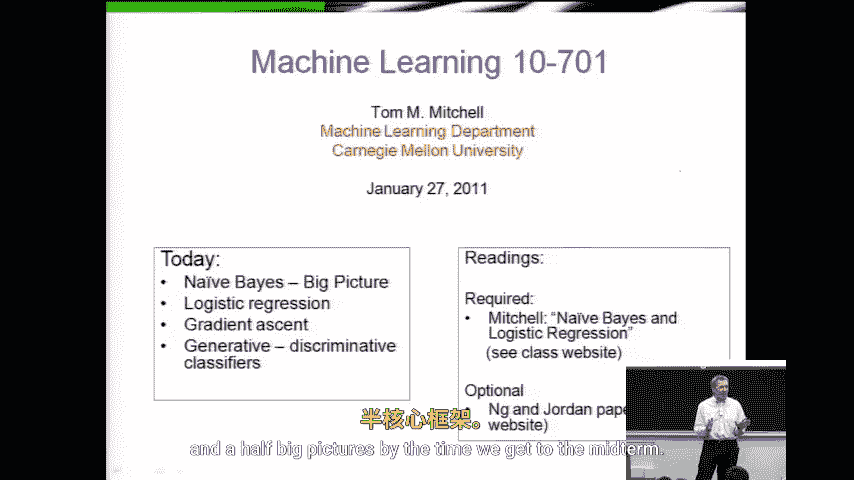
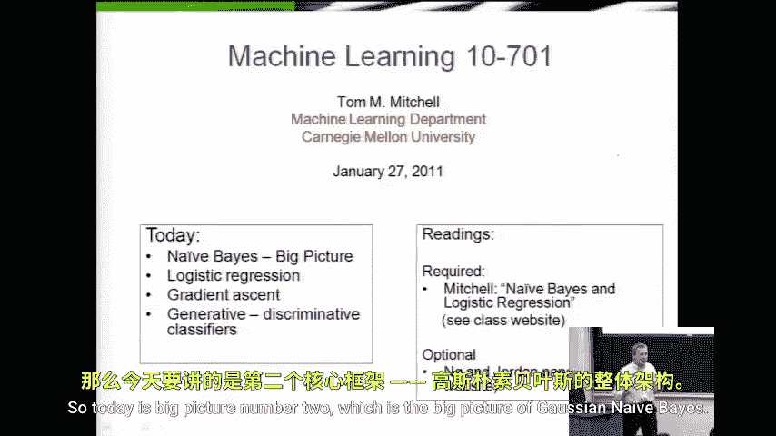
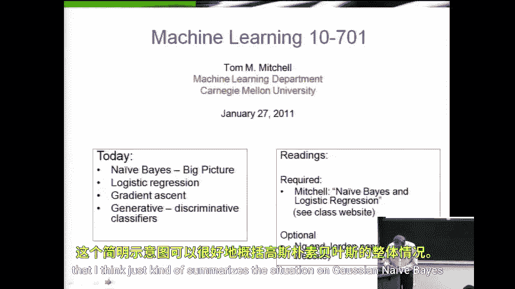
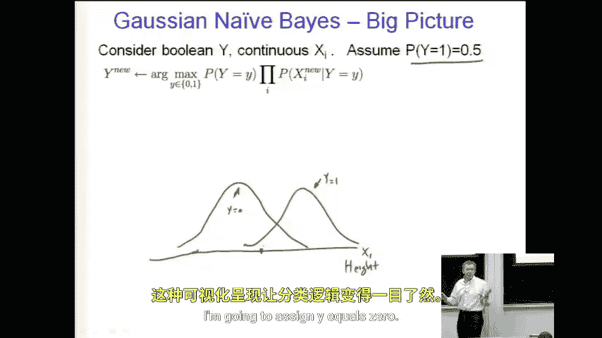

# 032：逻辑回归



在本节课中，我们将学习逻辑回归。这是继高斯朴素贝叶斯分类器之后，课程中的第二个“大图景”。我们将从一个简单的分类问题入手，逐步理解逻辑回归的核心思想、模型形式以及它与之前所学方法的联系与区别。





## 概述

上一节我们介绍了高斯朴素贝叶斯分类器，它通过估计类别先验概率 `P(Y)` 和特征的条件概率 `P(X|Y)` 来进行分类。本节中，我们来看看另一种强大的分类方法——逻辑回归。逻辑回归直接对条件概率 `P(Y|X)` 进行建模，特别适用于二分类问题。

## 从朴素贝叶斯到逻辑回归

假设我们想训练一个分类器，用一个连续变量 `X1`（例如身高）来预测一个布尔值 `Y`（例如是否为篮球运动员，1表示是，0表示不是）。

在高斯朴素贝叶斯中，我们需要学习两个分布：`P(Y)` 和 `P(X|Y)`。对于连续特征，我们通常假设 `P(X|Y)` 服从高斯分布。例如，篮球运动员的身高分布（`P(X|Y=1)`）可能比非篮球运动员的身高分布（`P(X|Y=0)`）平均更高。

训练完成后，对于一个新样本（例如身高为5英尺10英寸的学生），我们应用贝叶斯决策规则：计算 `P(Y=1) * P(X|Y=1)` 和 `P(Y=0) * P(X|Y=0)`，并选择概率值更大的那个类别作为预测结果。

这个方法的决策边界（即分类为 `Y=1` 和 `Y=0` 的分界点）由两个高斯分布的交点决定。从图像上看，这非常直观。

## 逻辑回归的核心思想

逻辑回归采取了不同的思路。它不分别建模 `P(Y)` 和 `P(X|Y)`，而是直接对后验概率 `P(Y=1|X)` 进行建模。其核心假设是，对数几率（log-odds）是输入特征 `X` 的线性函数。

**公式**：
`log( P(Y=1|X) / P(Y=0|X) ) = w0 + w1*X1 + ... + wn*Xn`

通过对上述公式进行变换，我们可以得到 `P(Y=1|X)` 的表达式，即逻辑函数（或称Sigmoid函数）。

**公式**：
`P(Y=1|X) = 1 / (1 + exp(-(w0 + w1*X1 + ... + wn*Xn)))`

这个函数将线性组合的结果映射到 `(0, 1)` 区间，完美地表示了概率。

## 逻辑回归模型的优势

以下是逻辑回归与朴素贝叶斯相比的一些关键特点：

*   **直接的概率建模**：逻辑回归直接输出样本属于某个类别的概率，解释性很强。
*   **无需强独立性假设**：朴素贝叶斯假设特征在给定类别下条件独立，而逻辑回归没有这个限制，模型更灵活。
*   **决策边界是线性的**：从上述公式可以看出，逻辑回归的决策边界（即 `P(Y=1|X)=0.5` 的点）是特征空间中的一个超平面。
*   **通过优化损失函数学习参数**：逻辑回归的参数 `w` 不是通过估计分布得到的，而是通过最大化训练数据的似然函数（或等价地，最小化对数损失函数）来学习得到的。

## 参数学习与模型训练

逻辑回归的参数 `w` 通常使用梯度下降法或其变种（如随机梯度下降）进行优化。目标是找到一组参数，使得模型预测的概率与训练数据中的真实标签尽可能一致。

**代码**（伪代码表示优化目标）：
```
# 定义损失函数（负对数似然）
loss = -sum( y_i * log(p_i) + (1 - y_i) * log(1 - p_i) ) for all training samples i
# 其中 p_i = P(Y=1|X_i) 由逻辑函数计算得出
# 使用梯度下降更新参数 w
w = w - learning_rate * gradient(loss, w)
```

## 总结



本节课中我们一起学习了逻辑回归。我们从回顾高斯朴素贝叶斯分类器出发，引出了直接对条件概率 `P(Y|X)` 建模的逻辑回归方法。我们理解了其核心公式——用特征的线性组合来表示对数几率，并通过Sigmoid函数将其转化为概率。我们还讨论了逻辑回归的优势，包括其直接的概率输出、灵活的模型形式以及通过优化算法进行参数学习的过程。逻辑回归是机器学习中一个基础且重要的分类模型，为后续学习更复杂的模型奠定了基础。