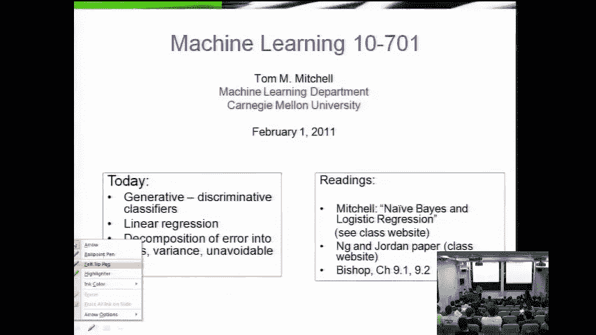
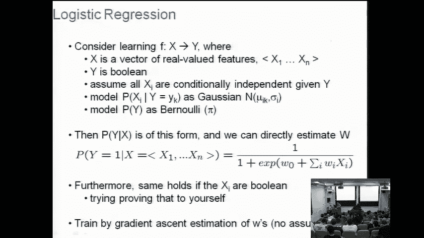
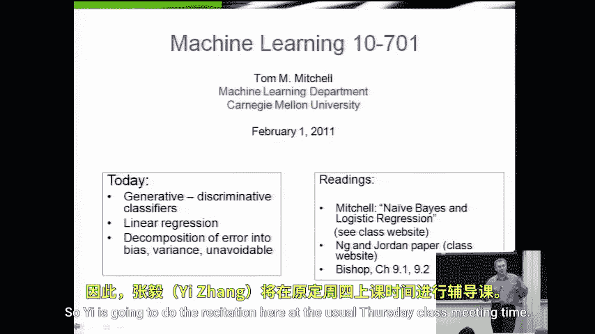
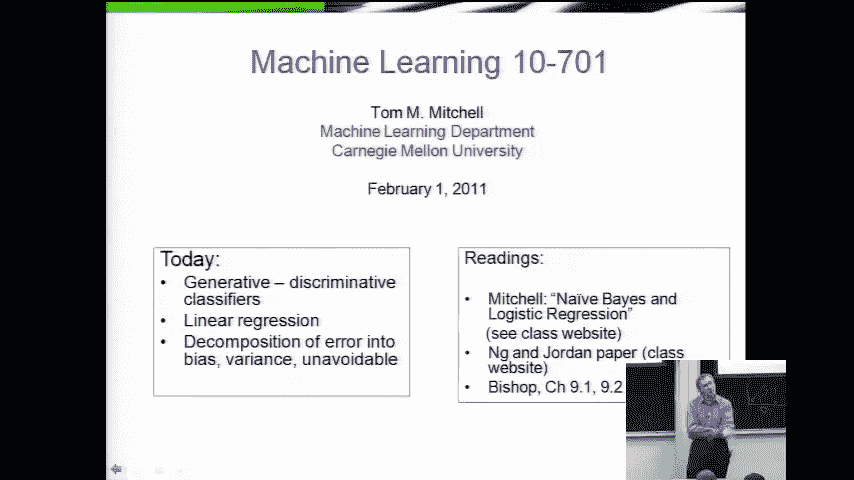
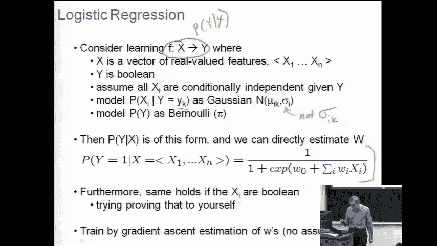
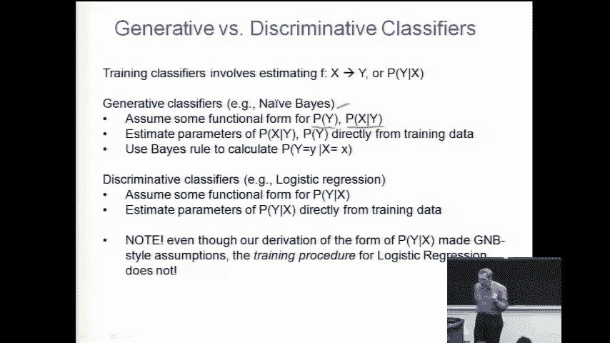

# 033：线性回归

在本节课中，我们将回顾并比较朴素贝叶斯与逻辑回归这两种概率学习方法，并引入第三种方法——线性回归。线性回归用于预测实数值输出，其推导过程与之前的方法有相似之处。

## 课程安排调整

在开始课程内容之前，有一个关于本周课程安排的调整通知。

本周的教师安排略有不同。原定于周三下午5点的复习课将不会举行。取而代之的是，张毅老师将在周四的常规上课时间，于本教室进行复习课讲解。这将为大家提供一个机会，因为周四我需要出差。张毅老师将在周四的常规上课时间进行复习，并讲解一些内容，同时也为大家提供一个比常规讲座风格下更多的提问机会。这就是本周的计划。

## 回顾：逻辑回归

我们刚刚完成了对逻辑回归的讨论。至此，我们已经介绍了课程中前两种严肃的概率机器学习方法：朴素贝叶斯和逻辑回归。

今天，我们首先要具体审视这两种方法，并探讨在何种情况下我们可能选择使用其中一种而非另一种。然后，我们将继续介绍第三种同样由概率动机驱动的学习算法。现在大家会发现，介绍它不会花费太长时间，因为大家已经掌握了进行此类推导的模板。我们要看的就是线性回归，其中我们试图逼近的函数具有实数值输出 Y，而非离散值 Y。

这就是今天的计划。

为了帮助大家回顾，这里有一张关于我们讨论过的所有内容的总结幻灯片，关于逻辑回归。

线性回归的核心在于，我们试图学习从 X 到 Y 的某个函数，或者等价地，思考给定 X 时 Y 的条件概率。如果我们做出与高斯朴素贝叶斯非常相似的假设，再加上一个假设：即各个实值特征 X_i 在给定 Y 时的条件分布是高斯分布，并且这些高斯分布的方差对于每个可能的标签 Y 都是相同的。那么我们发现，可以推导出 P(Y|X) 的形式，并得到了这个形式。

接着我们继续讨论如何训练这个逻辑回归形式中的权重 W_i。我们通过直接最大化所有训练样本的 Y 值在给定其 X 值时的条件似然来训练这些权重。当我们写下最大化条件似然（即给定 X 和 W 时 Y 的似然）的公式后，我们发现可以推导出一个梯度下降（实际上是梯度上升）规则。这个规则允许我们迭代地重新估计这些 W，直到它们确实最大化训练样本 Y 在给定训练样本 X 时的条件似然。这就是我们的优化过程，或者说训练过程，即让权重 W_i 拟合训练数据的方法。

这就是逻辑回归。

我想指出一点，认识到这一点实际上很重要，我们上次课后在教室前面也对此进行了一点讨论。如果你问，逻辑回归算法中做了哪些假设？那么，聪明的思考方式是将其分解为两个不同的问题。

我们可以问：为了推导出这个函数形式（即逻辑函数）作为我们表示 P(Y|X) 的方式，我们做了哪些假设？我们在那里所做的假设正是这张幻灯片上半部分列出的那些。

但我们也可以问一个略有不同的问题：一旦我们确定了使用这个函数形式，在训练算法本身中，我们做了哪些假设？那个梯度上升训练算法。仔细想想，它实际上并没有做出任何类似条件独立性的假设。除了假设 P(Y|X) 是这个函数形式外，它没有做任何假设。然后它寻找能最大化条件数据似然的 W_i。它所做的唯一假设就是我们将使用这个函数形式。

因此，这里有一个有趣的现象：梯度上升训练算法对于违反我们在推导这个函数形式时所做的假设，持一种开放的态度。我的意思是，是的，我们在推导函数形式时必须做出那些假设，但一旦我们有了函数形式，我们估计 W_i 的过程除了想要优化条件数据似然外，真的没有做任何假设。

从这个意义上说，逻辑回归比高斯朴素贝叶斯更自由、更灵活。因为当你训练高斯朴素贝叶斯分类器时，你实际上是在估计这些均值和方差，并且你真的在应用这些估计，在条件独立性假设下对新样本进行分类。

所以，如果我们想理解逻辑回归和高斯朴素贝叶斯之间的区别，这是我们需要考虑的一部分视角。

## 生成式与判别式分类器

我们花这么多时间在高斯朴素贝叶斯和逻辑回归上的一个原因是，它们确实是人们常说的生成式分类器与判别式分类器的典型范例。本学期后续还会看到其他例子。

例如，朴素贝叶斯是人们常说的生成式分类器的一个例子。当人们这么说时，意思是它是一个概率分类器，假设了 P(Y) 和 P(X|Y) 的某种函数形式，然后从训练数据中估计这两者，接着使用贝叶斯规则来对新的 X 进行分类，以找到给定新 X 时 Y 的分布（即新样本可能属于各类别的概率分布）。

相比之下，逻辑回归是人们常说的判别式分类器的一个例子。我们指的是这样一种分类器，它直接假设了给定 X 时 Y 的条件分布的某种函数形式，然后直接估计该分布的参数，而不经过贝叶斯规则这个中间步骤。

将这些方法称为“生成式”和“判别式”的原因有点奇特，但大致如下：逻辑回归被称为判别式，因为它真正关心的只是给定一个 X 时，Y 是什么。