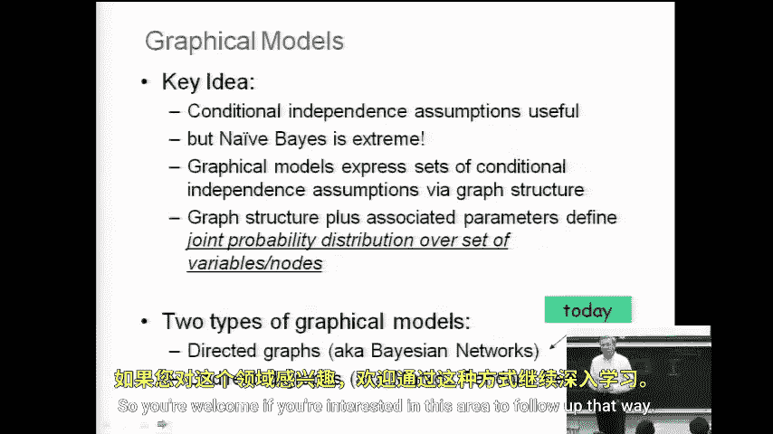
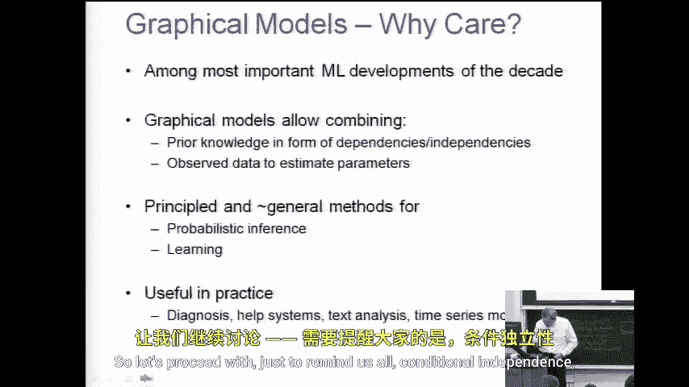
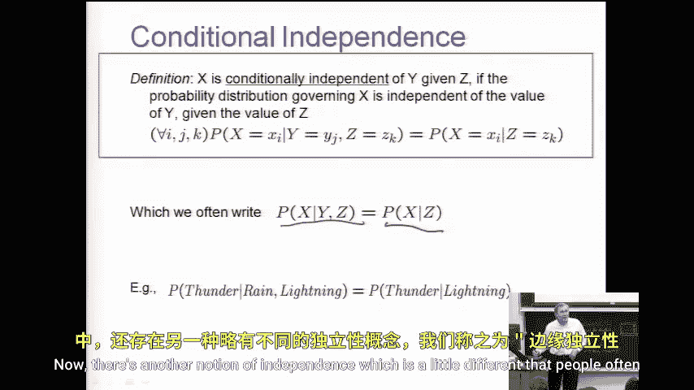
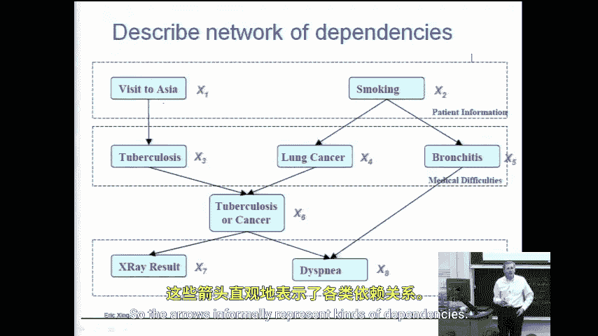
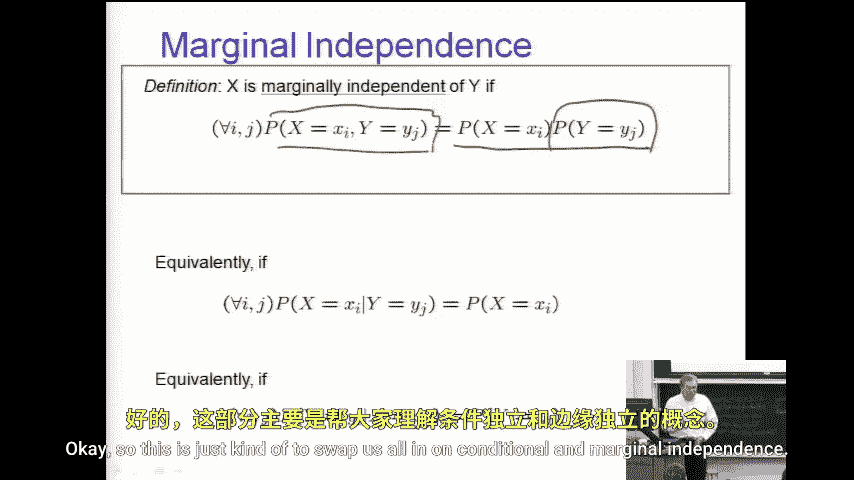

# 034：图模型入门 🧠

在本节课中，我们将要学习图模型（Graphical Models）的基本概念。图模型是一种用于表示概率分布的强大工具，它在机器学习领域极为流行，为许多算法提供了基础。我们将从回顾朴素贝叶斯的局限性开始，逐步理解图模型如何通过表达变量间的条件独立性假设，在模型复杂度和表达能力之间找到平衡。

## 从朴素贝叶斯到图模型 🚀

上一节我们介绍了朴素贝叶斯分类器，它基于一个非常强的条件独立性假设：所有特征在给定类别标签的条件下相互独立。这个假设虽然使得模型非常高效（参数数量与特征数 **n** 呈线性关系），但在许多实际场景中（如文档分类）却过于简化，并不符合真实的数据分布。

图模型的动机正在于此。它为我们提供了一种方法，可以在这两个极端之间进行导航：
*   一个极端是**完整的联合分布**，它对 **n** 个变量不做任何独立性假设，但需要指数级（**2^n**）的参数，难以处理。
*   另一个极端是**朴素贝叶斯**，它做了大量（且通常不成立）的条件独立性假设，从而变得非常高效但可能过于简化。

图模型允许我们**有选择地声明**我们相信存在的条件独立性和依赖性关系。这样，我们就能设计出既相对高效又能捕捉关键数据关系的模型。

## 图模型的类型与条件独立性 📊

图模型主要分为两大类：
*   **有向图模型**：通常称为贝叶斯网络（Bayesian Networks）。本课程将主要关注此类模型。
*   **无向图模型**：例如马尔可夫随机场（Markov Random Fields）。本课程不会深入讨论。

在深入图模型之前，我们先明确两个核心的概率概念：

以下是条件独立性的定义：
*   我们说随机变量 **X** 在给定随机变量 **Z** 的条件下独立于随机变量 **Y**，当且仅当：
    **P(X | Y, Z) = P(X | Z)**
*   这意味着，一旦知道了 **Z**，**Y** 的取值不会为预测 **X** 提供任何额外信息。

以下是边际独立性的定义：
*   我们说随机变量 **X** 和 **Y** 是边际独立的，当且仅当它们的联合分布可以分解为各自边缘分布的乘积：
    **P(X, Y) = P(X) * P(Y)**
*   边际独立性是比条件独立性更强的假设，它不依赖于任何其他变量。

## 贝叶斯网络：一个直观例子 🏥

让我们通过一个经典的医疗诊断贝叶斯网络例子来建立直观理解。

在这个网络中，每个节点代表一个随机变量（例如：“是否去过亚洲”、“是否是吸烟者”、“是否患有肺癌”、“X光结果”等）。箭头直观地表示了变量之间的**依赖关系**。

例如：
*   “是否患有肺癌”可能依赖于“是否是吸烟者”，但可能不直接依赖于“是否去过亚洲”。
*   “X光结果”则直接依赖于“是否患有肺癌”。

这个图不仅仅是一个依赖关系的示意图。它对应着一个严格的**因式分解**：整个变量集合的联合概率分布可以写成图中每个节点在给定其父节点条件下的概率的乘积。这种分解正是图模型形式化语义的核心，它编码了图中蕴含的所有条件独立性假设。

## 总结 ✨

本节课中我们一起学习了图模型的基本思想。我们了解到，图模型是一种强大的框架，它通过图结构来编码变量间的条件独立性假设，从而允许我们在模型复杂度和真实性之间进行灵活的权衡。我们从回顾朴素贝叶斯的局限性出发，引出了对更丰富表达方式的需求，并初步认识了贝叶斯网络这一有向图模型，以及它如何通过图结构和概率分解来表示领域知识。