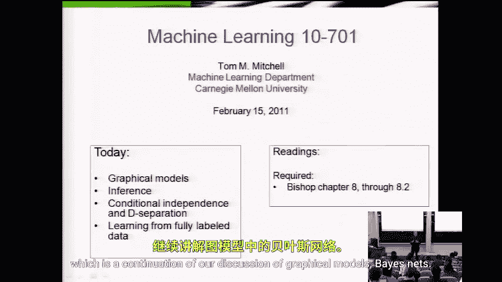
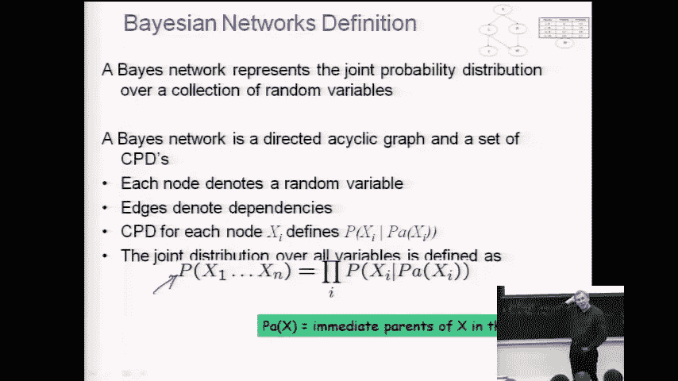
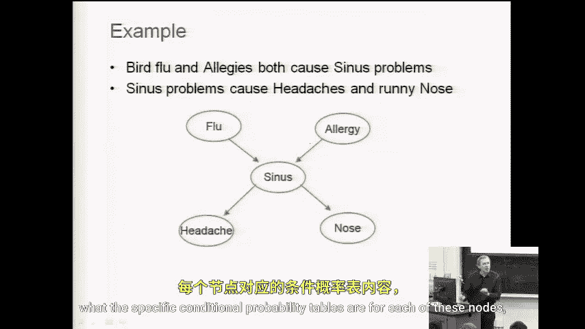

# 035：贝叶斯网络（二）📊

在本节课中，我们将继续学习贝叶斯网络。我们将探讨如何利用贝叶斯网络进行概率推断，并深入理解其背后蕴含的条件独立性假设。首先，让我们回顾一下贝叶斯网络的基本概念。

## 贝叶斯网络回顾

贝叶斯网络是一种用于描述一组随机变量联合概率分布的表示方法。它是一种非常方便的表示法。

贝叶斯网络通过以下公式来表示联合概率分布：

\[
P(X_1, X_2, ..., X_n) = \prod_{i=1}^{n} P(X_i | \text{Parents}(X_i))
\]

我们有一组随机变量 \(X_1\) 到 \(X_n\)。贝叶斯网络告诉我们，相比于构建一个包含所有变量可能取值组合的巨大表格（即使变量是布尔型，也会有 \(2^n\) 行），我们可以用一系列更简单的条件概率分布的乘积来表示联合分布。

这相当于做了一系列条件独立性假设。因此，能够更简单地表示这些联合分布在两个主要方面带来了好处。

## 贝叶斯网络的优势

第一个优势体现在推理任务上。如果有人给我们一个贝叶斯网络并提出一个推理问题，例如“给定 \(X_5=0\) 和 \(X_3=0\)，求 \(X_7=1\) 的概率”，我们可以利用简化的表示来更高效地计算答案，而不必遍历庞大的概率表。虽然最坏情况下贝叶斯网络推理仍然是NP难问题，但对于某些特定结构的网络，我们可以显著降低计算复杂度。

第二个优势体现在模型学习上。与需要估计完整联合分布的贝叶斯分类器相比，贝叶斯网络因其隐含的条件独立性假设，降低了**样本复杂度**。这意味着我们需要更少的训练样本来可靠地估计模型参数，这与朴素贝叶斯分类器的优势类似。

上一节我们回顾了贝叶斯网络的基础和优势，本节中我们来看看具体的推理方法和条件独立性。

## 概率推断问题

关于推断的故事有些令人遗憾。遗憾的是，贝叶斯网络并不能使概率推断变得简单，在最坏情况下它仍然是NP难的。然而，在某些情况下它是可处理的。在图形模型的研究文献中，有大量篇幅讨论如何在贝叶斯网络中进行推断，这本身就是一个重要的课题。本课程不会深入所有细节，但我们会介绍一些核心思想。

让我们从一个简单的贝叶斯网络例子开始，这是我们上节课看过的。

在这个网络中，我们假设有五个布尔变量。描述一个贝叶斯网络需要说明三件事：
1.  图结构。
2.  每个节点是何种随机变量（例如，布尔值、实数值）。
3.  每个节点在其父节点条件下的条件概率表。

一旦知道了这些，我们就完全掌握了这个贝叶斯网络。在这个例子中，我们假设所有变量都是布尔型的，并且图结构如上所示。我们尚未指定每个节点的具体条件概率表，但这不影响我们讨论推断问题。

## 计算具体赋值的概率

一个常见的推断问题是：如何利用这样的贝叶斯网络计算所有变量取某一组特定值的概率？

通常，我们用大写字母表示变量名，用小写字母表示其取值。例如，\(P(A=a, B=b, C=c, D=d, E=e)\)。为了简洁，我们常将其缩写为 \(P(a, b, c, d, e)\)。

假设我们已经有了每个节点对应的条件概率表（每个表给出了该节点在其直接父节点条件下的概率），那么如何计算这个特定赋值组合的概率呢？

我们唯一可用的信息就是图结构和每个节点的条件概率表。答案是，直接应用贝叶斯网络的链式法则定义：

\[
P(a, b, c, d, e) = P(a) \times P(b|a) \times P(c|a) \times P(d|b, c) \times P(e|c)
\]

我们可以通过查找每个节点对应的条件概率表中的值，并将它们相乘来得到结果。例如，要计算 \(P(b|a)\)，我们就在变量 \(B\) 的条件概率表中，找到在父节点 \(A=a\) 的条件下，\(B=b\) 对应的概率值。

## 条件独立性深入探讨

现在，让我们更深入、更完整地探讨贝叶斯网络所蕴含的条件独立性假设，这比我们上节课的讨论更详细。

贝叶斯网络的图结构编码了条件独立性关系。理解这些关系对于高效进行推理和学习至关重要。判断条件独立性的一个通用标准是“**有向分离**”。

有向分离的概念涉及“**阻塞**”一条路径。一条路径在给定一组证据变量 \(Z\) 的条件下被阻塞，如果该路径包含以下三种结构之一：
1.  **顺连结构** \(A \rightarrow B \rightarrow C\)：如果中间变量 \(B\) 在 \(Z\) 中，则路径被阻塞。
2.  **分连结构** \(A \leftarrow B \rightarrow C\)：如果中间变量 \(B\) 在 \(Z\) 中，则路径被阻塞。
3.  **汇连结构** \(A \rightarrow B \leftarrow C\)：如果中间变量 \(B\) **或其任何后代**不在 \(Z\) 中，则路径被阻塞。

如果给定 \(Z\) 后，连接变量 \(X\) 和 \(Y\) 的所有路径都被阻塞，那么 \(X\) 和 \(Y\) 在给定 \(Z\) 的条件下是独立的。

让我们回到之前的五变量网络例子。我们可以应用有向分离来判断条件独立性。例如：
*   给定 \(A\)，\(B\) 和 \(C\) 是否独立？不，因为它们通过 \(A\) 相连，且 \(A\) 已被观测（属于顺连/分连结构中的被观测中间节点），但这并不导致它们独立；实际上，它们通过 \(A\) 相互关联。
*   给定 \(B\) 和 \(C\)，\(D\) 和 \(E\) 是否独立？是的，因为所有连接 \(D\) 和 \(E\) 的路径（如 \(D \leftarrow B \leftarrow A \rightarrow C \rightarrow E\)）都因为 \(B\) 或 \(C\) 被观测而阻塞。

理解这些条件独立性是设计高效推断算法和理解模型表达能力的关键。

## 总结

本节课中我们一起学习了贝叶斯网络的进一步内容。我们回顾了贝叶斯网络如何简化联合概率表示及其在推理和学习上的优势。我们探讨了计算具体变量赋值概率的方法，即利用网络结构将联合概率分解为条件概率的乘积。更重要的是，我们深入了解了贝叶斯网络所编码的条件独立性假设，并通过“有向分离”的标准来判断变量间的条件独立性。虽然精确推断在一般情况下是困难的，但理解这些基础概念是应用更高级、更高效近似推断算法的基石。