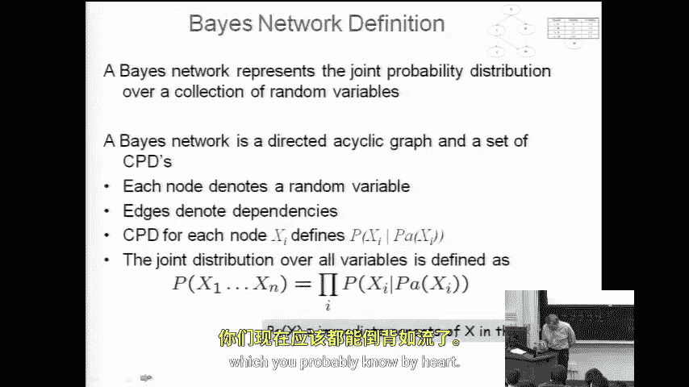
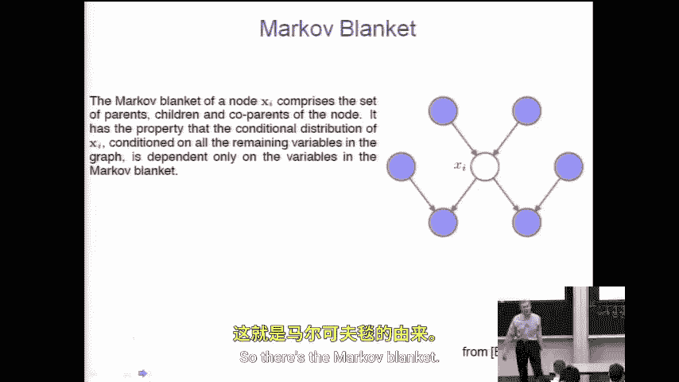
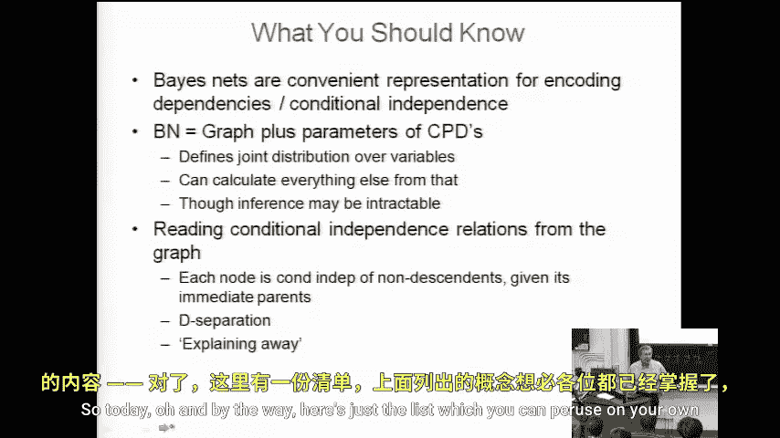
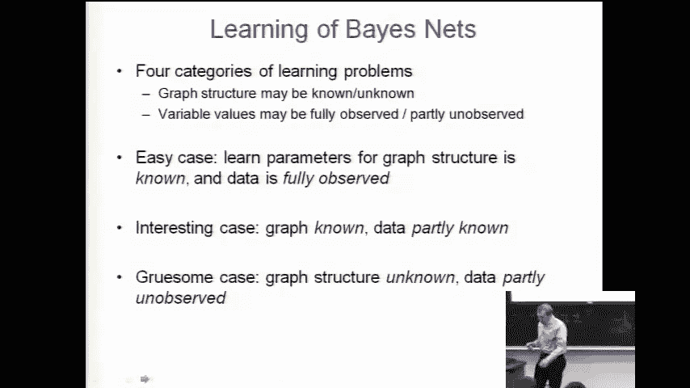
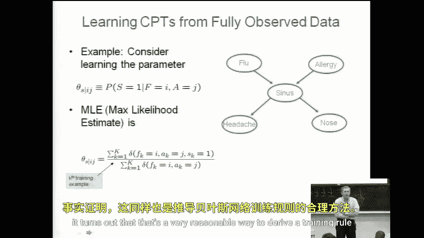

# 036：贝叶斯网络学习

在本节课中，我们将学习如何训练贝叶斯网络。我们将从最简单的情况开始，即网络结构已知且所有变量在训练数据中均可观测。接着，我们会探讨一个更具挑战性但更贴近现实的情况：网络结构已知，但部分变量值在训练数据中缺失。

## 回顾：马尔可夫毯

上一节我们介绍了d-分离的概念，本节中我们来看看一个相关的核心概念：马尔可夫毯。

在贝叶斯网络中，一个变量 \(X_i\) 的马尔可夫毯是指，当给定这些变量的值时，网络中的其余所有变量都与 \(X_i\) 条件独立。换句话说，知道了马尔可夫毯中变量的值，就足以完全确定关于 \(X_i\) 的所有信息。

对于任何有向无环图（贝叶斯网络），一个变量 \(X_i\) 的马尔可夫毯包含以下三部分：
*   **父节点**：\(X_i\) 的**直接父节点**。
*   **子节点**：\(X_i\) 的**直接子节点**。
*   **共父节点**：\(X_i\) 子节点的**其他父节点**（即共父节点）。

需要包含共父节点的原因，与d-分离定义中涉及的“碰撞”子图结构有关。

## 学习贝叶斯网络的问题分类

学习贝叶斯网络的任务可以根据两个维度进行分类，形成一个2x2的问题矩阵：

1.  **网络结构是否已知？**
    *   **已知**：学习任务已部分解决，但仍需学习条件概率分布。
    *   **未知**：需要从数据中同时学习网络结构和条件概率分布。

2.  **训练数据是否完全可观测？**
    *   **完全可观测**：每个训练样本都提供了网络中所有变量的观测值。
    *   **部分可观测**：某些训练样本中，部分变量的值是缺失或未观测到的。这在现实中很常见，例如在医疗诊断中，并非每个病人都接受所有检查。

基于此，我们有四种学习场景：
*   **最简单情况**：结构已知，数据完全可观测。
*   **本节重点之一**：结构已知，数据部分可观测。
*   **更复杂情况**：结构未知，数据完全可观测。
*   **最复杂情况**：结构未知，数据部分可观测。

本节课我们将聚焦于前两种情况。

## 情况一：结构已知，数据完全可观测

### 最大似然估计方法

回顾本课程至今的一个通用方法论：当我们想要学习一个函数或估计一个概率分布的参数时，我们的标准工具是**最大似然估计** 以及其贝叶斯版本**最大后验概率估计**。

具体到贝叶斯网络，我们用参数向量 \(\theta\) 来表示网络中所有条件概率分布（CPD）的参数。MLE的目标是：选择那个能使观测到的训练数据 \(D\) 出现概率最大的参数值 \(\theta\)。

公式表示为：
\[
\theta_{MLE} = \arg\max_{\theta} P(D | \theta)
\]

这非常直观：给定两个不同的参数假设，我们选择那个使现有数据更可能发生的那个。这正是我们在朴素贝叶斯分类器训练中使用的方法。

### 学习过程

对于结构已知且数据完全可观测的贝叶斯网络，学习过程变得相对直接。因为网络结构固定，并且每个数据点都提供了所有变量的值，所以我们可以独立地估计每个节点在其父节点取值组合下的条件概率。

本质上，这等同于为网络中的每个条件概率表（CPT）收集充分的统计量（即计数），然后进行归一化。这个过程可以高效地分解进行。

## 情况二：结构已知，数据部分可观测

### 挑战与期望最大化算法

当训练数据中部分变量值缺失时，问题变得更具挑战性。我们无法再简单地通过计数来估计CPT，因为对于某些样本，我们不知道缺失变量的取值。

处理这类问题的经典方法是**期望最大化算法**。EM算法通过迭代以下两步来解决这个问题：
1.  **E步（期望步）**：基于当前对参数 \(\theta\) 的估计，计算缺失数据的**期望**值（或更一般地，计算完整数据对数似然的期望）。
2.  **M步（最大化步）**：将E步计算出的期望视为“完整数据”，然后像情况一那样，重新**最大化**似然函数来更新参数估计 \(\theta\)。

EM算法保证每次迭代都能提高数据的似然值，并最终收敛到一个局部最优解。

### 直观理解

可以这样理解EM算法：开始时，我们随机猜测缺失的值和参数。然后，我们循环进行：
*   利用当前猜测的参数，对缺失的数据做出“最佳猜测”（E步）。
*   利用这个“补全”的数据集，重新计算更好的参数估计（M步）。
*   重复这个过程，直到参数估计不再发生显著变化。

## 总结

本节课中我们一起学习了贝叶斯网络的训练方法。

我们首先回顾了马尔可夫毯的概念，它定义了一个变量在给定其父节点、子节点及共父节点后与网络其余部分条件独立。

接着，我们根据**网络结构是否已知**和**数据是否完全可观测**两个维度，对贝叶斯网络学习问题进行了分类。

我们重点探讨了两种情况：
1.  **最简单情况（结构已知，数据完全可观测）**：可以直接使用**最大似然估计**方法，通过计数和归一化独立地学习每个条件概率表的参数。
2.  **更现实的情况（结构已知，数据部分可观测）**：需要采用**期望最大化算法**。EM算法通过迭代执行E步（基于当前参数估计缺失数据的期望）和M步（基于“补全”的数据更新参数），来处理缺失数据问题，并收敛到一个局部最优解。

理解这些基础的学习方法，是掌握更复杂的、结构未知的贝叶斯网络学习技术的重要前提。