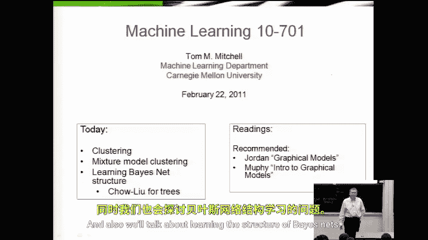
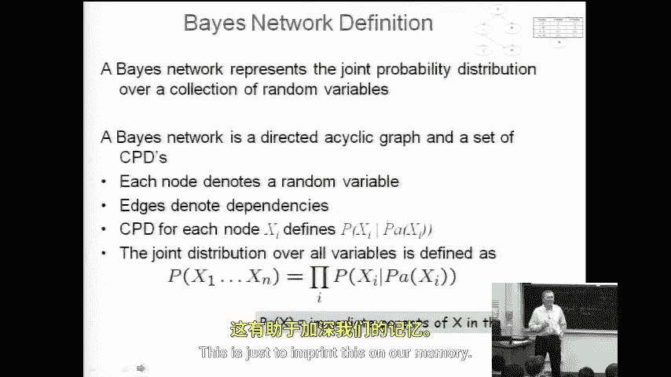
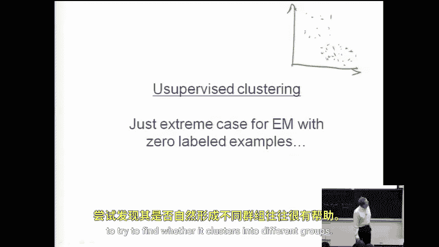
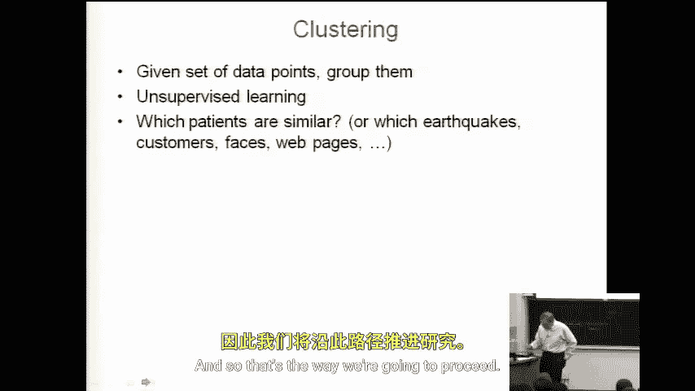
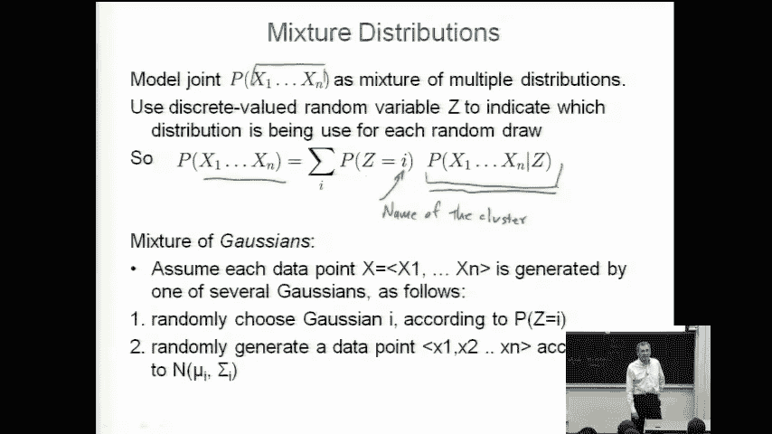

# 037：聚类与贝叶斯网络结构学习

在本节课中，我们将要学习**聚类**，这是处理无标签数据的一种方法。我们还会探讨如何学习贝叶斯网络的**结构**。课程开始时，我们回顾了上节课的内容，并指出聚类实际上是**期望最大化算法**的一个特例。

---

## 聚类问题概述

上一节我们介绍了如何处理部分变量可观测情况下的参数学习。本节中我们来看看**无监督聚类**问题。

许多人会用类似下图来描述聚类问题：当我们有一些无标签数据，并且数据点具有某些特征（例如身高和体重）时，有时将数据**分组**到不同的簇中是有用的，这有助于我们初步观察和理解数据。

我们可以用几种不同的方式来思考这个问题。最初，我认为聚类是一个定义不清的“愚蠢”问题，因为对于同一组数据点，不同的人可以画出不同的簇，而没有明确的标准来判断哪种划分更好。

但是，我们可以通过**概率建模**的视角，将聚类转化为一个定义明确的问题。具体来说，我们希望训练一个概率模型（例如贝叶斯网络）来对数据点进行聚类，并认为**最佳的聚类是使数据似然性最大化的那个**。

因此，给定两个可以对数据进行聚类的概率模型，我就有了选择依据：我会选择那个使观测数据**概率更高**的模型。通过这种方式，聚类不再是一个模糊的问题，而变成了一个明确的算法问题：**如何估计贝叶斯网络的参数，从而以最可能的方式对数据点进行聚类？**

---

## 混合分布

在聚类文献中，你经常会看到**混合分布**这个术语。这是一种用于对聚类问题进行建模的概率分布，其做法非常符合直觉。

假设每个数据点由 **N** 个特征描述，即由 N 个随机变量表示。混合分布是这些随机变量联合概率分布的一种特殊形式。

对于具有特征 **x₁** 到 **xₙ** 的任意数据点，其概率采用以下形式：

**P(x₁, …, xₙ) = Σᵢ P(Z=i) * P(x₁, …, xₙ | Z=i)**

其中，**Z** 是一个我们无法观测的**隐变量**，它是一个离散变量，可以将其视为**簇的名称或标识**。对于任何给定的数据点，我们都无法观测到 Z 的值。

这个公式的含义是：任何数据点的概率，是多个不同条件概率分布的**叠加或混合**。**P(x₁, …, xₙ | Z=i)** 表示给定数据点属于第 i 个簇时，其特征的概率分布。而 **P(Z=i)** 则反映了第 i 个簇的“权重”或“流行程度”，数据点更多的簇，其 **P(Z=i)** 值会更高。

你也可以将此公式视为一个**期望值**：它是在隐变量 Z 的概率分布 **P(Z)** 下，条件概率 **P(x | Z)** 的期望。

实际上，当我们讨论**朴素贝叶斯**模型时，其形式与此类似。在那里，可观测的类别标签 **Y** 就扮演了此处隐变量 **Z** 的角色。我们说，一个数据点的概率是标签 Y 取某个值的概率，乘以给定该标签下所有特征取值的概率。

---

## 如何选择簇的数量？

一个很自然的问题是：**我们如何知道 Z 应该取多少个值？是 2、3、17 还是其他？**

在本讲座中，我们暂时假设这个数量是**预先设定**的。这是一个很好的思考题：如何利用**交叉验证**来确定 Z 的最佳取值？

你可以尝试不同的值，例如 Z=1, 2, 17, 94，甚至让 Z 等于数据点的数量（即每个点自成一簇）。显然，我们允许的簇数量越多，就越能让训练数据的似然性变得更高（存在过拟合风险）。但是，如果我们留出一部分数据进行交叉验证，就会发现，当簇数量过多时，模型在未见数据上的性能可能会下降。因此，交叉验证可以帮助我们选择在泛化能力上最优的簇数量。

---

## 总结

本节课中我们一起学习了：
1.  **聚类**可以被定义为一个**概率模型参数估计**问题，其目标是找到使数据似然性最大化的分组方式。
2.  用于聚类建模的核心概率工具是**混合分布**，它通过一个隐变量 **Z** 来表示簇归属，并将数据概率表示为各成分分布按权重的和。
3.  混合分布的形式与**朴素贝叶斯模型**有相似之处。
4.  关于**簇数量**的选择，我们提到可以通过**交叉验证**这一技术来确定最优值，这是一个重要的模型选择问题。

通过将聚类置于概率框架下，我们赋予了这个问题清晰的定义和解决路径。