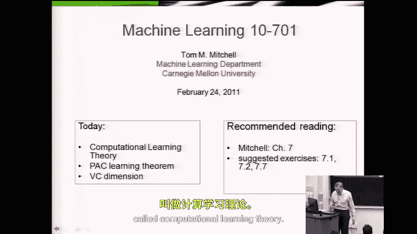
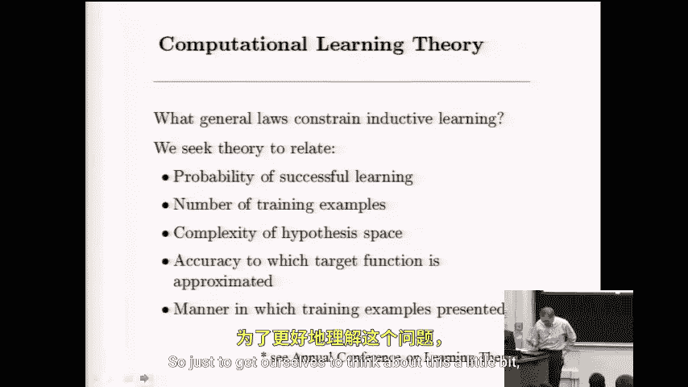

# 038：计算学习理论

在本节课中，我们将探讨一个在课程伊始就提出的核心问题：是否存在支配任何学习系统（包括人脑）学习行为的普遍规律？我们将介绍一个被称为“计算学习理论”的领域，它旨在从理论上分析学习问题，特别是研究训练样本数量、假设空间复杂度与学习成功概率之间的关系。

上一节我们引出了计算学习理论的基本问题，本节中我们来看看一个具体的分析框架。

## 问题设定

我们考虑一个布尔值函数（或称“概念”）的学习场景。设目标函数为 **C**，它将一个特征向量 **x** 映射到一个布尔值 **y**（1 或 0）。学习者的任务是，通过观察由 **C** 正确标记的训练样本 **(x, y)**，来估计这个函数。

学习过程涉及三个角色：
*   **目标函数 C**：我们试图学习的真实函数。
*   **训练器**：知晓 **C**，能为任何 **x** 提供正确的标签 **y**。
*   **学习者**：接收训练样本，并尝试估计函数。

学习的效果与如何获取训练数据密切相关。以下是三种不同的场景：

以下是三种不同的训练数据获取场景：

1.  **学习者主动选择（主动学习）**：学习者可以任意选择空间中的 **x** 点，并向训练器询问其标签。这允许学习者选择那些能提供最多信息的样本。
2.  **训练器主动选择（教学式学习）**：训练器知晓 **C**，并试图构造最少数量的、能高效传达概念本质的示例来教导学习者。
3.  **随机抽样（概率场景）**：存在一个底层的概率分布 **P(x)**。训练样本 **x** 是从 **P(x)** 中随机独立抽取的，然后由训练器提供正确标签 **y**。这是我们本节课主要讨论的场景。

在随机抽样的场景下，我们关心：需要从分布 **P(x)** 中抽取多少训练样本，才能以高概率保证学习者学到的假设在未来的新样本上错误率很低？

## 核心概念与PAC学习

为了回答上述问题，我们引入“可能近似正确”（Probably Approximately Correct, PAC）学习框架。该框架形式化地定义了“成功学习”的含义。

上一节我们定义了学习场景，本节中我们来看看PAC学习框架如何量化学习目标。

一个假设 **h**（学习者学到的函数）的**真实错误率**定义为，当从分布 **P(x)** 中随机抽取新样本 **x** 时，**h(x) ≠ C(x)** 的概率。其公式表示为：

**error_P(h) = Pr_{x∼P}[h(x) ≠ C(x)]**

PAC学习的目标是：我们希望学习者能够返回一个假设 **h**，使得其真实错误率 **error_P(h)** 小于某个小的常数 **ε**（例如 0.05），并且我们希望这一成功事件以很高的概率（至少 **1 - δ**，例如 0.95）发生。

以下是PAC学习目标的正式定义：

*   **近似正确（Approximately Correct）**：学到的假设 **h** 的**真实错误率 error_P(h) ≤ ε**。这里 **ε** 是精度参数。
*   **可能（Probably）**：上述“错误率 ≤ ε”的事件以至少 **1 - δ** 的概率发生。这里 **δ** 是置信参数，代表失败的风险。

因此，PAC学习研究的是：需要多少训练样本（记为 **m**），才能保证对于任何分布 **P(x)** 和任何目标概念 **C**（来自某个概念类 **H**），学习者都能以至少 **1 - δ** 的概率输出一个错误率至多为 **ε** 的假设。

## 假设空间复杂度与样本数量

所需训练样本数量 **m** 不仅取决于我们期望的精度 **ε** 和置信度 **δ**，还强烈依赖于学习者所考虑的**假设空间 H** 的复杂度。更复杂的假设空间（例如，能表示更多函数的空间）通常需要更多的数据来从中确定正确的假设。

一个关键的理论结果是，对于有限假设空间 **H**，存在一个样本复杂度上界。以下是保证PAC学习所需的样本数量公式：

**m ≥ (1/ε) [ ln(|H|) + ln(1/δ) ]**

其中：
*   **m**：所需训练样本数量。
*   **ε**：期望的错误率上界（精度）。
*   **δ**：允许的失败概率。
*   **|H|**：假设空间 **H** 的大小（即其中不同假设的数量）。

这个公式表明：
1.  对精度要求越高（**ε** 越小），需要的样本 **m** 越多。
2.  对置信度要求越高（**δ** 越小），需要的样本 **m** 越多。
3.  假设空间越复杂（**|H|** 越大），需要的样本 **m** 越多。复杂度以对数形式增长，这是一个相对温和的增长。

## 总结

本节课中我们一起学习了计算学习理论的基础，特别是PAC学习框架。我们明确了在随机抽样场景下“成功学习”的量化定义——即可能（高概率）且近似正确（低错误率）。我们看到了所需训练样本数量 **m** 由目标精度 **ε**、置信水平 **δ** 以及假设空间复杂度 **|H|** 共同决定，并通过公式 **m ≥ (1/ε)[ln(|H|) + ln(1/δ)]** 得到了一个理论上的样本复杂度上界。这为我们理解机器学习算法为何需要数据，以及数据量、模型复杂度与泛化性能之间的基本权衡提供了理论依据。