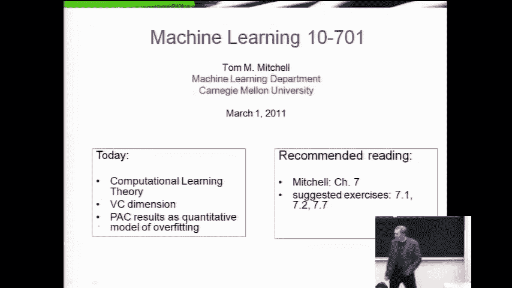
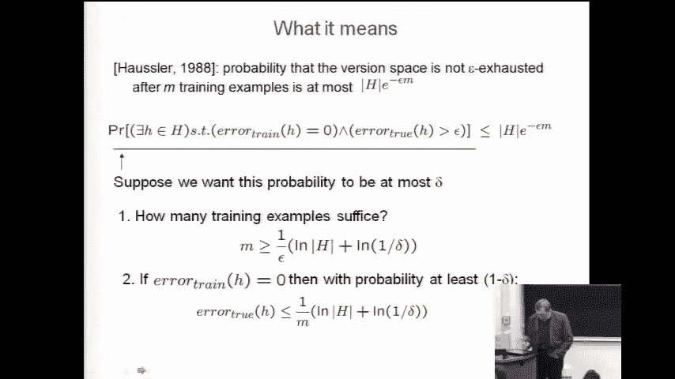
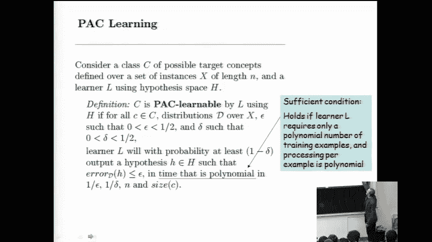
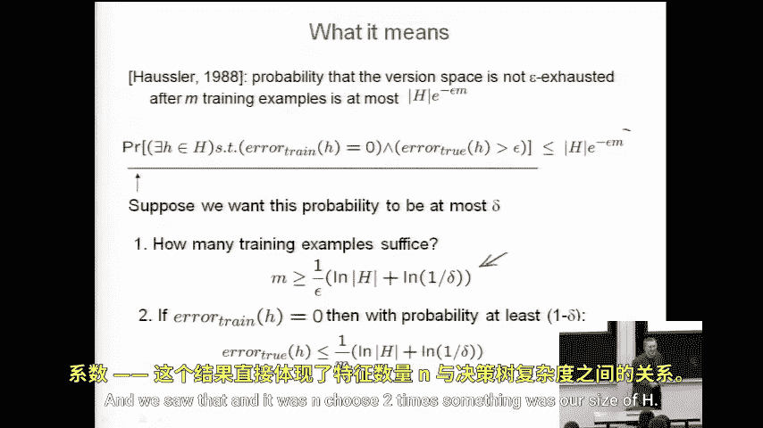

# 039：期中复习与计算学习理论

在本节课中，我们将完成计算学习理论内容的讲解，并回顾本学期前半部分所学的核心知识，为期中考试做准备。

## 回顾：PAC学习框架与有限假设空间



上一节我们介绍了PAC（Probably Approximately Correct）学习框架，并证明了在有限假设空间中的一个关键结论。在该设定下，训练样本由一个随机分布 **P(x)** 生成，并由一个永不犯错的“教师”进行确定性标注。

我们证明了以下结论：在经历了 **m** 个随机训练样本后，假设空间中仍存在一个训练误差为零，但其真实误差大于 **ε** 的假设的概率，存在一个上界。

具体公式如下：
```
P(存在 h ∈ H, 使得 error_train(h) = 0 且 error_true(h) ≥ ε) ≤ |H| * (1 - ε)^m
```

基于此，我们可以推导出，为了以至少 **(1 - δ)** 的概率确保所有幸存假设的真实误差都小于 **ε**，所需的样本数量 **m** 需满足：
```
m ≥ (1/ε) * (ln|H| + ln(1/δ))
```

这个公式为我们提供了**样本复杂度**的理论保证，即需要多少训练数据才能达到期望的精度和置信度。

## 深入：PAC可学习性的正式定义

现在，让我们更精确地理解“PAC可学习性”的正式定义。这个定义通常出现在学术论文中，它从计算复杂性的角度进行描述。

考虑一个概念类 **C**（即教师可能希望教授的所有目标函数的集合），定义在实例集合 **X** 上。一个学习算法 **L** 使用假设空间 **H**。



我们说概念类 **C** 是**PAC可学习的**，如果对于：
*   任何目标概念 **c ∈ C**
*   任何定义在 **X** 上的分布 **D**
*   任何精度参数 **ε > 0**
*   任何置信参数 **δ > 0**

学习算法 **L** 都能以至少 **(1 - δ)** 的概率，输出一个假设 **h**，其真实误差 **error_true(h) ≤ ε**，并且其运行时间是 **1/ε**、**1/δ**、实例编码长度 **n** 以及概念类 **C** 大小的多项式函数。

虽然定义侧重于**计算时间**的复杂性，但在机器学习实践中，我们通常更关心**样本复杂度**。幸运的是，大多数我们讨论过的学习算法（如决策树）都能在多项式数量的样本内学习，并且每个样本的处理时间也是多项式的，因此它们通常也满足PAC可学习的定义。

## 挑战：无限假设空间

上一节我们讨论的结论基于假设空间 **H** 的大小是有限的。本节中，我们来看看当假设空间无限大时，情况会变得如何。这是我们上次留下的悬念。

核心问题在于，我们之前的边界公式依赖于 **|H|**。如果 **|H|** 是无限的，那么边界值将趋于无穷大，变得没有意义。因此，我们需要一个新的衡量标准来替代简单的“假设数量”。

以下是解决这个问题的关键思路：我们需要一个能捕捉假设空间“丰富度”或“表达能力”的度量，即使空间是无限的。

## 关键概念：VC维

为了处理无限假设空间，我们引入一个称为**VC维**的核心概念。VC维衡量的是一个假设空间能够“打散”的最大样本集合的大小。

“打散”的含义是：对于一组包含 **d** 个样本的集合，如果假设空间 **H** 能够实现这 **d** 个样本所有可能的标记方式（共 **2^d** 种），那么我们就说 **H** 能够打散这个集合。

**VC维** 正式定义为：假设空间 **H** 的VC维，是能被 **H** 打散的最大样本集合的大小。如果 **H** 能打散任意大的集合，则其VC维是无穷大。

例如，在二维平面上，所有线性分类器（直线）的VC维是3。它可以打散任意三个不共线的点（实现所有8种标记），但无法打散任意四个点（例如，呈X形的四个点就无法被一条直线完全分开）。

VC维的重要性在于，在无限假设空间中，它可以替代 **|H|** 出现在样本复杂度的边界公式中。样本数量 **m** 的下界变为与 **VC维(H)** 相关，而不是与无限的 **|H|** 相关。这为无限假设空间的学习提供了理论保证。



## 总结与回顾要点

本节课中，我们一起学习了以下核心内容：

1.  **回顾了PAC学习框架**：在有限假设空间中，我们推导了保证学习效果所需的样本数量边界。
2.  **明确了PAC可学习性的正式定义**：这是一个结合了概率近似正确与计算复杂性的严格定义。
3.  **引入了无限假设空间的挑战**：简单的基于假设数量的边界在无限空间下失效。
4.  **介绍了VC维的概念**：作为衡量假设空间复杂度的新工具，VC维能够处理无限假设空间，并为样本复杂度提供新的理论边界。



理解这些理论概念有助于我们深刻认识机器学习算法的能力和限制，明白为何需要一定数量的数据，以及模型复杂性与泛化能力之间的基本权衡。这些是机器学习 foundational 的理论支柱。