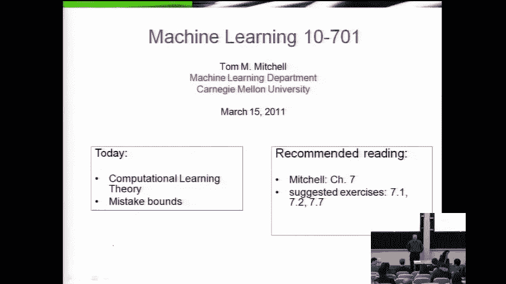
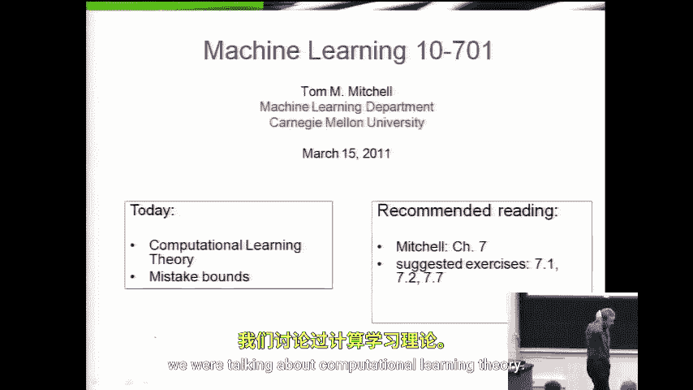
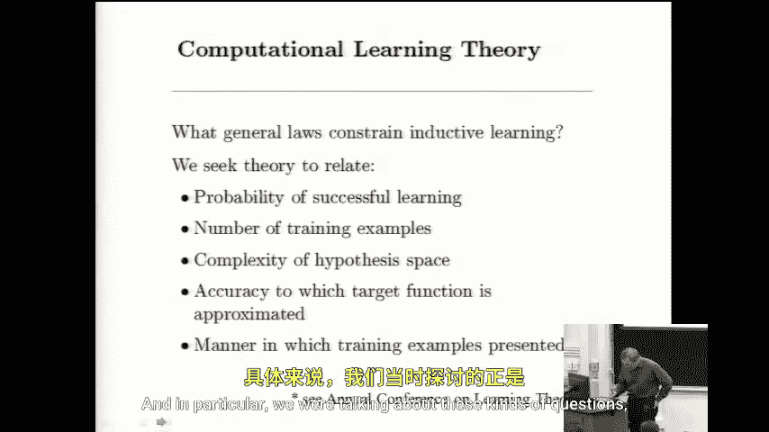
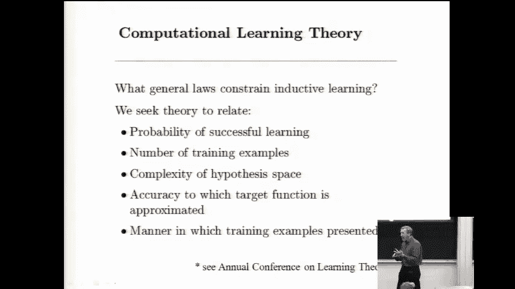
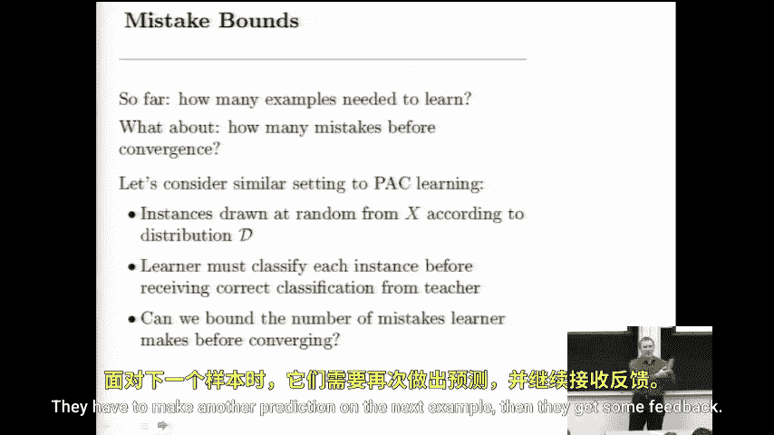
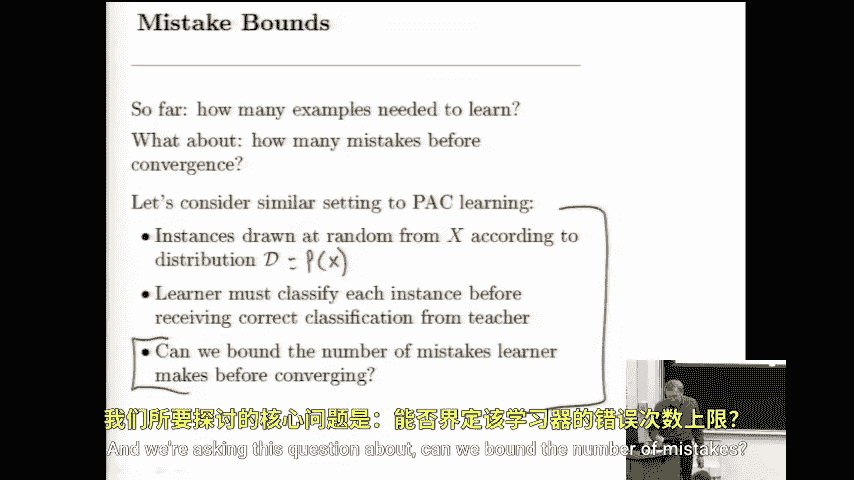
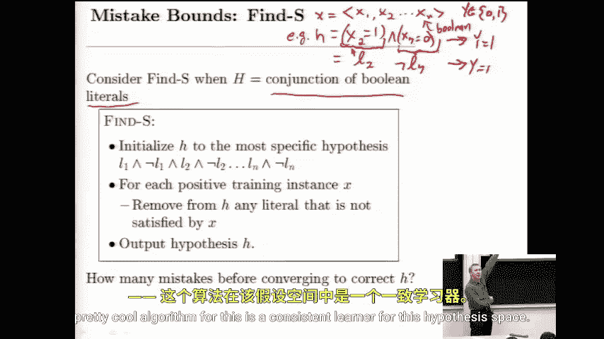

# 040：计算学习理论（续）



在本节课中，我们将继续探讨计算学习理论，但会从一个新的角度出发。上一节我们介绍了**可能近似正确（PAC）学习**框架，它关注的是需要多少训练样本才能以高概率学习到一个近似正确的假设。本节中，我们来看看另一种理论分析框架：**在线学习**中的**错误界分析**。我们将关注一个学习器在最终收敛到正确假设之前，**最多会犯多少个错误**。这对于需要“边工作边学习”的在线系统（如垃圾邮件过滤器）尤为重要。

## 在线学习与错误界

在线学习设定与PAC学习类似，但过程是动态的：
1.  学习器按顺序接收一个个由分布 `P(x)` 生成的实例（例如，一封待分类的邮件）。
2.  对于每个到来的实例，学习器必须**立刻做出预测**（例如，判断是否为垃圾邮件）。
3.  随后，学习器会收到该实例的**真实标签**作为反馈。
4.  学习器可以根据这个反馈来更新其内部假设。





我们关心的核心问题是：在学习器最终学习到目标概念（假设其存在）的过程中，我们能否**从理论上界定它可能犯的最大错误数量**？这就是**错误界**。

## 一个简单的案例：学习布尔文字的合取



为了直观理解错误界，我们从一个非常简单的学习问题和一个朴素的算法开始。

### 问题设定
*   **实例**：由 `n` 个**布尔特征**组成的向量 `x = (x1, x2, ..., xn)`，每个 `xi ∈ {0, 1}`。
*   **目标概念**：我们试图学习一个将实例映射到布尔值 `{0, 1}` 的函数。
*   **假设空间 H**：所有可能的**布尔文字合取式**。每个假设是若干约束的合取（逻辑与）。
    *   一个“文字”可以是要求某个特征 `xi` 为 `1`（正文字），也可以是要求某个特征 `xi` 为 `0`（负文字，即 `¬xi`）。
    *   **公式表示**：一个假设 `h` 形如 `(l1 ∧ l2 ∧ ... ∧ lk)`，其中每个 `lj` 是 `xi` 或 `¬xi`。
    *   **代码表示**：一个假设可以表示为一个字典或列表，记录了对哪些特征有怎样的约束。
        ```python
        # 示例：一个假设要求 (x2 == 1) 且 (x7 == 0)
        hypothesis = {2: 1, 7: 0}
        ```
*   **学习目标**：存在一个未知的目标假设 `c ∈ H`。当实例满足 `c` 的所有约束时，其标签 `y=1`，否则 `y=0`。学习器的目标是找到这个 `c`。

### 学习算法：“消除”算法



以下是针对此问题的一个简单且一致的在线学习算法：

1.  初始化：从最特殊的假设开始。即，初始假设 `h` 包含所有 `2n` 个可能的文字（每个特征的正和负形式）。这相当于一个空的合取式，等待被约束。
2.  对于每个到来的训练样本 `(x, y)`：
    *   **预测**：用当前的 `h` 对 `x` 进行分类。
    *   **接收反馈**：获得真实标签 `y`。
    *   **更新规则**：
        *   如果预测正确，则不改变 `h`。
        *   如果**预测错误**，则一定是以下情况：真实标签 `y=1`（正例），但当前假设 `h` 将其预测为 `0`（负例）。因为 `h` 是合取式，预测为 `0` 意味着 `x` 违反了 `h` 中的至少一个约束。
        *   此时，我们需要**放宽** `h` 以容纳这个正例。方法是：从 `h` 中**删除所有与当前实例 `x` 冲突的文字**。
            *   具体来说，对于 `h` 中的每个文字 `lj`：
                *   如果 `lj` 是 `xi` 而 `x` 中 `xi=0`，则删除 `lj`。
                *   如果 `lj` 是 `¬xi` 而 `x` 中 `xi=1`，则删除 `lj`。
        *   （注：永远不会遇到 `y=0` 但预测为 `1` 的错误，因为我们的初始假设是最特殊的，只会预测 `0`。随着学习进行，`h` 不断放宽，但一旦某个实例被预测为 `1`，它必然满足当前 `h` 的所有约束，而目标概念 `c` 是 `h` 的超集（约束更少），所以该实例也一定满足 `c`，真实标签应为 `1`。因此，不会出现假正例错误。）

### 错误界分析



现在，我们来分析这个算法在最坏情况下会犯多少错误。

以下是关键思路：
*   **初始状态**：假设 `h` 开始时包含 `2n` 个文字（每个特征两个方向）。
*   **错误触发更新**：只有当遇到一个**正例**（`y=1`）且当前假设 `h` 将其误判为负例时，算法才会更新并可能犯错。
*   **每次更新消除文字**：每次这样的错误都会导致算法从 `h` 中删除**至少一个**与当前实例冲突的文字。
*   **文字总数有限**：初始共有 `2n` 个文字。目标概念 `c` 是 `h` 的子集（`c` 的文字是 `h` 中文字的一部分）。错误的更新会删除那些不在 `c` 中的冗余文字。
*   **错误上界**：最坏情况下，每个错误只删除一个文字。为了将初始的 `h` 缩减到目标概念 `c`，我们需要删除所有不在 `c` 中的文字。因为最多有 `2n` 个文字，所以最多需要犯 `2n` 次错误。
*   **更紧的界**：实际上，目标概念 `c` 只包含 `n` 个特征中某一部分的约束。设 `c` 包含 `k` 个文字（`k ≤ n`）。那么，初始 `h` 中与 `c` 不一致的文字最多有 `2n - k` 个。因此，最坏情况下的错误数上界是 `2n - k`。由于 `k` 至少为 `0`，一个更简单通用的上界是 **`2n`**。

**结论**：对于学习“布尔文字合取”概念的“消除”算法，其错误界是 `O(n)`，具体最多为 `2n` 次。这意味着，即使面对恶意排序的实例序列，该算法在学到目标概念前犯的错误数量也是**特征数量**的线性函数，而非指数级，这保证了其学习效率。

## 本节课总结



本节课中我们一起学习了计算学习理论的另一个重要视角：**在线学习的错误界分析**。我们通过一个具体的例子——学习**布尔特征的合取式**——阐述了这个概念。我们介绍了一个简单而有效的“消除”算法，并逐步分析了其工作原理。最关键的是，我们推导出了该算法的**错误上界为 O(n)**，这从理论上保证了它在有限步骤内能够收敛到目标概念，且过程中犯的错误是可控制的。这种分析有助于我们理解学习算法的稳健性和效率，特别是在需要实时交互和学习的应用场景中。