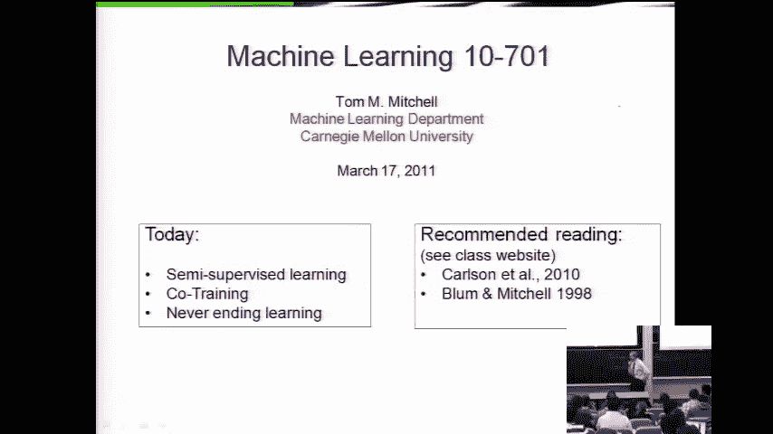
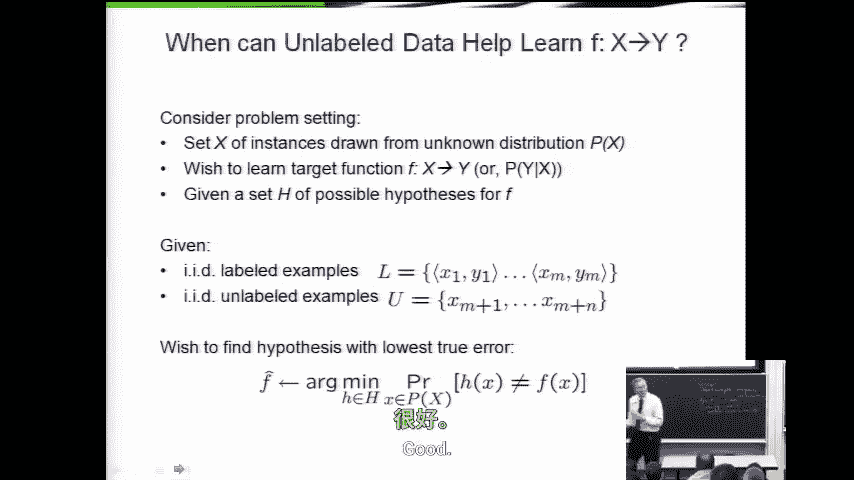
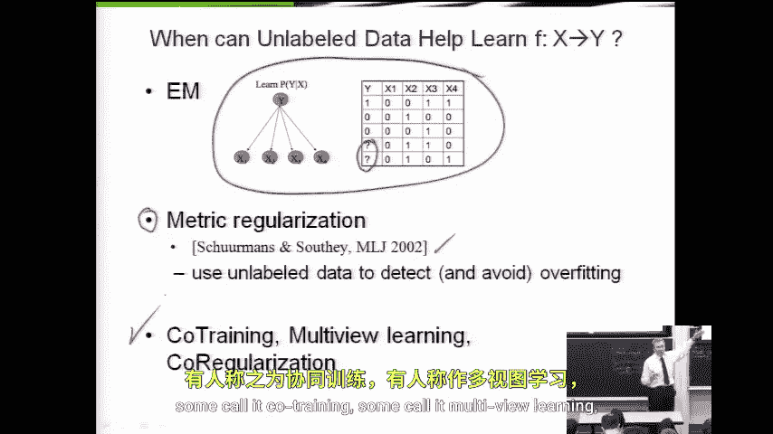
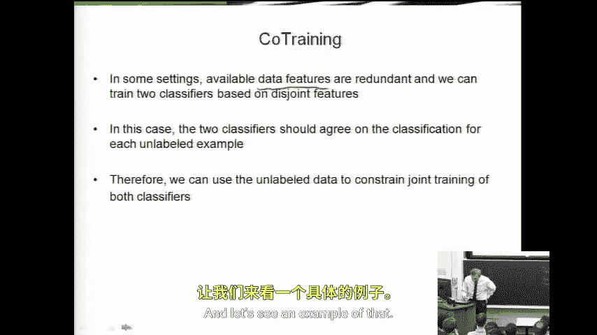
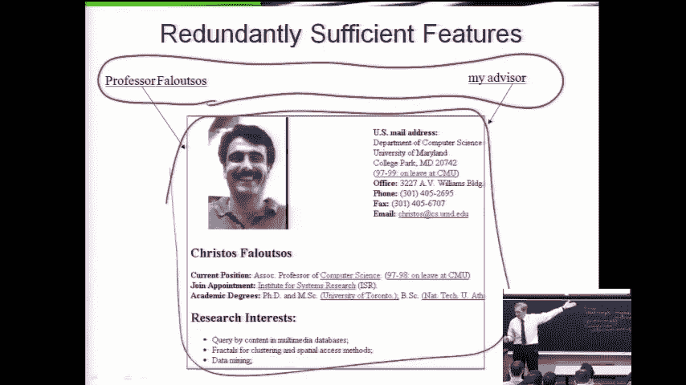
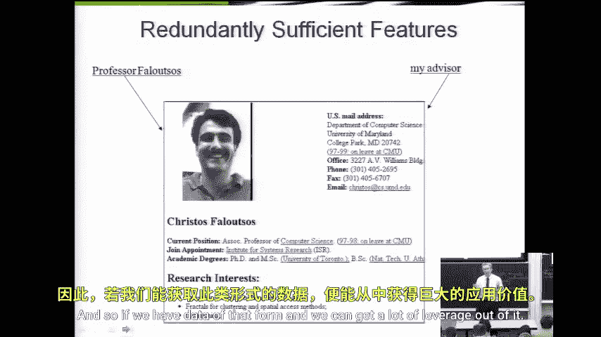
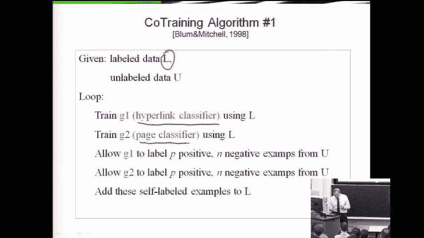

# 041：半监督学习与协同训练

在本节课中，我们将要学习半监督学习的基本概念，并重点探讨一种名为“协同训练”或“多视图学习”的特定方法。我们将了解如何利用未标记的数据来提升模型性能，特别是在特征包含冗余信息的情况下。

---

## 半监督学习问题

上一节我们介绍了PAC学习框架。本节中，我们来看看半监督学习的具体设定。

我们有一个从某个未知但固定的分布 **P(x)** 中抽取的实例集合。我们希望学习一个从 **x** 到 **Y** 的函数，或条件分布 **P(Y|x)**。学习器有一个可能的假设集合 **H**。

与过去不同，我们不仅提供标记样本集 **L**（其中每个样本是 **x_i** 和对应的 **y_i** 对），还提供一些未标记的样本，这些样本只有 **x** 而没有对应的 **y**。

我们的目标与典型情况一致：我们希望找到能最小化与真实函数 **F** 分歧概率的假设 **h**。公式化表示如下：

**目标：** 找到 **h ∈ H**，最小化 **P( h(x) ≠ F(x) )**。

---

## 利用未标记数据的思路

我们之前已经讨论过一种方法——期望最大化算法。EM算法是回答“何时以及如何利用未标记数据”这一问题的一种答案。它通过最大化期望的完整数据似然来估计参数。

除了EM，领域内还有大约两种半思路。其中一种是“度量正则化”，我们今日不深入讨论，但其核心思想是利用未标记数据来检测过拟合。例如，在决策树生长过程中，可以观察新树与旧树对未标记数据分配的标签变化速度，如果变化快于对训练数据标签的拟合速度，则可能是过拟合的信号。

---

## 协同训练方法

我们今天将重点讨论的方法是“协同训练”，也被称为多视图学习或协同正则化。这是一个简单而有效的想法。

其核心思想是：有时我们可以做出一个额外的假设，使得未标记数据变得有用。具体来说，有时描述 **X** 的特征包含关于我们试图预测的 **Y** 的冗余信息。如果我们对这种冗余性有所了解，就可以利用它。

我们可以使用不同的特征子集训练两个分类器。在标记数据上，我们训练这两个分类器来预测已知的 **y**。在未标记数据上，我们希望这两个分类器的预测结果至少能够达成一致。这就是协同训练的直观思想。

---

## 示例：网页分类

让我们通过一个例子来理解协同训练。假设我们想训练一个分类器来区分网页是否为“教师主页”。

我们用于描述网页的特征可以包括两部分：
1.  页面本身的文本内容。
2.  其他页面指向该页面的超链接。

这两组特征是“冗余充分”的。这意味着，仅使用文本特征（例如，页面包含“教授”字样）就足以判断是否为教师主页；同样，仅使用链接特征（例如，其他页面写着“我的导师”并链接至此）也足以做出判断。

---

## 协同训练算法步骤

以下是协同训练算法的具体步骤：

1.  **初始化：** 拥有少量标记数据 **L** 和大量未标记数据 **U**。
2.  **创建视图：** 将特征集划分为两个冗余充分的视图（例如，视图1：文本；视图2：链接）。
3.  **训练初始分类器：** 使用标记数据 **L**，分别在视图1和视图2上训练两个分类器 **C1** 和 **C2**。
4.  **迭代标记：**
    *   让 **C1** 对 **U** 中的部分数据进行分类，选取它最确信的几个正例和几个负例。
    *   将这些新标记的样本（仅 **x** 和 **C1** 预测的伪标签 **y**）添加到 **C2** 的标记数据集中。
    *   让 **C2** 对 **U** 中的另一部分数据进行分类，同样选取它最确信的正例和负例。
    *   将这些新标记的样本添加到 **C1** 的标记数据集中。
5.  **重新训练：** 用各自扩增后的标记数据集重新训练 **C1** 和 **C2**。
6.  **重复：** 重复步骤4和5，直到满足停止条件（例如，没有更多未标记数据，或达到迭代次数上限）。

通过这个过程，两个分类器相互教学，利用未标记数据上达成一致的预测来逐步扩充训练集，从而提升各自的性能。

---

## 总结

本节课中，我们一起学习了半监督学习的基本设定，它旨在利用大量未标记数据辅助学习。我们回顾了EM算法作为基础方法，并重点介绍了一种强大的方法——协同训练。协同训练的核心在于利用特征中的冗余充分信息，通过训练两个在不同特征视图上的分类器，并让它们在未标记数据上相互验证和教学，从而有效利用未标记数据提升模型性能。这种方法在像网页分类这样天然具有多视图特征的问题上尤为有效。