# 042：隐马尔可夫模型

在本节课中，我们将学习时间序列建模。时间序列数据在我们的生活中无处不在，例如股票价格序列、医疗状态序列等。我们将探讨如何为这类序列数据构建概率模型，并重点介绍一种强大的模型——隐马尔可夫模型。

上一节我们介绍了序列数据建模的基本问题，本节中我们来看看一种常见的简化方法：马尔可夫模型。

## 马尔可夫模型

马尔可夫模型的核心思想是简化序列观测值的联合分布描述。其基本假设是：当前时刻的观测值仅依赖于有限的过去历史，而非整个无限长的过去。这被称为马尔可夫假设。

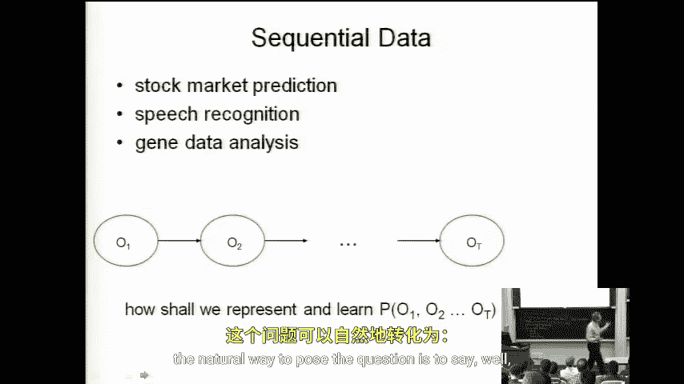

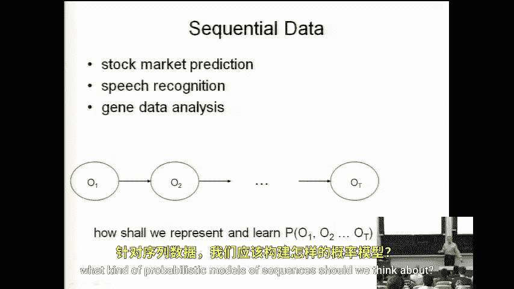

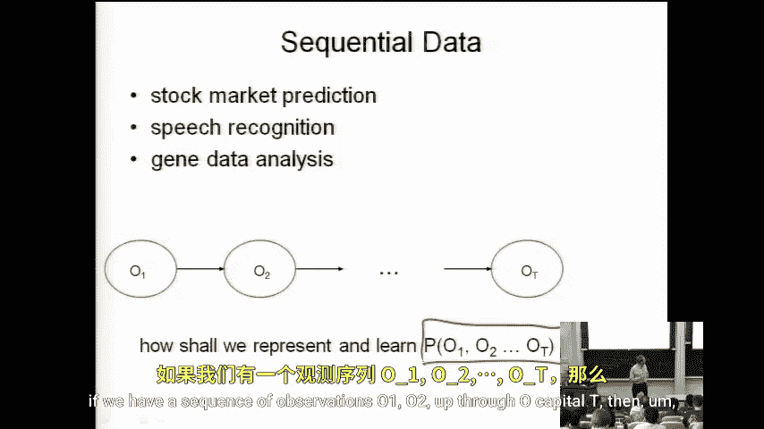

用贝叶斯网络的术语来说，我们试图表示一个序列的联合分布。在不做任何假设的情况下，我们可以将其表示为某种贝叶斯网络。这意味着，我们将不同时间点的所有观测值的联合分布，表示为每个观测值在其贝叶斯网络中的直接父节点条件下的概率的乘积。

那么，问题在于贝叶斯网络的结构是什么？马尔可夫假设简单地表述为：我们可以假设在时间 `t` 的观测值 `O_t` 仅依赖于时间 `t-1` 的观测值 `O_{t-1}`。

因此，这为我们提供了一个具有链式结构的贝叶斯网络，如下图所示。

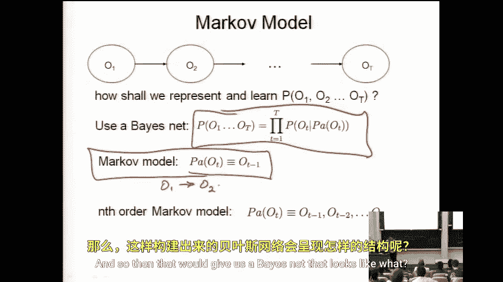

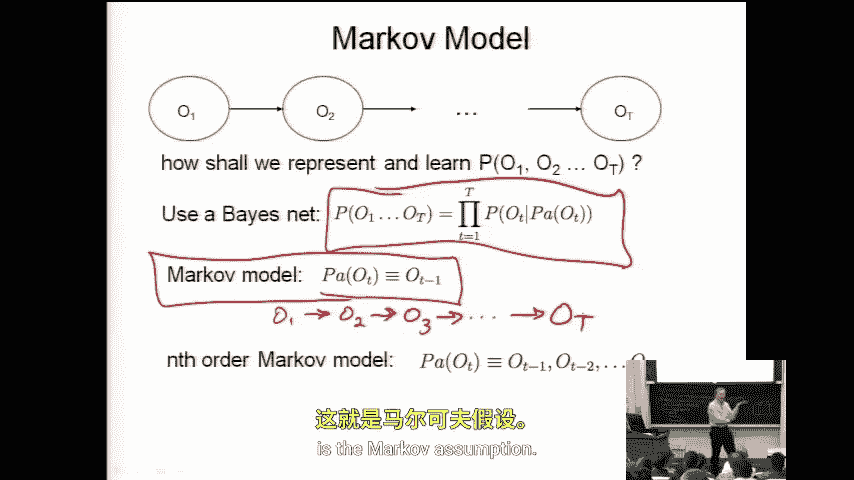

根据d-分离和条件独立性的知识，我们可以推导出一些性质。例如，观测值 `O_3` 在给定其直接父节点 `O_2` 的条件下，与它的非后代节点（如 `O_1`）条件独立。同样，在给定 `O_4` 的条件下，`O_3` 也与 `O_5` 条件独立。

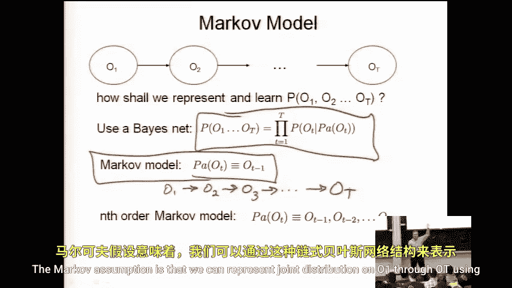

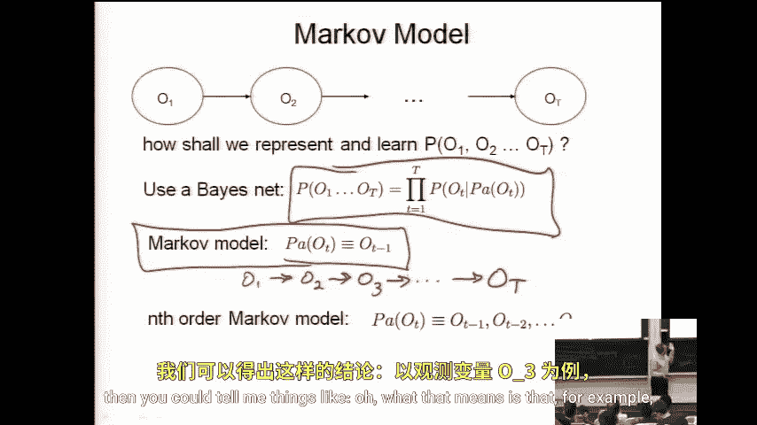

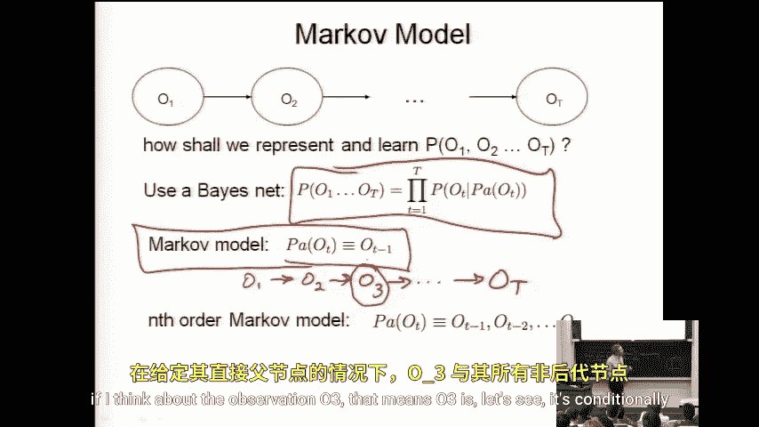

这种性质使得联合分布可以分解为一些相当小的项的乘积，从而带来各种计算上的便利性。

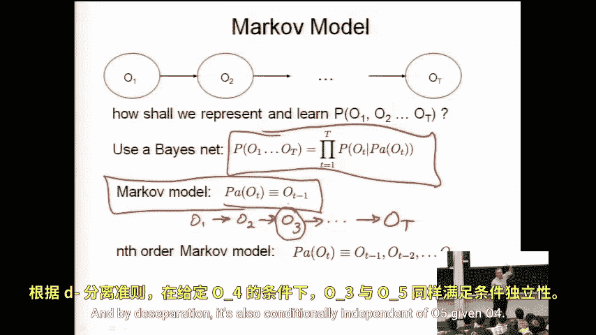

这个假设是否合理？这可能是一个好假设，也可能是一个坏假设。以股票市场或医疗状态为例，如果我今天的观测值 `O_t` 不是一个单一值（如体温），而是一个包含体温、白细胞计数等多种体征的向量，那么假设在已知昨天所有这些值的情况下，今天的值分布与更早的历史值条件独立，是相对合理的。前提是这个观测向量是相当完备的。

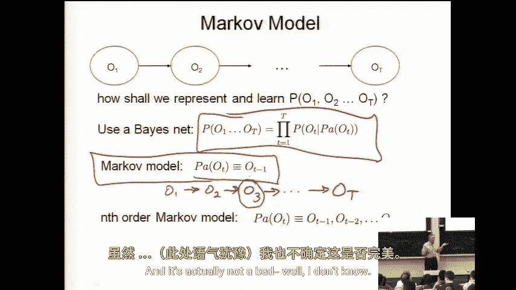

如果观测向量不完整，这个假设就变得更有疑问。例如，如果没有测量白细胞计数，但体温可能间接反映它，那么了解几天前的值可能对预测今天的体温有帮助。这里存在一个权衡：观测向量 `O_t` 的完备程度，与“给定近期历史后，当前观测值与更远历史条件独立”这一假设的合理性之间的权衡。

是否有方法量化这种依赖性？可以想象一些方法，例如测量 `t-2` 时刻的变量与“给定昨天值后今天值的条件分布”之间的互信息等。

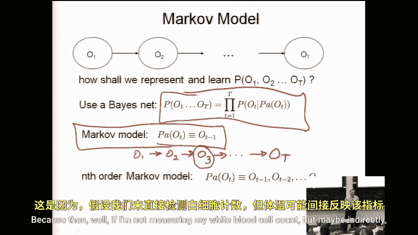

## N阶马尔可夫模型

马尔可夫模型的一个简单推广是N阶马尔可夫模型。它指出，时间 `t` 观测值的直接父节点包括 `t-1` 直到 `t-n` 的所有观测值。

换句话说，`O_t` 在给定 `O_{t-1}, O_{t-2}, ..., O_{t-n}` 的条件下，与 `O_{t-n-1}` 及更早的历史值条件独立。

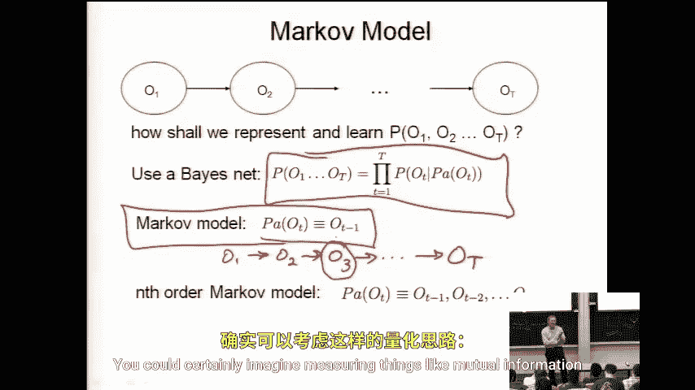

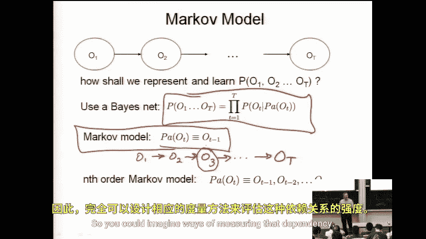

这会产生什么样的贝叶斯网络？如下图所示，`O_t` 不仅依赖于 `O_{t-1}`，还依赖于 `O_{t-2}`，一直回溯到 `O_{t-n}`。

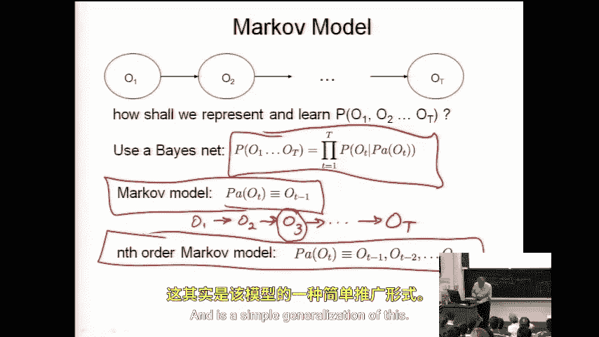

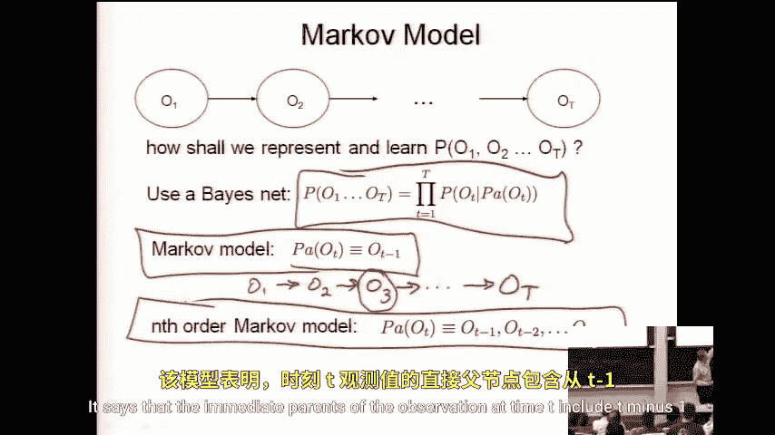

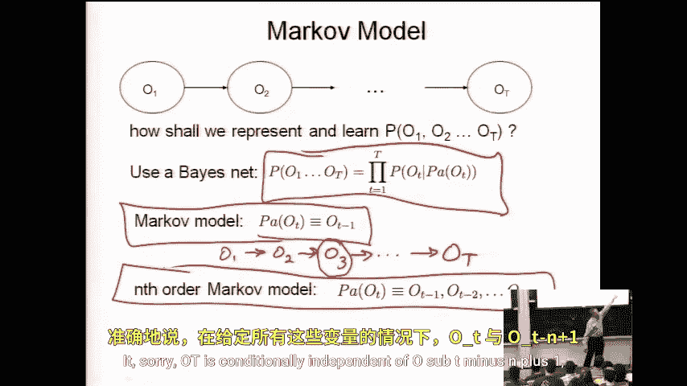

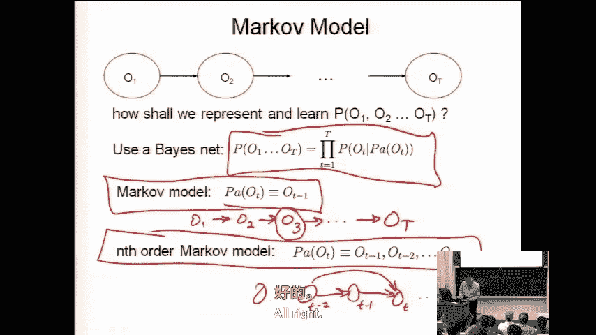

本节课中我们一起学习了时间序列建模的入门概念，重点探讨了马尔可夫假设及其在构建序列概率模型中的应用。我们了解了如何用贝叶斯网络框架来形式化马尔可夫模型和N阶马尔可夫模型，并讨论了这些模型假设的合理性及其权衡。这为后续学习更复杂的隐马尔可夫模型打下了基础。