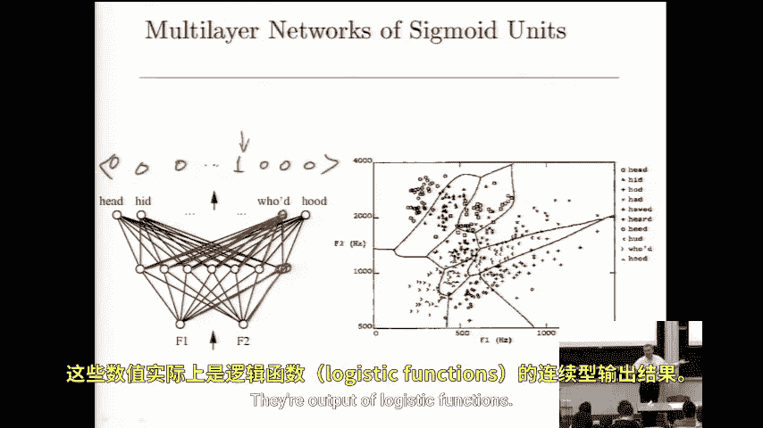

# 043：神经网络入门 🧠

在本节课中，我们将要学习一种强大的非线性回归方法——神经网络。我们将探讨其基本概念、工作原理以及它在机器学习领域中的独特价值。

## 概述

神经网络是机器学习中一个有趣且历史悠久的子领域。自20世纪80年代起，它曾一度是机器学习的主导方法。尽管在90年代末，概率模型（如图模型）变得更为流行，但近年来，神经网络因其强大的表达能力而重新兴起。本节课将从两个视角理解神经网络：一是将其视为一种灵活的非线性函数近似工具；二是将其视为一种学习数据有效表示的方法。

## 神经网络的定义与目标

神经网络旨在学习一个从输入向量 **x** 到输出向量 **y** 的函数。输入 **x** 可以是任意类型的特征向量（例如 `x1, x2, ..., xn`），输出 **y** 也可以是向量，这使得神经网络能够处理比单一标量更丰富的数据结构，例如预测图像。

我们试图学习的函数由一个逻辑单元网络表示。这些逻辑单元使用的函数与我们熟悉的逻辑回归函数完全相同。

## 训练方法

训练神经网络时，我们的目标是拟合输入和输出向量。我们使用梯度下降法来最小化预测输出与真实输出之间的平方误差之和。这对应于权重的最大似然估计。如果我们希望进行最大后验估计，则需要在目标函数中加入一个惩罚权重的项。

其精妙之处在于，它建立在你们已经学过的模块之上。逻辑回归使用了相同的函数，并且我们之前在线性回归中讨论的最大似然估计或最大后验估计的假设和目标函数优化思想，在这里同样适用。

## 一个具体例子：元音识别

让我们来看一个训练用于识别不同元音声音的神经网络例子。

以下是该网络的架构示意图：

在这个例子中，输入由两个特征 `F1` 和 `F2` 编码，它们代表了声音的频谱特性。每个声音都被转换为这个二维图上的一个点。图中不同形状的点代表了不同单词（如“head”、“hood”、“had”等）中的元音。

这个神经网络包含两层逻辑阈值单元。

*   **第一层（隐藏层）**：例如，图中所示的一个单元。它接收两个输入，其输出是一个实数值，即逻辑函数作用于这两个加权输入后的结果。图中的边代表了该特定单元对这两个输入的权重。这一层共有7个这样的单元。
*   **第二层（输出层）**：第一层所有单元的输出，成为第二层逻辑单元的输入。例如，图中另一个单元接收第一层所有单元的输出，并通过其连接边上的权重进行加权计算，得到自己的输出。

输出层有多个单元，数量与此分类问题中的类别数（即不同的元音声音数量）相同。在这个例子中，输出被编码为一个向量，其中除了一个元素为1（代表识别出的特定元音），其余元素均为0。在训练时，我们以此为目标；在实际预测时，输出是逻辑函数的值，我们可以通过四舍五入得到0或1。

## 核心概念总结

本节课中我们一起学习了神经网络的基础知识：

1.  **目标**：学习从输入向量 **x** 到输出向量 **y** 的复杂（非线性）函数映射。
2.  **构成**：网络由多层**逻辑单元**构成，这些单元使用与逻辑回归相同的激活函数。
3.  **训练**：通过**梯度下降**优化算法，最小化预测误差（如平方误差）来训练网络权重。
4.  **能力**：神经网络不仅能进行函数近似，还能自动学习数据的有用**表示**，这通过中间的**隐藏层**实现。
5.  **应用**：可以处理丰富的结构化数据（如图像、语音），输出可以是多类别的分类结果。

通过将简单的逻辑单元以分层、互联的方式组织起来，神经网络获得了强大的表达和学习能力，使其成为解决复杂非线性问题的有力工具。