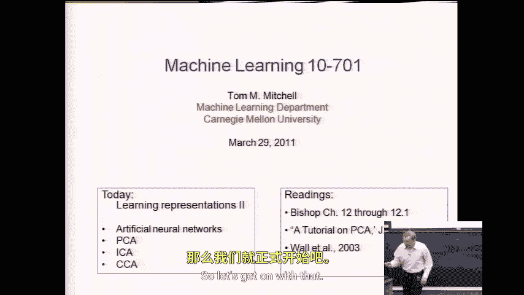
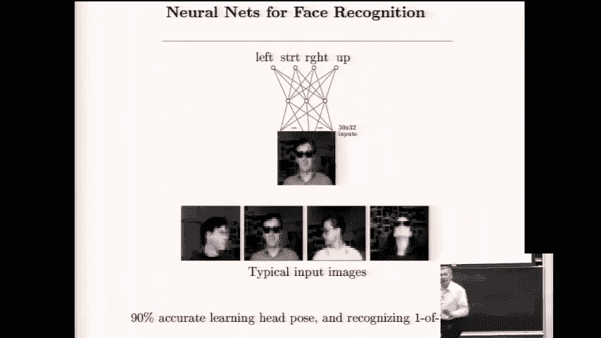
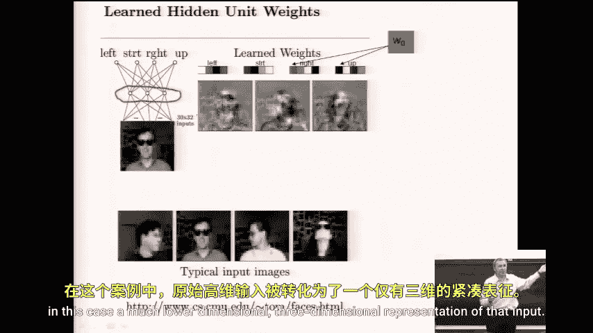
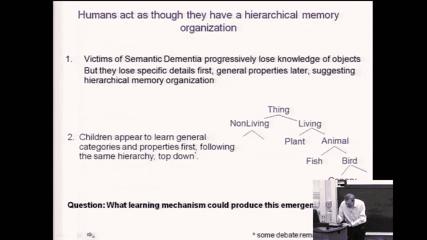

# 044：学习表示方法 I 🧠

在本节课中，我们将要学习机器学习中一个核心且迷人的主题：**学习表示方法**。我们将探讨如何通过算法自动发现数据的新表示形式，这通常能揭示数据的内在结构，并提升后续任务的性能。上节课我们介绍了人工神经网络，而它正是学习新表示的一种强大方法。本节课，我们将延续这一主题，并开始了解一系列经典的表示学习方法，包括PCA、ICA和CCA等。

## 从神经网络到表示学习 🔄

上一节我们介绍了人工神经网络，但关于神经网络最吸引人的一点在于，它是一种学习输入数据**新表示**的方法。因此，我们今天将继续这个主题，并在后续课程中探讨多种其他方法。今天我们将讨论那些众所周知的经典方法，如PCA、ICA和CCA，并对机器学习中不同的表示学习方法进行一次概览。

现在，让我们正式开始。

这张幻灯片我们上次讨论过，但再次展示是为了提醒我们“学习表示”的含义。这里有一个经过训练的神经网络。训练时，我们提供输入为照片、输出为该照片中人脸朝向（左、右、上、下）分类的训练样本。正如我们所见，网络训练后能以超过90%的准确率完成此任务。

有趣的是，仔细思考一下，这个输入图像是30x32像素，因此有900个特征。一旦这个网络训练完成，它就找到了一种方法，将原本30x32的900像素输入，用仅仅**三个数字**来重新表示。这并没有保留照片的所有信息，但考虑到我们训练神经网络时使用的目标函数是**最小化其输出预测值的平方误差和**，那么神经网络本质上会尝试为这个900多维的输入图像找到**最佳的**三维表示。

这里“最佳的三维表示”，指的是能最小化预测这张脸朝向（四个方向之一）的平方误差和的那个表示。因此，从这个意义上说，神经网络在尝试拟合训练数据中的输入-输出信号时，产生了一个副作用：它学习到了一种新的表示，在这个案例中，是一个维度低得多的、三维的输入表示。

## 神经网络的认知建模示例 🧩

在离开神经网络话题之前，我想再讨论一个例子，它阐释了神经网络研究的另一个方向：**对人类认知过程的建模**。

这个神经网络取自几年前Jay McClellan在《自然》杂志上发表的一篇论文。你可以看到，输入有两组。一组以“n选一”的方式编码输入，如“松树、玫瑰、雏菊、知更鸟、金丝雀”等。另一组输入则编码某种关系的名称，如“是”、“有”或“能”。网络被训练来拟合诸如“金丝雀能飞”这样的断言。

其编码方式如下所示：深绿色表示这些单元被激活（值为1），其他则为0（非激活）。因此，如果我们想表示“金丝雀能飞”这个训练样本，我们在这个网络中让“金丝雀”对应的单元为1，让关系“能”对应的单元为1。然后在输出端，我们说金丝雀能飞，所以让“飞”对应的单元为1。金丝雀还能做其他事情，如“唱歌”、“移动”和“生长”，我们也让这些单元为1。

我喜欢这个例子的一个原因是，它稍微拓展了我们对神经网络所使用的命题表示能做什么的思考。实际上，你可以看到这个网络有几层神经网络（隐藏层），它是一个全连接的前馈网络，因此我们可以使用上次讨论的**反向传播算法**来训练它。McClellan在这个案例中正是这样做的。

我喜欢这个网络还因为它促使你思考表示事物的不同方式。那么，他们这样构建网络结构有原因吗？是的，有原因。他们感兴趣的问题是：**范畴的层次结构是如何涌现的？** 他们这样构建结构是为了更容易研究这个问题。

## 层次结构的涌现与证据 📊

以下是这篇《自然》论文的一个总结。文中指出，人类有时会发展出不同类型的认知缺陷，其中一种叫做**语义性痴呆**。患有语义性痴呆的人，在数月或数年的时间里，会逐渐丧失关于物体的知识，特别是他们会先失去层次结构中更具体的细节。

例如，在患上语义性痴呆之前，如果你向他们展示一张金丝雀的图片，他们和你我一样，会毫不费力地说“哦，那是金丝雀”。但随着病情发展，他们会到达一个阶段，能识别出那是一只鸟，但无法说出那是金丝雀。在疾病后期，他们可能只会说“某种动物”。因此，这种疾病的进展过程，在某种意义上，是首先“剥夺”了层次结构中更具体的层面。

他们以此作为证据，表明人类的行为仿佛拥有某种概念的**层次化组织**。他们还指出，例如，儿童在学习说话时，先学会“鸟”这个词，然后过一段时间，才学会区分“金丝雀”、“知更鸟”、“公鸡”等。所以，有很多证据表明，人们的行为方式暗示其概念和记忆存在某种层次化组织。因此，他们感兴趣的问题是：什么样的学习机制能够从我们遇到的事物中产生这种涌现的层次结构？

实际上，这是他们给出的一个证据。一个名叫J.L.的特定人士患有语义性痴呆，你可以看到在跨越数年的三个不同时期，他识别照片中物体名称的能力。在1991年9月，他能很好地识别出鸟、鸡、鸭和天鹅，但对其他物体有困难。后来可以看到，他能识别这些东西是鸟，但丧失了详细识别的能力。再往后，甚至对这些识别也有困难。这是一个典型的进展过程。

那么，他们所做的（再次强调，他们关注的问题是：什么样的学习机制可以解释这些层次结构的涌现？）他们的猜想是：**人工神经网络可以模拟这种涌现的层次结构**。因此，他们训练了我刚才展示的那个神经网络，并绘制了图表。他们使用什么算法来训练它？**反向传播**，也就是我们讨论过的那个梯度下降算法。

---

本节课中我们一起学习了表示学习的基本概念，并通过神经网络的例子，看到了模型如何在学习任务的同时自动发现数据的新、更紧凑的表示。我们还探讨了神经网络在模拟人类认知层次结构形成方面的有趣应用。下一节，我们将深入探讨主成分分析等经典的表示学习算法。