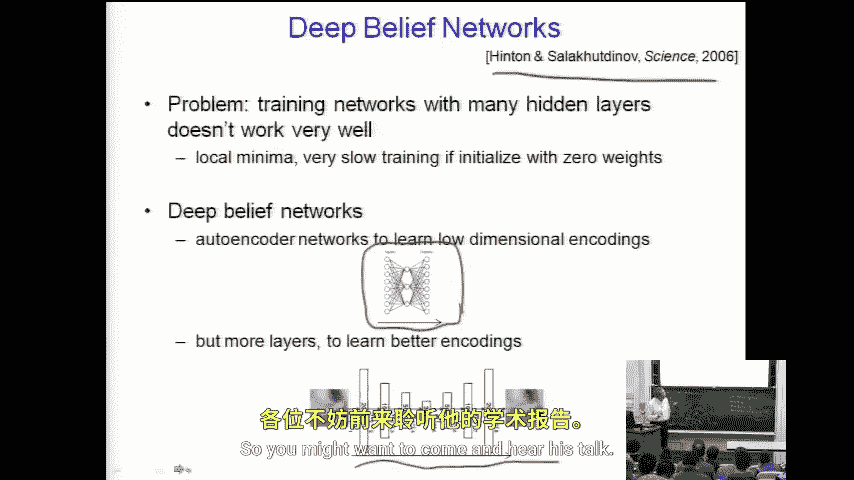
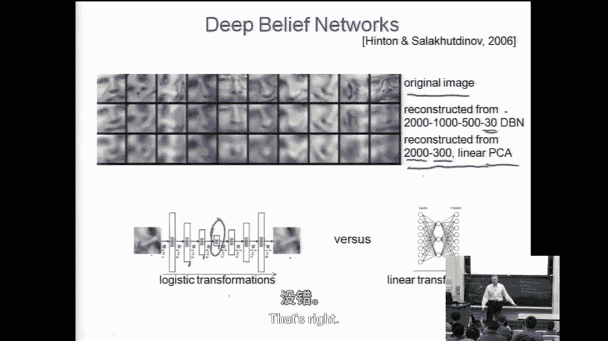

# 045：学习表征 II

在本节课中，我们将继续探讨学习新表征这一主题。我们将了解多种不同的方法，并通过实例感受这一活跃研究领域的多样性。课程将涵盖深度信念网络等现代方法，并比较其与主成分分析等传统线性方法在图像重建任务上的表现差异。

## 概述

上一节我们介绍了通过监督式神经网络和无监督方法（如PCA）学习表征的基本思路。本节中，我们将深入探讨其他几种学习表征的方法，特别是深度信念网络，并理解为何在某些复杂任务上，非线性深度模型可能比线性方法表现更优。

## 深度信念网络

深度信念网络是现代神经网络研究中的一个热门领域。其核心思想是：为了学习更复杂的表征，我们可能需要使用具有多个隐藏层的神经网络。

然而，直接训练一个具有许多隐藏层的深度网络会面临比浅层网络更严重的局部极小值问题。深度网络因其结构层次深而得名。

这里介绍一项由杰夫·辛顿等人发表在《科学》杂志上的工作。他们的目标是训练一个神经网络来学习复杂数据的优良编码或表征，这需要用到多层隐藏单元。

以下是他们进行的一个实验示例：

*   **第一行**：原始的人脸图像片段，作为训练输入。
*   **第二行**：深度信念网络重建的输出图像。可以看到，重建结果与输入相似。
*   **第三行**：使用PCA方法重建的输出图像。

该实验旨在说明，仅对输入进行线性变换的PCA方法，在编码信息和重建图像的能力上，可能不如使用更少隐藏单元但允许更复杂输入函数的深度网络。

具体数据对比如下：
*   原始图像：2000像素。
*   PCA：压缩至300个主成分。
*   深度网络：结构为2000 -> 1000 -> 500 -> 30 -> ... -> 2000。

从图像质量上看，深度网络的重建效果优于PCA。

关于评估标准，通常使用**像素的平方误差和**来衡量重建误差。PCA和通过反向传播训练的神经网络都旨在最小化这个目标函数。选择平方误差主要出于数学上的便利性，且对于图像质量这类任务，我们尚无更明确、更符合人类心理感知的替代性优化目标。

需要指出的是，该测试集中的人脸图像存在旋转、平移和不同区域裁剪的情况，这种非对齐、非中心化的数据特性确实增加了PCA这类线性方法的处理难度，从而也凸显了深度网络方法的优势。

## 总结

本节课我们一起探讨了学习表征的多种方法。我们重点了解了深度信念网络，并通过图像重建的例子，对比了深度非线性模型与PCA线性模型的表现。结果表明，在处理具有复杂变化（如旋转、平移）的数据时，能够学习复杂函数关系的深度网络可能获得更好的表征和重建效果。这为我们理解当前活跃的表征学习领域提供了一个具体的视角。

