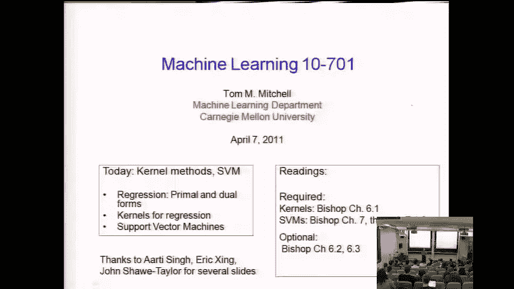
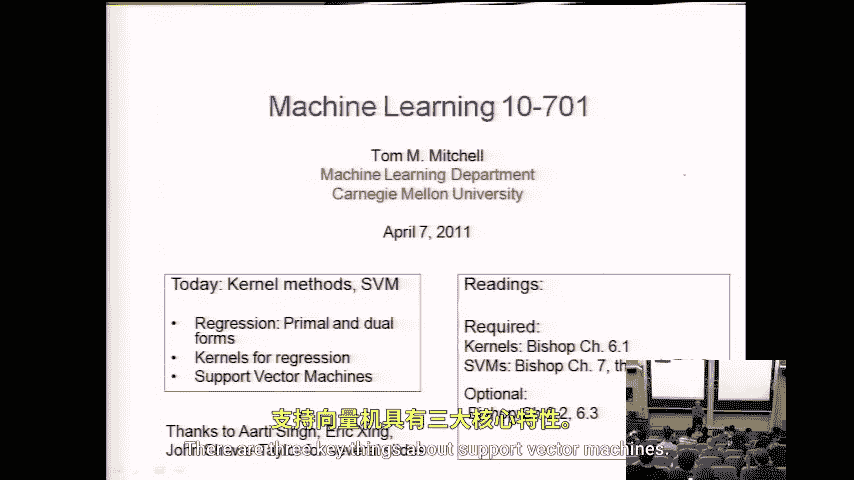
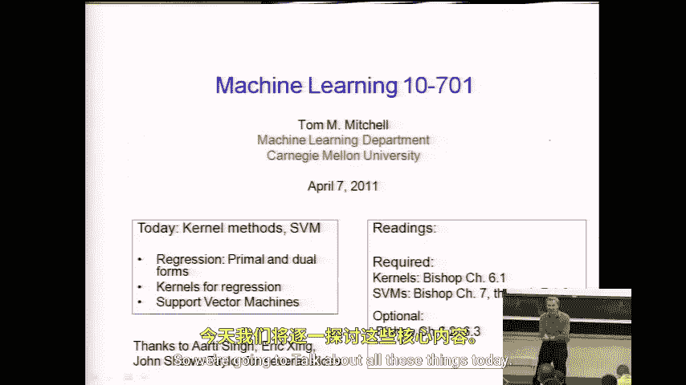
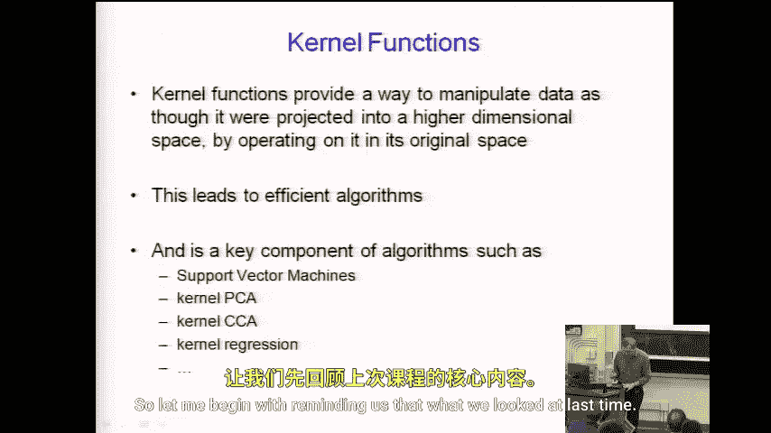
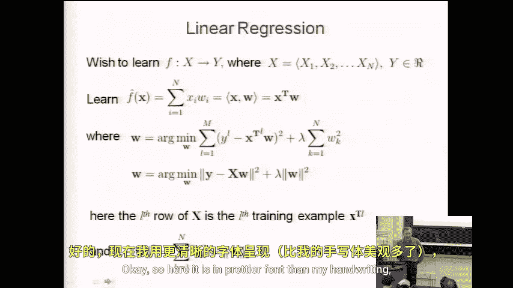
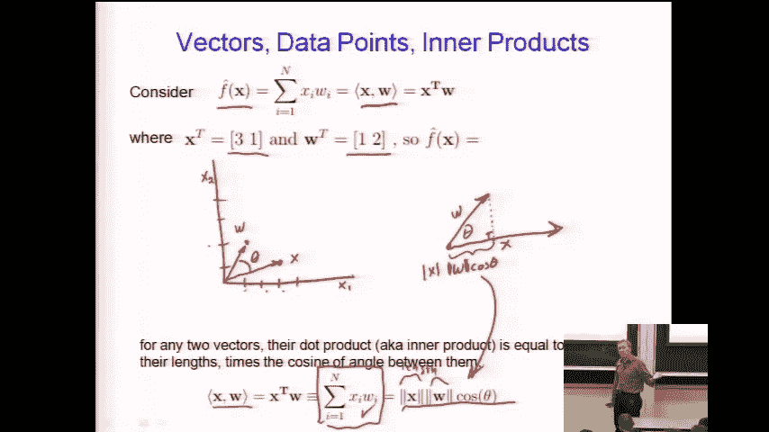

# 047：核方法与支持向量机

在本节课中，我们将学习支持向量机及其所属的算法类别。支持向量机在实践中是最广泛使用和最成功的分类器训练方法之一。它的核心思想基于两个我们尚未深入探讨的概念：最大化间隔作为选择权重向量的目标函数，以及核函数。今天我们将详细讨论这些内容。

## 线性函数与符号回顾

上一节我们介绍了线性函数。为了确保我们使用相同的符号，这里快速回顾一下。

我们一直在讨论学习线性函数，即特征的加权和。如果我们有一个包含特征 `X1` 到 `Xn` 的向量输入 `X`，典型的线性函数就是这些特征的加权线性组合。

我们可以用以下方式表达：
`f(X) = w1*x1 + w2*x2 + ... + wn*xn`

或者，使用向量符号来简化表达。通常，我们用粗体表示向量。因此，同样的表达式可以写作两个向量的点积（或内积）：
`f(X) = w·x`

另一种等价的记法是，将向量视为列向量，其转置为行向量，则点积可以表示为：
`f(X) = w^T * x`

这本质上就是上述的和式。这只是符号上的不同。

上一节我们还讨论了如何使用这种符号重新表达我们的目标函数。学习问题的目标是学习权重向量 `W` 的分量，用于与特征向量 `x` 相乘来预测标量值 `y`。

我们注意到，可以将其表达为寻找最小化以下表达式的 `W`：
`min_w Σ_l (y_l - w^T * x_l)^2 + λ * ||w||^2`

第一项是观测值 `y_l` 与预测值 `w^T * x_l` 之间差值的平方和（误差项）。第二项是正则化项，例如最小化权重向量 `W` 各分量的平方和。

我们还可以用更紧凑的矩阵符号表示。令 `Y` 为所有训练样本观测值 `y` 组成的向量，`X` 为矩阵，其第 `i` 行是第 `i` 个训练样本的特征向量。那么整个表达式可以写作：
`min_w ||Y - X * w||^2 + λ * ||w||^2`

这些符号我们将在今天的内容中使用。

## 点积的几何解释

现在，我们为点积或内积的概念引入一些几何直观。许多同学在线性代数课程中已经熟悉，但简要回顾一下仍然有益。

假设我们试图学习一个函数，并且已经得到了一个学习到的权重向量 `W`。同时，我们有一个数据点 `x`。

例如，设 `x = [3, 1]`，`w = [1, 2]`。我们可以在二维空间中绘制这些点。`x` 对应坐标 (3,1)，`w` 对应坐标 (1,2)。我们可以将它们视为从原点指向这些点的向量。

当我们考虑两个向量的点积时，除了代数定义 `w·x = Σ_i w_i * x_i`，它还可以用向量的长度和它们之间的夹角来解释。

设 `w` 和 `x` 之间的夹角为 `θ`。那么，它们的点积也等于：
`w·x = ||x|| * ||w|| * cos(θ)`

其中，`||x||` 和 `||w||` 分别是向量 `x` 和 `w` 的长度（模）。这个关系很容易证明，但在思考向量代数时非常有用。

例如，这有助于我们理解：如果固定 `w` 和 `x` 的长度不变，只让它们绕原点旋转，点积会如何变化？
*   如何使点积为零？只需让两个向量垂直（`θ = 90°`，`cos(θ)=0`）。
*   如何在不改变长度的情况下使点积最大？只需让两个向量共线（`θ = 0°`，`cos(θ)=1`），此时点积等于两向量长度的乘积。
*   点积的值永远不会大于两向量长度的乘积，也永远不会小于其相反数。

这种几何视角对于理解支持向量机的核心思想——间隔最大化——至关重要，我们将在下一节深入探讨。

## 支持向量机的三个关键点

在深入细节之前，我们先总结一下支持向量机的三个关键特性。

以下是关于支持向量机的三个要点：
1.  **实践成功**：在实践中，它们是最广泛使用、最成功的分类器训练方法之一。
2.  **最大化间隔**：其核心思想基于一个我们尚未讨论过的概念，即**最大化间隔**，以此作为选择权重向量 `w` 的目标函数。
3.  **核函数**：它们也基于**核函数**的思想，这是我们上节课承诺要讨论的内容。

本节课，我们将围绕这些要点展开，首先理解间隔最大化的概念，然后探讨核函数如何赋予支持向量机强大的非线性处理能力。

## 总结

本节课我们一起学习了支持向量机的初步框架。我们首先回顾了线性函数和向量点积的符号与几何解释，这为理解后续内容奠定了基础。接着，我们指出了支持向量机的三个核心特征：其在实际应用中的卓越效果、以最大化分类间隔为优化目标的核心思想，以及依赖于核函数来处理非线性问题。在接下来的章节中，我们将深入探讨间隔最大化和核方法的具体原理与实现。