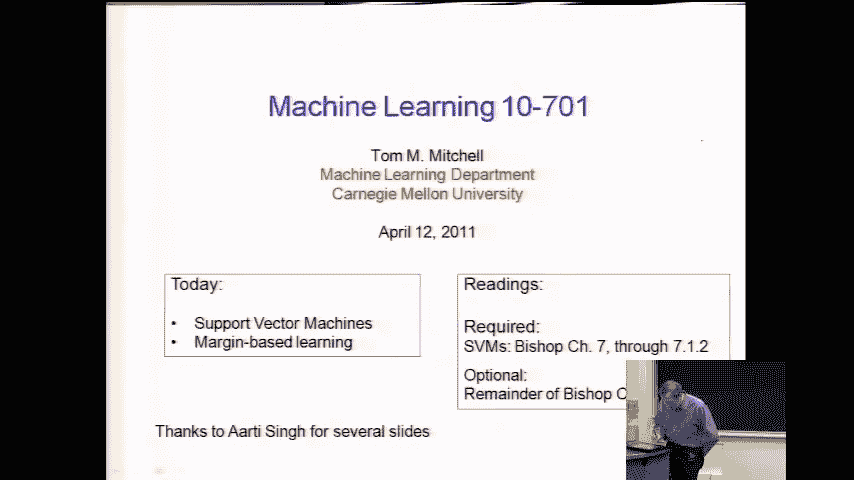
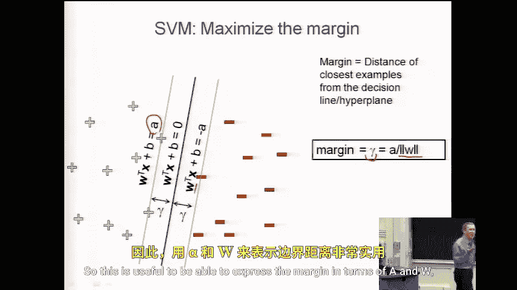
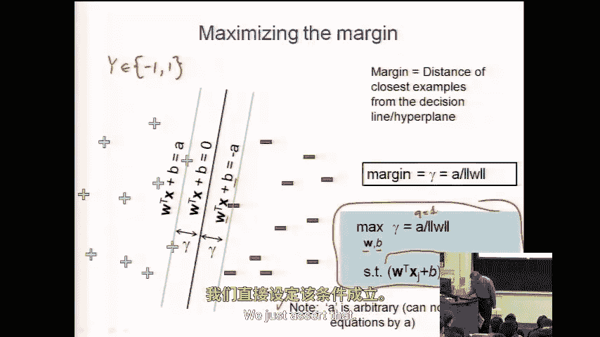
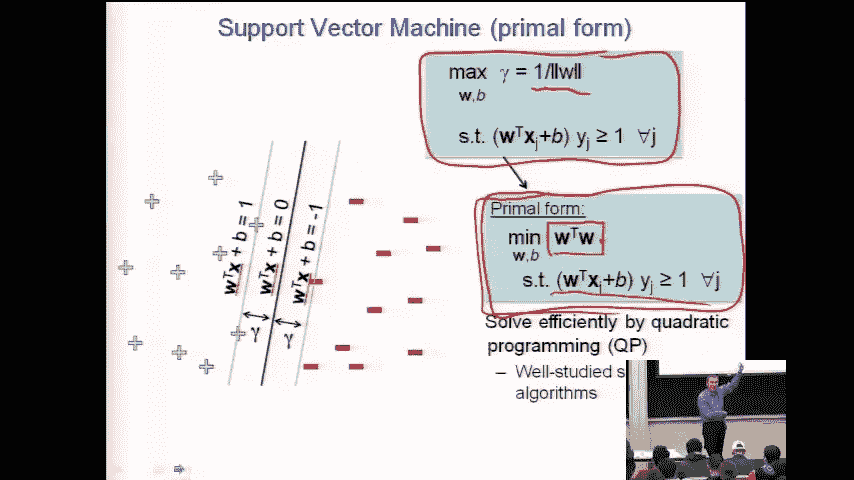

# 048：支持向量机（SVM）进阶 🚀

在本节课中，我们将完成对支持向量机（SVM）的探讨，并将其与课程中讨论过的其他主题联系起来，例如与其他算法的比较以及与PAC学习理论的关系。

## 概述

上一节我们介绍了支持向量机作为一种判别式分类器，其目标是找到一个能最大化分类间隔（Margin）的决策边界。本节中，我们将深入探讨如何将这一目标形式化为一个优化问题，并理解其数学本质。

## 回顾：最大化间隔

支持向量机的核心思想是找到一个能正确分类所有训练样本，并且具有最大间隔的决策超平面。我们使用 `y ∈ {-1, +1}` 来表示类别标签。

我们推导出，间隔 `γ` 可以表示为 `1 / ||w||`，其中 `w` 是权重向量。因此，**最大化间隔等价于最小化权重向量的范数**。

更精确地说，我们的优化目标是：在正确分类所有训练样本的前提下，最小化 `||w||`（或等价地，最小化 `(1/2) w^T w`）。这可以形式化为以下约束优化问题：

**目标**：
`min (1/2) w^T w`

**约束条件**：
对于所有训练样本 `(x_i, y_i)`，满足：
`y_i (w^T x_i + b) ≥ 1`

这个公式简洁地表达了我们的要求：正样本（`y=+1`）的决策函数值 `w^T x + b` 至少为 `+1`，负样本（`y=-1`）的决策函数值至少为 `-1`。距离决策边界最近的那些点（即支持向量）将恰好满足 `y_i (w^T x_i + b) = 1`。

## 优化问题：二次规划

将SVM的目标写成上述形式后，我们发现它是一个标准的**二次规划**问题。

以下是二次规划问题的特点：
*   **目标函数**：是优化变量（此处为 `w` 和 `b`）的二次函数。在我们的例子中，是 `(1/2) w^T w`。
*   **约束条件**：是优化变量的线性（不等式）约束。在我们的例子中，是 `y_i (w^T x_i + b) ≥ 1`。

这是一个被深入研究过的优化问题类别，存在许多现成的、高效的求解算法（例如序列最小优化算法）。这为实际应用SVM提供了便利。

## 总结

本节课我们一起学习了支持向量机核心优化问题的完整数学表述。我们明确了SVM的目标是**在保证所有样本被正确分类的线性约束下，最小化权重向量的L2范数**，从而最大化分类间隔。最终，我们将该目标规约到了一个标准的**二次规划**问题，这为其数值求解奠定了理论基础。在接下来的课程中，我们将探讨如何处理线性不可分的情况，并引入核函数等更强大的概念。