# 049：主动学习

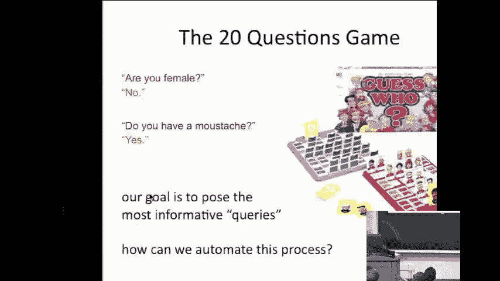

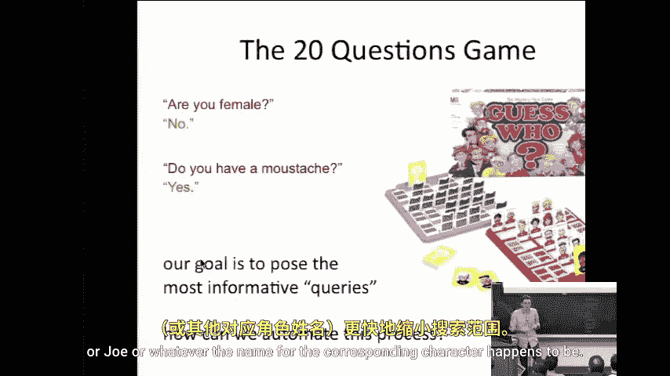

在本节课中，我们将要学习主动学习。主动学习是一种机器学习范式，其核心思想是让学习算法能够主动选择最需要标注的数据，而不是被动地接受随机采样的数据。这种方法可以显著减少获取训练数据所需的成本。

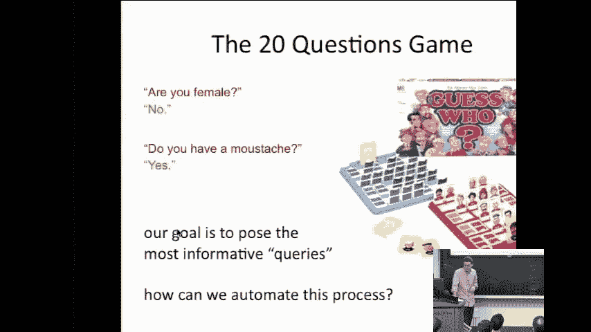

## 概述

上一节我们介绍了主动学习的基本概念。本节中，我们来看看一个思想实验，以理解主动学习的动机和优势。

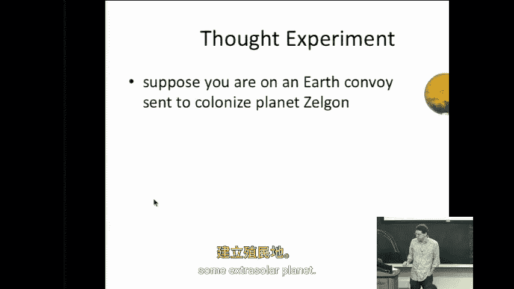

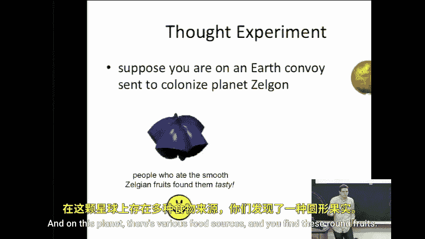

### 思想实验：泽尔贡星球的挑战

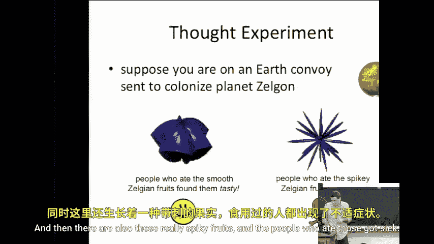

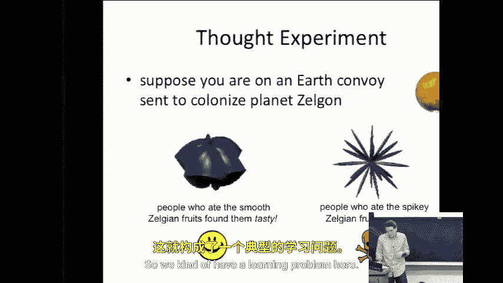

假设你负责一个前往泽尔贡星球的地球殖民队。在这个星球上，有两种水果：一种是圆形光滑的，殖民者食用后觉得美味；另一种是多刺的，食用后会让人生病。

我们面临一个学习问题：水果的“多刺程度”是一个连续参数，我们需要找到一个阈值 **θ***，以区分安全水果和有毒水果。我们的目标是尽可能准确地学习这个阈值，同时让尽可能少的殖民者冒险试吃。

在典型的被动监督学习设置中，我们需要预先收集并标注大量水果。根据**PAC学习模型**，为了以误差率 **ε** 学习这个阈值，需要 **O(1/ε)** 个标注实例。如果 **ε** 很小，这将需要很多人冒险试吃。

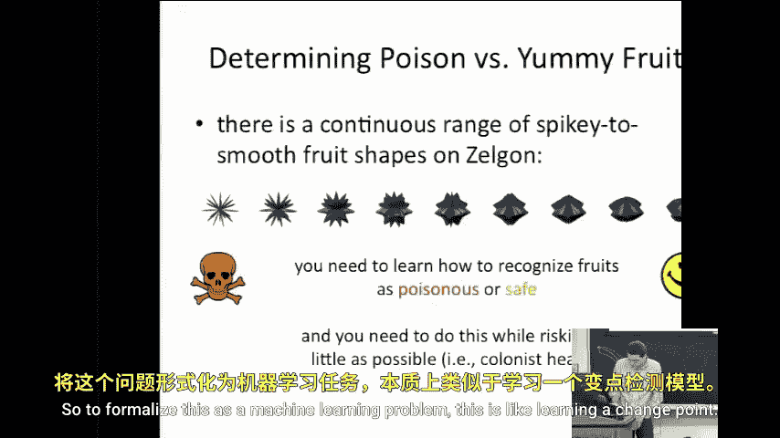

那么，我们能否做得更好？

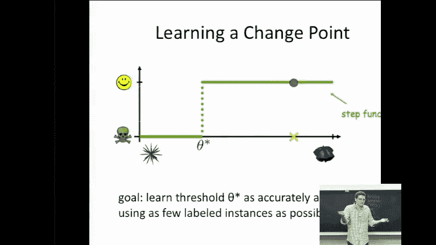

### 主动学习策略

假设我们已经收集了九个不同多刺程度的水果，并知道最刺的（最左边）有毒，最光滑的（最右边）安全。我们应该从哪里开始测试？

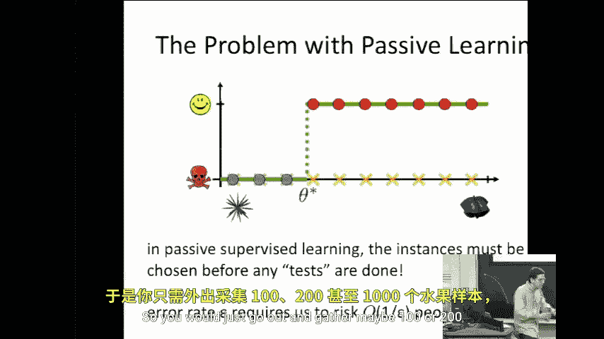

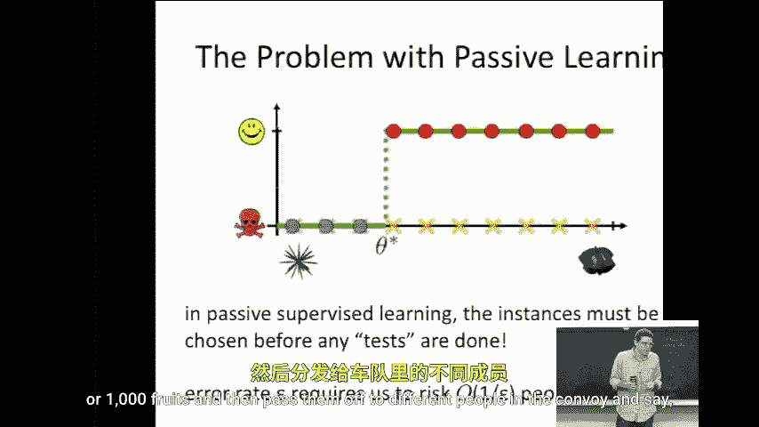

答案是：从中间开始。如果我们测试中间的水果，发现食用者生病了，那么我们就知道阈值在中间点和最光滑点之间。接下来，我们在这个新区间的中间点进行测试，以此类推。

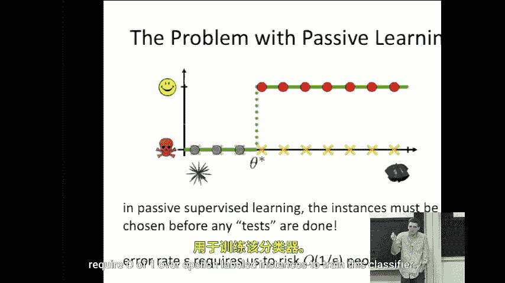

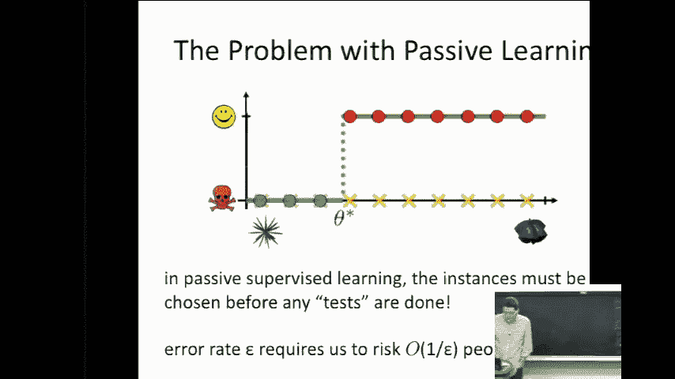

这本质上是一个**二分查找**算法。在被动学习中，我们需要 **O(1/ε)** 次测试，而在主动学习中，我们只需要 **log₂(1/ε)** 次测试。这些测试次数就是需要有人实际食用的水果数量。

恭喜，这就是你的第一个主动学习算法。

### 核心思想

主动学习的关键关系在于：**学习者主动选择训练数据**，而不是被动地对事物进行采样，然后将其交给标注者（专家）。

在泽尔贡星球的例子中，标注是水果是否有毒。一般来说，这就是我们研究的问题领域中某个实例的真实标签。

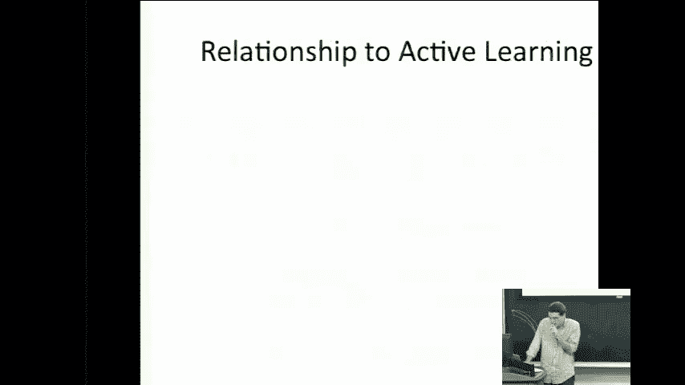

这样做的目标是**降低训练成本**。在水果例子中，成本是冒险食用水果的人数。通常，这可以转化为查询次数，进而关联到更有意义的成本概念，如人工标注的劳动力成本或训练样本的磁盘存储空间等。

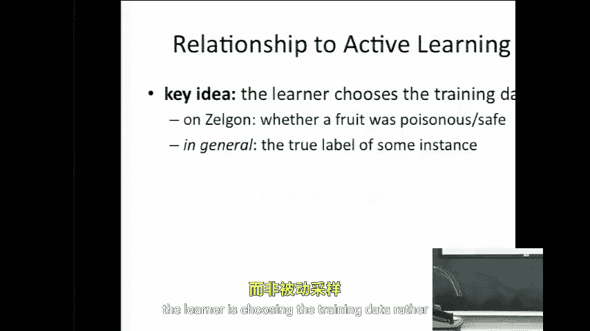

因此，**减少所需标注数据的数量**可以直接影响训练一个准确分类器所需的数据获取成本。

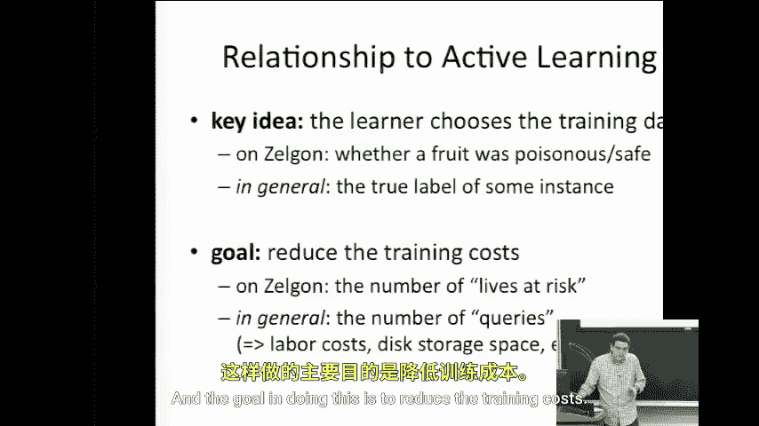

## 查询策略

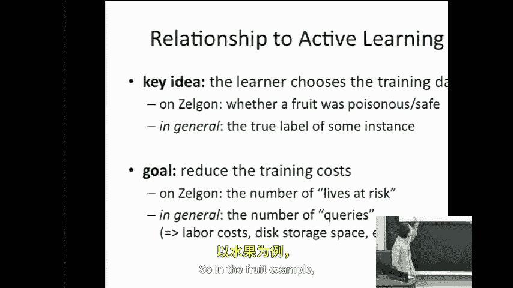

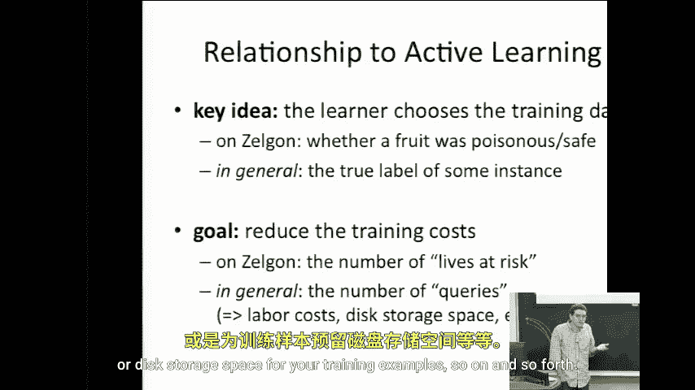

在现实世界的问题中，有几种不同的方式来制定和测试查询。以下是文献中最常见的三种通用方法。

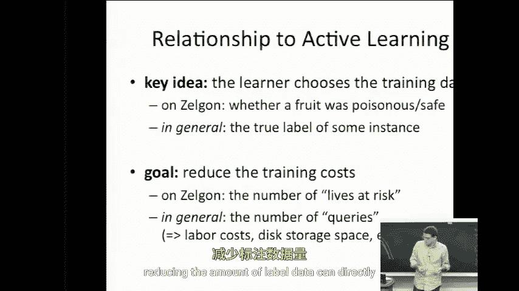

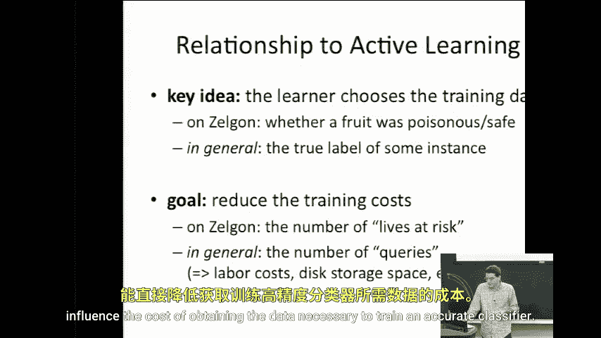

### 1. 查询合成

假设我们已经有一些随机标注的样本。我们将这个训练集交给学习器。学习器知道实例空间是什么，并且能够凭空生成一个新的查询。

例如，如果实例空间恰好是实数的笛卡尔空间，那么它可以挑选一个具有两个坐标的点，然后将该点传递给专家，专家提供标签并将其添加到训练集中，如此重复。

这种方法存在一个问题：学习器不知道实例的底层自然分布是什么。这在20世纪90年代初的实践中变得非常明显。例如，在尝试让人工神经网络学习分类手写数字时，它合成的查询很多时候毫无意义，生成的可能是人类根本不会自然写出的、介于两个数字之间的奇怪图像。

因此，我们希望保证查询来自某个底层的自然分布。这是查询合成方法的一个问题。

### 2. 选择性采样

选择性采样是解决上述问题的一种方法。同样，我们有一些标注数据，将其交给学习器以推导出一个分类器。然后，我们有一个连续的数据源（如果你知道数据的分布，这实际上可以是数据的生成模型），从中抽取一个新的实例。

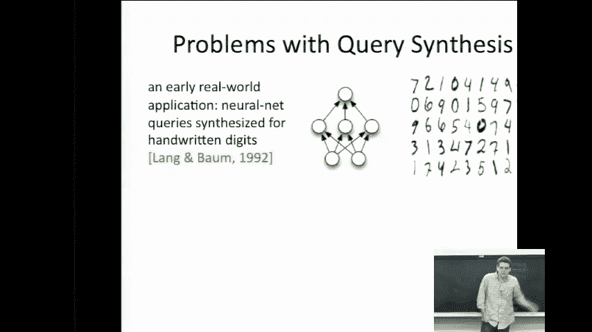

然后，分类器可以检查这个实例，并决定它是否具有信息量。如果具有信息量，则提出查询；如果分类器已经知道答案，认为是在浪费时间，则将其丢弃。

### 3. 基于池的主动学习

基于池的主动学习是另一种常见方法。在这种设置中，我们有一个大的未标注数据池（例如，从自然分布中收集的大量水果）。学习器可以查看整个池子，并从中选择它认为最不确定、最具信息量的实例进行查询。

这种方法结合了前两种方法的优点：查询来自自然分布（解决了查询合成的问题），并且学习器可以主动选择（解决了被动随机采样效率低下的问题）。

## 总结

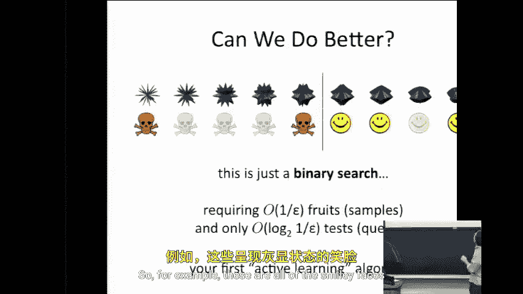

本节课中，我们一起学习了主动学习的基本概念。我们通过泽尔贡星球的思想实验，理解了主动学习如何通过让学习算法主动选择最具信息量的数据点（如使用二分查找策略），来显著减少达到特定精度所需的标注成本。我们还介绍了三种主要的主动学习查询策略：查询合成、选择性采样和基于池的主动学习，并分析了各自的优缺点。主动学习的核心在于**学习者选择数据**，而非被动接受，这是提高学习效率、降低标注成本的关键。