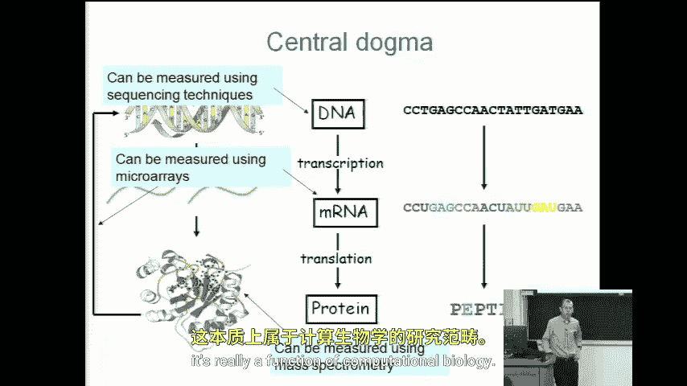
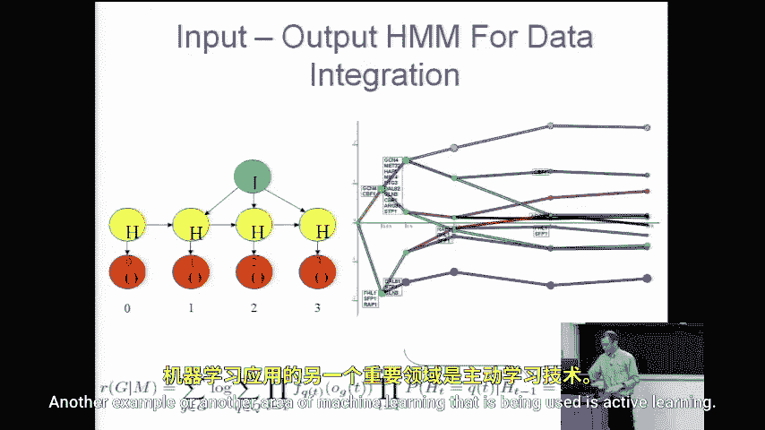
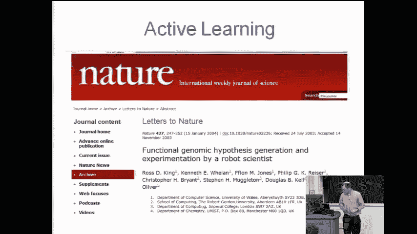
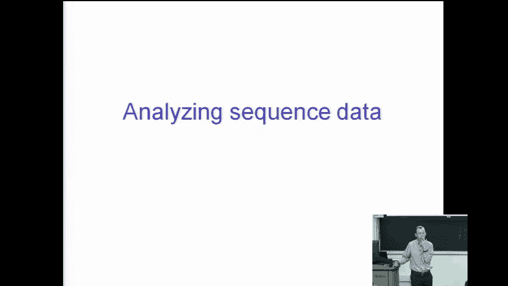

# 050：计算生物学中的机器学习 🧬

在本节课中，我们将探讨机器学习在计算生物学领域的应用。我们将了解现代生物学如何产生海量数据，以及如何利用机器学习技术整合这些数据，以理解细胞内的复杂活动，例如癌症的进展。课程最后，我们将聚焦于处理序列数据这一核心挑战。

---

## 数据整合：计算生物学的关键挑战

上一节我们介绍了计算生物学中可用的多种数据类型。本节中我们来看看如何整合这些信息。

我们现在拥有的能力，在五年前可能还不存在。我们可以测量mRNA的水平。我们可以测量蛋白质的结构。我们可以测量哪些蛋白质彼此相互作用。我们可以观察这个反向反馈回路，它告诉我们哪些蛋白质控制着其他蛋白质的生成，等等。所有这些都可以通过高通量方法完成。这些方法能一次性提供大量信息。

现在的问题是，我们如何处理这些信息？我们如何将它们整合起来，从而真正理解细胞内发生的过程？

每种类型的数据集都为我们提供了体内活动的特定视角。计算上和生物学上的挑战在于，将这些信息整合起来并加以理解。例如，癌症是如何发展的？我们从序列开始。某些突变导致一些蛋白质生成错误，这些蛋白质与其他蛋白质相互作用，进而影响其他蛋白质的生成，癌症就是这一过程的结果之一。

因此，如果我们能把所有关于序列、蛋白质水平、蛋白质相互作用以及蛋白质调控关系的信息整合起来，我们或许就能建立一个模型，来解释例如癌症中事情是如何出错的。

这就是计算生物学工作的主要焦点，尽管在过去大约十年里，我们才开始能够大规模收集这类细胞数据。在此之前，我们虽然可以通过观察、尸检等方式收集其他类型的数据，但很难收集到这类细胞层面的数据。

---

## 计算生物学的广泛应用

但我不希望你们认为计算生物学只关乎我们体内发生的事情。

以下是计算生物学的一些其他应用方向：

*   **运动表现分析**：去年，顶级计算生物学期刊《PLOS Computational Biology》发表了一篇论文，分析了马拉松跑者所需的代谢摄入，并给出了关于需要摄入多少能量的计算公式。显然，运动员们阅读并考虑了这项研究，从而能够提升表现。这展示了计算生物学在器官甚至身体层面的应用。
*   **临床应用**：这是一个目前正在使用的临床测试例子。该测试测量肿瘤中的基因水平。如果你患有复发性乳腺癌，有几种替代治疗方案。这项测试可以告诉你哪种方案最适合你。在此之前，人们只能尝试其中一种，如果无效，可能在六个月后再换方案。这不仅浪费了时间，错误的治疗还可能带来副作用。这种测试非常重要，它是首个能同时检测大量蛋白质（本例中为70种）的测试。虽然报道中称之为“公式”，但实际上他们使用的是**分类器**（很可能是基于他们早期论文的**支持向量机**变体）。通过测量细胞中蛋白质的水平，得到70个不同的数值，基于在大量个体上训练的分类模型做出预测，从而决定使用哪种药物。这正是一项源于计算生物学并应用于临床的成果。

---

## 机器学习在数据整合与实验设计中的作用

我们之前的工作展示了如何利用**隐马尔可夫模型**来整合静态和时间序列数据，以模拟细胞内的某些系统。数据整合确实是计算生物学的一个关键问题。

另一个被广泛使用的机器学习领域是**主动学习**。几年前，英国的研究人员开发了所谓的“机器人科学家”。其理念是，这个机器人科学家不仅能进行实验，还能设计实验。它会去实验台或储物柜取样品，运行实验，分析结果，并决定下一步进行哪些实验。它实现这一点的方式就是使用主动学习方法，试图确定进行哪些实验能以最少的次数获得最佳模型或结果。这同样是基于机器学习思想完成的工作。

因此，机器学习涵盖了计算生物学的许多不同方面。

---

## 聚焦核心问题：序列数据处理

今天，我想聚焦于计算生物学领域人们至少面临了二十年的一个具体问题，以及机器学习思想如何真正改变了人们解决或尝试解决这个问题的方式。

我将要聚焦的问题是：**如何处理序列数据**。

序列数据在生物学中非常普遍。基本上，一切都源于序列。当然，我们现在知道序列并不能决定一切，还存在超越序列的因素，但序列无疑扮演着重要角色。许多疾病都与序列的改变有关。

我们的DNA非常长。人体内有数万亿个细胞，每个细胞都有一份DNA副本，这是一本巨大的“书”，由许多不同的“字母”组成。

---

## 总结

本节课中，我们一起学习了机器学习在计算生物学中的重要作用。我们了解到现代生物学技术产生了多维度的海量数据（如序列、蛋白质水平、相互作用等），而机器学习的核心价值在于整合这些数据，构建模型以理解复杂生物过程（如癌症发展）。计算生物学的应用不仅限于分子层面，也延伸至运动科学和临床诊断等领域。最后，我们指出了**序列数据处理**是领域长期面临的核心挑战，也是机器学习能发挥关键作用的焦点。